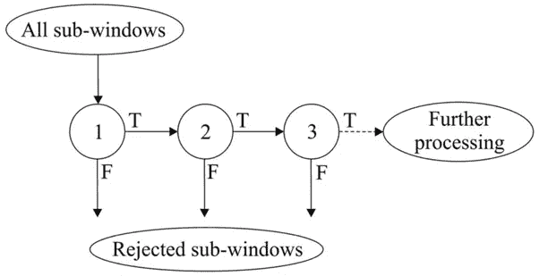

# 基于 MTCNN 的鲁棒人脸检测

> 原文：<https://towardsdatascience.com/robust-face-detection-with-mtcnn-400fa81adc2e?source=collection_archive---------9----------------------->

## 从旧的 Viola-Jones 检测器升级

## **简介**

人脸检测是在给定图像上检测所有人脸的任务。这通常是通过提取边界框的列表来完成的，即面部周围最小可能矩形的坐标。完美的探测器应该是:

*   快速—理想情况下是实时的(至少 1 FPS 以上)
*   准确—它应该只检测人脸(无误报)和检测所有人脸(无误报)
*   鲁棒—应该在不同的姿势、旋转、光照条件等情况下检测人脸。
*   利用所有可用资源——如果可能，使用 GPU，使用彩色(RGB)输入等。

如果你已经知道 Viola-Jones 检波器是如何工作的，你可以跳过下一部分，直接进入 MTCNN 部分。

## **维奥拉-琼斯探测器**

最古老的方法之一是 Viola-Jones 探测器([论文](https://www.cs.cmu.edu/~efros/courses/LBMV07/Papers/viola-cvpr-01.pdf))。它适用于灰度图像，因为它将图像解释为一组 *Haar 特征*，即较亮和较暗的矩形。有许多类型的 Haar 特征，在矩形中具有不同的亮区和暗区位置。通过使用一种叫做*积分图像*的技术，可以非常快速地计算出它们。

哈尔特征([来源](https://en.wikipedia.org/wiki/Viola%E2%80%93Jones_object_detection_framework#/media/File:Prm_VJ_fig1_featureTypesWithAlpha.png))

这些特征然后被馈送到 AdaBoost 分类器的*级联*。它们是按照一定顺序排列的决策树的增强集合。每个特征被馈送到第一个分类器——如果它拒绝它(即认为这个地方没有人脸)，它立即被拒绝；如果它接受(即认为它是面部的一部分)，它将作为下一个分类器的输入。通过这种方式，Viola-Jones 检测器将检测人脸的任务转变为拒绝非人脸的任务。事实证明，我们可以用 cascade 快速过滤掉非人脸，从而实现快速检测。

维奥拉-琼斯级联([来源](https://www.researchgate.net/figure/The-structure-of-the-Viola-Jones-cascade-classifier_fig1_233375515))

然而，它也有自己的问题。如果人脸大小不同，则调整图像的大小，并对每张图像运行分类器。这种情况下的准确性不是很高，在非常令人惊讶的情况下也可能失败(见下图)。主要缺点是缺乏鲁棒性。Viola-Jones 分类器假设人脸直视摄像机(或几乎直视)，光照均匀，人脸清晰可见。这种情况经常出现，例如当智能手机摄像头检测人脸进行过滤时，但并不总是如此。主要的例子是安全(它们被放置在天花板附近)和团体照片(在光线条件变化的地方)。

## **美国有线电视新闻网前来救援**

多任务级联卷积神经网络([论文](https://arxiv.org/abs/1604.02878))是一种现代的人脸检测工具，利用了 3 级神经网络检测器。

MTCNN 工作可视化([来源](https://arxiv.org/abs/1604.02878))

首先，多次调整图像大小，以检测不同大小的人脸。然后，P 网络(建议)扫描图像，执行第一次检测。它的检测阈值很低，因此即使在 NMS(非最大抑制)之后也能检测到许多误报，但它是故意这样工作的。

建议的区域(包含许多假阳性)被输入到第二个网络，R-网络(Refine ),顾名思义，它过滤检测(也用 NMS)以获得相当精确的边界框。最后阶段，O-网络(输出)执行边界框的最终细化。这种方式不仅可以检测到人脸，而且边界框也非常正确和精确。

MTCNN 的可选特征是检测面部标志，即眼睛、鼻子和嘴角。它几乎没有成本，因为它们无论如何都被用于过程中的面部检测，这是一个额外的优势，如果你需要这些(例如，面部对齐)。

MTCNN 的官方 TensorFlow 实现效果不错，但是 PyTorch one 更快([链接](https://github.com/timesler/facenet-pytorch))。它在全高清视频上达到了大约 13 FPS，甚至在重新缩放时达到了 45 FPS，使用了一些技巧(见文档)。它还非常容易安装和使用。我还在全高清的 CPU 上实现了 6-8 FPS，因此使用 MTCNN 进行实时处理是非常可能的。

MTCNN 非常准确和健壮。即使在不同大小、光照和强烈旋转的情况下，它也能正确检测人脸。它比 Viola-Jones 检测器慢一点，但是用 GPU 也不慢太多。它还使用颜色信息，因为 CNN 获得 RGB 图像作为输入。

## **比较**

Viola-Jones 和 MTCNN 探测器的比较(图片由作者提供)

## **代码和示例**

为了查看这两个检测器在真实数据上的比较，我使用了下面的代码和一些流行的图片。

Viola-Jones 代码基于[这个](https://docs.opencv.org/3.4/db/d28/tutorial_cascade_classifier.html) OpenCV 教程。人脸检测的预训练权重可以在[这里](https://github.com/opencv/opencv/blob/master/data/haarcascades/haarcascade_frontalface_alt.xml)找到。

第一张图片([来源](https://unsplash.com/photos/4_mJ1TbMK8A))是一张典型的家庭照片。人脸检测经常用于这类图像，例如用于 iPhones 上的自动图库管理。

左:维奥拉-琼斯，右:MTCNN ( [原始图片来源](https://unsplash.com/photos/4_mJ1TbMK8A))

Viola-Jones 检测的典型用例，一张全家福。很棒的条件，脸几乎正对着镜头，效果真的很好。由于默认情况下更敏感，MTCNN 会检测到假阴性。对于这种情况，我们可以使用 thresholds 属性轻松地更改 MTCNN 的阈值，这非常有用，但这里我们坚持使用默认值。

第二张图片更具挑战性，一张著名的苏威会议合影([来源](https://commons.wikimedia.org/wiki/File:Solvay_conference_1927_(group_photograph)_bw.jpg))。这类似于大型家庭团体照片，也是社交媒体中人脸检测的热门目标。

上图:维奥拉-琼斯，下图:MTCNN ( [原始图片来源](https://commons.wikimedia.org/wiki/File:Solvay_conference_1927_(group_photograph)_bw.jpg))

两个探测器都工作良好。Viola-Jones 唯一没有检测到的是旋转的那张脸。这里 MTCNN 展示了它的鲁棒性——它检测到了这张脸。如你所见,“琐碎”的照片对于简单的探测器来说也是有问题的。

最后一张照片是典型的街拍([来源](https://www.russellallert.com.au/people-disrupt-industries/))。这种情况更类似于安全摄像机照片，其中 ML 用于面部检测，例如加速监控视频分析。

上图:维奥拉-琼斯，下图:MTCNN ( [原始图片来源](https://www.russellallert.com.au/people-disrupt-industries/))

像这样的图像有许多不同的光线水平，所以 Viola-Jones 检测器不能很好地工作，它会产生很多假阳性，并且不能检测较小、旋转或部分遮挡的面部。另一方面，MTCNN 具有完美的检测能力，即使对于严重遮挡的人脸也是如此。

## **总结**

您已经了解了 MTCNN，它是 Viola-Jones 检波器的一种强大而精确的替代产品。在现实生活条件下，Viola-Jones 框架的假设经常失败，但巧妙构建的神经网络可以轻松完成这些任务。

如果你想了解更多关于 MTCNN 和它的技术细节，请看优秀的文档(那里有教程和笔记本链接)。