# NumPy 中从头开始的 ROC 曲线和 AUC(可视化！)

> 原文：<https://towardsdatascience.com/roc-curve-and-auc-from-scratch-in-numpy-visualized-2612bb9459ab?source=collection_archive---------6----------------------->

## 因为在你建造它之前，你不会学到它

妮娜·摄影实验室在 [Unsplash](https://unsplash.com?utm_source=medium&utm_medium=referral) 上拍摄的照片

从引用开始怎么样？。

> “过去，我曾试图使用[…]种不同的编程语言[…]来教授机器学习，我发现，使用 Octave 等相对高级的语言，学生能够最有效地学习[…]。”，[吴天俊](https://youtu.be/39PyhM0LAow?list=PLLssT5z_DsK-h9vYZkQkYNWcItqhlRJLN&t=10)。

从零开始构建东西是 Andrew NG 教授他著名的 Coursera 的机器学习课程时使用的方法😂)，拥有平台上最棒的收视率之一。像安德鲁一样，我真的相信建造东西是最好的学习方式，因为它迫使我们理解算法的每一步。与 Andrew 不同，我更喜欢使用 Python 和 Numpy😎因为它们简单且被广泛采用。直接反对他的建议听起来有点疯狂，但时代在变，我们也能变。

评估机器学习模型可能是一项具有挑战性的任务。有大量的指标，仅仅看着它们，你可能会感到不知所措。通常的第一种方法是检查准确度、精确度和召回率。但是当你再深究一点，你很可能会碰到一个 ROC 图。问题是它不像其他的那样容易理解。

那怎么办呢？从头开始构建！。

*接收操作特性(ROC)* 图试图解释二进制分类器的表现如何。一个简单的混淆矩阵不足以测试你的模型有几个原因。尽管如此，ROC 表示非常好地解决了以下问题:*在一个可视化中设置多个阈值的可能性*。

在我们继续之前，下面的一个场景是真的:第一个是你理解了我在最后一段所说的一切，所以我可以继续下去，开始构建 ROC 曲线。第二是你没懂多少。如果是这样的话，我不想显得粗鲁。因此，我有东西给你。

如果你对自己的知识有信心，你可以跳过下一部分。但是如果你不知道(或者你需要复习一下)，我鼓励你去读一读。理解以下概念是必要的，因为 ROC 曲线是建立在这些概念之上的。

# 基础

> **注**:以下术语将浅显处理。如果你想要更详细的指南，看这里的或这里的。

*   ***混淆矩阵*** :预测二分类问题时，通常将正例标为 1，负例标为 0。当预测值与实际值相等时，为真情况；否则就是负面的。该矩阵旨在揭示这些场景组合的比例信息，包括真阳性(TP)、真阴性(TN)、假阳性(FP)和假阴性(FN)。在下图中，你可以看到一个例子。

作者创建的图像。

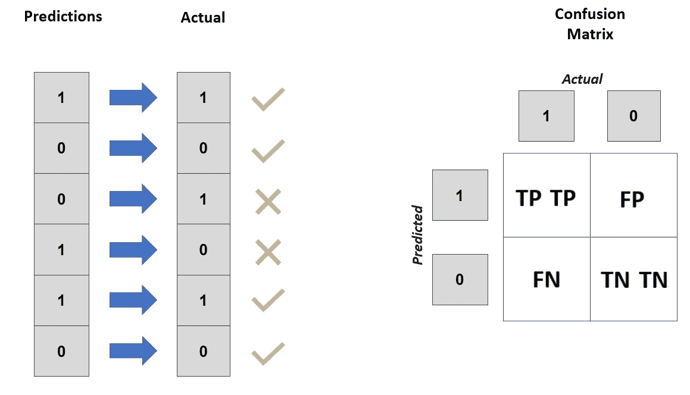

作者创建的图像。

*   ***真阳性率:*** 根据以下公式，使用真阳性和假阴性计算此指标。

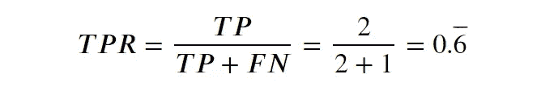

作者创建的图像。

*   ***假阳性率:*** 根据以下公式，使用假阳性和真阴性来计算此指标。

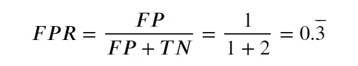

作者创建的图像。

*   ***Predict _ proba***:对于大多数模型，您可以检索预测的概率。概率显示所选类别上模型的置信度是否存在差异。predict_proba 越高，表示输出的可信度越高。
*   ***阈值:*** 该值定义了模型何时改变对输出的看法，从正面到负面，反之亦然。默认情况下，模型的阈值为 0.5。如果该值高于 0.5，模型会将样本预测为阳性，但如果该值低于 0.5，模型会将其预测为阴性。

# ROC 曲线从零开始

ROC 图在 y 轴上具有真阳性率，在 x 轴上具有假阳性率。正如您可能猜测的那样，这意味着我们需要一种方法来不止一次地创建这些指标，以使图表具有自然的形状。我们需要一种算法来迭代计算这些值。

尽管 scikit-learn(我们稍后将访问)中有这个指标的实现，但如果您已经在这里，这强烈表明您有足够的勇气来构建而不是仅仅复制粘贴一些代码。为了了解我们实际要做的事情，我为你准备了以下步骤，以及视觉化…享受吧！。

***第一步，选择一个阈值*** :正如我们之前讨论的，ROC 曲线的整个思路就是检验出不同的阈值，但是怎么做呢？这是我们工作的一部分。做这件事有不同的方法，但我们将采用最简单的方法。只需将阈值设置为距离相等的分区，我们就可以解决第一个难题。

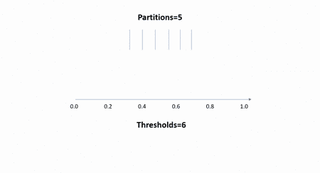

作者创建的图像。

我们需要查看的阈值等于我们设置的分区数量加 1。我们将迭代这个步骤中定义的每个阈值。

***第二步，阈值比较:*** 在每次迭代中，我们都要将预测概率与当前阈值进行比较。如果阈值高于预测概率，我们将样本标记为 0，反之标记为 1。如果你还不清楚这一点，我相信下一个例子会有所帮助。

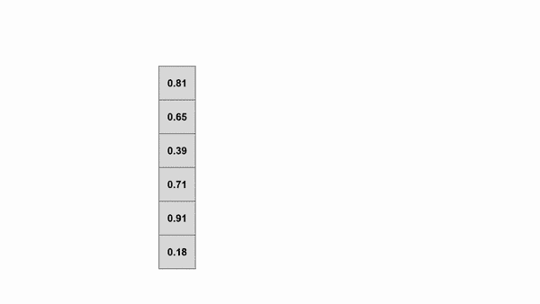

作者创建的图像。

在可视化中，有两个不同迭代的例子。高阈值的阳性预测病例数总是低于或等于较小阈值的阳性预测病例数。

***第三步，计算 TPR 和 FPR:*** 我们差不多完成了我们的算法。最后一部分是在每次迭代中计算 TPR 和 FPR。方法简单。这与我们在上一节中看到的完全相同。唯一的区别是，在进行下一次迭代之前，我们需要将 TPR 和 FPR 保存在一个列表中。TPRs 和 FPRs 对的列表是 ROC 曲线中的线。所以，我们正式结束了！

我知道你想再看一次。你可以看到不同的阈值如何改变我们的 TPR 和 FPR 的值。

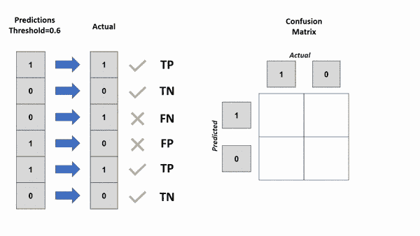

作者创建的图像。

既然你是算法方面的专家，是时候开始构建了！开始之前的第一步是要有一些概率和一些预测。为了快速解决这个问题，我们将使用 scikit-learn 收集它(这不是作弊，因为它只是算法的输入)。

> **注意**:因为我没有在“make_classification”上设置 random_state 参数，所以您的案例的结果可能会有细微的变化。

首先，我们需要一个方法来复制步骤 3，它是通过下面的方法完成的。

该算法的核心是迭代步骤 1 中定义的阈值。我们通过步骤 2 和 3，在每次迭代中将 TPR 和 FPR 对添加到列表中。

你认为这行得通吗？🤞

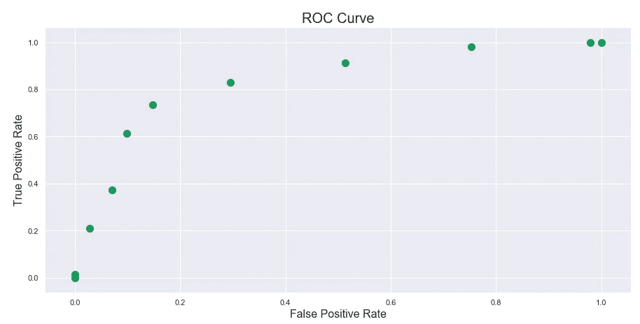

作者创建的图像。

显然，这是可行的🤣。使用 10 个分区，我们获得了第一个 ROC 图。但是你可以看到增加分区的数量是如何给我们一个更好的曲线近似值的。

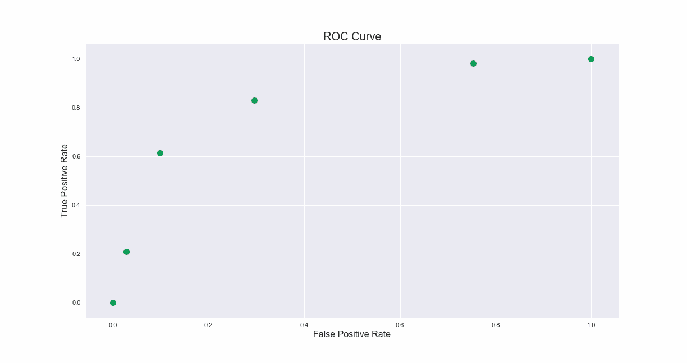

作者创建的图像。

但是让我们将我们的结果与 scikit-learn 的实现进行比较。

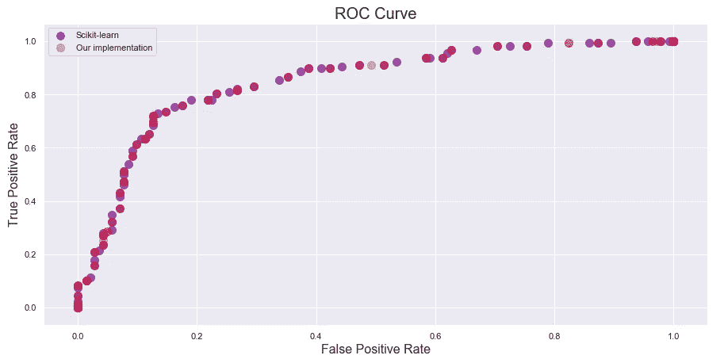

作者创建的图像。

差不多一样😎。但是我们还没有结束。ROC 曲线带有一个度量标准:“曲线下的面积”。

# 从头开始 AUC

ROC 图中曲线下的面积是确定分类器是否运行良好的主要指标。该值越高，模型性能越高。这个指标的最大理论值是 1，但通常比这个值小一点。

可以使用函数在 0 和 1 之间的积分来计算函数的 AUC。

但是在这种情况下，创建一个函数就没那么简单了。尽管如此，一个好的近似方法是计算面积，将其分成更小的块(矩形和三角形)。

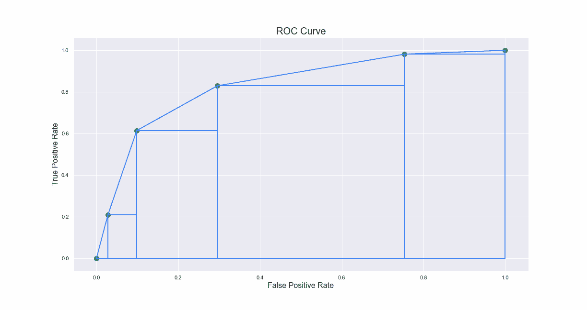

作者创建的图像。

随着数字的增加，三角形下面的面积变得更加可以忽略，所以我们可以忽略它。不过，我们还有最后一个挑战:计算 AUC 值。我们要做的是把我们刚刚画的矩形的每一个面积加起来。尽管不是最佳实现，我们将使用 for 循环来使您更容易理解。

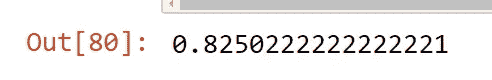

作者创建的图像。

同样，我们将它与 scikit-learn 的实现进行比较

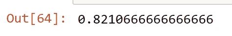

作者创建的图像。

由于点的位置不同，差异很小，但值几乎相同。

我们完了！🙌

该算法还有待改进，但这只是为了教学目的。我真的希望看到每一步，帮助你更好地解释指标。

# 再见

现在是你做决定的时候了。Octave 和 Python 哪个最适合你？我在评论里等你的回答！。我真的希望这个博客能让你感兴趣。

我还上了 [Linkedin](http://www.linkedin.com/in/maletelier) 和 [Twitter](https://twitter.com/maletelier) 。我很乐意与你交谈！
如果你想多读一点，看看我最近的一些帖子:

</decision-trees-as-you-should-have-learned-them-99862469493e>  </become-a-machine-learning-engineer-from-inside-of-your-jupyter-notebook-76a42b65c8f4> 