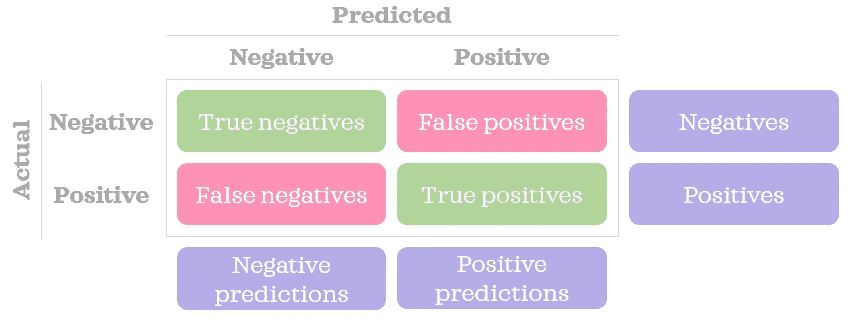
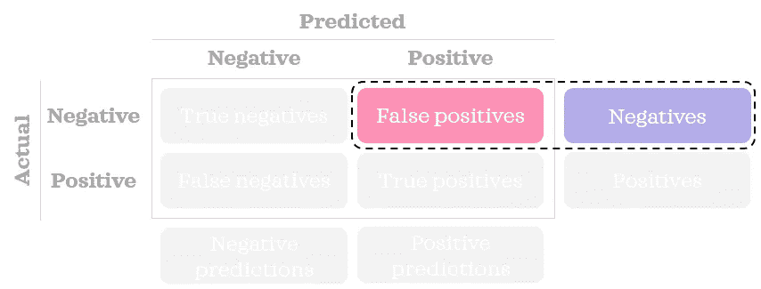
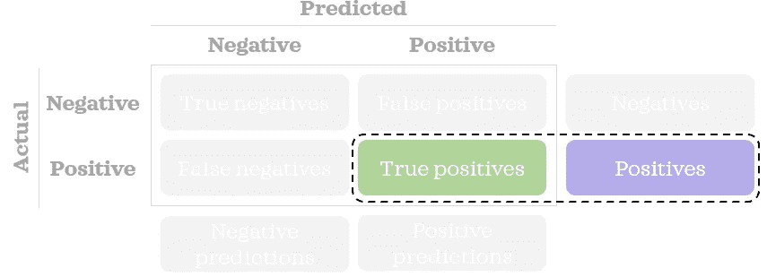
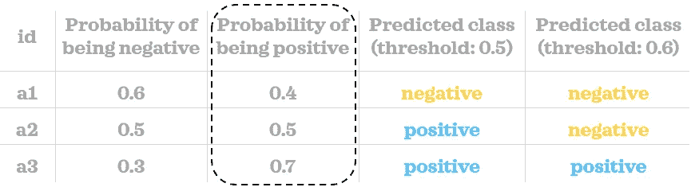
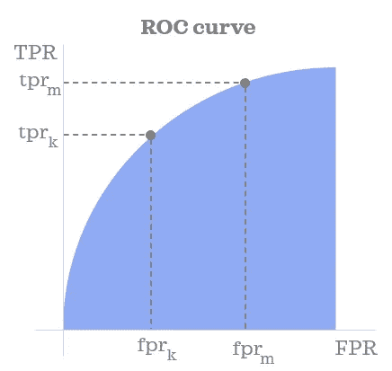
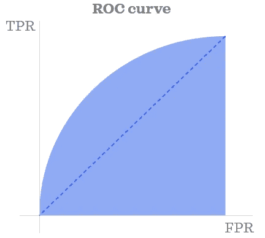
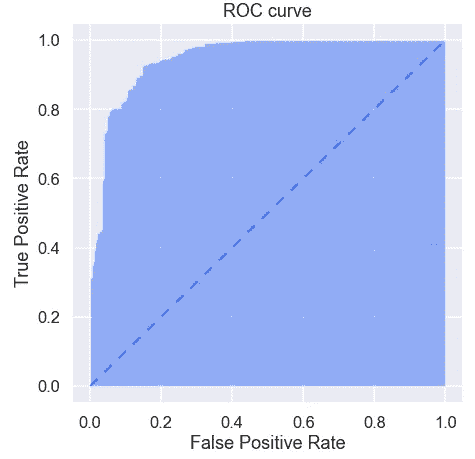
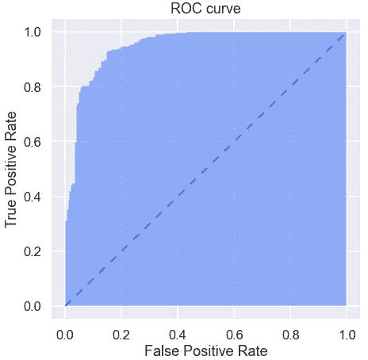
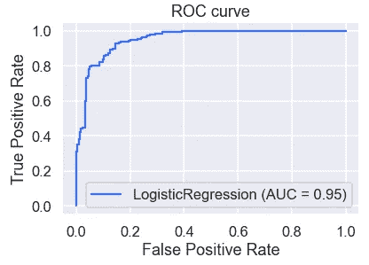
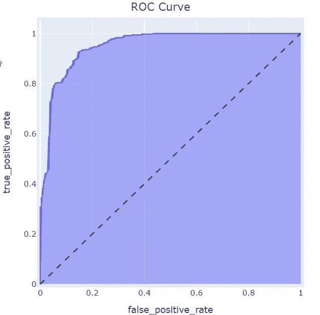

# ROC 曲线解释

> 原文：<https://towardsdatascience.com/roc-curve-explained-50acab4f7bd8?source=collection_archive---------13----------------------->

## 数据科学基础

## 学习用 Python 可视化 ROC 曲线

ROC 曲线下面积是评估监督分类模型的最有用的度量之一。这一指标通常被称为 ROC-AUC。这里，ROC 代表受试者操作特征，AUC 代表曲线下面积。在我看来，AUROCC 是一个更准确的缩写，但听起来可能不太好听。在正确的上下文中，AUC 也可以暗示 ROC-AUC，即使它可以指任何曲线下的面积。


乔尔·菲利普在 [Unsplash](https://unsplash.com?utm_source=medium&utm_medium=referral) 上的照片

在这篇文章中，我们将了解 ROC 曲线是如何从概念上构建的，并以 Python 中的静态和交互式格式来可视化该曲线。

# 理解曲线

ROC 曲线向我们展示了不同*阈值*下*假阳性率*和*真阳性率(TPR)* 之间的关系。让我们来理解这三个术语的含义。

首先，让我们回顾一下混淆矩阵的样子:



作者图片

刷新了我们对混淆矩阵的记忆后，让我们看看术语。

## 假阳性率

我们可以使用下面的简单公式找到 FPR:


> FPR 告诉我们不正确预测的负面记录的百分比。



作者图片

## 真实阳性率

我们可以使用下面的简单公式找到 TPR:


> TPR 告诉我们正确预测的正面记录的百分比。这也被称为回忆或敏感性。



作者图片

## 阈值

通常，分类模型可以预测给定记录成为某个类别的概率。通过将概率值与我们设置的阈值进行比较，我们可以将记录分类。换句话说，您需要定义一个类似如下的规则:

> 如果为正的概率大于或等于阈值，则记录被分类为正预测；否则，一个负面的预测。

在下面的小例子中，我们可以看到三个记录的概率得分。使用两个不同的阈值(0.5 和 0.6)，我们将每个记录分类到一个类中。正如您所看到的，预测的类根据我们选择的阈值而变化。



作者图片

当构建混淆矩阵和计算 FPR 和 TPR 等比率时，我们需要预测的类别，而不是概率得分。

## 受试者工作特征曲线

既然我们知道了什么是 FPR、TPR 和阈值，就很容易理解 ROC 曲线显示了什么。当构建曲线时，我们首先跨多个阈值计算 FPR 和 TPR。一旦我们有了阈值的 FPR 和 TPR，我们就可以在 x 轴上绘制 FPR，在 y 轴上绘制 TPR，从而得到 ROC 曲线。就是这样！✨



作者图片

ROC 曲线下的面积范围从 0 到 1。完全随机模型的 AUROCC 为 0.5，由下面的蓝色三角形对角线虚线表示。ROC 曲线离这条线越远，模型的预测性越强。



作者图片

现在，是时候看看一些代码示例来巩固我们的知识了。

# 在 Python 中构建静态 ROC 曲线

让我们首先导入本文剩余部分所需的库:

```
import numpy as np
import pandas as pd
pd.options.display.float_format = "{:.4f}".formatfrom sklearn.datasets import load_breast_cancer
from sklearn.linear_model import LogisticRegression
from sklearn.metrics import roc_curve, plot_roc_curveimport matplotlib.pyplot as plt
import seaborn as sns
import plotly.express as px
sns.set(palette='rainbow', context='talk')
```

现在，我们将构建一个函数，在给定正确类别、预测为阳性类别的概率和阈值的情况下，该函数将找到*假阳性*和*真阳性*的数量:

```
def get_fp_tp(y, proba, threshold):
    """Return the number of false positives and true positives."""
    # Classify into classes
    pred = pd.Series(np.where(proba>=threshold, 1, 0), 
                     dtype='category')
    pred.cat.set_categories([0,1], inplace=True)
    # Create confusion matrix
    confusion_matrix = pred.groupby([y, pred]).size().unstack()\
                           .rename(columns={0: 'pred_0', 
                                            1: 'pred_1'}, 
                                   index={0: 'actual_0', 
                                          1: 'actual_1'})
    false_positives = confusion_matrix.loc['actual_0', 'pred_1']
    true_positives = confusion_matrix.loc['actual_1', 'pred_1']
    return false_positives, true_positives
```

*请注意，您将在现实中使用分区数据集(例如，培训、测试)。但是为了简单起见，我们不会在本文中对数据进行划分。*

我们将在玩具数据集上构建一个简单的模型，并获得这些记录为正的概率(用值 1 表示):

```
# Load sample data
X = load_breast_cancer()['data'][:,:2] # first two columns only
y = load_breast_cancer()['target']# Train a model
log = LogisticRegression()
log.fit(X, y)# Predict probability
proba = log.predict_proba(X)[:,1]
```

我们将使用 0 到 1 之间的 1001 个不同的阈值，增量为 0.001。换句话说，阈值看起来像 0，0.001，0.002，… 0.998，0.999，1。让我们找到阈值的 FPR 和 TPR。

```
# Find fpr & tpr for thresholds
negatives = np.sum(y==0)
positives = np.sum(y==1)columns = ['threshold', 'false_positive_rate', 'true_positive_rate']
inputs = pd.DataFrame(columns=columns, dtype=np.number)
thresholds = np.linspace(0, 1, 1001)for i, threshold in enumerate(thresholds):
    inputs.loc[i, 'threshold'] = threshold
    false_positives, true_positives = get_fp_tp(y, proba, threshold)
    inputs.loc[i, 'false_positive_rate'] = false_positives/negatives
    inputs.loc[i, 'true_positive_rate'] = true_positives/positives
inputs
```


该地块的数据已准备好。让我们画出来:

```
def plot_static_roc_curve(fpr, tpr):
    plt.figure(figsize=[7,7])
    plt.fill_between(fpr, tpr, alpha=.5)
    # Add dashed line with a slope of 1
    plt.plot([0,1], [0,1], linestyle=(0, (5, 5)), linewidth=2)
    plt.xlabel("False Positive Rate")
    plt.ylabel("True Positive Rate")
    plt.title("ROC curve");

plot_static_roc_curve(inputs['false_positive_rate'], 
                      inputs['true_positive_rate'])
```



虽然构建自定义函数有助于我们理解曲线及其输入，并更好地控制它们，但我们也可以利用 *sklearn 的*功能进行更好的优化。例如，我们可以用一个`roc_curve()`函数得到 FPR、TPR 和阈值。我们可以使用自定义绘图功能以同样的方式绘制数据:

```
fpr, tpr, thresholds = roc_curve(y, proba)
plot_static_roc_curve(fpr, tpr)
```



*Sklearn* 还提供了一个`plot_roc_curve()`函数，为我们完成所有的工作。您只需要一行代码(添加标题是可选的):

```
plot_roc_curve(log, X, y)
plt.title("ROC curve"); # Add a title for clarity
```



# 用 Python 绘制交互式 ROC 曲线

使用静态图时，很难看到曲线上不同点的相应阈值。一种选择是检查我们创建的`inputs` 数据框架。另一个选项是创建图形的交互式版本，这样当我们将鼠标悬停在图形上时，可以看到 FPR 和 TPR 以及相应的阈值:

```
def plot_interactive_roc_curve(df, fpr, tpr, thresholds):
    fig = px.area(
        data_frame=df, 
        x=fpr, 
        y=tpr,
        hover_data=thresholds, 
        title='ROC Curve'
    )
    fig.update_layout(
        autosize=False,
        width=500,
        height=500,
        margin=dict(l=30, r=30, b=30, t=30, pad=4),
        title_x=.5, # Centre title
        hovermode = 'closest',
        xaxis=dict(hoverformat='.4f'),
        yaxis=dict(hoverformat='.4f')
    )
    hovertemplate = 'False Positive Rate=%{x}<br>True Positive Rate=%{y}<br>Threshold=%{customdata[0]:.4f}<extra></extra>'
    fig.update_traces(hovertemplate=hovertemplate)

    # Add dashed line with a slope of 1
    fig.add_shape(type='line', line=dict(dash='dash'), x0=0, x1=1, y0=0, y1=1)
    fig.show()plot_interactive_roc_curve(df=inputs, 
                           fpr='false_positive_rate', 
                           tpr='true_positive_rate', 
                           thresholds=['threshold'])
```



互动性挺有用的吧？

希望你喜欢学习如何建立和可视化 ROC 曲线。一旦理解了这条曲线，就很容易理解另一条相关曲线: [*精准召回曲线*](https://levelup.gitconnected.com/precision-recall-curve-explained-fabfe58fb52e) 。


由 [Mael Pavageau](https://unsplash.com/@maelpg?utm_source=medium&utm_medium=referral) 在 [Unsplash](https://unsplash.com?utm_source=medium&utm_medium=referral) 上拍摄的照片

*您想访问更多这样的内容吗？媒体会员可以无限制地访问媒体上的任何文章。如果您使用* [*我的推荐链接*](https://zluvsand.medium.com/membership)*成为会员，您的一部分会费将直接用于支持我。*

感谢您阅读这篇文章。如果你感兴趣，这里有我其他一些帖子的链接:

◼️ [在 Python 中使用标点符号的有趣方法](/interesting-ways-to-use-punctuations-in-python-43205a0bd67d)
◼️ [从零开始学习 Python 的 5 个技巧](/5-tips-to-learn-python-from-zero-e4f6a9106558)
◼️[python 虚拟环境数据科学简介](/introduction-to-python-virtual-environment-for-data-science-3c216929f1a7)
◼️[git 数据科学简介](/introduction-to-git-for-data-science-ca5ffd1cebbe?source=your_stories_page-------------------------------------)
◼️ [用这些技巧整理你的 Jupyter 笔记本](/organise-your-jupyter-notebook-with-these-tips-d164d5dcd51f)
◼️ [6 个简单技巧让你在 Seaborn (Python)中的情节更漂亮、更定制](/6-simple-tips-for-prettier-and-customised-plots-in-seaborn-python-22f02ecc2393)
◼️️

再见🏃💨