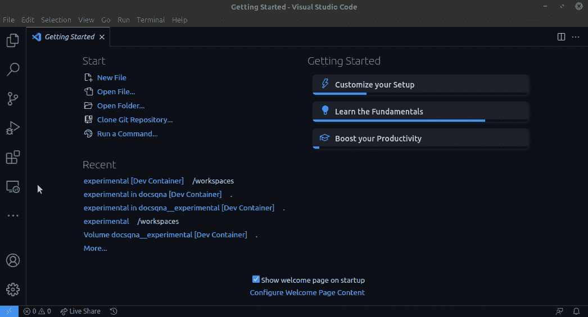

# Rock 容器化 GPU 机器学习开发用 VS 代码

> 原文：<https://towardsdatascience.com/rock-containerized-gpu-machine-learning-development-with-vs-code-34940ff25509?source=collection_archive---------18----------------------->

## 再也不用为破损的基础设施而烦恼了

由 [Fab Lentz](https://unsplash.com/@fossy?utm_source=unsplash&utm_medium=referral&utm_content=creditCopyText) 在 [Unsplash](https://unsplash.com/s/photos/success?utm_source=unsplash&utm_medium=referral&utm_content=creditCopyText) 上拍摄的照片

在 GPU 上运行机器学习算法是一种常见的做法。虽然有像 Paperspace 和 Colab 这样的云 ML 服务，但是最方便/灵活的原型化方式仍然是本地机器。

# 别闹了，用集装箱🦺

自从机器学习库(例如 TensorFlow、Torch 和 Caffe)出现以来，处理 Nvidia 库一直是许多数据科学家头疼的问题:

*   Nvidia 驱动程序/库和硬件/操作系统可能不兼容，这在面向消费者的笔记本电脑/台式机上经常发生。
*   Nvidia 库可能与 ML 库版本不匹配，这意味着您不能让系统自动更新库。
*   ML 进程和其他进程可以竞争资源。例如，如果您在训练模型时筛选记录，则两者都有可能崩溃，因为编解码器和模型训练都需要锁定 GPU 资源。
*   更多奇怪的问题…

总之，建立一个 GPU ML 环境会不断弄乱现有的基础设施，通常需要重新安装操作系统来恢复。

更好的方法是在支持 CUDA 的容器中进行开发，其中开发环境与主机和其他项目相隔离。

# VS 代码远程容器=在容器中开发

在容器内开发通常效率很低，因为很难想象 VM 内发生了什么。

然而，VS 代码通过在 IDE 前端和后端之间定义一组通用的 API 使它变得简单，这使得在两个系统中运行它们对用户来说是无缝的。

下面是来自 VS 代码文档网站的图表，展示了它是如何工作的:

鸣谢: [Visual Studio 代码文档网站](https://code.visualstudio.com/docs/remote/containers)

关于它如何工作的更多细节，参见[官方文档](https://code.visualstudio.com/docs/remote/containers)。

# 逐步安装说明

让我们一步一步来看看如何用 VS 代码建立一个容器化的 GPU ML 开发环境。

## 步骤 1:定义容器

基于容器的开发中最基本的组件是容器。我们需要用 Dockerfile 文件定义容器。

下面是张量流的一个例子:

这个 Dockerfile 告诉 VS 代码以官方的 TensorFlow 图像为基线构建一个容器，此外，使用 BASH 作为默认终端，而不是不太用户友好的 SH(IMO)。

## 步骤 2:定义 VS 代码应该如何使用 VM

现在我们有了一个可以利用 GPU 能力的容器，我们需要告诉 VS 代码**使用之前定义的容器**并且**将 GPU 能力传递给它**:

## 步骤 3(可选):在虚拟机中添加用户

理论上，我们已经可以使用这个环境进行开发，但是，由于我们还没有定义任何用户，所以所有的操作都将在 root 下进行，这是可以的，但是不太安全。

我们可以通过在 docker 文件中添加以下代码来定义用户:

此外，我们需要告诉 VS 代码以这个远程用户的身份登录:

## 步骤 4:启动虚拟机开发环境

最后，我们已经准备好运行远程开发会话的一切，让我们试一试:

要了解更多细节，请查看[这个库](https://github.com/DocsQnA/experimental)，这是我试验这个设置的库。更多后续提示和技巧(我仍在努力)，请在 GitHub 上关注我[。](https://github.com/tianhaoz95)

以下是如何在 GPU 的支持下进行 ML 开发，但又不会经常搞乱你的基础设施。快乐黑客🚀🚀🚀