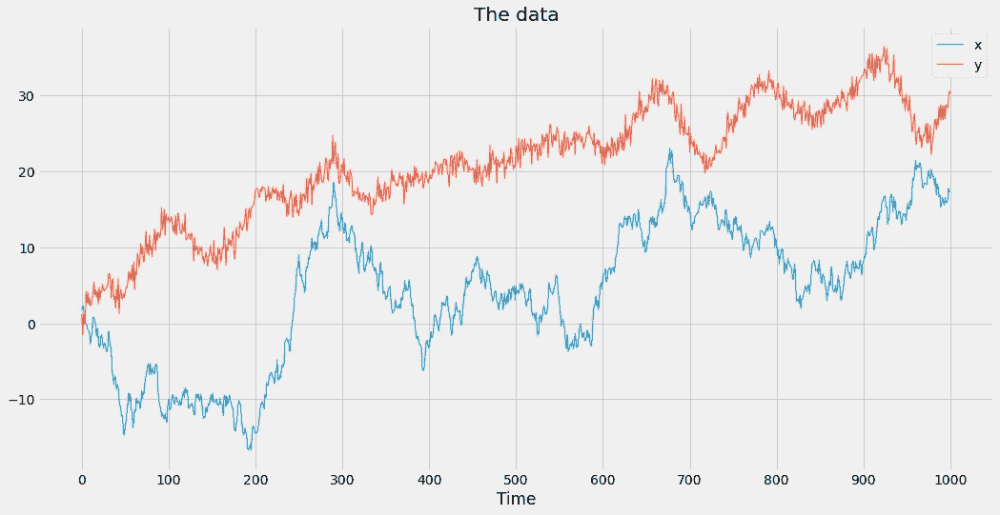
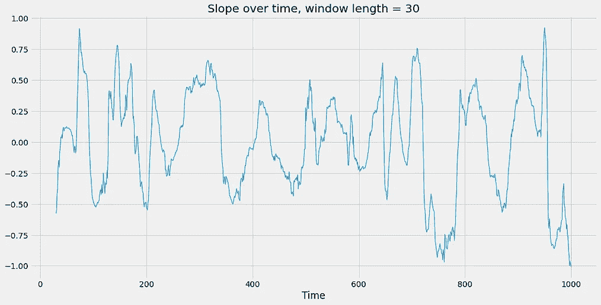
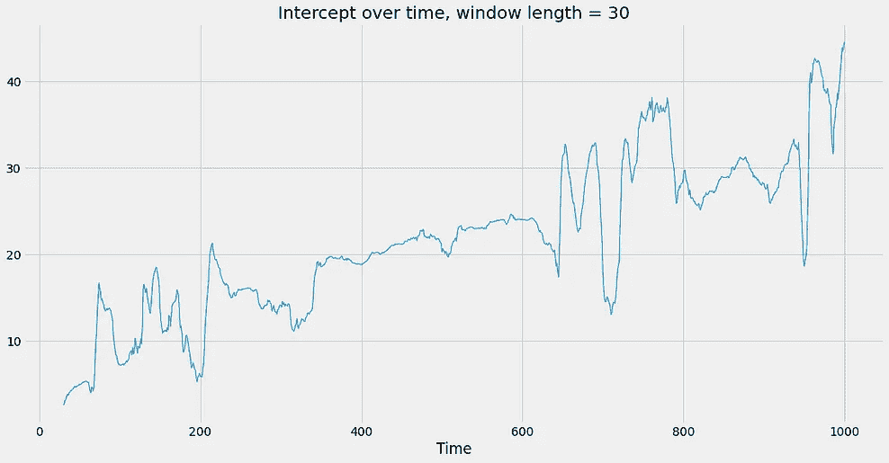
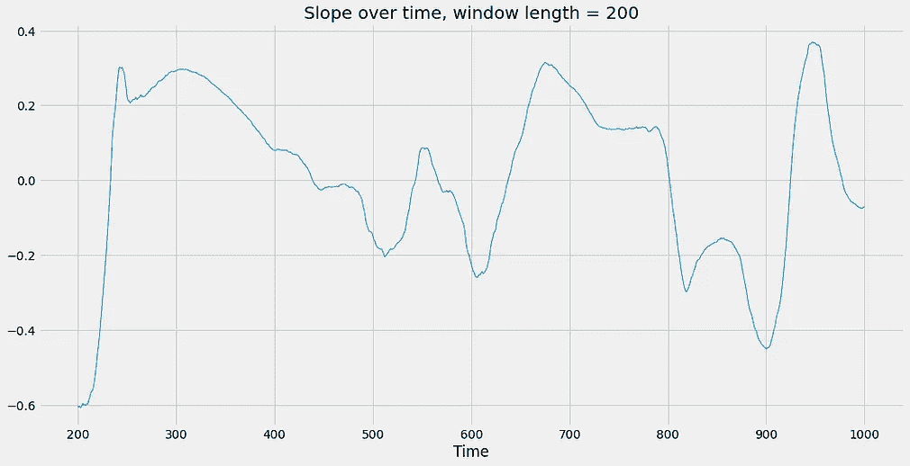
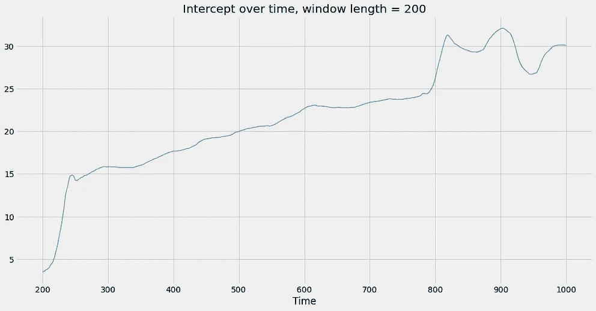
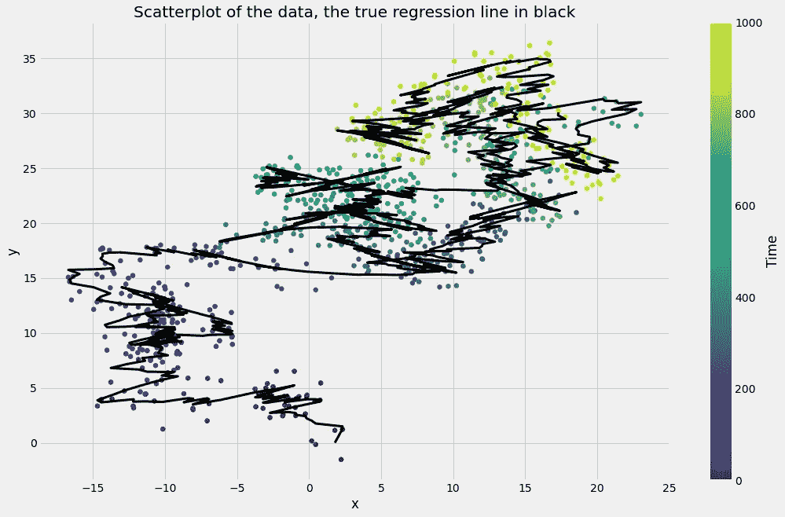

# 通过 PyMC3 在 Python 中实现滚动回归

> 原文：<https://towardsdatascience.com/rockin-rolling-regression-in-python-via-pymc3-e4722b6118cd?source=collection_archive---------4----------------------->

## [贝叶斯统计](https://medium.com/tag/bayesian-statistics)

## 学习如何处理变化的参数


由[本杰明·沃罗斯](https://unsplash.com/@vorosbenisop?utm_source=medium&utm_medium=referral)在 [Unsplash](https://unsplash.com?utm_source=medium&utm_medium=referral) 上拍摄的照片

答假设您想要训练一个参数模型，如线性模型或神经网络。在线性回归的情况下，首先，你指定模型的形状，我们说 *y = ax + b.* 其次，你估计参数 *a* 和 *b* 。对你这样的专家来说没什么难的。

我想指出的是你在这样做的时候所做的一个隐含的假设:

> 来自数据集的所有观测值都服从具有相同固定参数的相同模型。

在线性模型的情况下，这意味着 *a* 和 *b* **的**相同固定值适用于所有观测值**。这个假设是否合理，取决于你手头的数据集。虽然它经常成立，但在这篇文章中，我想给你看一个简单的例子，它是完全错误的。在你读完之后，你将能够自己发现这些有问题的例子，并且知道如何以一种好的方式对待它们。我们将考虑一个天真的以及不错的贝叶斯治疗。**

# 随时间变化的参数

一个参数可能变化的明显场景是在处理时间序列时。随着时间的推移，数据的输入和输出之间的依赖关系可能会改变，这意味着模型及其参数也必须随着时间的推移而改变。

作为一个假设的例子，让我们假设我们有一个数据集 *D* = ( *t* ， *x* ， *y* )，其中 *t* 是某个时间戳。 *D* 的时间上的第一个条目可能表现得像*y***≈***3*x+*2，而最近的条目表现得更像*y***≈***-x+*1，这只是因为事情随着时间而改变。如果我们能够检测并量化这样的变化，那就太好了，例如通过找到一些满足*y***≈***a**t**x+b*的时间相关函数 *a* ( *t* )和 *b* ( *t* )*

*为了了解我们如何做到这一点，让我们看一个具体的例子。*

## *抽样资料*

*首先，让我们加载数据集:*

```
*import pandas as pd
data = pd.read_csv(
  'https://raw.githubusercontent.com/Garve/datasets/3b6b1e6fadc04e2444905db0a0b2ed222daeaa28/rolling_data.csv',
   index_col='t'
)*
```

*然后，我们可以看一看它:*

**

*图片由作者提供。*

*我们的目标是找到一个线性模型，在给定 *x，*即 *y = ax + b* 的情况下预测 *y* 。然而，仅从图中我们可以看出，由于以下观察结果，固定值对于 *a* 和 *b* 是不够的:*

1.  *在 300 和 670 左右的时间内，蓝色和红色时间序列都增加，然后又同步下降。这表明它们是正相关的，这暗示着*a*0。*
2.  *在时间 720 和 950 期间，蓝色时间序列先增加然后下降，而红色时间序列正好相反。这暗示着这些时间序列是负相关的，意味着*a*0。*

*这两点都表明斜率 *a* 必须随时间变化，这意味着我们更愿意处理一个依赖于时间的函数 *a* ( *t* )，而不仅仅是一个固定的 *a* 。*

*我们也可以在散点图中以不同的方式显示上面的图片，这样我们可以更好地理解实际数据集的样子:*

**

*图片由作者提供。*

*在这个表示中，您还可以看到回归线做了次优的工作。做线性回归*

```
*from sklearn.linear_model import LinearRegression

X = data[['x']]
y = data['y']

lr = LinearRegression().fit(X, y)

print(f'intercept = {lr.intercept_:.5f}, slope = {lr.coef_[0]:.3f}')

# Output: intercept = 18.45587, slope = 0.593*
```

*生产*

**

*图片由作者提供。*

*不是很合适。那么，怎样做才能更精确地描述 *x* 和 *y* 之间的联系呢？*

# *可怜人的滚动回归*

*一个简单的解决方法是在一个连续的滑动窗口上进行几次较小的回归。听起来不错吧？它的意思如下:*

1.  *您创建了第一个 *w* 观察值的较小子集，即从时间 **0 到 *w* -1** 。*即第一次迭代中的滑动窗口*。你在这个子数据集上做普通的最小二乘法，写下直线的斜率和截距。*
2.  *你移动窗口一步，意味着它现在从时间 **1 到达*w*。在这个子数据集上使用普通最小二乘法。***
3.  *您将窗口移动一步，这意味着它现在从时间 **2 到达 w+1** 。在这个子数据集上使用普通最小二乘法。*
4.  *你移动窗口一步，意味着它现在从时间 **3 到达 w+2** 。在这个子数据集上使用普通最小二乘法。*
5.  *…*

*你明白了:每个小数据集由 *w* 个连续元素组成，其中 *w* 也被称为(*窗口* ) *长度。这是一个你可以随意摆弄的超参数。从图形上看是这样的( *w* = 3):**

**

*数据集上长度为 3 的滑动窗口(蓝色),有 9 个时间步长，图片由作者提供。*

*编写这种**滚动回归方法**的简单方法如下:*

```
*w = 30 # sliding window of length 30

slopes = []
intercepts = []

for i in range(len(data) - w):
    X = data.loc[i:i+w, ['x']]
    y = data.loc[i:i+w, 'y']
    lr = LinearRegression()
    lr.fit(X, y)
    intercepts.append(lr.intercept_)
    slopes.append(lr.coef_[0])*
```

*绘制我们得到的斜率和截距*

****

*作者图片。*

*我们可以看到，斜率从正变到负再变回来是非常不规则的。截距似乎随着时间增加了一点。这很有趣，但是它可能取决于窗口长度吗？我们将它设置为 30 是相当武断的，那么为什么不尝试其他值，比如 200，看看故事是否会发生变化？*

*一般来说，以下情况成立:*

> *窗口长度越大，图形越平滑。*

*这是因为窗口长度越大，每两个相邻的子数据集就越相似。如果窗口长度是 200，那么每两个相邻子数据集(至少)有 199 行是相同的。几乎相同的数据集意味着训练后几乎相同的模型，至少对于线性回归这样的确定性方法来说是如此。如果窗口长度仅为 2，那么每两个相邻的子数据集只有至少 50%是相同的，因此在这些数据集上训练的模型可以显著不同。让我们看看长度为 200 的滑动窗口的结果是什么样的。*

****

*作者图片。*

*我们可以看到，图形更加平滑，故事大致保持不变:斜率在零附近波动，截距随着时间的推移而增加。然而，曲线图差别很大，所以很难说斜率和截距**实际上**如何随时间演变。*

*总之，这种滚动回归方法在很大程度上取决于窗口长度，我不知道有什么好的方法来正确选择这个超参数，以获得*真相***。***

***因此，让我们研究一种更好的方法来处理变化的参数。像往常一样，贝叶斯挽救了局面。***

# ***贝叶斯滚动回归***

***首先，让我们回顾一下简单的贝叶斯线性回归是什么样子的。您可以在此了解更多信息:***

***[](/bayesian-linear-regression-in-python-via-pymc3-ab8c2c498211) [## 通过 PyMC3 在 Python 中实现贝叶斯线性回归

### 了解如何推断模型参数并对新数据进行预测，包括不确定性估计！

towardsdatascience.com](/bayesian-linear-regression-in-python-via-pymc3-ab8c2c498211) 

## 第一次尝试

假设您知道该练习，请检查代码:

```
import pymc3 as pm

with pm.Model() as linear_model:
    slope = pm.Normal('slope', sigma=1) # a
    intercept = pm.Normal('intercept', sigma=1) # b
    noise = pm.Exponential('noise', lam=1)

    y = pm.Normal(
        'y',
        mu=slope*data['x'] + intercept, # the linear model equation
        sigma=noise,
        observed=data['y']
    )

    linear_trace = pm.sample(return_inferencedata=True)
```

这里应该没有什么惊喜。我们定义了一个斜率、截距和一个具有先验知识的噪声参数，并通过均值为 *ax + b* 的正态分布直接对输出 *y* 进行建模。

不幸的是，这个模型就像简单的线性回归一样糟糕，只是带有不确定性界限。那么，我们如何对随时间变化的事物建模呢？引入变化斜率的简单方法如下:

```
import pymc3 as pm

with pm.Model() as linear_model_2:
    slopes = pm.Normal('slopes', sigma=1, shape=len(data))
    intercepts = pm.Normal('intercepts', sigma=1, shape=len(data))
    noise = pm.Exponential('noise', lam=1)

    y = pm.Normal(
        'y',
        mu=slopes*data['x'] + intercepts,
        sigma=noise,
        observed=data['y']
    )

    linear_trace_2 = pm.sample(return_inferencedata=True)
```

使用这段代码，我们给**每个时间步长赋予它自己的斜率和截距**，因为我们定义的斜率和截距与数据集中的观测值一样多。

> 我希望你明白这是个糟糕的主意。

该模型定义，即使用`shape=len(data)`，意味着所有参数相互独立。所有的斜率都是相同且独立的 *N* (0，1)分布(正态)，这意味着两个相邻的斜率可能相距很远。例如，假设在一个时间步长中斜率为 2.41，而在下一个时间步长中斜率急剧变化为-2.8。由于随着时间的推移变化通常更平稳，这不是我们从现实世界的时间序列中所期望的。当然，拦截也是如此。

查看当前行为的另一种方式是，它相当于使用一个长度为**1 的滑动窗口。**每个斜率和截距都必须用**单个数据点**来估计，而且没有合理的方法来做到这一点。

## 高斯随机游动

解决方案是使两个相邻滚动窗口的参数以某种方式相关。如果某一时刻 *t* 的斜率为 *a* ( *t* )，那么下一时间步 *t* + 1 的斜率也不应远离 *a* ( *t* )。表达这一点的一种方式是通过对所有时间的标准偏差*σ*进行建模*a*(*t+1*)~*N*(*a*(*t*)*，σ**)*，对第一个斜率使用一些初始值，如*a*(0 用语言来说:

> 下一个斜率是旧斜率加上一些误差。

这就是所谓的[高斯随机游走](https://en.wikipedia.org/wiki/Random_walk#Gaussian_random_walk)。您可以通过 NumPy 自己模拟一个

```
np.random.seed(0)

steps = 20 # length of the random walk
a = [0] # the initial slope, can be anything
sigma = 1 # the error
for t in range(steps):
    a.append(np.random.normal(a[-1], sigma))
```

绘图`a`导致


图片由作者提供。

如果你稍微摆弄一下`sigma`，你会发现值越大，`a`内的跳跃越大，这是有道理的。你还可以看到的是，对于所有的 *t* 来说， *a* ( *t+1* )总是接近 *a* ( *t* )。

## PyMC3 模型

虽然在 PyMC3 中实现同样的逻辑并不太难，但是开发人员通过实现一个`GaussianRandomWalk`发行版让我们变得很容易。有了它，我们现在可以用 PyMC3 写下最终的模型了。整体造型和之前挺像的。我们只需要

1.  引入两个高斯随机游走，一个用于斜率，一个用于截距，以及
2.  这些高斯随机游走的两个噪声参数

以下是建议书范本:

```
with pm.Model() as rolling_linear_model:
    # noise parameters
    sigma_slope = pm.Exponential('sigma_slope', lam=1)
    sigma_intercept = pm.Exponential('sigma_intercept', lam=1)
    sigma = pm.Exponential('sigma', lam=1)

    # Gaussian random walks
    slopes = pm.GaussianRandomWalk(
        'slopes',
        sigma=sigma_slope,
        shape=len(data)
    )
    intercepts = pm.GaussianRandomWalk(
        'intercepts',
        sigma=sigma_intercept,
        shape=len(data)
    )

    # putting it together
    y = pm.Normal(
        'y',
        slopes*data['x'] + intercepts,
        sigma,
        observed=data['y']
    )

    rolling_linear_trace = pm.sample(return_inferencedata=True)
```

与之前的简单线性回归相比，运行该模型需要一些时间，因为有许多参数也随机地相互依赖。不过，在你的机器上，这应该不到 15 分钟。

我们可以运行一个后验预测检查，看看这个模型是否通过

```
import arviz as az

with rolling_linear_model:
    posterior = pm.sample_posterior_predictive(rolling_linear_trace)
    az.plot_ppc(az.from_pymc3(posterior_predictive=posterior))
```

这输出


图片由作者提供。

这意味着该模型非常好地捕捉了观察到的数据，因为黑色的*观察到的*线正好在蓝色的*后验预测*管内。这辆 *r* 也表现不错:

```
az.r2_score(data['y'].values, rolling_posterior['y'])

# Output:
# r2        0.981449
# r2_std    0.000920
```

> 但是，请注意，这是培训绩效。该模型可能会也可能不会过拟合，但这不是我们在这里要讨论的内容。

总的来说，挺好看的。是时候提取模型对斜率和截距的了解了。

# 结果

由于这个提取过程不是完全显而易见的，所以让我向您展示一下我是如何做到的。

```
import matplotlib.pyplot as plt

# extract the means and standard deviations of the slopes
posteriors = rolling_linear_trace.posterior.slopes.values
slopes_means = posteriors.reshape(4000, len(data)).mean(0)
slopes_stds = posteriors.reshape(4000, len(data)).std(0)

# plot
plt.figure(figsize=(16, 8))
plt.fill_between(
    range(len(data)),
    slopes_means - 2*slopes_stds,
    slopes_means + 2*slopes_stds,
    alpha=0.33,
    label='$\mu \pm 2\sigma$'
)
plt.plot(slopes_means, linewidth=1, label='$\mu$')
plt.title('Slope over time')
plt.xlabel('Time')
plt.legend()
```

您会收到以下内容:


图片由作者提供。

这看起来比以前好多了，对吧？它非常平滑，并且有很好的图案，当然这并不表示结果是正确的。但在这种情况下，我可以告诉你，结果是相当准确的，因为我自己创建了地面真相和数据集。让我把随时间变化的真实斜率也放入图中:


图片由作者提供。

这是拦截的结果。正如您在这里看到的，它们也是正确的:


图片由作者提供。

因此，使用高斯随机游走的*贝叶斯滚动回归方法*(多么好的一个词，嗯)在这种情况下工作得很好，在您的情况下也可能如此。每当您觉得参数可能会随时间或跨任何其他维度发生变化时，您都可以尝试一下！

# 结论

在本文中，我们已经看到，将参数模型中的参数视为固定参数有时是没有目的的。由于输入和输出数据之间的关系会随着时间的推移而变化，因此模型也必须能够调整其参数。否则，它可能会惨败。

我们已经讨论了一种简单的滚动窗口方法，这种方法易于理解和实现，但是非常不稳定，因为它取决于超参数*窗口长度*，而我们不知道如何正确设置。

作为补救措施，我们定义了一个贝叶斯滚动回归模型使用高斯随机游走。它运行良好，非常灵活。您可以扩展这个模型来包含更多的特性，但是您也可以固定一些参数，只让其中的一些发生变化。无论何时，当您想要可视化随时间的变化时，在您的清单中有这个模型是非常好的。

但是，请注意，该模型仅用于**推理**，即确定参数。预测未来是很困难的，因为随机行走的随机性会给你未来更大的不确定性。要创建预测，您可以尝试找到斜率、截距和所有其他参数随时间变化的公式，并在您的模型中使用该公式。在示例中，我们有*a*(*t*)= sin(*t*/20)/3 和 *b* ( *t* ) = √ *t，*，因此最终的模型方程为*y*= sin(*t*/20)/3 **x*+√*t .*



图片由作者提供。*** 

***我希望你今天学到了新的、有趣的、有用的东西。感谢阅读！***

*****作为最后一点，如果你*****

1.  *****想支持我多写点机器学习和*****
2.  *****无论如何，计划获得一个中等订阅量，*****

*****为什么不做** [**通过这个环节**](https://dr-robert-kuebler.medium.com/membership) **？这将对我帮助很大！😊*****

***透明地说，给你的价格不变，但大约一半的订阅费直接归我。***

***非常感谢，如果你考虑支持我的话！***

> ****如有问题，在*[*LinkedIn*](https://www.linkedin.com/in/dr-robert-k%C3%BCbler-983859150/)*上写我！****