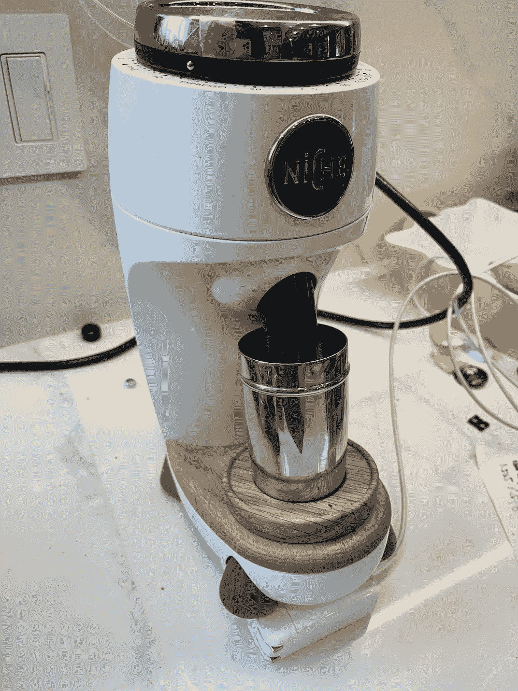
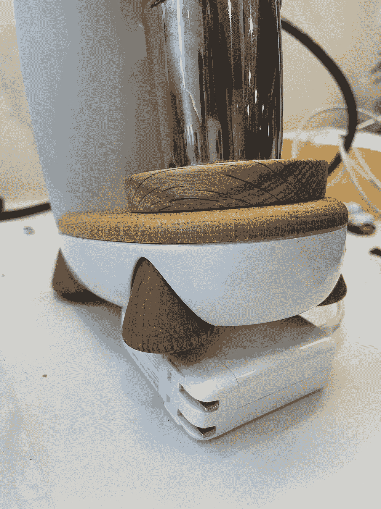
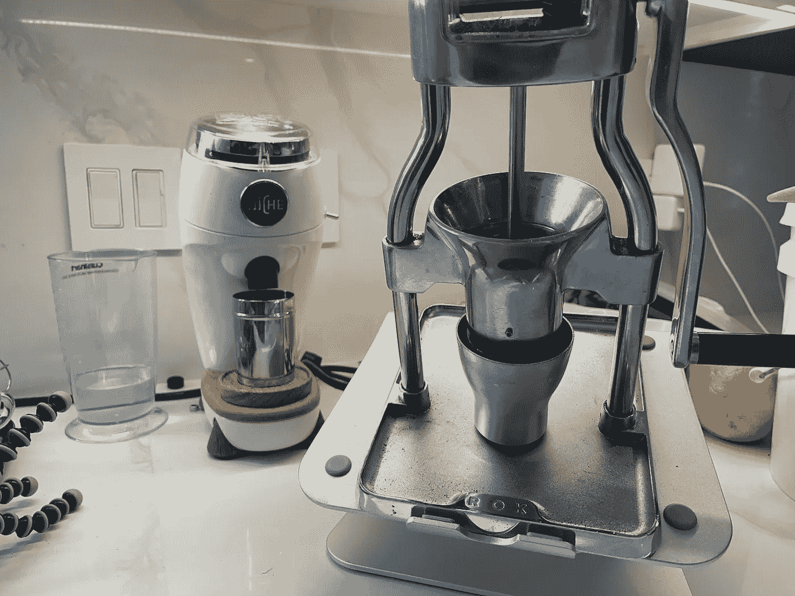
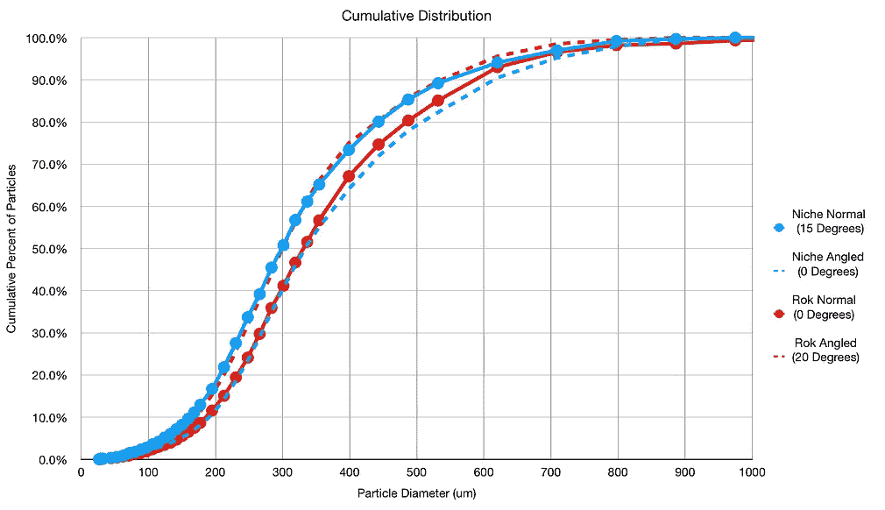
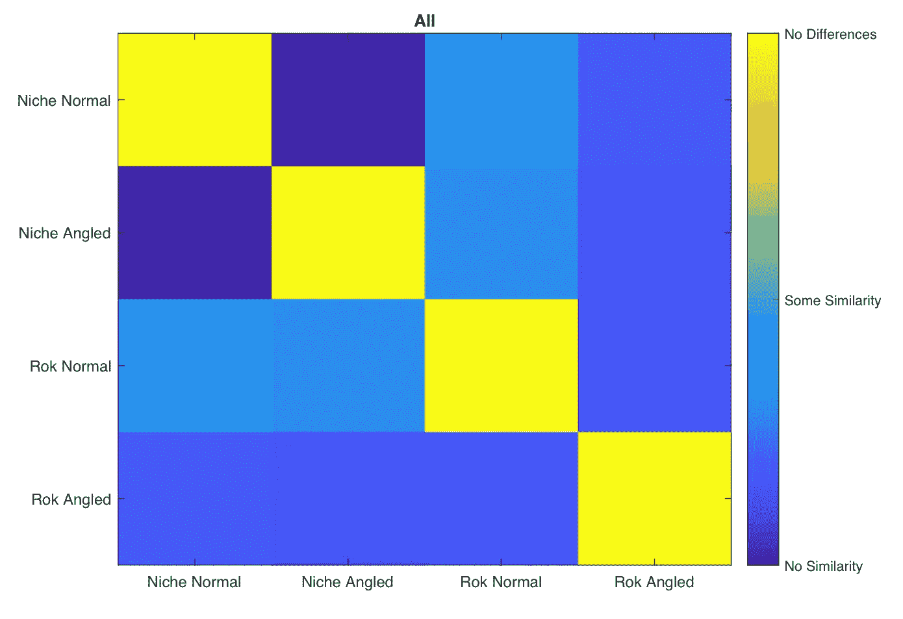
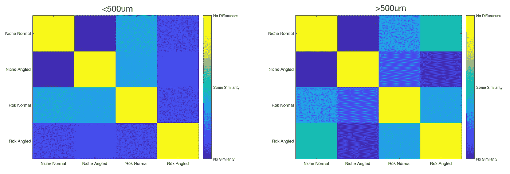
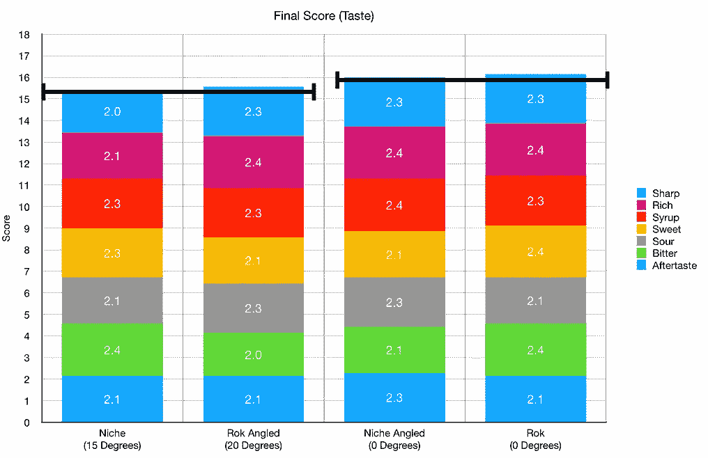
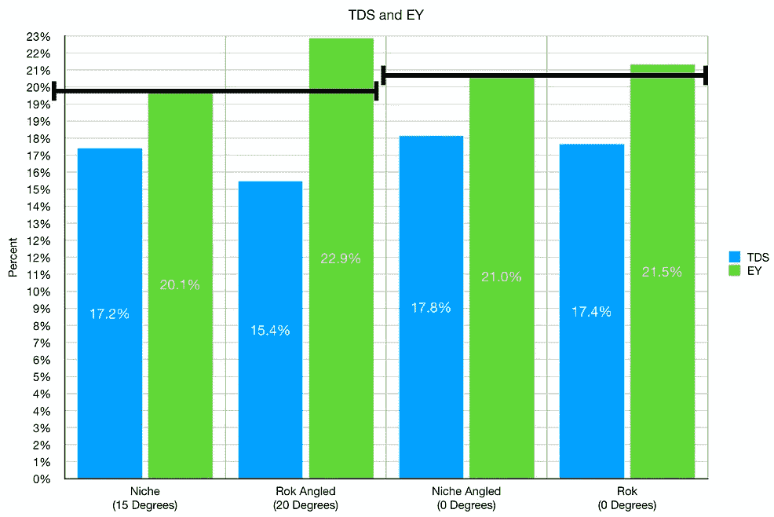
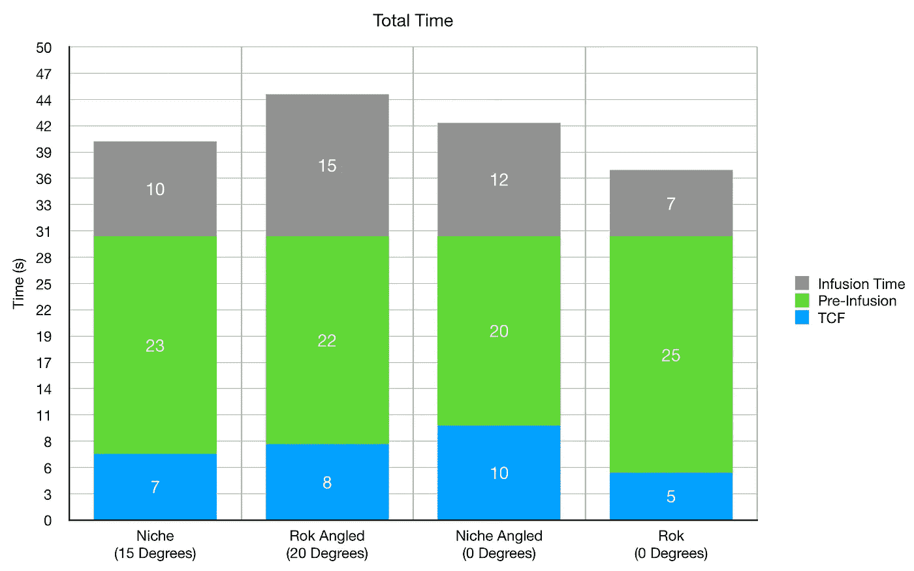
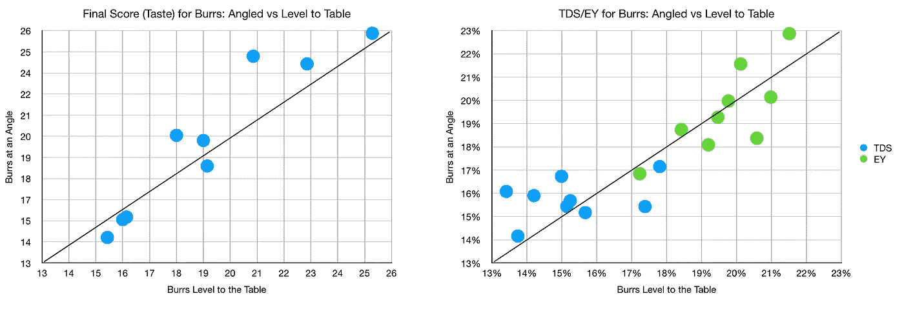

# Rok 打败小众？磨咖啡的另一个角度

> 原文：<https://towardsdatascience.com/rok-beats-niche-another-angle-to-grind-coffee-645e46102891?source=collection_archive---------21----------------------->

## 咖啡数据科学

## 给这些研磨看看从正确的角度，第 4 部分

[之前的](/rok-beats-niche-zero-part-1-7957ec49840d)，我展示了韩国在[口味和提取](/rok-defeats-niche-zero-part-3-2fbcc18397af)方面击败了小众。我以为我已经捕捉到了[所有的变量](/rok-defeats-niche-zero-part-2-acdbae134018)，但是有一个我错过了。壁龛毛刺位于 15 度角，而毛刺位于 0 度角。这可以是另一个角度吗？

所有图片由作者提供

我做了一个快速的比较，将小生境设为 0，然后将韩国设为 20。我拥有的最简单的稳定平台是拿着一台电脑，因为手工研磨会使研磨机移动更多。我比较了研磨分布，一些样本镜头，然后几对镜头。

# 分布

在查看研磨分布时，我很惊讶利基在一个角度匹配韩国，反之亦然。有角度的毛刺会导致研磨分布的差异，但我没有考虑到会有多大的差异。

我们可以使用 [LBP 和 K-means 聚类](/comparing-coffee-grounds-with-lbp-and-k-means-clustering-f7181dbdea67)来查看粒子形状的相似程度。与 Rok 法线相比，生态位角度比 Rok 法线与角度以及生态位法线与角度更相似。

按颗粒大小划分，垂直与倾斜生态位差别很大，而 Rok 倾斜生态位更接近大于 500 微米的垂直生态位。这意味着较粗的颗粒在形状上更相似，这是之前发现的[主要差异](/rok-defeats-niche-zero-part-3-2fbcc18397af)是韩国击败利基的根本原因。

# 绩效指标

我使用两个指标来评估技术之间的差异:最终得分和咖啡萃取。

[**最终得分**](https://towardsdatascience.com/@rmckeon/coffee-data-sheet-d95fd241e7f6) 是评分卡上 7 个指标(辛辣、浓郁、糖浆、甜味、酸味、苦味和回味)的平均值。当然，这些分数是主观的，但它们符合我的口味，帮助我提高了我的拍摄水平。分数有一些变化。我的目标是保持每个指标的一致性，但有时粒度很难确定。

**用折射仪测量总溶解固体量(TDS)，这个数字结合弹丸的输出重量和咖啡的输入重量用来确定提取到杯中的咖啡的百分比，称为**提取率(EY)** 。**

# **第一组样本**

**我为每一个有角度和没有角度的研磨机拍了两张照片。当研磨机具有相同的角度时，它们具有相似的味道分数(最终分数)以及 EY/TDS。生态位(15 度)的 TDS 较高，但 EY 较低，因为它比其他生态位稍短。**

********

**就拍摄时间而言，没有什么特别的。TCF 是时候盖上过滤器了。**

****

# **成对拍摄**

**我拍了 9 对照片，我把生态位角度设置为 0。每张图比较了某一角度的毛刺(壁龛通常是如何设置的)和台面上的毛刺(壁龛向后推 15 度)。**

**这个数据没有显示出这两个角度之间的趋势差异，所以它是不确定的。我本以为平行于桌面的毛刺会有更高的 EY 和更好的口感，但它们非常相似。**

****

**我真的很喜欢这两个研磨机，而且我没有考虑到研磨机角度是一个可能影响研磨分布的变量。似乎关于两个研磨机中的毛刺组，它们似乎仅在角度偏移上有所不同。这些数据确实存在于研磨机毛刺角度与性能的研究中，希望有一天，这些数据能够让普通人更好地理解研磨这一过程。**

**如果你愿意，可以在 [Twitter](https://mobile.twitter.com/espressofun?source=post_page---------------------------) 、 [YouTube](https://m.youtube.com/channel/UClgcmAtBMTmVVGANjtntXTw?source=post_page---------------------------) 和 [Instagram](https://www.instagram.com/espressofun/) 上关注我，我会在那里发布不同机器上的浓缩咖啡照片和浓缩咖啡相关的视频。也可以在 [LinkedIn](https://www.linkedin.com/in/robert-mckeon-aloe-01581595?source=post_page---------------------------) 上找到我。也可以在[中](https://towardsdatascience.com/@rmckeon/follow)关注我，在[订阅](https://rmckeon.medium.com/subscribe)。**

# **[我的进一步阅读](https://rmckeon.medium.com/story-collection-splash-page-e15025710347):**

**[我未来的书](https://www.kickstarter.com/projects/espressofun/engineering-better-espresso-data-driven-coffee)**

**[浓缩咖啡系列文章](https://rmckeon.medium.com/a-collection-of-espresso-articles-de8a3abf9917?postPublishedType=repub)**

**[工作和学校故事集](https://rmckeon.medium.com/a-collection-of-work-and-school-stories-6b7ca5a58318?source=your_stories_page-------------------------------------)**

**[个人故事和关注点](https://rmckeon.medium.com/personal-stories-and-concerns-51bd8b3e63e6?source=your_stories_page-------------------------------------)**

**[乐高故事启动页面](https://rmckeon.medium.com/lego-story-splash-page-b91ba4f56bc7?source=your_stories_page-------------------------------------)**

**[摄影启动页面](https://rmckeon.medium.com/photography-splash-page-fe93297abc06?source=your_stories_page-------------------------------------)**

**[使用图像处理测量咖啡研磨颗粒分布](https://link.medium.com/9Az9gAfWXdb)**

**[改进浓缩咖啡](https://rmckeon.medium.com/improving-espresso-splash-page-576c70e64d0d?source=your_stories_page-------------------------------------)**

**[断奏生活方式概述](https://rmckeon.medium.com/a-summary-of-the-staccato-lifestyle-dd1dc6d4b861?source=your_stories_page-------------------------------------)**

**[测量咖啡磨粒分布](https://rmckeon.medium.com/measuring-coffee-grind-distribution-d37a39ffc215?source=your_stories_page-------------------------------------)**

**[咖啡萃取](https://rmckeon.medium.com/coffee-extraction-splash-page-3e568df003ac?source=your_stories_page-------------------------------------)**

**[咖啡烘焙](https://rmckeon.medium.com/coffee-roasting-splash-page-780b0c3242ea?source=your_stories_page-------------------------------------)**

**[咖啡豆](https://rmckeon.medium.com/coffee-beans-splash-page-e52e1993274f?source=your_stories_page-------------------------------------)**

**[浓缩咖啡滤纸](https://rmckeon.medium.com/paper-filters-for-espresso-splash-page-f55fc553e98?source=your_stories_page-------------------------------------)**

**[浓缩咖啡篮及相关主题](https://rmckeon.medium.com/espresso-baskets-and-related-topics-splash-page-ff10f690a738?source=your_stories_page-------------------------------------)**

**[意式咖啡观点](https://rmckeon.medium.com/espresso-opinions-splash-page-5a89856d74da?source=your_stories_page-------------------------------------)**

**[透明 Portafilter 实验](https://rmckeon.medium.com/transparent-portafilter-experiments-splash-page-8fd3ae3a286d?source=your_stories_page-------------------------------------)**

**[杠杆机维修](https://rmckeon.medium.com/lever-machine-maintenance-splash-page-72c1e3102ff?source=your_stories_page-------------------------------------)**

**[咖啡评论和想法](https://rmckeon.medium.com/coffee-reviews-and-thoughts-splash-page-ca6840eb04f7?source=your_stories_page-------------------------------------)**

**[咖啡实验](https://rmckeon.medium.com/coffee-experiments-splash-page-671a77ba4d42?source=your_stories_page-------------------------------------)**