# 韩国击败利基零:第一部分

> 原文：<https://towardsdatascience.com/rok-beats-niche-zero-part-1-7957ec49840d?source=collection_archive---------10----------------------->

## 咖啡数据科学

## 咖啡研磨机摊牌

早在一月份，我买了一个[小生零](/how-zero-is-the-niche-zero-d823101f4829)。虽然我热爱我的 [Rok](https://www.rok.coffee/us/home?utm_source=rok.coffee) 手动研磨机，但用它进行了 5 年的多次拍摄和咖啡实验已经让我精疲力尽了。我想要一个电动研磨机，希望能升级。出于某种原因，我当时没有费心做一个并排的比较，我把[韩国磨床](https://rmckeon.medium.com/retiring-my-rok-coffee-grinder-with-a-niche-zero-92b6bd8e10b0)存放起来，直到我的夏季旅行。

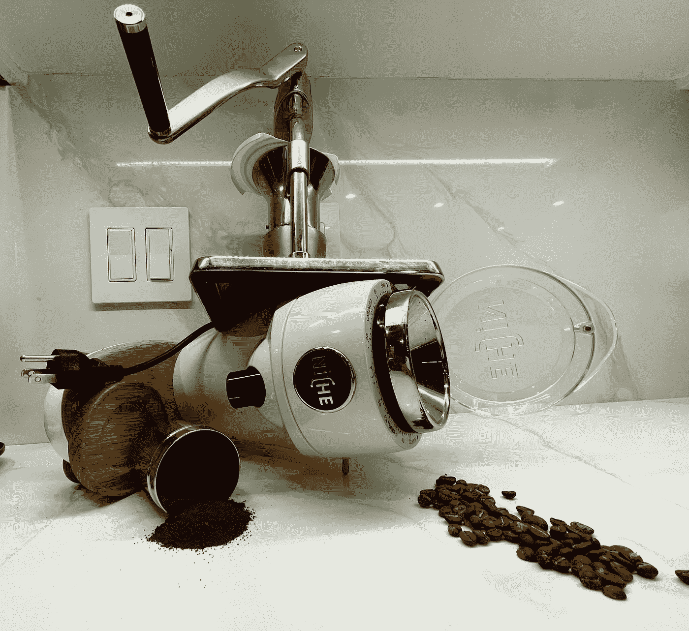

所有图片由作者提供

我带着韩国磨床去了我的亲家，在那里我有另一台像我家一样的 Kim Express 机器。我立即注意到我正在拉更高的提取镜头。我本来打算把韩国磨床留在那里，但我改变了主意，这样我就可以进行并排比较。

我把这个比较分成三个部分，因为我想更深入地了解为什么研磨机的性能如此不同。

1.  第 1 部分包括使用两个研磨机的 19 对镜头的配对比较，以及每对镜头的相同镜头参数。
2.  第 2 部分检查粒子分布，看看是否有更好的理解发生了什么。
3.  第 3 部分甚至更深入，使用 K-means 聚类对性能差异进行理论化，然后用一个 sifter 进行一个简短的实验来帮助验证该理论。

# 绩效指标

我使用两个指标来评估技术之间的差异:最终得分和咖啡萃取。

[**最终得分**](https://towardsdatascience.com/@rmckeon/coffee-data-sheet-d95fd241e7f6) 是评分卡上 7 个指标(辛辣、浓郁、糖浆、甜味、酸味、苦味和余味)的平均值。当然，这些分数是主观的，但它们符合我的口味，帮助我提高了我的拍摄水平。分数有一些变化。我的目标是保持每个指标的一致性，但有时粒度很难确定。

</coffee-solubility-in-espresso-an-initial-study-88f78a432e2c>**使用折射仪测量总溶解固体量(TDS)，这个数字结合咖啡的输出重量和输入重量用于确定提取到杯中的咖啡的百分比，称为**提取率(EY)** 。**

# **在利基市场拨号**

**一开始，我认为我可能需要磨得更细，所以我花时间拨入。通常，我发现设置 13 是最好的，这也不例外。设置 13 韩元的味道和提取。场景 14 是一个美味的镜头，但就提取而言，它并不令人印象深刻。**

**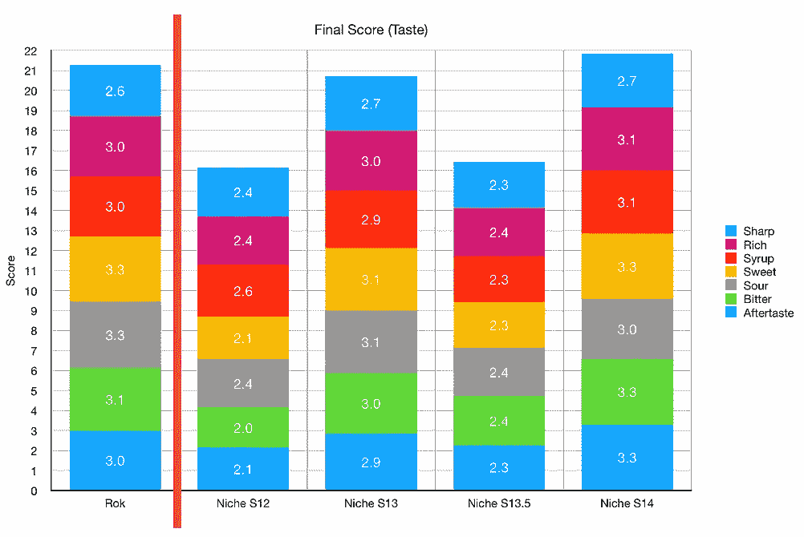****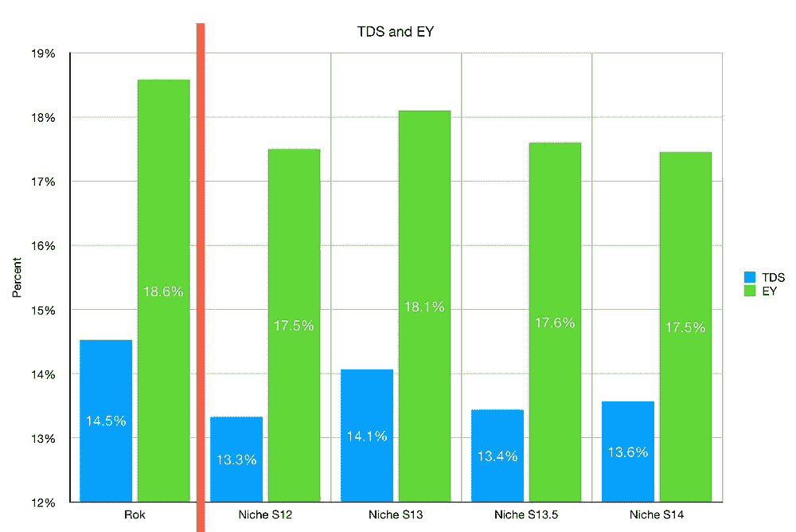**

**设定为 13 时，总时间稍长，但没关系。**

**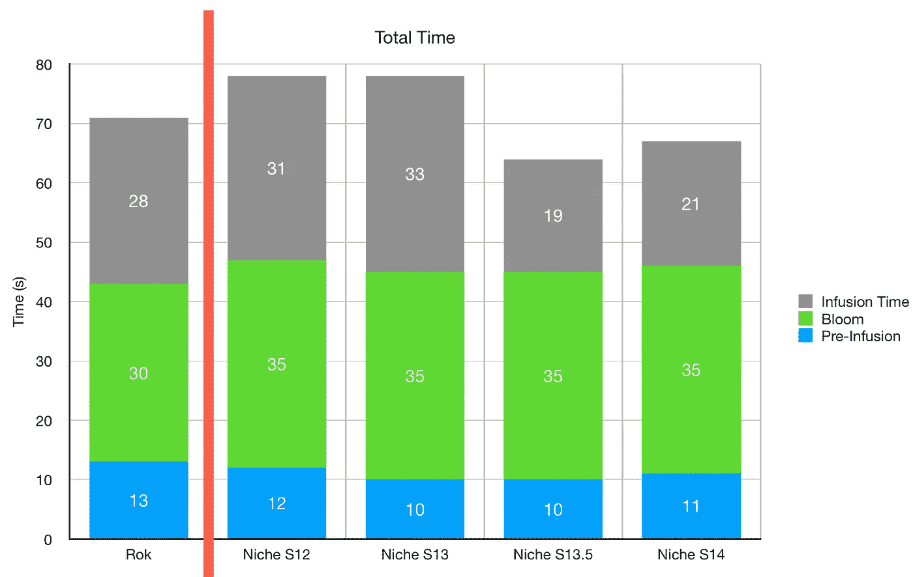**

**我没有在韩国拨号。我去过一个比 0 更好的地方，在过去的三年里我一直呆在那里。它在那个设置上已经太久了，拧入的部分需要更换。**

**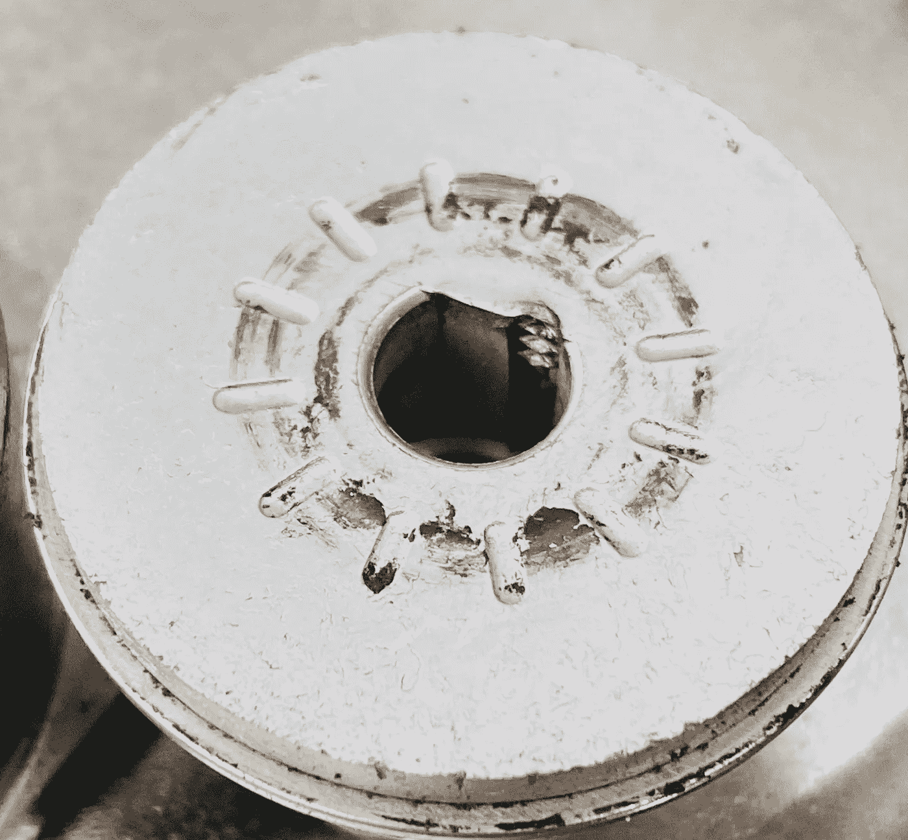**

**螺丝孔右上方带有螺丝凹痕的底部毛刺块。**

# **比较**

**我使用散点图来比较性能。很容易看出这些点是在线上还是线下。如果是在线上，两者表现差不多。**

**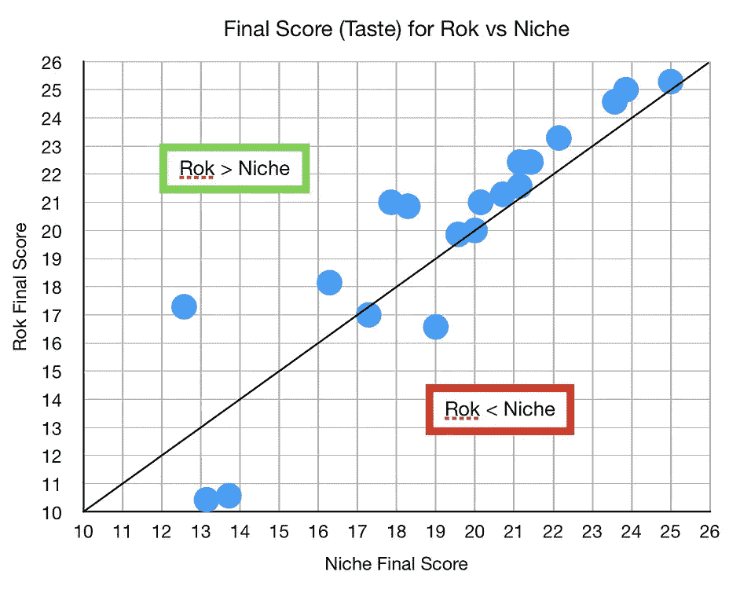****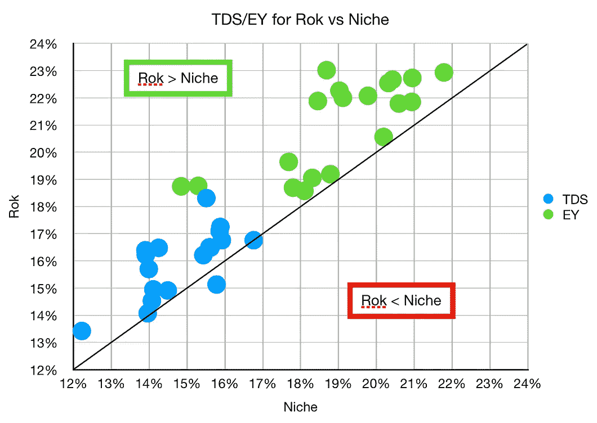**

**我根据咖啡烘焙分解了这些数据，结果是相似的。韩国击败了纸，我的意思是，利基。**

**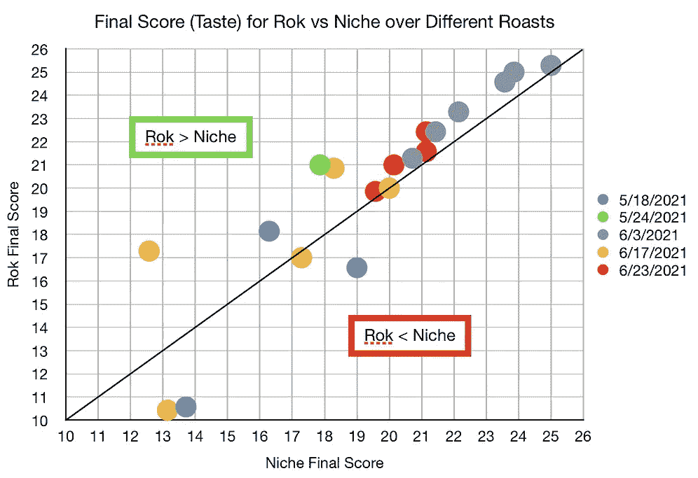****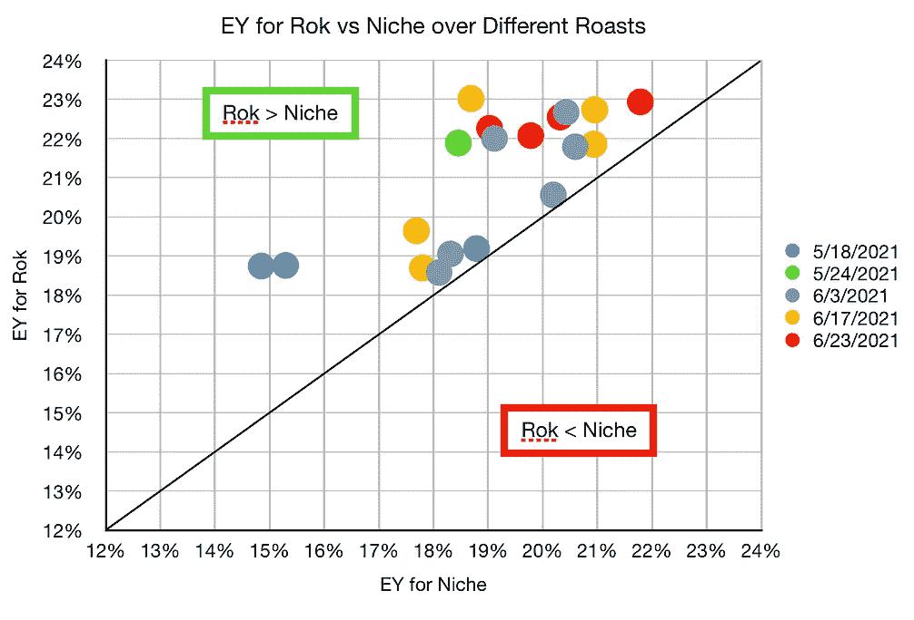**

**对于一般的统计，我有这个小表。我计划做 30 双，但是我在韩国弄坏了传动齿轮。**

**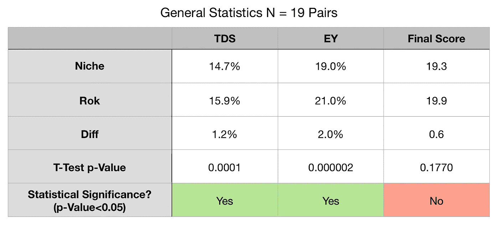**

**对于口味(最终得分)，结果几乎没有统计学意义。更多的数据可能会显示出统计学意义。我观察了两个异常值，p 值下降到 0.05 以上。**

**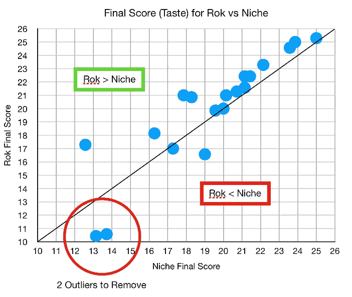****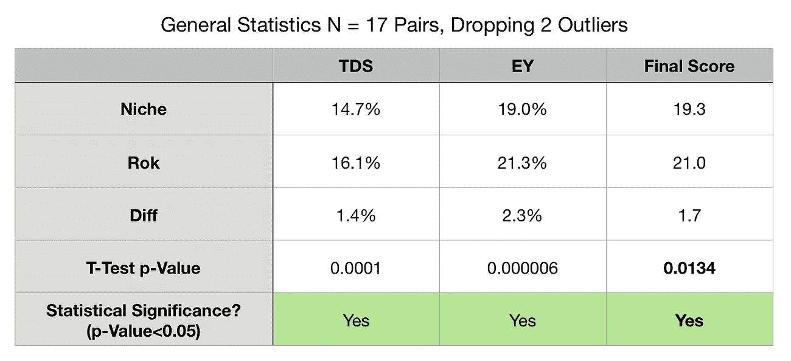**

**在工作流程方面，我更喜欢小众，因为电动研磨机部分。我很兴奋，韩国声称是一个更昂贵的电动磨床相同质量的磨床是真的。这项研究也有助于巩固我想继续使用我的韩国研磨机，特别是最好的烘烤。**

**当我探索其中的原因时，我真的开始更深入地理解咖啡研磨机。在我看来，研磨机之间的客观比较很少，部分原因是比较它们很困难。在接下来的两个部分中，我将深入探究原因和条件。**

**如果你愿意，可以在[推特](https://mobile.twitter.com/espressofun?source=post_page---------------------------)、 [YouTube](https://m.youtube.com/channel/UClgcmAtBMTmVVGANjtntXTw?source=post_page---------------------------) 和 [Instagram](https://www.instagram.com/espressofun/) 上关注我，我会在那里发布不同机器上的浓缩咖啡照片和浓缩咖啡相关的视频。你也可以在 [LinkedIn](https://www.linkedin.com/in/robert-mckeon-aloe-01581595?source=post_page---------------------------) 上找到我。也可以在[媒](https://towardsdatascience.com/@rmckeon/follow)和[订阅](https://rmckeon.medium.com/subscribe)关注我。**

# **[我的进一步阅读](https://rmckeon.medium.com/story-collection-splash-page-e15025710347):**

**[我的未来之书](https://www.kickstarter.com/projects/espressofun/engineering-better-espresso-data-driven-coffee)**

**[工作和学校故事集](https://rmckeon.medium.com/a-collection-of-work-and-school-stories-6b7ca5a58318?source=your_stories_page-------------------------------------)**

**[个人故事和关注点](https://rmckeon.medium.com/personal-stories-and-concerns-51bd8b3e63e6?source=your_stories_page-------------------------------------)**

**[乐高故事启动页面](https://rmckeon.medium.com/lego-story-splash-page-b91ba4f56bc7?source=your_stories_page-------------------------------------)**

**[摄影启动页面](https://rmckeon.medium.com/photography-splash-page-fe93297abc06?source=your_stories_page-------------------------------------)**

**[使用图像处理测量咖啡研磨颗粒分布](https://link.medium.com/9Az9gAfWXdb)**

**[改进浓缩咖啡](https://rmckeon.medium.com/improving-espresso-splash-page-576c70e64d0d?source=your_stories_page-------------------------------------)**

**[断奏生活方式概述](https://rmckeon.medium.com/a-summary-of-the-staccato-lifestyle-dd1dc6d4b861?source=your_stories_page-------------------------------------)**

**[测量咖啡磨粒分布](https://rmckeon.medium.com/measuring-coffee-grind-distribution-d37a39ffc215?source=your_stories_page-------------------------------------)**

**[咖啡萃取](https://rmckeon.medium.com/coffee-extraction-splash-page-3e568df003ac?source=your_stories_page-------------------------------------)**

**[咖啡烘焙](https://rmckeon.medium.com/coffee-roasting-splash-page-780b0c3242ea?source=your_stories_page-------------------------------------)**

**[咖啡豆](https://rmckeon.medium.com/coffee-beans-splash-page-e52e1993274f?source=your_stories_page-------------------------------------)**

**[浓缩咖啡滤纸](https://rmckeon.medium.com/paper-filters-for-espresso-splash-page-f55fc553e98?source=your_stories_page-------------------------------------)**

**[浓缩咖啡篮及相关主题](https://rmckeon.medium.com/espresso-baskets-and-related-topics-splash-page-ff10f690a738?source=your_stories_page-------------------------------------)**

**[意式咖啡观点](https://rmckeon.medium.com/espresso-opinions-splash-page-5a89856d74da?source=your_stories_page-------------------------------------)**

**[透明 Portafilter 实验](https://rmckeon.medium.com/transparent-portafilter-experiments-splash-page-8fd3ae3a286d?source=your_stories_page-------------------------------------)**

**[杠杆机维修](https://rmckeon.medium.com/lever-machine-maintenance-splash-page-72c1e3102ff?source=your_stories_page-------------------------------------)**

**[咖啡评论和想法](https://rmckeon.medium.com/coffee-reviews-and-thoughts-splash-page-ca6840eb04f7?source=your_stories_page-------------------------------------)**

**[咖啡实验](https://rmckeon.medium.com/coffee-experiments-splash-page-671a77ba4d42?source=your_stories_page-------------------------------------)**