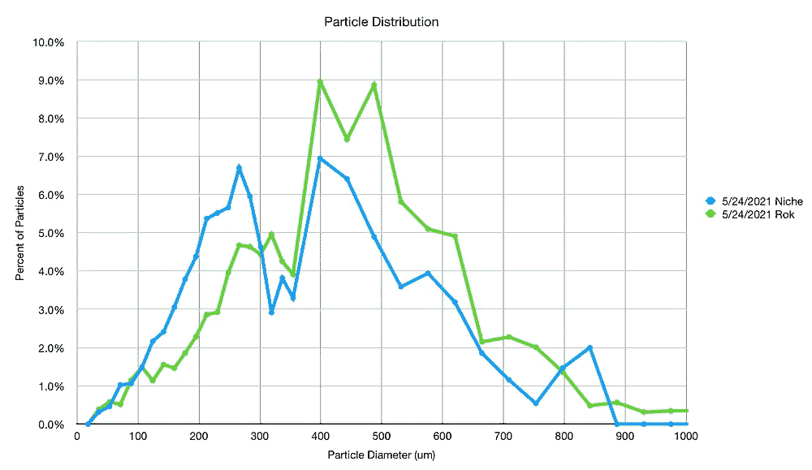
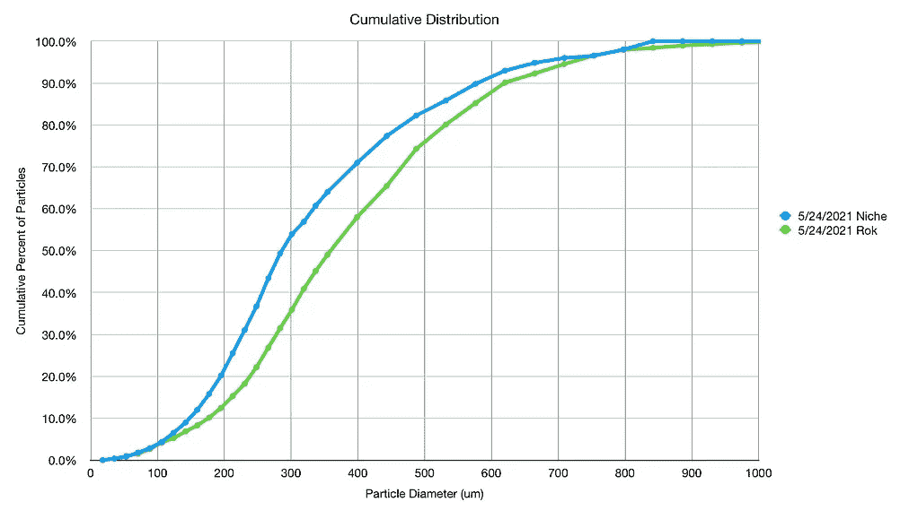
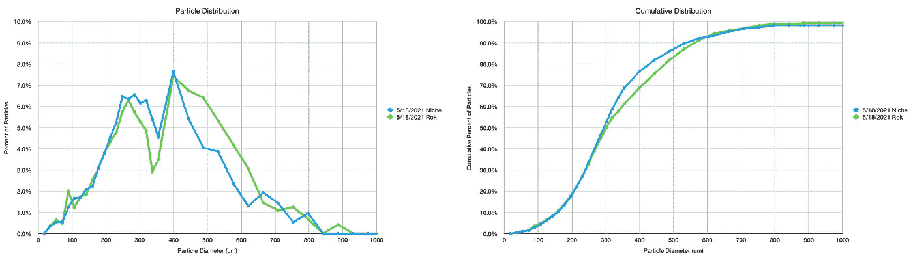
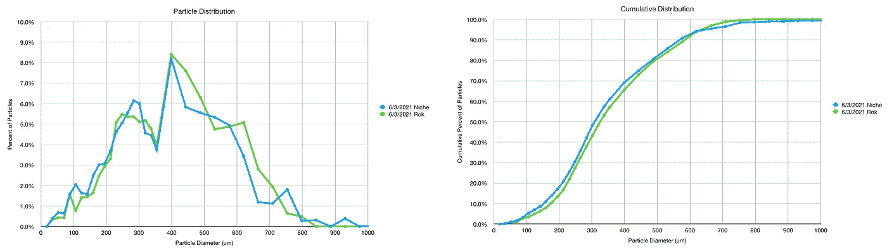
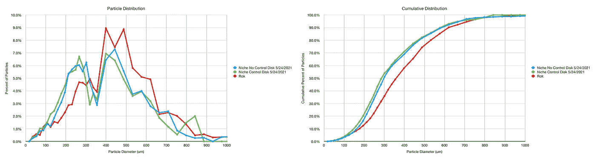
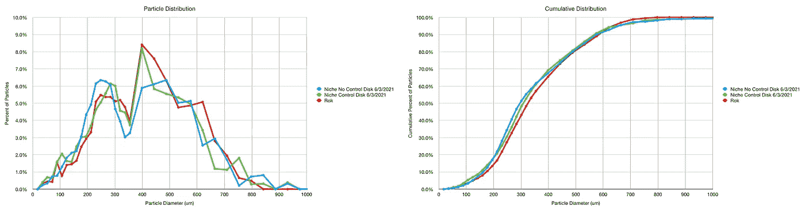

# 韩国击败利基零:第二部分

> 原文：<https://towardsdatascience.com/rok-defeats-niche-zero-part-2-acdbae134018?source=collection_archive---------16----------------------->

## 咖啡数据科学

## 咖啡研磨机摊牌，粒子分布

在第一部分中，我们发现 Rok grinder 比 Niche 更适合制作浓缩咖啡。我想知道为什么，所以我收集了一些地面粒子分布来寻找线索。我看了一些烘烤以及有和没有流量控制盘的壁龛。

对于所有这些烘焙，来自韩国的研磨粉比来自利基市场的研磨粉提取率更高。

# 2021 年 5 月 24 日烧烤

与壁龛相比，这种烘烤对韩国来说向右移动了，所以韩国给出了更粗糙的研磨。我试着在壁龛上变得粗糙，但是提取率下降了。

# 5/18/2021

这种烘烤有非常相似的分布，但韩国仍然拉得更高。

# 6/3/2021

故事和以前一样。我在第 1 部分中扫了一些研磨参数，这仍然是最好的。没有一个明确的答案来解释为什么韩国会胜过利基市场。

# 控制盘

韩国没有控制盘，所以我想我会检查一下。流量控制盘也没有显著改变分布。在这种情况下，Rok 要粗糙得多，但当我试图将粗糙度与小生境相匹配时，我的提取产量下降了。

我还检查了另一次烘烤的分布，无论有没有控制盘，它们几乎是一样的。

不幸的是，这些发行版最让我困惑。这意味着粒子分布只是故事的一部分。也许，粒子本身有不同的形状，这是我在[第三部](/rok-defeats-niche-zero-part-3-2fbcc18397af)中探索的。

如果你愿意，可以在[推特](https://mobile.twitter.com/espressofun?source=post_page---------------------------)、 [YouTube](https://m.youtube.com/channel/UClgcmAtBMTmVVGANjtntXTw?source=post_page---------------------------) 和 [Instagram](https://www.instagram.com/espressofun/) 上关注我，我会在那里发布不同机器上的浓缩咖啡照片和浓缩咖啡相关的视频。你也可以在 [LinkedIn](https://www.linkedin.com/in/robert-mckeon-aloe-01581595?source=post_page---------------------------) 上找到我。也可以在[中](https://towardsdatascience.com/@rmckeon/follow)关注我，在[订阅](https://rmckeon.medium.com/subscribe)。

# [我的进一步阅读](https://rmckeon.medium.com/story-collection-splash-page-e15025710347):

[我未来的书](https://www.kickstarter.com/projects/espressofun/engineering-better-espresso-data-driven-coffee)

[浓缩咖啡系列文章](https://rmckeon.medium.com/a-collection-of-espresso-articles-de8a3abf9917?postPublishedType=repub)

[工作和学校故事集](https://rmckeon.medium.com/a-collection-of-work-and-school-stories-6b7ca5a58318?source=your_stories_page-------------------------------------)

[个人故事和关注点](https://rmckeon.medium.com/personal-stories-and-concerns-51bd8b3e63e6?source=your_stories_page-------------------------------------)

[乐高故事启动页面](https://rmckeon.medium.com/lego-story-splash-page-b91ba4f56bc7?source=your_stories_page-------------------------------------)

[摄影启动页面](https://rmckeon.medium.com/photography-splash-page-fe93297abc06?source=your_stories_page-------------------------------------)

[使用图像处理测量咖啡研磨颗粒分布](https://link.medium.com/9Az9gAfWXdb)

[改进浓缩咖啡](https://rmckeon.medium.com/improving-espresso-splash-page-576c70e64d0d?source=your_stories_page-------------------------------------)

[断奏生活方式概述](https://rmckeon.medium.com/a-summary-of-the-staccato-lifestyle-dd1dc6d4b861?source=your_stories_page-------------------------------------)

[测量咖啡磨粒分布](https://rmckeon.medium.com/measuring-coffee-grind-distribution-d37a39ffc215?source=your_stories_page-------------------------------------)

[咖啡萃取](https://rmckeon.medium.com/coffee-extraction-splash-page-3e568df003ac?source=your_stories_page-------------------------------------)

[咖啡烘焙](https://rmckeon.medium.com/coffee-roasting-splash-page-780b0c3242ea?source=your_stories_page-------------------------------------)

[咖啡豆](https://rmckeon.medium.com/coffee-beans-splash-page-e52e1993274f?source=your_stories_page-------------------------------------)

[浓缩咖啡滤纸](https://rmckeon.medium.com/paper-filters-for-espresso-splash-page-f55fc553e98?source=your_stories_page-------------------------------------)

[浓缩咖啡篮及相关主题](https://rmckeon.medium.com/espresso-baskets-and-related-topics-splash-page-ff10f690a738?source=your_stories_page-------------------------------------)

[意式咖啡观点](https://rmckeon.medium.com/espresso-opinions-splash-page-5a89856d74da?source=your_stories_page-------------------------------------)

[透明 Portafilter 实验](https://rmckeon.medium.com/transparent-portafilter-experiments-splash-page-8fd3ae3a286d?source=your_stories_page-------------------------------------)

[杠杆机维修](https://rmckeon.medium.com/lever-machine-maintenance-splash-page-72c1e3102ff?source=your_stories_page-------------------------------------)

[咖啡评论和想法](https://rmckeon.medium.com/coffee-reviews-and-thoughts-splash-page-ca6840eb04f7?source=your_stories_page-------------------------------------)

[咖啡实验](https://rmckeon.medium.com/coffee-experiments-splash-page-671a77ba4d42?source=your_stories_page-------------------------------------)