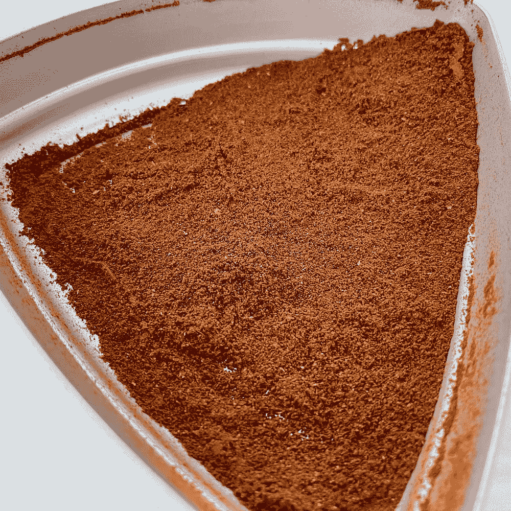
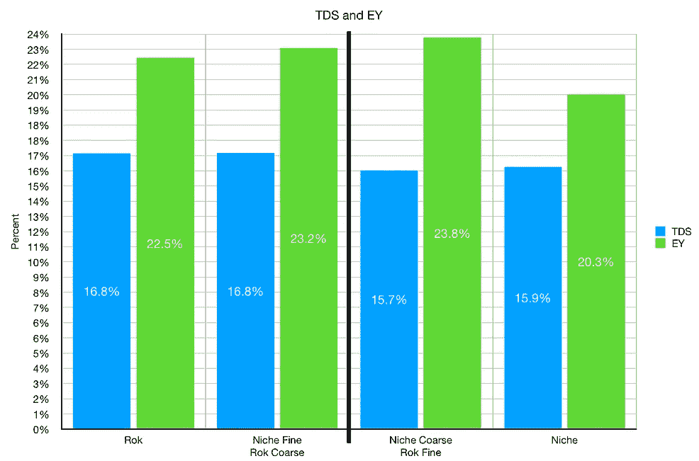

# 韩国击败利基零第 3 部分

> 原文：<https://towardsdatascience.com/rok-defeats-niche-zero-part-3-2fbcc18397af?source=collection_archive---------18----------------------->

## 咖啡数据科学

## 咖啡研磨机摊牌，根源

之前我发现 [Rok grinder 在口感和提取上都比小众 Zero](/rok-beats-niche-zero-part-1-7957ec49840d) 好。然而，当调查[研磨分布](/rok-defeats-niche-zero-part-2-acdbae134018)时，我没有看到可以解释口味和提取差异的巨大差异。所以我想深入挖掘，我转向了模式识别。

我用[线性二元模式(LBP)来描述粒子](/the-shape-of-coffee-fa87d3a67752)，然后我用 K-means 聚类对它们进行分类。我观察了不同大小的颗粒，以了解大小相似的不同颗粒之间的差异。

# 粒子分布的 LBP + K 均值聚类

我按颗粒直径分解了每种研磨分布，然后比较了这些颗粒聚集的直方图。从一些初始数据来看，大于 500 微米的颗粒差异似乎很大，所以我将大于 500 微米和小于 500 微米的颗粒分成两部分。

对于小于 500um 的粒子，它们非常相似，并结合成相似的簇。对于大于 500 微米的颗粒，小生境仅分为 8 个簇，而 Rok 则更分散，表明颗粒形状更为多样。

> 理论:韩国研磨机生产的 500 微米以上的研磨料比利基零研磨料更好。

# 筛

为了验证这个理论，我用一个 500 微米的筛子从每个研磨机中筛出咖啡。然后我将 Rok 的粗颗粒和小生境的细颗粒重新混合，反之亦然。

以下是每台研磨机的分布情况，使用筛分重量作为成像颗粒重量的参考。

以下是<500um particle distributions:

Here are the >500 微米的颗粒分布:

# 混合

通过混合这些筛过的粉末，我能够分离出作为潜在问题的粗颗粒。

我做了这些混合镜头的最终分布，分布非常相似。

# 绩效指标

我使用两个指标来评估技术之间的差异:最终得分和咖啡萃取。

[**最终得分**](https://towardsdatascience.com/@rmckeon/coffee-data-sheet-d95fd241e7f6) 是评分卡上 7 个指标(辛辣、浓郁、糖浆、甜味、酸味、苦味和余味)的平均值。当然，这些分数是主观的，但它们符合我的口味，帮助我提高了我的拍摄水平。分数有一些变化。我的目标是保持每个指标的一致性，但有时粒度很难确定。

</coffee-solubility-in-espresso-an-initial-study-88f78a432e2c>**用折射仪测量总溶解固体量(TDS)，这个数字结合弹丸的输出重量和咖啡的输入重量用来确定提取到杯中的咖啡的百分比，称为**提取率(EY)** 。**

# **表演**

**使用韩国粗磨和利基细磨的结果是在味道和提取相似的镜头作为韩国地面自己。反其道而行之会导致比单独的小生境更差的味道，但是这一次的产出与投入的比率略高，为 1.5:1。其他镜头的比例是 1.3:1。**

********

**将最终数字放入网格中，以帮助显示与汇总水平的差异。**

****

**就总时间而言，时间似乎更多地与韩国的罚款联系在一起，而不是任何其他变量。**

****

**这个调查对我来说是最有趣的，因为我还没有找到比较研磨机的好方法。通常，人们使用分布曲线，但当它们匹配时，如何量化差异？我对应用这项技术来帮助区分高端研磨机非常感兴趣。**

**编辑:在这篇[文章](/rok-beats-niche-another-angle-to-grind-coffee-645e46102891)中，我最后看了磨床角度。**

**如果你愿意，请在 [Twitter](https://mobile.twitter.com/espressofun?source=post_page---------------------------) 、 [YouTube](https://m.youtube.com/channel/UClgcmAtBMTmVVGANjtntXTw?source=post_page---------------------------) 和 [Instagram](https://www.instagram.com/espressofun/) 上关注我，我会在那里发布不同机器上的浓缩咖啡照片和浓缩咖啡相关的视频。也可以在 [LinkedIn](https://www.linkedin.com/in/robert-mckeon-aloe-01581595?source=post_page---------------------------) 上找到我。也可以在[中](https://towardsdatascience.com/@rmckeon/follow)和[订阅](https://rmckeon.medium.com/subscribe)关注我。**

# **[我的进一步阅读](https://rmckeon.medium.com/story-collection-splash-page-e15025710347):**

**[我未来的书](https://www.kickstarter.com/projects/espressofun/engineering-better-espresso-data-driven-coffee)**

**[浓缩咖啡系列文章](https://rmckeon.medium.com/a-collection-of-espresso-articles-de8a3abf9917?postPublishedType=repub)**

**[工作和学校故事集](https://rmckeon.medium.com/a-collection-of-work-and-school-stories-6b7ca5a58318?source=your_stories_page-------------------------------------)**

**[个人故事和关注点](https://rmckeon.medium.com/personal-stories-and-concerns-51bd8b3e63e6?source=your_stories_page-------------------------------------)**

**[乐高故事首页](https://rmckeon.medium.com/lego-story-splash-page-b91ba4f56bc7?source=your_stories_page-------------------------------------)**

**[摄影启动页面](https://rmckeon.medium.com/photography-splash-page-fe93297abc06?source=your_stories_page-------------------------------------)**

**[使用图像处理测量咖啡研磨颗粒分布](https://link.medium.com/9Az9gAfWXdb)**

**[改善浓缩咖啡](https://rmckeon.medium.com/improving-espresso-splash-page-576c70e64d0d?source=your_stories_page-------------------------------------)**

**[断奏生活方式概述](https://rmckeon.medium.com/a-summary-of-the-staccato-lifestyle-dd1dc6d4b861?source=your_stories_page-------------------------------------)**

**[测量咖啡磨粒分布](https://rmckeon.medium.com/measuring-coffee-grind-distribution-d37a39ffc215?source=your_stories_page-------------------------------------)**

**[咖啡萃取](https://rmckeon.medium.com/coffee-extraction-splash-page-3e568df003ac?source=your_stories_page-------------------------------------)**

**[咖啡烘焙](https://rmckeon.medium.com/coffee-roasting-splash-page-780b0c3242ea?source=your_stories_page-------------------------------------)**

**[咖啡豆](https://rmckeon.medium.com/coffee-beans-splash-page-e52e1993274f?source=your_stories_page-------------------------------------)**

**[浓缩咖啡滤纸](https://rmckeon.medium.com/paper-filters-for-espresso-splash-page-f55fc553e98?source=your_stories_page-------------------------------------)**

**[浓缩咖啡篮及相关主题](https://rmckeon.medium.com/espresso-baskets-and-related-topics-splash-page-ff10f690a738?source=your_stories_page-------------------------------------)**

**[意式咖啡观点](https://rmckeon.medium.com/espresso-opinions-splash-page-5a89856d74da?source=your_stories_page-------------------------------------)**

**[透明 Portafilter 实验](https://rmckeon.medium.com/transparent-portafilter-experiments-splash-page-8fd3ae3a286d?source=your_stories_page-------------------------------------)**

**[杠杆机维修](https://rmckeon.medium.com/lever-machine-maintenance-splash-page-72c1e3102ff?source=your_stories_page-------------------------------------)**

**[咖啡评论和想法](https://rmckeon.medium.com/coffee-reviews-and-thoughts-splash-page-ca6840eb04f7?source=your_stories_page-------------------------------------)**

**[咖啡实验](https://rmckeon.medium.com/coffee-experiments-splash-page-671a77ba4d42?source=your_stories_page-------------------------------------)**