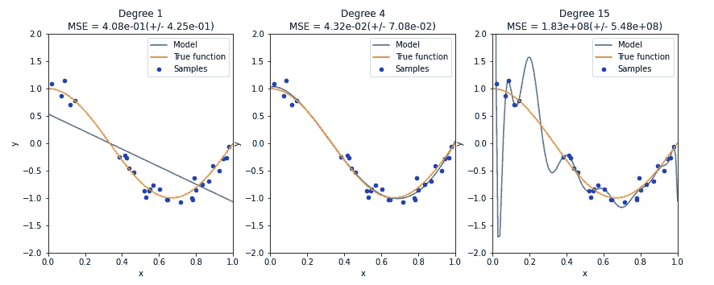
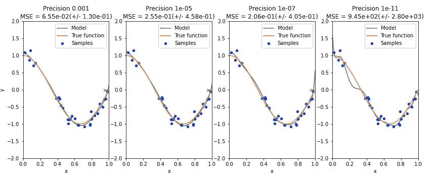
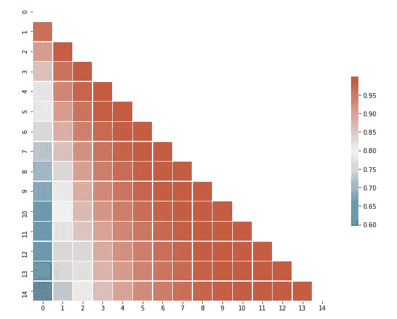
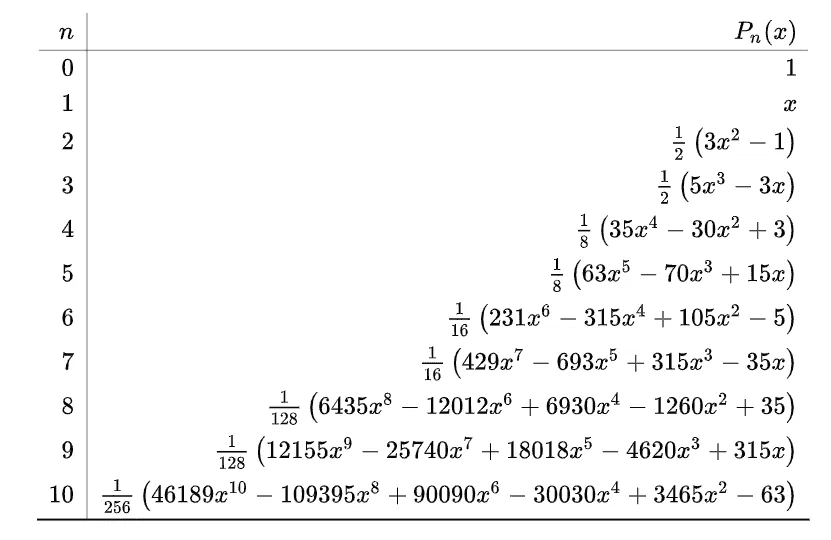
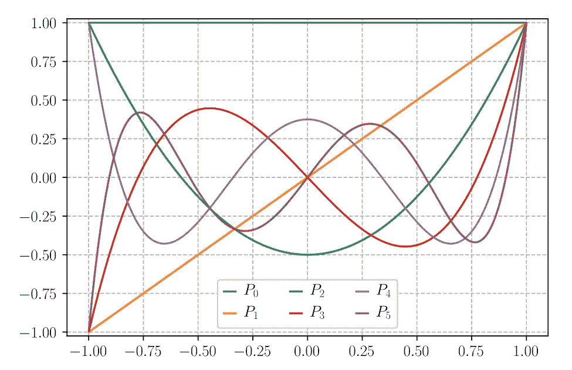
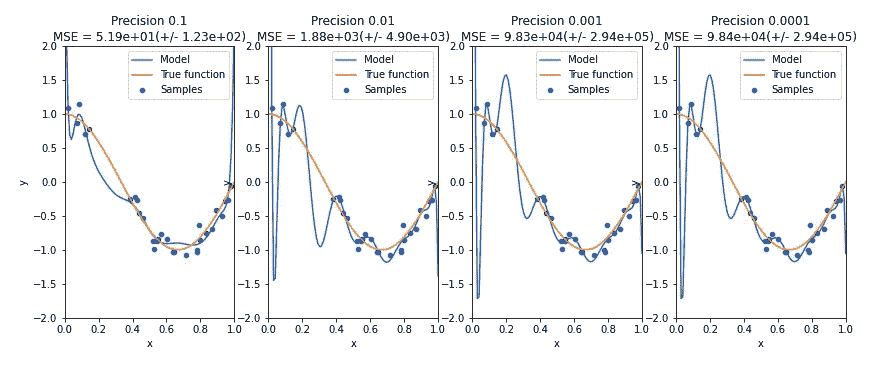

# 数据在隐式正则化中的作用

> 原文：<https://towardsdatascience.com/role-of-data-in-implicit-regularization-a37cdd6cce2e?source=collection_archive---------40----------------------->

## [实践教程](https://towardsdatascience.com/tagged/hands-on-tutorials)

## 使用勒让德多项式作为特征可以显著提高收敛性

照片由[德鲁·格拉汉姆](https://unsplash.com/@dizzyd718?utm_source=medium&utm_medium=referral)在 [Unsplash](https://unsplash.com?utm_source=medium&utm_medium=referral) 上拍摄

## TL；速度三角形定位法(dead reckoning)

在本文中，我们重温了基于梯度下降的优化算法的一个明显的*隐式正则化*效应。我们认为这是教科书上的过度拟合的例子，你可以在 scikit-learn 网站上找到。我们证明，当我们使用*先验*不相关多项式作为新特征时，隐式正则化效应消失。

## 过度拟合和正则化

在机器学习中，*过度拟合*是指一个经过训练的模型非常适合数据，但对看不见的数据不能很好地概括。一个相关的概念是*不适定问题*，当训练数据的微小变化导致模型参数的巨大变化时，不适定问题导致模型不稳定【1】。这种情况会阻止模型对来自与训练数据相同分布的数据进行归纳。这个问题可以通过*正则化*来解决，这是一组帮助创建模型的技术，不仅适用于训练数据，也适用于相同分布的未知数据。但是，请注意，一般来说，正则化并不能保证泛化。

文章中给出了一个过拟合的好例子:

 [## 欠拟合与过拟合-sci kit-了解 0.24.2 文档

### 这个例子演示了欠拟合和过拟合的问题，以及我们如何使用线性回归…

scikit-learn.org](https://scikit-learn.org/stable/auto_examples/model_selection/plot_underfitting_overfitting.html) 

这是一个回归问题，用一个简单的函数来描述基本事实

添加了高斯噪声。我们正试图用不同次数的多项式来逼近它。我们观察到，对于较低次数的多项式，该模型不太适合数据。这也被称为*欠配合*。相反，如果我们使用高次多项式来近似函数，则模型很好地拟合数据，但是曲线并不平滑，并且与我们试图学习的地面真实函数非常不同。下面是不同程度参数值的三个图。

在本例中，我们看到一次多项式对数据拟合不足，15 次多项式对数据拟合过度，而 4 次多项式似乎效果最好。

## 隐式正则化

然而，请注意，在这个例子中，我们使用线性回归的封闭形式的解决方案。如果我们决定通过改变`solver` 参数采用基于梯度下降的方法:

对于 15 次多项式，我们得到一个非常不同的图像:

在这个图中，我们尝试了四个不同的精度值(这决定了优化算法进行多少次迭代)。我们可以看到，几乎所有的预测曲线都非常接近真实函数，即使我们使用了更高次的多项式。诸如此类的例子让一些人(包括本文作者)相信基于梯度下降的优化过程具有正则化效果。隐式正则化是一个活跃的研究领域，其对泛化的影响尚未完全确定[2]。

然而，如果我们从另一个角度来看待这一现象，我们可以将我们的观察视为**优化算法未能达到全局最小值**。这是学习算法的问题(或特征)吗？不一定。原因可能在数据上。为了证明这一点，让我们考虑特征之间的相关性:

我们看到生成的特征高度相关。为了去相关特征，许多人使用像 PCA 这样的方法。然而，我们更喜欢先验不相关的特征*。*我们将使用勒让德多项式，而不是使用 x 的幂作为附加特征。

## 构建勒让德多项式

为简单起见，考虑区间[-1，1]中定义的函数。我们将使用与所有低次多项式不相关的多项式。设 f(x)是自变量 x 的先验分布的概率密度函数，那么两个函数 a(x)和 b(x)是不相关的，如果:

因此，我们的计划是选择与分布 f(x)不相关的多项式:

为简单起见，假设独立变量 x 的均匀先验分布。在贝叶斯术语中，它被称为*无信息先验*，通常在我们对变量没有任何先验信念时使用。那么等式就变得简单了:

我们将从零阶多项式开始，通过选择与所有其他低阶多项式正交的多项式来逐步提高。无需实际计算，我可以给你前 10 个多项式的结果:

来源:[https://en.wikipedia.org/wiki/Legendre_polynomials](https://en.wikipedia.org/wiki/Legendre_polynomials)

这些多项式被称为勒让德多项式，用于数学和物理的许多领域。以下是前六次勒让德多项式的曲线图，供您参考:

来源:[https://en.wikipedia.org/wiki/Legendre_polynomials](https://en.wikipedia.org/wiki/Legendre_polynomials)

然而，请注意，这不是多项式的归一化形式，因为按照惯例，P_n(1) = 1。

在`numpy`和`scipy` Python 库中都有一种计算勒让德多项式的有效方法。在我们的示例中，我们将添加基于勒让德多项式的特征，并将解决我们的回归问题:

在上面的代码中，我们将输入转换到区间[-1，1]中，然后基于直到指定次数的所有次数的勒让德多项式创建要素。结果真的很惊人:

仅用 13 次迭代，该模型就能达到全局最小值并匹配封闭形式的解。

**结论**

在本文中，我们考虑了高度相关的特性阻止优化算法找到全局最小值的情况。我们使用先验不相关*的勒让德多项式构建特征，而不是使用 PCA 去相关。实验表明，优化算法能较快地收敛到封闭解。这表明所谓的*隐式正则化*可以是数据的特征，而不是优化算法，并且它可以随着适当的数据预处理而消失。本文的代码可以在[我的 github 库](https://github.com/mlarionov/machine_learning_POC/blob/master/regularization/legendre_polynomials.ipynb)中找到。*

## 参考

[1]弗拉基米尔·瓦普尼克..*统计学习理论的本质*。:斯普林格，2000 年。

[2]阿罗拉、桑吉夫、科恩、纳达夫、胡、魏、罗、俞平。"深度矩阵分解中的隐式正则化." [arXiv:1905.13655](https://arxiv.org/abs/1905.13655) ，2019。