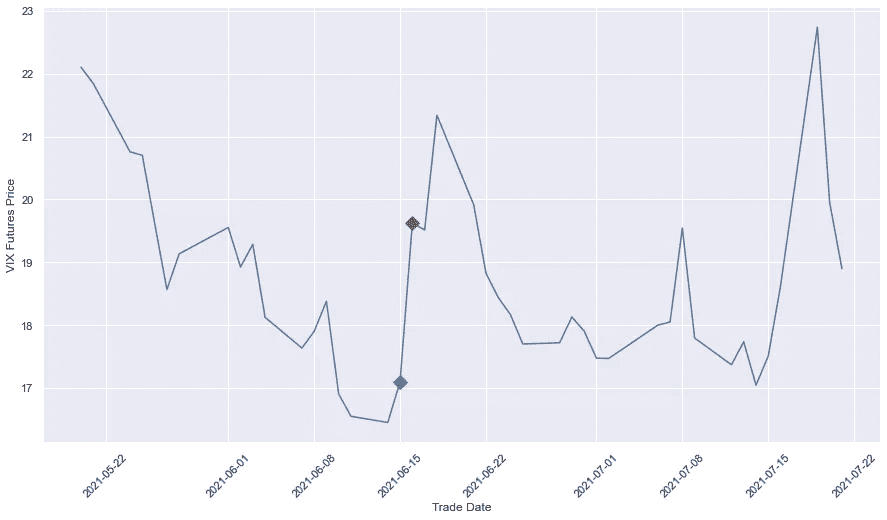
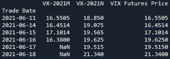
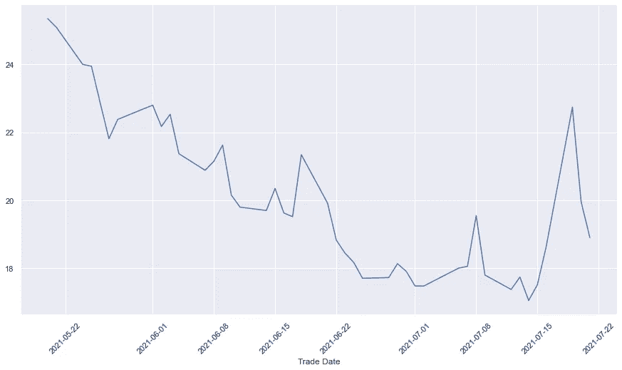
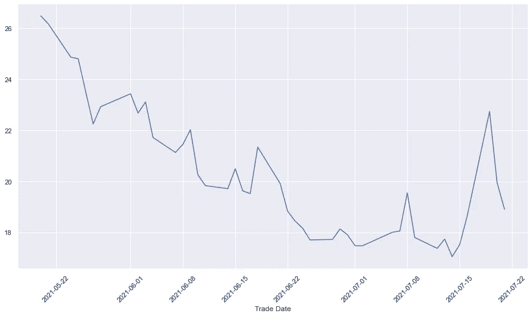
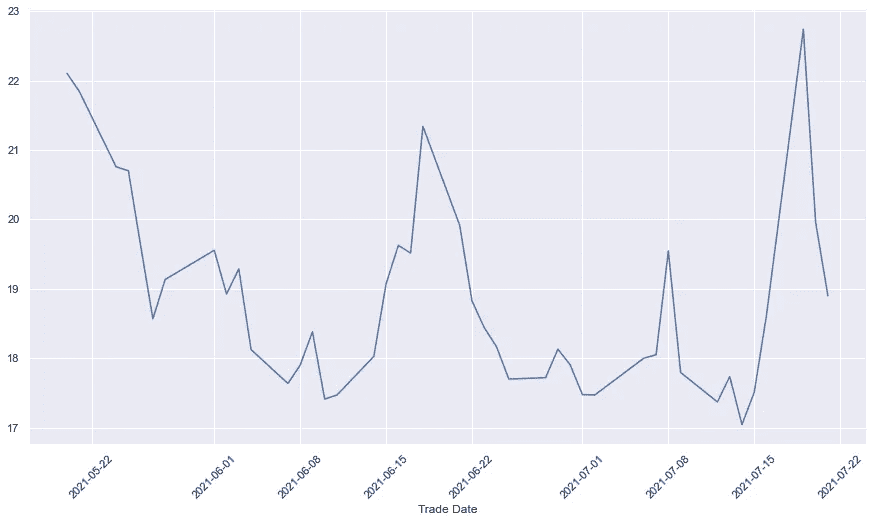

# 在期货曲线上滚动——连续期货价格

> 原文：<https://towardsdatascience.com/rolling-on-the-futures-curve-continuous-futures-prices-99382ee4bb4e?source=collection_archive---------9----------------------->

## 使用 Python 创建自定义的连续期货价格时间序列，用于回溯测试和交易。

[M. B. M.](https://unsplash.com/@m_b_m?utm_source=medium&utm_medium=referral) 在 [Unsplash](https://unsplash.com?utm_source=medium&utm_medium=referral) 上拍摄的照片

# 放弃

*本文不提供投资建议，其中的任何内容都不应被理解为投资建议。它为那些不需要建议就能做出投资决定的个人提供信息和教育。*

*本文包含的信息不是也不应被解读为购买或出售任何证券的要约或建议，或征求购买或出售任何证券的要约或建议。它不是，也不应该被视为使用任何特定投资策略的建议。*

在今天的资本市场上，期货提供了一种最具资本效率的交易各种资产类别的方式。它们的用途广泛，从对冲未来汇率风险，到直接持有大宗商品头寸，再到做空股指波动。

从历史上看，尽管期货的资本效率非常高，而且相对于名义保证金而言，要求的保证金相对较低，但这些名义保证金的绝对规模意味着它们不适合账户规模较小的散户投资者。

近年来，多个小型期货合约(小型和微型)的开发和上市极大地改变了这一局面。股票指数、波动性、石油、玉米和其他大宗商品甚至比特币的期货合约规模较小。这使得散户投资者对这一资产类别很感兴趣，尤其是从系统投资的角度来看。

<https://www.investopedia.com/terms/f/futures.asp>  

# 挑战

系统地回测和交易期货策略有其自身的挑战，主要的困难是从基础期货创建一个连续的时间序列。不同到期的合约很少以相同的价格交易，如果它们的价格只是缝合在一起，就会导致时间序列的跳跃。

举个例子，让我们看看 2021 年 6 月和 7 月到期的 VIX 期货合约。6 月合约于 6 月 16 日到期。

如果我们只是在滚动日期从一个期货切换到下一个期货，并将价格时间序列拼接在一起，下图中 6 月 16 日的跳跃(用红色标记)完全是两个不同水平的合约交易的产物，并不代表市场的实际行为。

缝合时间序列显示，从 6 月 15 日的 17.1 跃升至 6 月 16 日的 19.625，涨幅为 14.8%，而 7 月期货合约的变化实际上仅为 0.3%！

VIX 期货 6 月和 7 月 21 日的时间序列

VIX 期货价格快照(作者图片)

很明显，引入这样的人为跳跃可以完全改变任何形式的数据分析或对这一时间序列进行的回溯测试。

# 解决方案

有各种各样的方法可以用来解决这个问题，以便获得适合于回溯测试和分析的时间序列。最常见的是巴拿马调整、比例调整和使用永久展期。这些方法各有利弊。让我们看看它们中的每一个以及它们使用 python 的实现。

## 巴拿马调整

这种方法通过在滚动日期将每个以前的合同移动期货价格的差异来消除不同期货合同之间的差距。在我们上面的例子中，7 月期货在滚动日期的价格是 19.625，6 月期货的价格是 16.38，这意味着滚动前的所有价格都向上移动了 3.245。

执行巴拿马校正的简单 python 函数如下所示:

应用巴拿马调整的结果是这个价格时间序列。

使用巴拿马调整后的期货时间序列

与缝合的时间系列完全不同！

这是一个非常简单的方法，但有一些缺点。主要问题是，它引入了趋势偏差，这可能导致价格大幅波动。在某些情况下，这可能导致旧合同的负价格。时间序列中的相对价格信息也有损失，因为这种变化是绝对的。

然而，这是最常用的方法之一。

## 比例调整

与巴拿马法使用的绝对偏移不同，比例调整法使用旧价格的相对调整。这提供了一个连续的时间序列，不会引入任何偏差。

然而，这种方法的问题是，任何依赖于绝对价格水平的策略都需要以类似于时间序列的方式进行调整，这需要非常小心，因为使用这种方法非常容易引入错误。

使用比例调整后的期货时间序列(作者图片)

## 永久展期

这种方法使用两种期货的线性组合来进行 x 天的滚动。例如，如果您将滚动 5 天，在第 1 天，您将从旧合同滚动 20%到新合同，旧合同的风险敞口为 80%，新合同的风险敞口为 20%。第二天，旧的有 60%，新的有 40%，以此类推。到第 5 天，你将完成你的滚动。

虽然这种方法提供了非常平滑的过渡，但其主要缺点是在实际交易中，人们需要在所有这些天进行交易，并可能导致更高的交易成本。

使用永久展期后的期货时间序列(图片由作者提供)

# 结论

在这篇文章中，我介绍了三种不同的方法来创建一个连续的期货时间序列，用于回溯测试和分析。所有这些方法都有各自的优缺点，最终取决于您的具体应用，哪种方法效果最好。然而，这应该给你一个好的起点。

如果你想了解更多期货回溯测试和交易的复杂性，请查看 Quantra 的 12 小时综合课程，学习如何用 python 实现期货交易自动化。

<https://quantra.quantinsti.com/course/futures-trading/?ref=stefanharing>  

***注来自《走向数据科学》的编辑:*** *虽然我们允许独立作者根据我们的* [*规则和指导方针*](/questions-96667b06af5) *发表文章，但我们不认可每个作者的贡献。你不应该在没有寻求专业建议的情况下依赖一个作者的作品。详见我们的* [*读者术语*](/readers-terms-b5d780a700a4) *。*