# 基于深度学习的罗马图书馆读者评论分析

> 原文：<https://towardsdatascience.com/romes-libraries-readers-comments-analysis-with-deep-learning-989d72bb680c?source=collection_archive---------29----------------------->

## [实践教程](https://towardsdatascience.com/tagged/hands-on-tutorials)

## 主题建模、情感分析和读者聚类，以获得对用户偏好的洞察并执行量身定制的推荐

照片由[尼古拉斯·帕丁](https://unsplash.com/@perspectivaerronea?utm_source=medium&utm_medium=referral)在 [Unsplash](https://unsplash.com?utm_source=medium&utm_medium=referral) 上拍摄

# **简介**

这篇文章描述了对罗马图书馆的**读者评论开放数据集的分析，该数据集由[*Istituzione Biblioteche di Roma*](https://www.bibliotechediroma.it/)公开发布。**

该分析利用**主题建模**技术在读者的评论中寻找重复出现的主题，从而通过推理确定所借书籍的主题和读者的兴趣。此外，执行**情感分析**以确定客户评论是正面还是负面的。最后，使用读者数据(年龄和职业)通过**聚类技术**实现客户细分。

这提供了关于借阅书籍的主题、读者情绪和不同读者群的见解。除此之外，这些信息将用于**在两种不同的场景**中执行建议 **:**

1.  按题目推荐**:
    1.1。在**中找到书名最相似的题目**
    1.2。返回按降序排序的书名**评论情感评分****
2.  **推荐**由用户**(当我们没有偏好的主题，但仍有一些关于读者的信息时):
    2.1。对读者数据(年龄和职业)执行聚类
    2.2。为新用户
    2.3 找到**所属的集群**。返回按**评论情绪得分降序排列的书名。****

# ****数据准备和探索性数据分析****

**我们从导入所需的库开始:**

**然后我们加载数据集(2021 年 11 月更新):**

**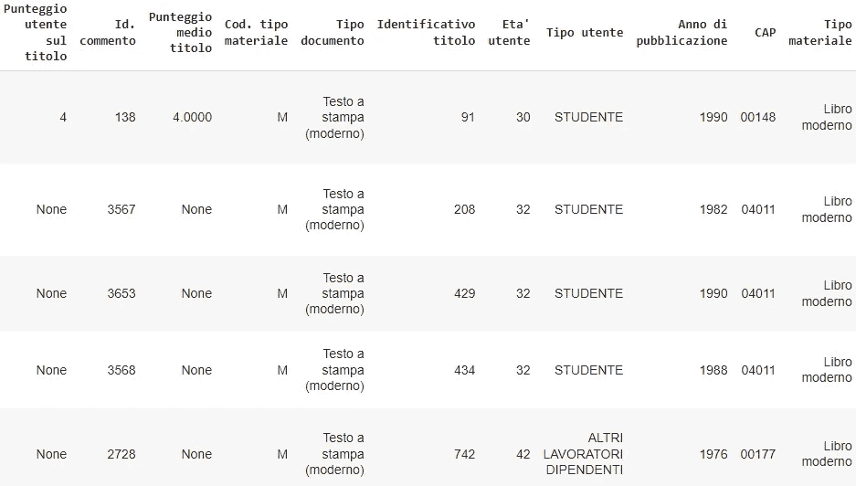**

**图片作者。**

**我们主要对以下栏目感兴趣:**

*   **" *Descrizione commento* ":将用于主题建模和情感分析的完整用户评论。**
*   **" *Titolo* ":素材的标题(书，电影，..)由客户借用，也是审查的主题。**
*   **" *Età utente* ":客户的年龄，以年为单位。**
*   **" *Tipo utente* ":客户的职业。**

**值得注意的是，数据集中的一列收集了用户给产品的一个**分数**，从 1 到 5。然而，在 **15636 条总评论**、**中，只有 5.2%** 显示该分数，因此该信息将不被使用:**

**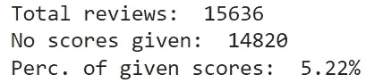**

**图片作者。**

**正在审核的产品为**图书**占 **78.7%** ，**音像**(如电影)占 **12.44%** ，**电子资源**占 **8.86%** :**

**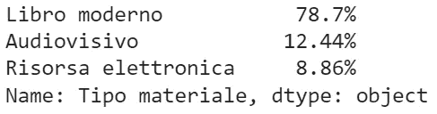**

**图片作者。**

**通过观察客户，我们注意到他们的平均年龄为 49 岁(只有 25%的总体评论是由 38 岁以下的读者撰写的)，并且几乎没有缺失值:**

**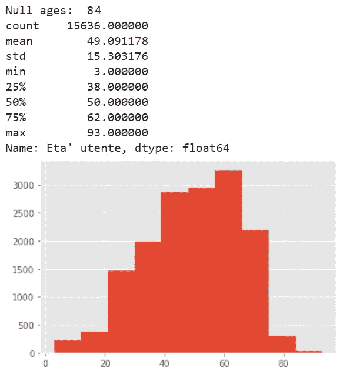**

**图片作者。**

**大多数客户都有职业，最常见的类型是雇员(" *impiegato* "，31.58%)，而学生(" *studente* ")仅占客户群的 19.49%；**

**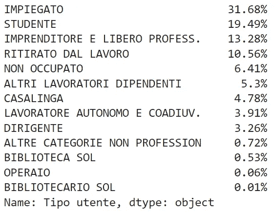**

**图片作者。**

**根据职业类型的年龄分布，我们还可以观察到学生的年龄(平均标准:26±8，Q1–Q3:25-32)低于雇员(平均标准:51±8，Q1–Q3:44–57)或工人(平均标准:50±9，Q1–Q3:47–56)和退休人员(平均标准:68±5，Q1–Q3:62–71)。**

**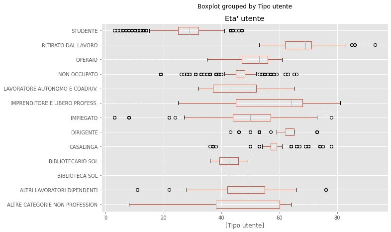**

**图片作者。**

# ****主题建模****

**读者评论不与任何标签相关联，因此它们需要用无监督的方法来分析。**

**为了在评论中找到语义相似的结构，我们将使用 BERTopic，这是 Maarten Grootendorst 的主题建模技术。**

**正如 author⁴所解释的，算法的主要步骤包括嵌入的**文档，其中利用了 bert⁵；然后 UMAP⁶到**降低嵌入维数**，否则将导致较差的聚类性能；用于**聚类**的 HDBSCAN⁷，以及最后，通过将 TF-IDF 应用于主题内的所有文档(而不是应用于单个文档)来定义**主题表示**，基本上将主题视为文档本身(因此得名，基于类的 TF-IDF):通过这种方式，得到的重要单词(以及相关分数)提供了有意义的、可解释的主题描述。****

**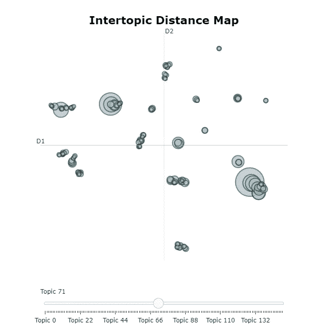**

**使用 UMAP 在 2D 空间上投影的基于类别的 TF-IDF 主题表示可以被动态地探索。图片作者。**

**我们现在观察读者评论中最常出现的 25 个话题。根据基于类别的 TF-IDF 得分，主题名称由最具代表性的单词组成，通过查看它们的频率，我们可以获得关于客户阅读内容的见解:**

**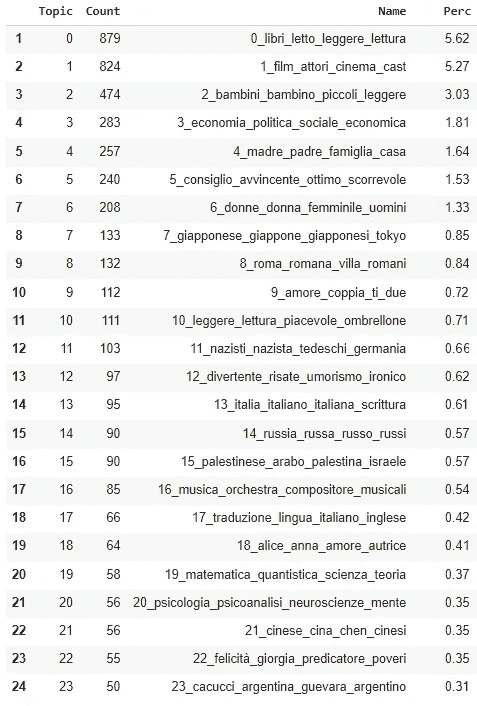**

**客户评论中最常出现的 25 个话题。图片作者。**

**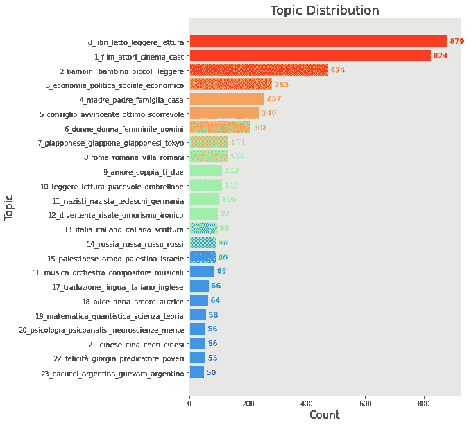**

**图片作者。**

**例如，如果我们从顶部观察表格，我们会注意到所有评论中的 **5.27%** 与**电影**(主题 1)相关，随后是 **3%** 与**儿童书籍**(主题 2)相关的评论，以及 **1.8%** 与**社会经济学**读物(主题 3)相关的评论。**

**我们还可以推断关于外国文学或国家的趋势或偏好，其中**日本**是所有评论的 **0.85%** (主题 7)的对象，而**俄罗斯**是 **0.57%** (主题 14)的对象。**

**我们还可以看到大量关于**罗马历史和建筑**的评论( **0.84%** ，话题 8)。或许，这可能与我们观察的地点有关(罗马图书馆的读者评论)。**

**最经常出现的主题所涵盖的评论比例较低，这背后的原因可能会引起问题。直觉上，我们可能期望最经常出现的主题能够解释大多数评论(*帕累托原则*)。这一发现至少有两个主要原因:**

*   ****大量检测到的主题**:在数据集上的重复实验总是产生数量一致的主题，在 130 到 145 之间变化。如果这种对语义差异的高度敏感性产生了过于分散而难以解释的结果，则可以减少主题的数量。减少话题有不同的方法。我们可以通过它们的层次结构来观察主题的相似性，以及它们如何相互关联，例如通过*topic _ model . visualize _ topic()*:**

**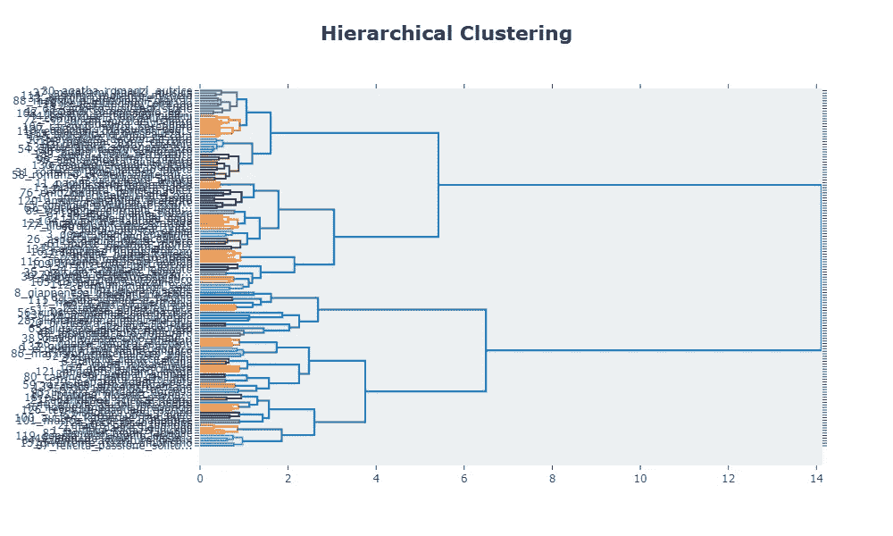**

**尽管由于主题标签之间的重叠而在该图中不太明显，但是可以观察到关于音乐的主题(“musica_orchestra_compositori_…”)非常类似于关于爵士乐的主题(“jazz_blues_melodie_…”)。或者，它们可以被认为是一个不同的或一个单独的主题(从某种角度来看，主题建模是相当主观的)。根据我们观察树状图的层次级别，可以随意调整主题的数量来调整输出。图片作者。**

*   ****离群值的存在**:ber topic 中使用的聚类算法 HDBSCAN 并不强制将观察值划分到聚类中，从而导致在主题 index -1 中收集离群值。**

**我们最后将主题保存到一个新的 dataframe 列中:**

# ****情绪分析****

**我们对读者的评论进行情感分析，通过使用 HuggingFace⁹.上的*feel-it-italian-sentiment⁸*模型来确定评论是正面的还是负面的**

**该模型在一个新的数据集上对翁贝托·⁰模型进行了微调: *FEEL-IT* ，这是一个新颖的意大利 Twitter 帖子基准语料库。**

**我们可以用几个句子来测试模型输出:**

**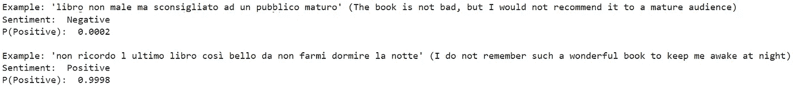**

**并预测评论的情绪。这保存在新的 dataframe 列中:**

**值得注意的是，我们通过变量 *max_w* 限制了每个评论的情感分析所考虑的字数。**

**我们还可以观察读者职业的平均情绪，证实工人(年龄:50±9 岁)和学生(年龄:26±8 岁)表达了最积极的情绪，而家庭主妇(年龄:57±6 岁)、管理人员(年龄:62±3 岁)和退休人员(年龄:68±5 岁)在产品评论中表达了最不积极的情绪:**

**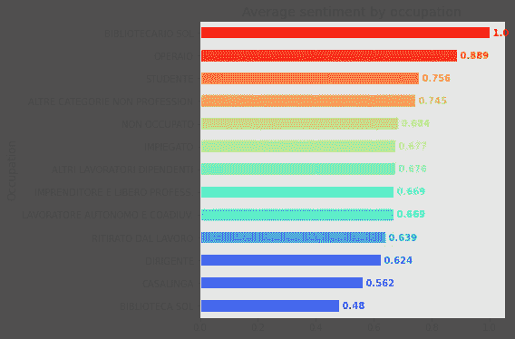**

**图片作者。**

# ****读者聚类****

**到目前为止，我们利用自然语言处理技术对读者评论进行了主题建模和情感分析。**

**我们现在根据客户的特征(年龄和职业)对他们进行聚类，以便以后在没有偏好主题或兴趣的情况下实施推荐。**

**由于观察值包含数字(年龄)和分类(职业)变量，我们将使用 k-prototypes 算法。**

****注意**:当我们通过用平均值替换缺失的年龄值来估算它们时，我们不执行进一步的预处理(年龄是我们使用的唯一数字变量)，但是我们也可以对其进行缩放或应用变换以使其更像高斯，例如 Yeo-Johnson 变换。**

**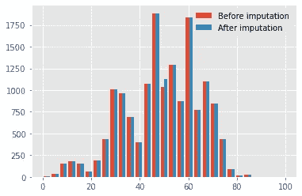**

**图片作者。**

**我们通过夏皮罗检验来检验年龄是否呈正态分布:**

**我们使用肘方法来确定集群的数量:**

**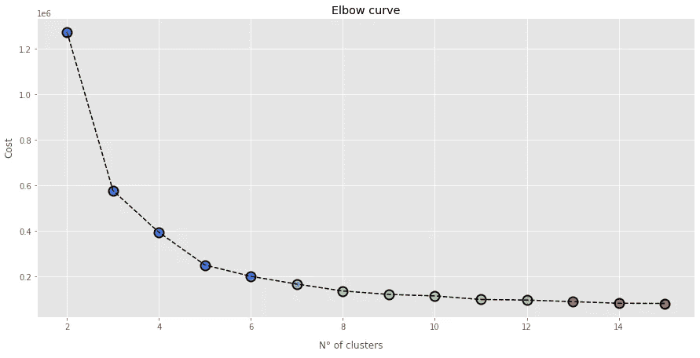**

**图片作者。**

**我们根据对图上肘部的观察，用 4 个聚类拟合模型，然后将信息保存在新的 dataframe 列中:**

**我们现在可以通过观察年龄分布和每个聚类中最常见的职业来检查所获得的聚类:**

**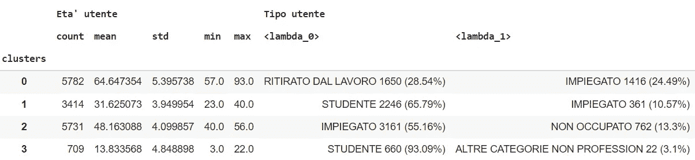**

**图片作者。**

**我们可以将集群总结如下:**

*   ****n0**:**60 岁以上退休**:年龄在 64.6±5.4 岁之间，最经常从事的职业“退休人员”(28.5%)和“雇员”(24.5%)。**
*   ****n 1** : **三十多岁的学生和员工**:年龄在 31.6±3.9 岁之间，最经常出现的职业“学生”(65.8%)和“员工”(10.6%)。**
*   ****n 2** : **四五十岁的工人**:年龄在 48.2±4 岁之间，最经常从事的职业是“雇员”(55.2%)和“闲人”(13.3%)。**
*   ****n 3** : **青年学生**:年龄在 13.8-4.9 岁之间，最经常出现的职业“学生”(93.1%)。**

**还可以直观地检查职业按类别的分布:**

**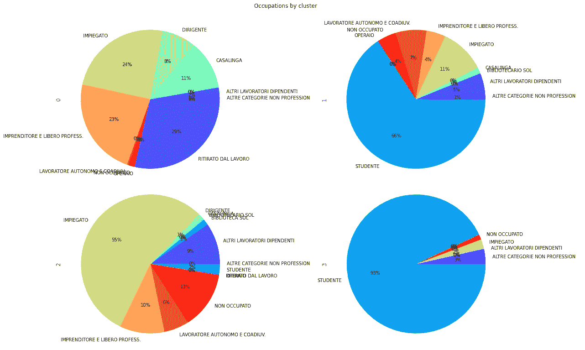**

**图片作者。**

****年轻学生**(第 3 组)在评论中表现出**最积极的情绪**(0.82±0.37)，而 60 岁以上的退休人员或在职人员(第 0 组)表现出最不积极的情绪(0.62±0.4):**

****

**图片作者。**

# **推荐**

## **按主题推荐**

**让我们考虑一位顾客问图书管理员:**

> **你能推荐一些关于旅行的东西吗？**

**或者让我们想象一下，同一个客户在一个在线图书馆目录上进行类似的查询。**

**由于对客户评论进行主题建模，我们可以**找到与感兴趣的论点最相似的主题**，然后在该主题中推荐**最受好评的标题**。**

**因此，我们定义了一个*推荐*类，它将主题模型和搜索查询作为输入，并提供方法来:**

*   **确定最相似的主题，**
*   **通过单词云图表显示其表现形式(基于类别的 TF-IDF 单词得分),以及**
*   **根据话题相似度和情感评分推荐前 *n* 个标题:**

****例 1: vacanza(休假)****

**搜索度假( *vacanza* )会有什么推荐？**

**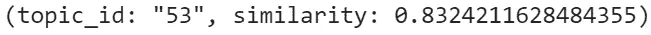**

**图片作者。**

**最接近的主题具有 id 53 和 0.83 的相似性，我们可以观察主题表示(基于类别的 TF-IDF 单词分数)作为相似性度量的验证:**

**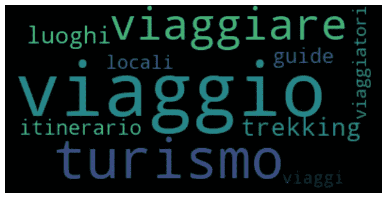**

**图片作者。**

**与“*度假*最接近的话题，用“*游记*”、“*导游*”、“*旅游*”、“*行程*”、“*旅行者*”、“*徒步旅行】*等词来表示。**

**该主题中情感得分最高的 5 个标题是:**

**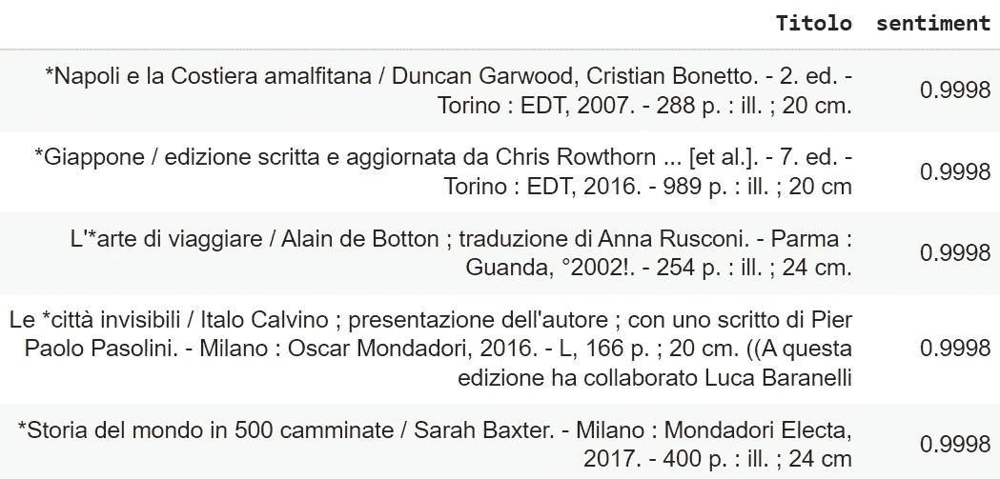**

**图片作者。**

**书名包括旅游指南(特别是针对那不勒斯、阿马尔菲海岸和日本的)，建议度假的门户目的地，以及深入研究旅行概念的小说(阿兰·德波顿的“*旅行的艺术*”，伊塔洛·卡尔维诺的“*看不见的城市*”)。**

****第二个例子:贾洛(黄色/犯罪小说)****

**“ *Giallo* ”是一个有趣的查询术语:在意大利语中，这个词既代表黄色，也代表犯罪小说叙事的类型。**

**步骤:**

**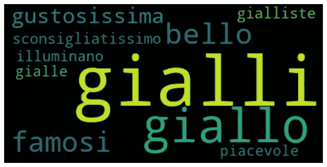**

**图片作者。**

**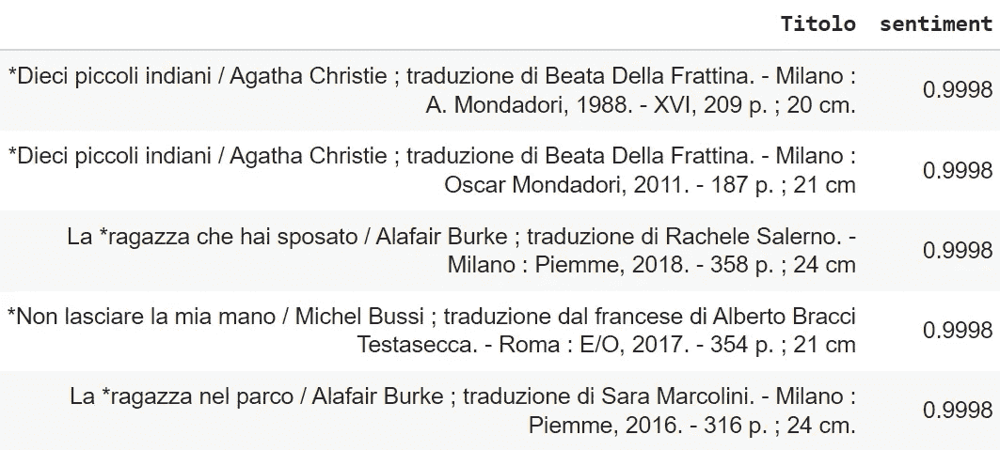**

**图片作者。**

**尽管输入的单词有歧义，但所有结果都属于犯罪小说类型。**

**不出所料，阿加莎·克里斯蒂的“*然后就没有了*”出现在这个主题的首选推荐中(在两个不同的版本中)。**

****例 3:爵士乐****

**为简单起见，代码不再重复(可以应用前面示例中的相同步骤):**

****

**图片作者。**

**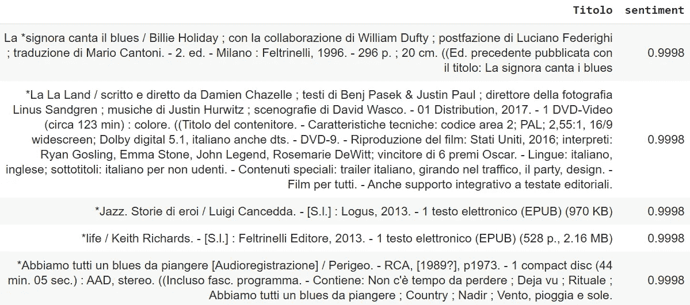**

**图片作者。**

**虽然我个人认为所有推荐的结果都很有趣，但我想提请注意第五个结果:“*Abbiamo tutti un blues da piangere*”，这是一张来自 Perigeo 的精彩专辑，这是一个 70 年代的爵士/进步摇滚意大利乐队，我直到现在才知道它的存在。我真诚地感谢发现了这颗[隐藏的宝石](https://www.youtube.com/watch?v=GBf6J4YPc38&ab_channel=CrystalSilence)(的确，推荐似乎很管用)。**

**值得注意的是，检索不同的产品类型(书籍、电影、相册)。这种行为可以通过在建模阶段或推荐阶段(例如作为过滤器)考虑产品类型来修改。**

## **按客户特征推荐**

**在用户没有偏好的主题或特定的兴趣，并且没有搜索/贷款历史可用的情况下，推荐仍然可以通过利用由聚类产生的客户群来实现。**

**给定用户的年龄和职业，我们可以找到其归属的聚类，并返回该聚类中最受好评的标题作为推荐:**

**假设我们需要向一名 32 岁的员工提供建议:**

**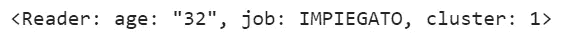**

**图片作者。**

**正如我们所料，用户属于集群 n 1，其元素是 30 多岁的学生和员工。我们现在可以在同一个群集中检索最受好评的书目:**

**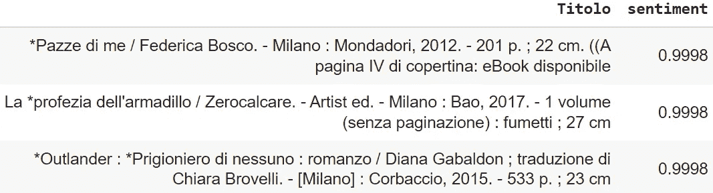**

**图片作者。**

**有什么推荐给 12 岁的学生？**

**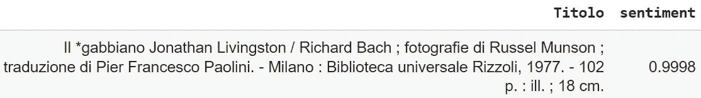**

**图片作者。**

# **结论**

**我们分析了由“[*Istituzione Biblioteche di Roma*](https://www.bibliotechediroma.it/)”拥有并公开的罗马图书馆评论数据集。**

**主题建模和情感分析让我们能够深入了解图书馆借阅和用户偏好。聚类技术提供了客户群的附加信息。**

**我们利用这些见解，通过使用主题和情感信息来实施推荐策略(“*你能就旅行提出一些建议吗？*)”)，或者在没有查询或兴趣表达的情况下，客户群和情感(用户所属的群中最受好评的标题)。**

**可以通过将不同的产品性质(书籍、电影、专辑)作为过滤器来考虑，并将感兴趣的主题与客户细分相结合来进行改进。主题的数量也可能是进一步调整的主题，尽管显示的最经常出现的主题在不同的实验中被一致地识别。**

# **参考**

**[1][https://www . bibliotechediroma . it/it/open-data-commenti-lettori](https://www.bibliotechediroma.it/it/open-data-commenti-lettori)**

**[2]https://maartengr.github.io/BERTopic/index.html**

**[3]https://medium.com/@maartengrootendorst**

**[4][https://towards data science . com/topic-modeling-with-Bert-779 F7 db 187 e 6](/topic-modeling-with-bert-779f7db187e6)**

**[5] Jacob Devlin，张明蔚，Kenton Lee，Kristina Toutanova，“ *BERT:用于语言理解的深度双向变压器的预训练*”，2019， [arXiv:1810.04805v2](https://arxiv.org/abs/1810.04805v2)**

**[6]利兰·麦金尼斯，约翰·希利，詹姆斯·梅尔维尔， *UMAP:一致流形逼近与降维投影*，2020， [arXiv:1802.03426v3](https://arxiv.org/abs/1802.03426v3)**

**[7] Claudia Malzer，Marcus Baum，“一种基于分层密度的混合聚类选择方法”，2020， [arXiv:1911.02282v4](https://arxiv.org/abs/1911.02282v4)**

**[8] Federico Bianchi，Debora Nozza，Dirk Hovy，“ *FEEL-IT:意大利语的情感和情绪分类*”，2021 年，第 11 届主观性、情绪和社交媒体分析计算方法研讨会会议录，第 76–83 页([链接](https://aclanthology.org/2021.wassa-1.8.pdf))**

**[https://huggingface.co/MilaNLProc/feel-it-italian-sentiment](https://huggingface.co/MilaNLProc/feel-it-italian-sentiment)**

**[10][https://hugging face . co/musix match/umberto-common crawl-cased-v1](https://huggingface.co/Musixmatch/umberto-commoncrawl-cased-v1)**

**[11]黄哲学，“使用混合数值和分类值对大型数据集进行聚类*”, 1997 年，第一届亚太知识发现和数据挖掘会议，第 21–34 页([链接](http://citeseerx.ist.psu.edu/viewdoc/summary?doi=10.1.1.94.9984))***

**[12]桑福德·魏斯伯格，“Yeo-Johnson 电力转换”，2001 年([链接](https://www.stat.umn.edu/arc/yjpower.pdf))**