# 数据工程师的根本原因分析

> 原文：<https://towardsdatascience.com/root-cause-analysis-for-data-engineers-782c02351697?source=collection_archive---------13----------------------->

## 权威指南

## 排除管道中数据质量问题的 5 个基本步骤

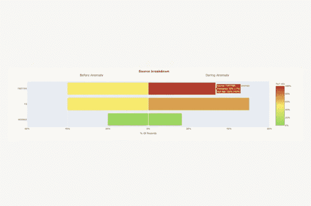

图片由蒙特卡洛提供。

*这篇客座博文的作者是* [*弗朗西斯科·阿尔贝里尼*](https://www.linkedin.com/in/falberini)*[*蒙特卡洛*](https://www.montecarlodata.com/) *的产品经理和前细分市场产品经理。**

**数据管道可能因为一百万种不同的原因而中断，没有一种通用的方法来理解如何中断或为什么中断。以下是数据工程师在进行数据质量问题的根本原因分析时必须采取的五个关键步骤。**

*虽然我不能确定，但我相信我们很多人都经历过。*

*我说的是下午晚些时候疯狂的 Slack 消息，看起来像是:*

**

*在我的职业生涯中，这种情况在我身上发生过很多次。作为协议的[项目经理，我们的数据治理工具，我花了很多时间思考和构建仪表板，以评估我们的客户发送给细分市场的数据的质量。](https://segment.com/product/protocols/)*

*作为这个产品的所有者，任何关于这些仪表板的问题都直接找我。我解决这些问题的方法可以归结为两步:*

1.  *疯狂地向一位在我们团队工作了 4 年多的数据工程师寻求紧急帮助。*
2.  *如果她不在，花几个小时通过抽查 1000 个 1:1 的表来调试这个管道。*

*你明白了。*

> *多年来，在与数十个数据工程团队交谈和合作后，我了解到对数据质量问题进行[根本原因分析](https://en.wikipedia.org/wiki/Root_cause_analysis) (RCA)既可以像查看气流日志一样简单，也可以像检查 5+系统一样复杂，以确定上游数据供应商是否在少数记录值中添加了一些尾随空白字符。*

*在这篇文章中，我将总结我的经验，并通过一个五步骤的方法来使这个过程更快，更少痛苦，并且在下次你遇到这种情况时更有效。*

# *什么是成功的根本原因分析？*

*当 [**数据宕机**](/the-rise-of-data-downtime-841650cedfd5) 来袭时，第一步(嗯，在暂停您的管道之后)是确定是什么出了问题。*

*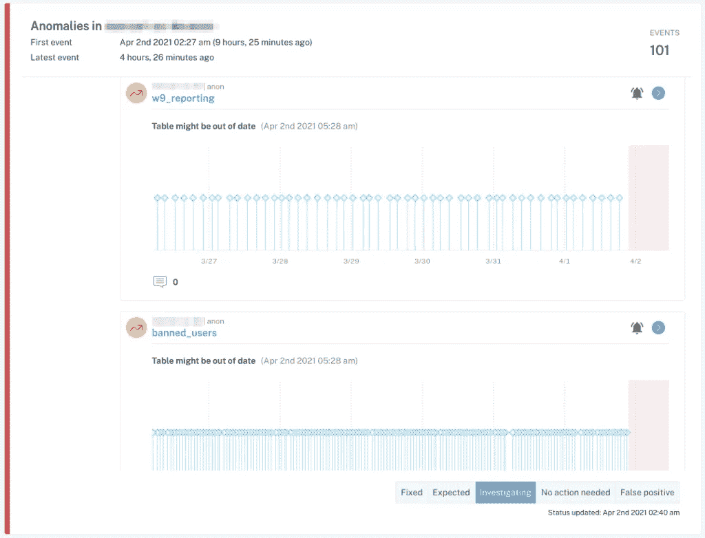*

*图片由蒙特卡洛提供。*

*理论上，根本原因听起来就像运行几个 SQL 查询来分割数据一样简单，但在实践中，这个过程可能相当具有挑战性。事件可能以不明显的方式出现在整个管道中，并影响多个(有时是数百个)表。*

*例如，数据停机的一个常见原因是数据的新鲜度，即数据异常过时。这种事件可能是由多种原因造成的，包括作业卡在队列中、超时、合作伙伴未及时提供其数据集、错误或意外的计划更改从 DAG 中删除了作业。*

*根据我的经验，我发现大多数数据问题都可以归因于以下一个或多个事件:*

1.  *输入作业、管道或系统的数据发生意外变化*
2.  *逻辑(ETL、SQL、Spark 作业等)的变化。)转换数据*
3.  *操作问题，如运行时错误、权限问题、基础设施故障、计划变更等。*

*快速确定手头的问题不仅需要适当的工具，还需要考虑这三个来源如何以及为什么会中断的整体方法。*

*你应该这么做。*

# *第一步。看看你的血统*

*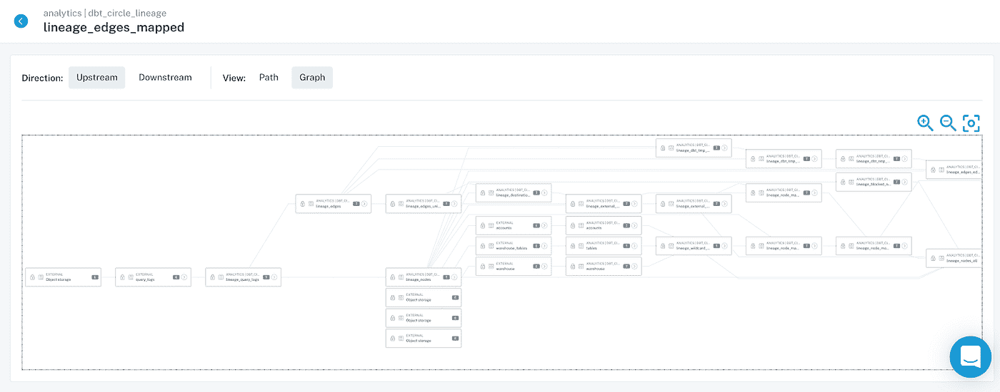*

*图片由蒙特卡洛提供。*

*你知道顾客仪表板坏了。您还知道这个仪表板是建立在一长串转换之上的，由几个(或者几十个……)数据源提供数据。*

*要了解什么出了问题，您需要找到系统中出现问题的最上游节点——这是事情开始的地方，也是答案所在……如果您幸运的话，所有罪恶的根源都出现在有问题的仪表板中，您将很快发现问题所在。*

> *在糟糕的一天，问题发生在系统的最上游来源之一，距离损坏的仪表板有许多转换步骤，这将需要一整天的时间来跟踪 DAG 上的问题，然后回填所有损坏的数据。*

***外卖。**确保对数据问题进行故障排除的每个人(数据工程师、数据分析师、分析工程师和数据科学家)都能访问最新的血统。你的血统应该包括像 BI 报告、ML 模型或反向 ETL 接收器这样有用的数据产品。外地级血统是一个加号。*

# *第二步。看看代码*

*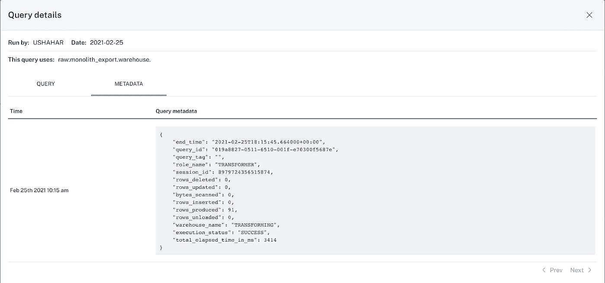*

*图片由蒙特卡洛提供。*

*您找到了遇到问题的最上游的表。恭喜你，你离理解根本原因又近了一步。现在，您需要理解这个特定的表是如何由您的 ETL 过程生成的。*

*浏览一下创建该表的逻辑，甚至是影响事件的特定字段，将有助于您对问题所在提出合理的假设。问问你自己:*

*   *什么代码最近更新了该表？什么时候？*
*   *相关字段是如何计算的？按照这种逻辑，什么可能会产生“错误”的数据呢？*
*   *逻辑最近是否有任何变化，潜在地引入了一个问题？*
*   *是否有对该表的临时写入？最近回填了吗？*

*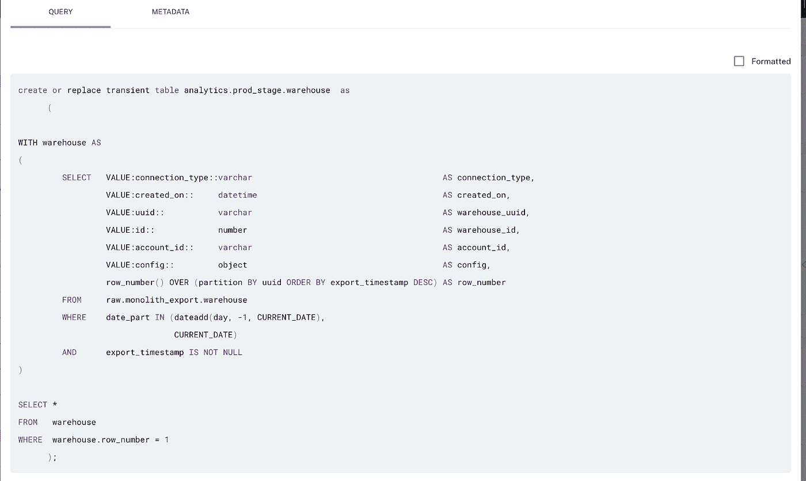*

*图片由蒙特卡洛提供。*

***外卖。**确保每个对数据问题进行故障排除的人都能快速追溯到创建表的逻辑(SQL、Spark 或其他)。为了弄清事情的真相，您不仅需要知道代码当前的样子，还需要知道表最后一次更新时的样子，理想情况下是什么时候更新的。虽然我们都试图避免它们，但回填和临时写入应该考虑在内。*

# *第三步。看看你的数据*

*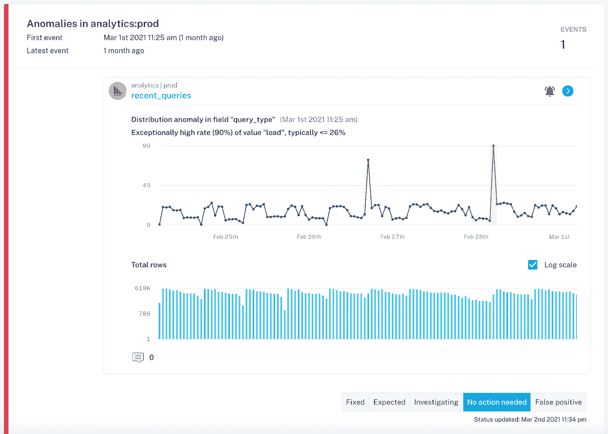*

*图片由蒙特卡洛提供。*

*您现在知道了数据是如何计算的，以及它可能如何导致了事故的发生。如果您仍然没有发现根本原因，那么是时候更仔细地查看表中的数据，寻找可能出错的线索了。*

*问问你自己:*

*   *所有记录的数据都是错误的吗？为了一些记录？*
*   *特定时间段的数据是否有误？*
*   *特定数据子集或数据段的数据是错误的吗，例如，只有您的 android 用户还是只有来自法国的订单？*
*   *是否有新的数据段(您的代码还没有考虑到…)或缺失的数据段(您的代码依赖于…)？*
*   *模式最近是否发生了变化，从而可能解释了这个问题？*
*   *你的数字从美元变成美分了吗？你从太平洋标准时间到东部时间的时间戳？*

*这样的例子不胜枚举。*

*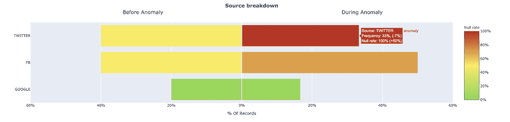*

*图片由蒙特卡洛提供。*

*这里有一种很有前途的方法，那就是研究表中有异常记录的其他字段如何提供线索，说明数据异常发生在哪里。例如，我的团队最近发现，我们的一个客户的一个重要的用户表中的 user_interests 字段的空率突然增加。我们查看了源领域(Twitter、FB、Google ),看看关系模式是否能为我们指出正确的方向。*

*这种类型的分析提供了两个关键的见解，这两个见解都可以解释空记录的增加，但最终会驱动非常不同的操作。*

1.  *与 source="Twitter "相关联的记录的比例显著增加，这通常比其他来源具有更多 user_interests="null "的记录*
2.  *对于 source =“Twitter”的记录，user _ interests =“null”的记录比例增加，而 source =“Twitter”的记录比例没有变化*

*对于 insight 1，我们可能只是遇到了季节性问题或有效营销活动的结果。对于 insight 2，我们可能会遇到来自 Twitter 源的用户数据的数据处理问题，可以将我们的调查重点放在来自 Twitter 的数据上*

***外卖。**确保对数据问题进行故障排除的每个人都可以方便地对数据进行切片和切块，以找出问题与数据的各个部分、时间段和其他切片之间的关系。对数据或其模式的最新更改的可见性是救命稻草。请记住，虽然这些统计方法是有帮助的，但它们只是更大的 RCA 过程的一部分。*

# *第四步。看看您的运营环境*

*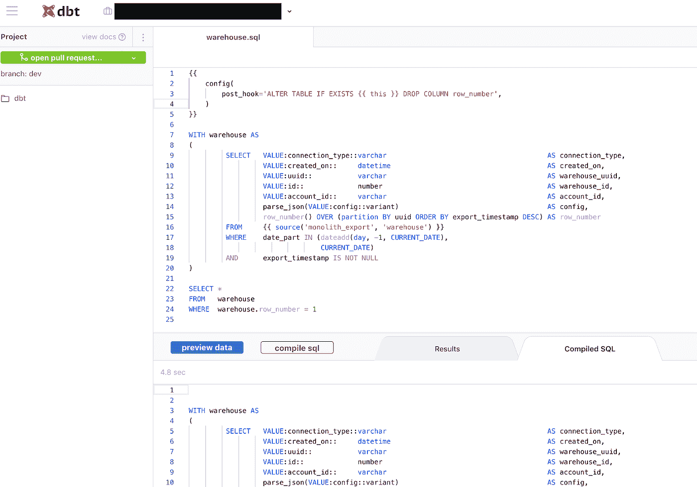*

*图片由蒙特卡洛提供。*

*好了，数据核实了。现在怎么办？许多数据问题是运行您的 ETL/ELT 作业的操作环境的直接结果。*

*查看 ETL 引擎的日志和错误跟踪有助于回答以下一些问题:*

*   *相关工作有没有失误？*
*   *开始工作时有异常的延迟吗？*
*   *是否有任何长时间运行的查询或低性能作业导致延迟？*
*   *是否存在任何影响执行的权限、网络或基础设施问题？最近这些有什么变化吗？*
*   *是否对作业计划进行了任何更改，导致意外删除作业或将其误放在依赖关系树中？*

*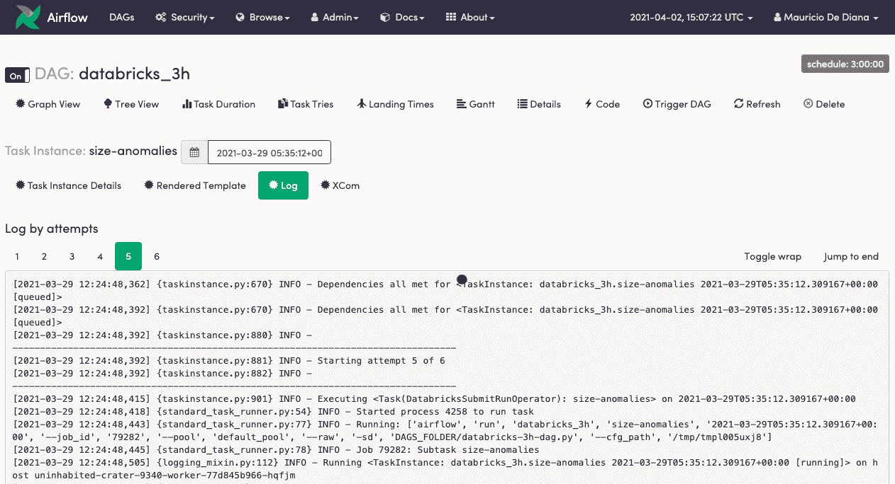*

*图片由蒙特卡洛提供。*

***外卖。**确保每个解决数据问题的人都了解 ETL 工作是如何执行的，并且能够访问相关的日志和调度配置。了解基础设施、安全性和网络也会有所帮助。*

# *第五步。利用你的同事*

*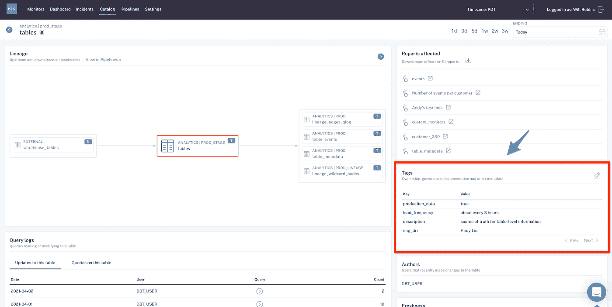*

*你已经做了你能做的一切(或者你正在寻找捷径)——下一步是什么？您需要从您的数据团队获得指导。在你开始用问题轰炸 Slack 之前，问问你自己:*

*   *这个数据集过去发生过什么类似的问题？团队做了什么来调查并解决这些问题？*
*   *谁拥有现在遇到问题的数据集？我可以向谁寻求更多信息？*
*   *谁在使用现在遇到问题的数据集？我可以向谁寻求更多信息？*

*外卖。确保每个解决数据问题的人都可以访问关于数据集所有权和使用的元数据，这样他们就知道应该向谁询问。包含有用文档的数据事件历史也会有所帮助。*

# *把一切都包起来*

*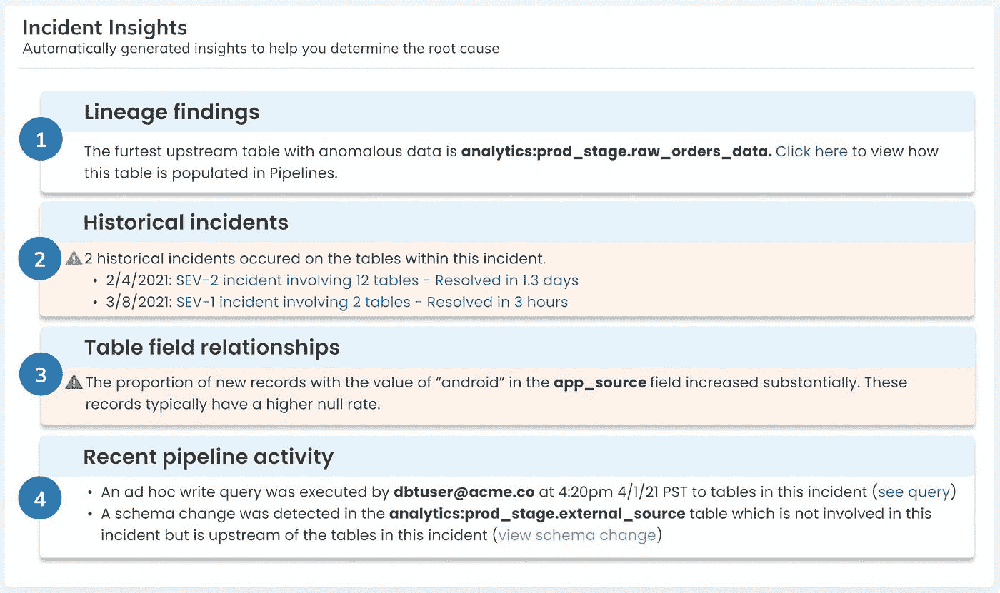*

**在一天结束的时候，你的目标是展示你需要的每一个细节，以尽可能少的点击次数快速完成你的 RCA。基于世系、历史记录和元数据自动生成见解的方法可以使这一过程变得简单而快速。图片由蒙特卡洛提供。**

> *在近乎实时地解决和预防数据质量问题时，根本原因分析可能是一个强大的工具，但重要的是要记住，管道破裂很少能追溯到一个特定的问题。与任何分布式架构一样，您的数据生态系统由一系列复杂的逻辑、事件以及管道组成，就像科学实验一样，这些管道会以多种方式做出反应。*

*也就是说，我们希望这个框架能够帮助您实现更好的数据质量，从而获得更值得信赖和可靠的管道。通过利用这种方法，您也可以将 RCA 从一个引发压力的警钟转变为整个数据组织的可扩展和可持续的实践。*

*在这个过程中，你会给那个数据工程师(你知道，人类数据管道百科全书)一点喘息的机会…*

****有兴趣了解如何对您的数据管道进行 RCA 的更多信息吗？伸出手去*** [***巴尔***](https://www.linkedin.com/in/barrmoses/)*[***藩***](https://www.linkedin.com/in/falberini) ***，还有*** [***其余的蒙特卡洛团队***](http://www.montecarlodata.com/) ***。*****