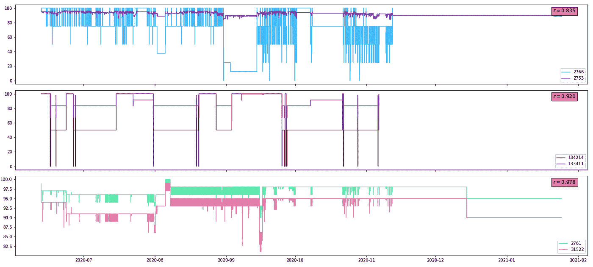

# 如何预测 IT 事件

> 原文：<https://towardsdatascience.com/root-cause-analysis-of-it-incidents-based-on-correlations-between-time-series-of-it-infrastructure-cd7a116a334a?source=collection_archive---------18----------------------->

## **根据 IT 基础设施指标时间序列之间的相关性分析 IT 事故的根本原因**

**简介**

IT 监控系统的任务之一是收集、存储和分析表征 IT 基础设施的各种元素(CPU 负载、空闲 RAM、空闲磁盘空间等)的状态的各种度量。)，以及各种业务流程的状态。为了应用统计分析的广泛的数学工具，以相应变量的有序时间序列的形式呈现这些数据通常更方便。Python 中处理时间序列的一个好工具是三个模块的组合:pandas、scipy 和 stats models(【pandas.pydata.org】、 [scipy.stats](https://docs.scipy.org/doc/scipy/reference/stats.html#module-scipy.stats) 、[statsmodels.org](https://www.statsmodels.org/))，它们为构建时间序列、估计各种统计模型以及进行统计测试和分析统计数据提供了广泛的类和函数。具体来说，在本文中，我们将描述这些模块中包含的所有大量数学工具算法，这些算法用于 AIOps 平台 [monq](http://monqlab.com) 中的根本原因分析，特别是 IT 基础设施指标时间序列的相关性分析。


包含 MLOps 数据的 Monq IT 服务运行状况图。图片作者。

在数学上，相关性是两个或多个变量的值的一致变化，当一个变量发生任何变化时，另一个变量也会发生相对变化(减少或增加)，相关系数是两个变量的这种匹配可变性的定量度量。相关分析是数理统计的方法之一，通过计算变量之间的相关系数，可以确定变量之间是否存在相关性以及相关性有多强。应当记住，相关系数是一种描述性统计，变量之间存在相关性并不一定意味着它们之间存在因果关系，也就是说，正相关或负相关并不一定意味着一个变量的变化会引起另一个变量的变化(“相关性并不意味着因果关系”)。

如果在相关分析中考虑三个或更多变量的时间序列，则相关矩阵由成对相关系数构成，在该矩阵中，相应变量之间的相关系数位于相应行和列的交点处。关于 IT 基础设施的监控系统，各种度量的时间序列的关联矩阵可用于两种主要场景(用例):寻找系统中事件的根本原因(根本原因分析)和寻找系统元素之间隐藏的基础设施连接(以某种方式，“绘制”资源服务模型)。最终，度量之间的时间相关性可以插入到各种算法中，用于进一步的数据分析，如预测或建模工具。

**构建度量的时间序列**

相关性分析过程中的第一步是以规则(等间距)时间序列的形式呈现描述 IT 基础架构元素状态的度量值集，即描述每个特定时刻(每 5 分钟、每半小时等)的度量值的行。).在一般情况下，度量值的测量和它们在数据存储器中的记录以不同的间隔和不同的频率异步发生，因为这些度量通常来自外部源，并且监控系统对它们没有控制:存在这样的情况，当几个度量值在 5 分钟间隔内出现，然后在半小时内没有一个度量值出现。在这方面，需要一个用于正则化各种度量的时间序列的程序，为此，有必要对不同的时间间隔使用数据内插和外插的方法。时间序列正则化过程如图 1 所示，在*熊猫*模块中，这是在一行中完成的——在下面的代码示例中，这是最后一行，其中方法*重采样(‘5min’)。mean* 对每个 5 分钟时间间隔内的测量值进行平均，方法 *fillna(method='ffill')* 将前一个度量值外推至空(无测量值)时间间隔:

```
import pandas as pd
data=pd.read_csv(‘TimeSeriesExample.txt’,parsedates=[0])
timeSeries=pd.Series(data[‘KEHealth’].values, index=data[‘Timestamp’])
timeSeriesReg=timeSeries.resample(‘5min’).mean().fillna(method=’ffill’)
tsCollection.append(timeSeriesReg)
```


*图一。度量值时间序列的正则化。*图片作者。

Monq 使用资源服务模型，根据相关触发器的状态以及第三方系统和组件对给定配置单元的相互影响，计算硬件和服务的健康指标。在上面的示例中，使用了关于特定健康指标的数据，该数据是根据某些规则为监控系统的每个元素计算的。图 2 显示了我们的一个拥有几千个配置单元的客户的系统中的一些 Cu 的健康指标的时间序列的典型视图，时间跨度大约为一年。


*图二。监控系统不同元素的运行状况指标的时间序列。*图片作者。

**相关矩阵的计算**

在获得正则化的度量时间序列之后，计算它们的相关矩阵是一项相当简单的任务。在 *pandas* 模块中，最简单的方法是将时间序列合并到一个表(dataframe)中，并对其应用 *corr()* 方法，该方法计算每对指标在其联合定义的时间间隔内(不一定是连续的)的皮尔逊相关系数:

```
import matplotlib.pyplot as plt
allKeDF=pd.concat(tsCollection, axis=1)
corrMatrix=allKeDF.corr()
pallet=plt.getcmap(‘jet’)
img=plt.imshow(corrMatrix, cmap=pallet, vmin=-1, vmax=1, aspect=’auto’)
plt.colorbar(img)
```


*图三。系统中 150 个最不稳定的 Cu 的运行状况指标的时间序列的相关矩阵。*图片作者。

图 3 显示了来自我们的一个客户的监控系统的 150 个配置单元的健康状况度量的时间序列的相关矩阵，其中度量值变化最频繁。如您所见，该矩阵基本上是一个“绿色区域”,这意味着绝大多数 Cu 之间不存在任何相关性，或者存在非常弱的相关性。对于那些算法未能计算相关系数的 CU 对，图片中出现白色像素——它们的时间序列在时间上不相交(为了进一步处理的方便，所有的 *nan* 值被置零)。这是很有可能的，因为监控系统是活的——新的配置元素可以出现在其中，旧的配置元素可以消失。图片中的红色和蓝色像素对应于那些 CU 对，它们的时间序列是相关的，因此是反相关的。这样的 CU 对并不多:相关系数 *r > 0.7* (占总对数的 0.29%)的相关对只有 65 个， *r < -0.7* (0.02%)的反相关对只有 4 个。这从好的方面描述了监控系统的特征:没有许多重复的元件监控相同的参数，每个人都忙于自己的事情。重复彼此功能的配置单元应该正好属于相关系数为 *r > 0.95* 的强相关对组。


*图 4。度量时间序列不同正则化间隔的相关矩阵— 5 分钟和 10 分钟。*图片作者。

图 4 显示了为一组相同的 Cu 计算的相关矩阵，但是对时间序列的度量使用了不同的正则化间隔——5 分钟和 10 分钟。乍一看，两张图片看起来相当相似，但如果你计算一下它们之间的差异，你会得到图 5 所示的直方图，其中平均值接近于零μ = 0，标准差σ = 0.11。5 分钟和 20 分钟时间序列的相关性差异的相同直方图具有标准偏差σ = 0.16，由此得出结论，随着正则化的改变，显著数量的 KE 对可以从相关组移动到非相关组，反之亦然。可以看出，时间序列的正则化间隔的选择对相关矩阵的值有显著影响，并且应该在计算相关性的期望精度、所需的计算机资源和计算时间之间进行一定的折衷。


*图 5。5 分钟和 10 分钟正则化时间序列的相同相关系数值之间差异的直方图。*图片作者。



*图六。CU 对的运行状况度量的相关时间序列的典型视图。*图片作者。

图 6 显示了几对相关的 CU 健康指标时间序列的概况，图 7 显示了反相关时间序列的概况。最后一幅图清楚地表明，相关系数的高模数值可能是由于时间序列的非常特殊的行为，它们的联合可变性的时间间隔的特征交叉。在这种情况下，为了检查所计算的相关系数的显著性，可以使用(有些夸张地)学生的 *t* 测试，为此，使用公式 *t=|r|√(n-2)/(1-r2)* ，计算 t 统计量 *tobs* ，并与给定显著性水平和自由度数量 *k=n-2* 的表格值 *tcrit(α，k)* 进行比较作为 n，应该取在定义两者的时间间隔上度量(来自 CU 对)的时间序列中值变化的最小数量。对于图 7 中的时间序列对，在 *α = 0.05* 的情况下计算学生的 *t* 测试的结果显示在红色方块中。由于对于前两对*tobs*<*t crit*，相关系数的测量值被认为不重要，可能是随机巧合的结果。对于最后一对*tobs*>*t crit*，这意味着反相关的测量值具有统计学意义。在 *scipy* 模块中很容易获得 *tcrit* 值:

```
import scipy as sp
tCrit=sp.stats.t.ppf(1-alpha/2, ndf)
```


*图 7。CU 对健康度量的反相关时间序列的典型视图。*图片作者。

**相关矩阵的使用**

如引言中所述，在 IT 基础设施的监控系统中使用度量的时间序列的关联矩阵有几种情况，其中两种似乎是主要的:1)搜索 IT 系统中事件的根本原因(根本原因分析),以及 2)搜索资源服务模型中不存在的系统元素之间的隐藏基础设施链接。应该记住，在这两种情况下，相关性分析的信息性和有用性直接取决于给定 IT 系统可用的资源服务模型(RSM)的质量和完整性:如果系统的配置单元之间存在的所有连接和影响程度都显示在 RSM 图上，那么相关性矩阵不可能包含 RSM 中已经注册的任何附加信息。很明显，完整的 RSM 给出了系统中所有因果关系的完整图像，在这种情况下，相关矩阵只是 RSM 图的某种简化表示。然而，建立一个完整的 IT 系统资源服务模型是一个非常耗时的过程，并且在实践中并不总是可行的，因此，分析系统元素行为的相关性可以帮助揭示它们之间的一些隐藏的(RSM 中不存在的)联系，或者建立一个元素对另一个元素影响程度的定量表达，即在某种程度上补充 RSM 图。在系统没有 RSM 的情况下，相关性矩阵可以找到另一个应用:3)相关性的分级聚类分析，用于将系统元素组合成组，并以树状图的形式可视化其 PCM 结构。

**寻找事故的根本原因**

一般而言，IT 系统中的事故是导致或可能导致服务标准流程失败、服务中断或服务质量下降的任何事件。与此同时，许多事件可能只是基础设施层面一些更深层次问题的症状，通常一个问题(根本原因)会引发一整组事件。找到这些事件的根本原因是 IT 监控系统最重要的功能之一。

原则上，如果系统的成熟且可靠的资源服务模型存在，则特定 CU 的操作失败的根本原因可以通过沿着所有连接链顺序检查有问题 CU 的存在以及对原始 CU 的影响来在 RSM 图中追踪。通过分析 CU 状态时间序列之间的相关矩阵，可以在一定程度上弥补在搜索事件根本原因时缺乏完整的 RSM 图的问题。由于数据库查询类型的不同，关联矩阵比 RSM 图更快地确定事件的根本原因也是可能的。

在 monq 中，CUs 的健康度量的时间序列的相关性分析的功能被委托给单独的微服务，该微服务在后台不断更新相关性矩阵。对于整个矩阵，更新不是同时发生的，而是部分发生的(由于计算资源的限制)，对于更不稳定的时间序列，相关系数的计算要比稍微不稳定的时间序列更频繁。因此，当前相关矩阵包含在不同时刻计算的相关系数，但是由于上述用于更新它的方法，其中的所有值都是相关的。

当某个 CU 发生事故时，微服务在收到相应的请求后，会发布一个与原始 CU 相关系数的值高于某个阈值(通常为 *r > 0.7* )的 CU 的排序列表，如图 8 所示。该信息可以直接在前端用于检查相关 Cu 的状态，也可以传递给组合根本原因搜索算法，该算法除了时间相关性之外，还使用事件的语义聚类。


*图 8。与 CU-38374 相关的 CU 列表，由微服务生成，用于计算相关矩阵。*图片作者。

**搜索隐藏的基础设施链接**

如上所述，CU 状态的时间序列的相关性分析可以揭示 IT 系统的元素之间的新的联系，这些联系在其资源服务模型中没有被考虑。这可能是系统本身中某种隐藏的基础设施链接(例如，使用公共电源电路、公共冷却系统等。)或对某种外部服务的普遍依赖。由于在这种情况下，在系统的元件之间寻求相当严格的连接，用于选择 CU 对的相关系数的阈值应该取得相当高: *r > 0.95* 。

图 9 显示了我们主要客户的 IT 系统的 CU 健康指标的时间序列关联矩阵，它由 3200 个配置项组成。相关系数大于 0.95 的 CU 对的数量是 7470，其中，在检查 RSM 图中的对元素之间的连接之后，剩余 2310。一些剩余 CU 对的时间序列的典型视图如图 10 所示，其中学生的 *t* 测试结果以红色方块给出(为了更高的可靠性， *α=0.001* )。从图中可以看出，对于大多数对来说， *t* 统计值小于临界统计值，所以最终只有 3 对相关 CU 通过了这个 *t* 测试。对于参数值为 *α=0.01* 的*t*-标准，剩余 CU 对的数量为 27。尽管原则上自动添加也是可能的，但是下一步如何处理在 IT 系统的元素之间发现的新连接，是否将它们添加到 RSM，由其操作员决定。


*图 9。我们主要客户的 IT 系统的 CU 健康指标的时间序列的全相关矩阵。*图片作者。


*图 10。RSM 图中未连接的一些高度相关的 Cu 对的典型时间序列视图。*图片作者。

**相关性的层次聚类分析**

层次聚类用于识别一组变量中相对同质的组，使用的算法首先将每个变量视为一个单独的聚类，然后根据变量之间的某种定量度量接近度，依次将这些聚类相互组合成更大的聚类，直到只剩下一个聚类。作为该过程的输出，获得了一个树状图——一个从相似性(差异)度量矩阵构建的树状图形，它可视化了给定集合中变量之间的相互距离。在相关的情况下，差分矩阵通常取为 *Mdist=||1||-Mcorr* ，其中||1||是与相关矩阵 *Mcorr* 大小相同的单位矩阵。在 *scipy* 模块中，您可以用几行代码从相关矩阵构建一个树状图:

```
import scipy.cluster.hierarchy as hac
z = hac.linkage(1-corrMatrix, method=’complete’)
hac.dendrogram(z, colorthreshold=3, leaf_rotation=90., labels=allKeDF.columns)
plt.title(‘Dendrogram of hierarchical cluster analysis based on correlation matrix of CU health’, fontsize=12)
plt.ylabel(‘Distance’,fontsize=10)
plt.xlabel(‘Cu Id’,fontsize=10)
plt.show()
```

图 11 显示了从图 3 中 150 个配置单元的运行状况度量的时间序列的相关矩阵中获得的树状图，其中，分层聚类算法以不同的颜色突出显示了具有其度量的相关行为的 CU 簇，并有效地将整个系统 CU 集划分为相关的组(子系统)。在没有系统 RSM 的情况下，这样的划分已经揭示了系统的一些结构，并且可能是有用的，例如，当搜索事件的根本原因时。


*图 11。系统中 150 个最不稳定的 Cu 的运行状况指标时间序列的相关矩阵的树状图。*图片作者。