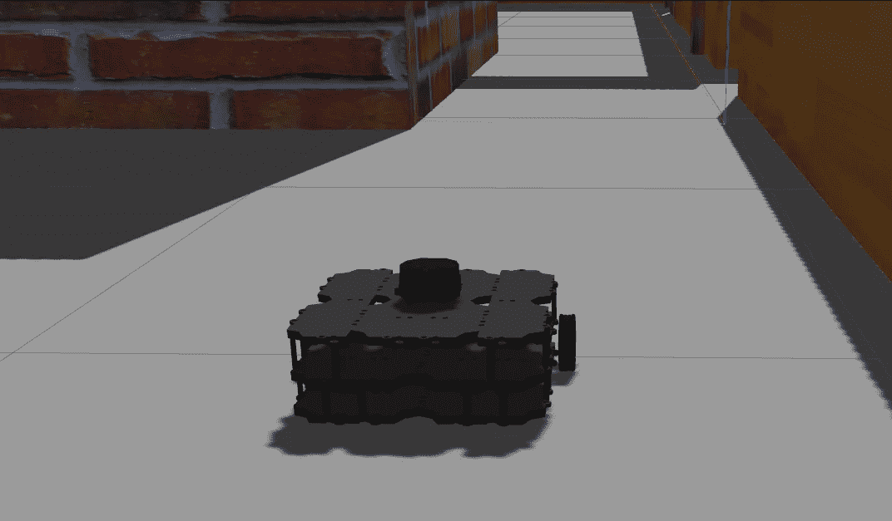

# 使用快速探索随机树的 ROS 自主 SLAM(RRT)

> 原文：<https://towardsdatascience.com/ros-autonomous-slam-using-randomly-exploring-random-tree-rrt-37186f6e3568?source=collection_archive---------3----------------------->

## 移动机器人 Turtlebot3 在 ROS 的导航栈和 Gazebo 模拟器的帮助下实现未知环境探索的 RRT 算法


使用 RRT 探索 Turtlebot3 图片由作者提供

机器人操作系统(ROS)已经成为现代机器人领域的游戏规则改变者，在这个领域具有极高的潜力，有待于下一代更熟练的开源机器人社区来探索。ROS 的最大优势之一是它允许机器人系统中不同流程(即节点)的无缝集成，在开源社区的支持下，这些流程也可以在其他系统中重用。

## ROS 和 SLAM

ROS 最受欢迎的应用之一是 SLAM(同步定位和地图绘制)。移动机器人中 SLAM 的目标是在将用于探索的机器人上附着的可用传感器的帮助下，构建和更新未探索环境的地图。

在这个演示中，我们将看到预构建的 ROS 包的实现，即导航堆栈和 Gmapping，使用 SLAM 自主地使用随机探索随机树(RRT)算法来绘制未探索的房子，使机器人覆盖未知环境的所有区域。

## RRT 算法

快速探索随机树(RRT)是一种数据结构和算法，旨在有效地搜索非凸高维空间。RRT 是以一种快速减少随机选择的点到树的预期距离的方式递增构建的。RRT 特别适合于涉及障碍和微分约束(非完整或动力学)的路径规划问题。[来源](http://lavalle.pl/rrt/about.html)


RRT 算法动画|图片由作者提供，使用[源代码](https://github.com/pbpf/RRT-2)生成

## SLAM 应用的 RRT

我们将使用 RRT 算法为机器人制定路径计划，以到达传感器附近所有可到达的远程端点，也称为前沿点，这反过来使机器人在试图到达其新的远程端点时，使用 SLAM 连续绘制新的区域。以这种方式将 RRT 应用于移动机器人，使我们能够创建一个无需人类干预的自我探索自主机器人。该算法的本质倾向于偏向于未探索的区域，这对于环境探索任务变得非常有益。更深入的信息和该策略的流程可以在本出版物中找到:[基于多个快速探索随机树的自主机器人探索。](https://ieeexplore.ieee.org/document/8202319)


探索未知空间的 RRT 算法的推广|图片作者

## [露台模拟器](http://gazebosim.org/)

Gazebo Simulator 是一个设计良好的独立机器人模拟器，可用于快速测试算法、设计机器人、执行回归测试以及使用真实场景训练 AI 系统。我们将使用带有房屋模型的露台环境，让我们的机器人探索并制作房屋地图。


露台模拟器中的房屋模型|图片由作者提供

# 让我们开始和 ROS 一起工作吧

对于这个演示，请随意从我的[***Github***](https://github.com/fazildgr8)资源库下载我预建的 ROS 包[***ROS _ autonomous _ slam***](https://github.com/fazildgr8/ros_autonomous_slam)*。*

*这个存储库由一个 ROS 包组成，它使用导航栈在 GMAPPING 的帮助下自主探索未知环境，并构建所探索环境的地图。最后，在新生成的地图中使用导航堆栈中的路径规划算法来达到目标。Gazebo 模拟器用于 Turtlebot3 华夫饼 Pi 机器人的模拟。集成了各种算法，用于在 360 度激光雷达传感器的帮助下自主探索该区域并构建地图。不同的环境可以在启动文件中交换，以生成所需的环境图。当前用于自主探索的最有效的算法是快速探索随机树(RRT)算法。RRT 算法是使用来自 [rrt_exploration](http://wiki.ros.org/rrt_exploration) 的包实现的，它是为了支持 Kobuki 机器人而创建的，我进一步修改了源文件，并在这个包中为 Turtlebot3 机器人构建了它。*

## *在这个项目中有三个主要步骤要执行。*

*   *步骤 1:将机器人放置在露台内的环境中*
*   *步骤 2:执行环境的自主探索并生成地图*
*   *步骤 3:执行路径规划并在环境中到达目标*

# *项目的先决条件和设置*

*在开始执行这些步骤之前，请确保您已经成功完成了本项目演示的先决条件和设置。有三个安装部分(Gazebo ROS 安装、Turtlebot3 包和导航栈安装)。*

# *ROS 安装*

*我用的是 Ubuntu 18 OS 配合 ROS 旋律版。检查 ROS 安装的官方文件 [ROS 安装](http://wiki.ros.org/melodic/Installation/Ubuntu)*

## *露台 ROS 安装*

*主露台模拟器是一个独立的应用程序，必须安装。办理文件[凉亭安装](http://gazebosim.org/tutorials?tut=install_ubuntu&cat=install)。测试 Gazebo 及其版本的工作情况*

```
*gazebo
which gzserver
which gzclient*
```

*安装 Gazebo 后，必须单独安装 Gazebo ROS 软件包*

```
*sudo apt-get install ros-melodic-gazebo-ros-pkgs ros-melodic-gazebo-ros-control*
```

*在本教程中，将`melodic`替换成你的 ROS 版本。*

## *Turtlebot3 包*

*Turtlebot3 ROS 包可以从工作区的源文件下载并构建，也可以直接从 Linux 终端安装。无论哪种方式都可以，我建议两者都做，因为它会自动安装所有缺少的依赖项。*

**

*Turtlebot3 Waffle Pi 凉亭内的房屋模型|图片由作者提供*

*直接安装*

```
*source /opt/ros/melodic/setup.bash
sudo apt-get install ros-melodic-turtlebot3-msgs
sudo apt-get install ros-melodic-turtlebot3*
```

*构建包*

```
*cd catkin_ws/src
git clone -b melodic-devel https://github.com/ROBOTIS-GIT/turtlebot3
git clone -b melodic-devel https://github.com/ROBOTIS-GIT/turtlebot3_simulations
cd ..
catkin_make
source /devel/setup.bash*
```

## *导航堆栈*

*导航栈也可以作为源文件下载到您的工作区并进行构建。*

```
*sudo apt-get install ros-melodic-navigation
cd catkin_ws/src
git clone -b melodic-devel https://github.com/ros-planning/navigation
cd ..
catkin_make
source /devel/setup.bash*
```

# *自主 SLAM 演示的主要执行*

# *步骤 1:将机器人放置在露台内的环境中*

*将您的环境变量设置为要使用的模型机器人。*

```
*export TURTLEBOT3_MODEL=waffle_pi
source ~/.bashrc*
```

*使用给定的世界文件执行给定的启动以打开 Gazebo，并将机器人 Turtlebot3 Waffle pi 模型放入其中。*

```
*roslaunch ros_autonomous_slam turtlebot3_world.launch*
```

*保持此过程始终运行，并在不同的终端中执行其他命令。*

# *步骤 2:执行环境的自主探索并生成地图*

```
*roslaunch ros_autonomous_slam autonomous_explorer.launch*
```

*运行 Autonomous Explorer 启动文件，它同时为我们执行两个任务。*

1.  *它使用定制的修改后的 RVIZ 文件启动导航堆栈中的 SLAM 节点，以监控环境的映射。*
2.  *它同时启动自主浏览器，这是一个基于 Python 的控制器，在机器人周围移动，掠过所有区域，帮助 SLAM 节点完成映射。用于探索的默认算法是 RRT 算法。我还创建了一个 explorer 方法，该方法使用 Bug Wall following 算法进行探索，可以通过将参数`explorer`添加到采用`[RRT,BUG_WALLFOLLOW]`的 launch 来进行测试。*

# *在 RVIZ 窗口中设置 RRT 的探测区域([更多详情](http://wiki.ros.org/rrt_exploration/Tutorials/singleRobot)*

*RRT 探测需要在 RVIZ 窗口中定义机器人周围的矩形区域，使用四个点和机器人已知区域内探测的起点。必须使用 RVIZ 发布点选项，按照下面给出的确切顺序定义总共五个点。*

**

*发布点序列|作者图片，更多细节来自 [rrt_exploration 教程](http://wiki.ros.org/rrt_exploration/Tutorials/singleRobot)*

*在 RVIZ 窗口中监控映射过程，并坐下来放松，直到我们的机器人完成 XD 映射。*

**

*使用 RRT 算法的机器人地图|图片由作者提供*

*对构建的地图感到满意后，保存地图。*

```
*rosrun map_server map_saver -f my_map*
```

**my_map.pgm* 和 *my_map.yaml* 保存在您的主目录中。将这些文件移动到包的 maps 文件夹中(chunk _ ws \ src \ ROS _ autonomous _ slam \ maps)。现在你的新地图基本上是一个占用网格构建！*

**

*由作者构建的地图|图像*

***在自主失败的情况下**你可以使用键盘手动控制环境中的机器人，下面给出一个单独的启动执行。您也可以像玩游戏一样手动探索和构建地图。*

```
*roslaunch turtlebot3_teleop turtlebot3_teleop_key.launch*
```

**

*手动机器人制图|图片由作者提供*

# *步骤 3:执行路径规划并在环境中到达目标*

*我们将使用 ROS 的导航栈来执行路径规划，并使用/move_base/goal 操作到达目标。执行给定的打击发射会打开一个 RVIZ 窗口，显示机器人在先前构建的地图中的位置。*

```
*roslaunch ros_autonomous_slam turtlebot3_navigation.launch*
```

*RVIZ 窗口显示机器人使用其激光传感器构建的局部地图，相对于之前在步骤 2 中借助成本地图构建的全局地图。*

# *在 RVIZ 窗口中设置目标*

*   *首先，估计初始姿态，即相对于地图定位真实的机器人位置。这可以在 RVIZ 窗口中设置，使用 2D 姿态估计，并在当前机器人的位置和方向上指向和拖动箭头。*

**

*2D 估价标签*

*   *可使用 2D 导航目标选项在 RVIZ 窗口中设置目标点，该选项可在顶部窗口选项卡中找到。这允许您在 RVIZ 环境中的地图上设置一个目标点，然后机器人自动执行路径规划并开始沿其路径移动。*

**

*2D 导航目标选项卡*

# *Ros 导航堆栈调整指南*

*ROS 导航堆栈需要调整其参数，这些参数对于不同的环境类型有不同的作用，以获得最佳的 SLAM 和路径规划性能。下面是 ROS 针对 Turtlebot3 的导航栈参数调优指南。 [Turtlebot3 导航参数整定指南](https://emanual.robotis.com/docs/en/platform/turtlebot3/navigation/#tuning-guide)*

**

*机器人局部路径和全局路径规划|图片由作者提供*

**

*机器人向目标移动动作|作者图片*

# *太好了！！！现在我们已经在 ROS 工具的帮助下完成了 SLAM 任务。*