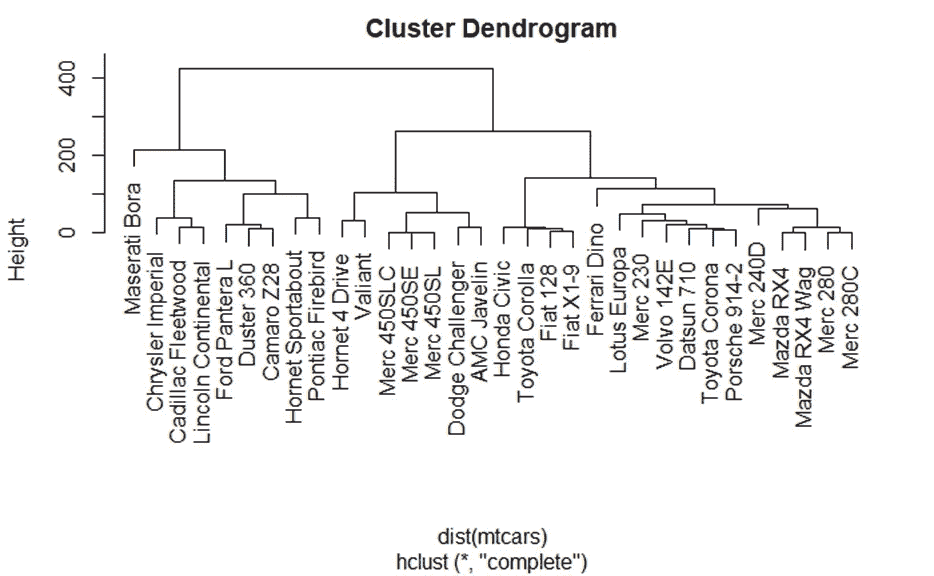
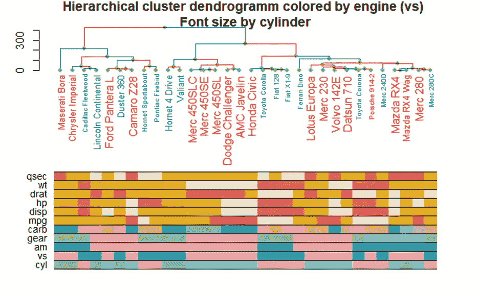

# r 的层次聚类图解——小菜一碟！

> 原文：<https://towardsdatascience.com/rs-hierarchical-clustering-illustration-a-piece-of-cake-a2406f48cbf9?source=collection_archive---------43----------------------->

聚类分析中的一个常见问题是:“现在怎么办？”。您有很多方法可以让混乱的数据变得有序，而不需要在头脑中有一个预先定义的假设。您可以使用传统的 kMeans，一些基于密度的方法，如 dbscan 或层次聚类，这可以让您对数据集中的聚类层次有一个印象。然而，你最感兴趣的不仅仅是你的哪些样本聚集在一起，还有，**为什么**它们会聚集在一起。只有当能够区分哪些样本特征将它们聚集在一起，哪些将它们分开时，您才能从分析中获得**值**。你超越了单纯的描述，走向了诠释和洞见。

然而，你要确保你的分析本身就能说明问题。不要抢镜头。只要提供正确的数字，见解就会显而易见。最近，我偶然发现了 R 中的一个新包，它使吸引人的层次集群变得轻而易举。它也有一个很棒的文档[在这里](https://cran.r-project.org/web/packages/dendextend/vignettes/dendextend.html)，所以我仅仅提供一个开胃菜。你可以自己去探索所有的基本细节。

因此，首先我们获取一些数据(mtcars 数据集)并运行层次聚类分析。标准图看起来是这样的:



作者图片

现在，我们加载 Tal Galili 的出色的 dendextend 包，将 hclust 对象转换成一个树状图。您可以给树叶标签和树状图线着色(这里是根据引擎类型)，根据某个向量(这里是根据气缸数量)设置标签的大小，并对节点进行处理。



作者图片

但最重要的是，您可以添加彩色条，代表您给定样本的特征级别。我将连续变量按其四分位数分割，以分配离散的颜色，因此您很快就能对给定聚类的特征级别有一个印象。因此，我们可以很快看出，与 Merc450 系列处于中间位置的那一组拥有共同的重量等级(wt)、后轮轴比(drat)、相同数量的齿轮和气缸、相同类型的变速器和发动机(am、vs)，但这两款车的排量和马力不同(disp、hp)。有趣的是，本田思域的后轮轴比率和 mpg 组合远远落后于 Mercedes450 组，它与丰田和菲亚特归为一类，尽管它的其他参数与 Merc450 相当。我想知道如果有一天数据集被更新，特斯拉会被分组到哪里。

下面是获取这些数字的代码:

```
library(dendextend)
library(colorspace) #to translate factors to colors
library(plotrix) #to translate hex to color#run cluster analysis:
hccomplete <- hclust(dist(mtcars), method ="complete")
#standard plot
plot(hccomplete)
#transform the hclust object to a dendrogram
dend <- hccomplete %>% as.dendrogram
#get colors for factors. Continuous variables are cut by their quartiles, to which the colors are assigned
the_bars <- cbind(unname(sapply(rainbow_hcl(length(levels(as.factor(mtcars$cyl))))[c(as.factor(mtcars$cyl))], color.id)), 
                  unname(sapply(rainbow_hcl(length(levels(as.factor(mtcars$vs))))[c(as.factor(mtcars$vs))], color.id)), 
                  unname(sapply(rainbow_hcl(length(levels(as.factor(mtcars$am))))[c(as.factor(mtcars$am))], color.id)), 
                  unname(sapply(rainbow_hcl(length(levels(as.factor(mtcars$gear))))[c(as.factor(mtcars$gear))], color.id)), 
                  unname(sapply(rainbow_hcl(length(levels(as.factor(mtcars$carb))))[c(as.factor(mtcars$carb))], color.id)),
                  sapply(cut(mtcars$mpg,breaks=c(0,unname(quantile(mtcars$mpg))), labels=heat_hcl(5)), color.id),
                  sapply(cut(mtcars$disp,breaks=c(0,unname(quantile(mtcars$disp))), labels=heat_hcl(5)), color.id),
                  sapply(cut(mtcars$hp,breaks=c(0,unname(quantile(mtcars$hp))), labels=heat_hcl(5)), color.id),
                  sapply(cut(mtcars$drat,breaks=c(0,unname(quantile(mtcars$drat))), labels=heat_hcl(5)), color.id),
                  sapply(cut(mtcars$wt,breaks=c(0,unname(quantile(mtcars$wt))), labels=heat_hcl(5)), color.id),
                  sapply(cut(mtcars$qsec,breaks=c(0,unname(quantile(mtcars$qsec))), labels=heat_hcl(5)), color.id))#plot awesomely
par(mar = c(17,3,2,2))
dend %>% set("branches_col", ifelse(mtcars$vs ==0, "red", "blue")) %>% # change color of branches
  set("labels_col",  ifelse(mtcars$vs ==0, "red", "blue"))%>% # change color of labels
  set("labels_cex", mtcars$cyl/10+0.2 ) %>% # Change size by number of cylinder
   set("nodes_pch", 19) %>% set("nodes_cex", 0.8) %>% set("nodes_col", 3) %>% #add nodes
  plot(main = "Hierarchical cluster dendrogramm colored by engine (vs) \nFont size by cylinder") # plot
colored_bars(colors = the_bars, dend = dend, rowLabels = c("cyl","vs","am","gear","carb","mpg","disp","hp","drat","wt","qsec"), sort_by_labels_order = FALSE) #sort_by_labels_order = FALSE is very important, otherways you get the colors sorted by their appearance in the dataset rather than in the dendrogram
```