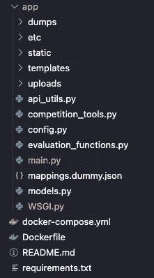
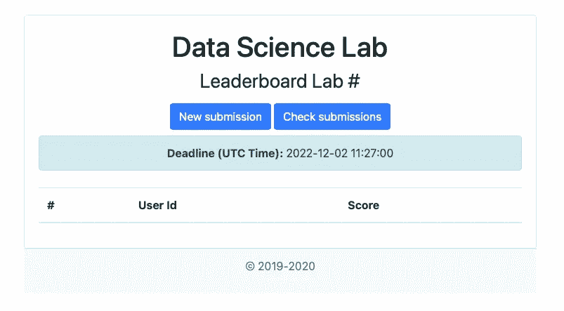

# 今天，免费举办一场机器学习竞赛。

> 原文：<https://towardsdatascience.com/run-a-machine-learning-competition-for-free-today-9e87a9f5c00?source=collection_archive---------28----------------------->

## 使用 DSLE:设计数据科学竞赛的智能平台。

由[卢卡斯·布拉塞克](https://unsplash.com/@goumbik?utm_source=unsplash&utm_medium=referral&utm_content=creditCopyText)在 [Unsplash](https://unsplash.com/s/photos/data-science?utm_source=unsplash&utm_medium=referral&utm_content=creditCopyText) 拍摄的照片

# 什么是 DSLE？

DSLE 是一个用于构建机器学习竞赛的 API，内置于 python (Flask)中。这是都灵理工大学(意大利都灵)一篇研究论文的成果。其目的是为设计和监控机器学习竞赛提供一个开源平台，该平台易于使用且高度可定制。[1]

# 我应该期待什么？

使用 DSLE，你应该能够建立任何类型的私人或公共比赛。您可以利用 API 本身提供的极简界面，或者将其嵌入到您的 web 应用程序中。考虑到[代码](https://zenodo.org/record/3666486#.YW6WYy8w30o)【2】带有[知识共享署名 4.0 国际公共许可证](https://creativecommons.org/licenses/by/4.0/legalcode)【3】，你对使用 DSLE 代码所能构建的东西的期望主要受限于你作为软件开发人员的技能。

本文将探讨如何仅使用 API 及其内置接口来建立竞赛。我们还将做一些小的编辑来增加它的健壮性:

*   将申请归档
*   添加需求依赖版本

最后，您将能够通过上传您的解决方案的 csv 文件来举办比赛，还可以创建自定义 API 密钥来与您的朋友共享，以便他们可以上传他们的结果。

# 先决条件

要在本教程后面使用 Docker 和 Docker compose，您需要在您的计算机上安装它们。访问这里了解更多关于如何安装它们的细节:[https://www.docker.com](https://www.docker.com/)

# 我们开始吧

首先，我们要从这里下载 https://zenodo.org/record/3666486#.YW6WYy8w30o 代码:

截至今天，最新版本的代码是`0.1.0`，上传于 2020 年 2 月 13 日。根据您访问存储库的时间，您的最新版本可能与我的不同。下载后，你可以用你选择的代码编辑器打开代码文件夹:我使用 Visual Studio 代码，但是其他的也可以。

> **提示:**你也可以在文末找到我的 GitHub 公开回购的链接。

# 将申请归档

如果你已经看过原始回购中提供的`README.md`文件，你可能会注意到它并不包含如何运行该应用程序的最彻底的说明。但是，它建议您创建一个虚拟环境来本地运行它。另一方面，我发现 dockerised 环境比传统的虚拟环境更容易管理，并且添加了更好的“容器层”。

如果你不熟悉 docker，我写了一篇文章[在这里](https://medium.com/analytics-vidhya/automate-your-pandas-workflow-with-flask-docker-28e5ab461288)关于如何使用 flask 和 Docker 自动化 pandas workflow，它提供了一种在没有任何 Docker 或 Flask 知识的情况下建立 Flask 应用程序的简单方法:[https://medium . com/analytics-vid hya/automate-your-pandas-workflow-with-Flask-Docker-28e 5 ab 461288](https://medium.com/analytics-vidhya/automate-your-pandas-workflow-with-flask-docker-28e5ab461288)

因此，让我们创建一个`Dockerfile`和`docker-compose.yml`，并将除了`requirements.txt`和`README.md`之外的所有其他文件移动到一个名为`app`的子文件夹中。

此时，您应该有这样的文件夹结构:

最终文件夹结构

打开您刚刚创建的`Dockerfile`,复制粘贴下面的代码:

现在打开`docker-compose.yml`并粘贴以下内容:

如果你需要更多关于`Dockerfile`和`docker-compose.yml`代码的信息，你可以在我上面链接的文章中读到。

> **注意:**在我们构建并运行我们的应用程序之前，如果您已经使用了上述的`Dockerfile`，请确保将文件`app.py`重命名为`main.py`并修改文件`WSGI.py`第 3 行:
> 
> 来自:`from app import app as flask_app`
> 
> **至:**至:`from main import app as flask_app`

# 构建并运行应用程序

打开你的终端，进入`Dockerfile`所在的应用目录。如果最后一条指令对你来说很奇怪，不要担心，它实际上很简单:

1.  打开您的终端，键入`cd` (带空格)、**，不要按**回车键
2.  将应用程序文件夹拖放到终端窗口中(这将自动生成文件夹路径)
3.  按回车键

现在您可以键入`docker-compose build`来构建您的 docker 映像。一旦完成，输入`docker-compose up`运行 docker 容器。

**注意:**如果您有一个关于名为`greenlet`的依赖项版本的错误，您可以通过在您的`requirements.txt`上添加下面一行来解决它:`greenlet == 0.4.17`。然后保存需求文件并重新构建容器映像。

最后，要检查应用程序是否运行良好，请在您最喜欢的浏览器上访问`127.0.0.1`或 localhost，您应该会看到类似这样的内容:

PS。不要担心有效期；我们稍后会改变这一点。

# 更新需求文件

您可能已经注意到了，`requirements.txt`文件包含一个依赖项名称列表，但是缺少版本号。这意味着每次构建容器映像时，安装的依赖项都是最新的版本。

截至今天，2021 年 10 月 19 日，除了上面描述的`greenlet`问题之外，没有太多变化，所有依赖项在其最新版本上都运行良好。但是，将来这种情况可能会改变，所以如果您遇到依赖问题，这里是我的`requirements.txt`文件的快照，您可以用作参考:

# 为比赛做准备

现在，应用程序正在运行，我们可以花时间来设置我们的竞争数据。

DSLE 应用程序通过将提供的解决方案与参与者上传的数据集进行比较来工作。[1]默认情况下，解决方案和参与者提交的内容都必须采用`csv`格式。

要为比赛格式化数据，您应该以这样的方式分割数据集:将一部分数据发送给参与者进行培训和测试，另一部分作为隐藏解决方案，应用程序将使用该解决方案进行验证并对提交的数据进行评分。

如何在熊猫身上做到这一点的一个例子是:

## 添加解决方案文件:

导航到`app/static/test_solution`并用您的`solution`文件替换文件`test_solution.csv`；然后重命名您的文件`test_solution.csv`。

## 定制比赛配置:

打开文件`config.py`。在这里你可以改变比赛的某些方面，比如开始和结束的时间以及比赛的管理，以适应你的需要。

在配置选项中，您还会看到`API_FILE_PATH`引用了一个名为`mappings.dummy.json`的文件。在这里，您可以找到一个用户“字典”,其中已经映射了相关的 API 键。您可以随意更改它们，也可以添加更多内容与单身参与者分享。在提交或检查结果时，他们将使用您提供的 API 密钥进行身份验证。

## 定制评估指标

在开展竞赛之前，您需要设置评估指标，用于对参与者提交的内容进行评分。你可以在`evaluation_functions.py`文件中找到这个选项。默认情况下，使用的度量是准确性；你可以在这里找到所有可用函数的列表:[https://sci kit-learn . org/stable/modules/model _ evaluation . html](https://scikit-learn.org/stable/modules/model_evaluation.html)

或者，如果您需要包含多个指标和更复杂的评估，您可以创建自己的函数。

# 主持比赛

现在一切就绪，您只需要在服务器或本地网络上部署 docker，并与您的参与者共享 API 密钥和公共数据集。每次有人提交，公共排行榜上的分数就会自动生成。

我希望您喜欢这个简短的指南，并且能够顺利地运行您的应用程序。如果你想查看 dockerised app 的最终代码，可以在这里找到**我的公共 GitHub repo:**[https://github.com/fabiom91/DSLE_dockerised](https://github.com/fabiom91/DSLE_dockerised)

> **参考文献**:
> 
> **1。** G. Attanasio *等人*。，“DSLE:设计数据科学竞赛的智能平台”， *2020 IEEE 第 44 届计算机、软件和应用年会(COMPSAC)* ，2020，第 133–142 页，doi:10.1109/COMPSAC 48688 . 2020 . 00026
> 
> **2。** DSLE:设计数据科学竞赛的智能平台。0.1.0，芝诺多，2020 年 2 月 13 日，p，doi:10.5281/芝诺多. 3666486。
> 
> **3** 。【https://creativecommons.org/licenses/by/4.0/legalcode】