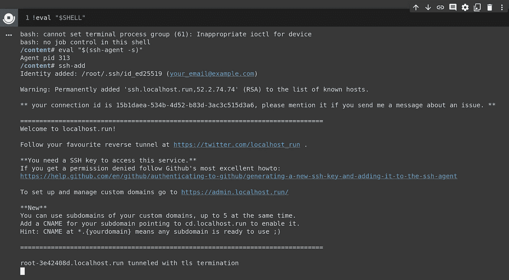
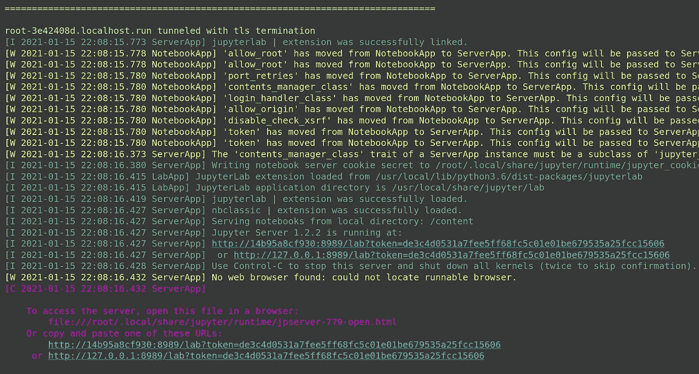
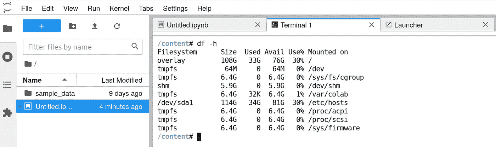

# 在谷歌联合实验室上运行 Jupyter 实验室

> 原文：<https://towardsdatascience.com/run-jupyter-lab-on-google-colaboratory-7b02075f61c?source=collection_archive---------45----------------------->

## 简单使用一个反向 SSH 隧道来大大提高可用性。


这不是 SSH 隧道，但仍然是一个反向隧道。2019 年葡萄牙辛特拉。(作者供图)。

# 介绍

我们已经很久没有写过任何“类似工程”的话题了。因为我们都想保持高效和多产，所以这是一个重温[谷歌联合实验室](https://colab.research.google.com/)的好时机。

总的来说，谷歌合作实验室(Google Colaboratory，简称 Colab)一直是数据科学家或机器学习爱好者的一个伟大平台。它在有限的时间内提供了一个免费的 GPU 和 TPU 实例，此外它还提供了一个美化版的 Jupyter 笔记本。这是各种小型或中型项目的绝佳组合。

不幸的是，它有一定的局限性。最大的问题是缺乏存储持久性，以及局限于单个文档。这两个限制使开发变得复杂，并使处理多个文件变得不那么简单。

虽然社区已经开发了一些好的解决方案(包括我之前的工作[这里](https://zerowithdot.com/colab-workspace/)和[这里](/colaboratory-drive-github-the-workflow-made-simpler-bde89fba8a39)，我们中的许多人仍然在寻找类似“数据工作室”的东西，也就是 [Jupyter Lab](https://jupyter.org/) 。

在本文中，我们将展示如何通过 Colab 在 Google 机器上安装和运行 Jupyter Lab 实例，将其转变为一个免费的带有 Jupyter Lab 前端和 GPU/TPU 后端的**定制解决方案。更重要的是，这里介绍的方法是通用的，也允许你使用其他服务，比如 Flask。它**不同于**这里的[这里的](https://robotwealth.com/how-to-connect-google-colab-to-a-local-jupyter-runtime/)或者[这里的](https://medium.com/@thedatadetective/getting-local-with-google-colab-a4d69f373364)，因为它们显示了如何将 Jupyter Colab 前端连接到本地实例。在这里，我们将做**完全相反的**，所以继续！**

# 大意

主要想法是利用驻留在 Colab 笔记本后面的服务器，并使用其后端功能，但取代前端。要使其工作，步骤如下:

*   点击笔记本后面的服务器。
*   安装我们需要的所有软件包(例如 Jupyter Lab)。
*   建立沟通渠道。
*   连接到它，玩得开心。

# 入门指南

转到 https://colab.research.google.com 的[来启动一个新实例，连接到它，并等待资源被分配。如果你愿意，**现在**是时候将后端切换到 GPU 或 TPU(除非你想重复所有步骤)。](https://colab.research.google.com)


图一。我们已经连接到谷歌后端的证据。(作者供图)。

# 准备工作区

## 第一次“黑”

现在，我们需要更深入地与笔记本背后的机器对话，而不是与笔记本本身对话。与底层 shell 交互的标准方式是在 bash 命令前面加上`!`(例如`!ls -la`)。但是，它可能会在以后产生一些问题，所以最好使用一种替代方式，主要是执行

```
eval "$SHELL"
```

在一个细胞中，这将让我们与后面的控制台直接沟通。

## 安装 Jupyter 实验室

接下来，我们安装 Jupyter 实验室或任何其他东西。Colab 本身没有安装它，您可以通过执行以下命令来确认:

```
pip list | egrep jupyter

# output
jupyter                       1.0.0          
jupyter-client                5.3.5          
jupyter-console               5.2.0          
jupyter-core                  4.7.0          
jupyterlab-pygments           0.1.2          
jupyterlab-widgets            1.0.0pip install jupyterlab
pip list | egrep jupyter

# output
jupyter                       1.0.0          
jupyter-client                6.1.11         
jupyter-console               5.2.0          
jupyter-core                  4.7.0          
jupyter-server                1.2.2          
jupyterlab                    3.0.5          
jupyterlab-pygments           0.1.2          
jupyterlab-server             2.1.2          
jupyterlab-widgets            1.0.0
```

所以现在，我们已经拥有了 Python 环境所需要的一切，但是我们仍然需要在笔记本之外公开它。为此，我们将做所谓的*反向 ssh 隧道*。

# 反向 SSH 隧道

反向 SSH 隧道允许使用两台机器之间的现有连接来建立从本地机器到远程机器的新连接通道。正如[这篇文章](https://www.howtogeek.com/428413/what-is-reverse-ssh-tunneling-and-how-to-use-it/)所解释的:

> 因为最初的连接是从远程计算机到您的，使用它去另一个方向就是“反向”使用它因为 SSH 是安全的，所以您将安全连接放在了现有的安全连接中。这意味着您到远程计算机的连接充当原始连接内部的专用隧道。

现在，按照本文使用的词汇，本地机器实际上是运行 Colab 的 Google 服务器。我们想向外界公开的就是这台机器的端口。然而，由于我们不知道本地机器的外部地址(或者按照本文的词汇表，是“远程”机器)，我们使用第三方服务，即[http://localhost.run/](http://localhost.run/)。

这个解决方案是由 haqpl 建议的，他是一个专业的 pentester，也是我的一个朋友。

它既是反向 SSH 隧道的终端，也是普通的 HTTP 服务器，允许我们将其用作通信的桥梁。换句话说，该服务在一端完成 SSH 隧道，在另一端完成 HTTP 服务器，将我们的本地 PC 连接到我们在 Colab 上运行的任何服务。

## 生成公钥

在我们开始之前，有一件事我们需要注意。我们需要一个密钥对来保护没有密码的 SSH 通道。

这是容易的部分。详细说明可以在 [GitHub](https://docs.github.com/en/github-ae@latest/github/authenticating-to-github/generating-a-new-ssh-key-and-adding-it-to-the-ssh-agent) 上找到。对我们来说，执行以下命令就足够了。不要担心密码短语。只要按下回车键。

```
ssh-keygen -t ed25519 -C "your_email@example.com"
```

默认情况下，密钥存储在`/root/.ssh/id_ed25519.pub`下。接下来，确认我们有`ssh-agent`并注册密钥。

```
eval "$(ssh-agent -s)"
ssh-add

# expected response
Identity added: /root/.ssh/id_ed25519 (your_email@example.com)
```

此时，我们准备测试隧道。

## *测试*连接

为了初始化连接，我们需要选择一个不太可能被系统使用的端口。比如 9999。这是一个很好的数字，不是吗？然后，要执行的命令将把这个端口映射到端口 HTTP 连接的标准端口)。此外，我们需要让系统对宿主是谁视而不见。因此有了`-o`旗。

```
ssh -o StrictHostKeyChecking=no -R 80:localhost:9999 ssh.localhost.run
```

如果一切顺利，响应的最后一行应该会给出指向本地机器的 URL。



图二。SSH 反向隧道已经建立。在我们的例子中，URL 是` root-3e42408d.localhost.run`。

然而，当您将它复制粘贴到您的浏览器时，您最有可能得到的响应是`Something went wrong opening the port forward, check your SSH command output for clues!`。这没问题，因为这个端口上确实没有运行任何服务(还没有)。

让我们在这个端口下启动一个小的 python 服务器(或者如果你以前用过的话就换一个)。

```
python -m http.server 9999 & ssh -o StrictHostKeyChecking=no -R 80:localhost:9999 ssh.localhost.run
```

当连接建立后，您应该能够在浏览器中浏览 Colab 上的文件，看到这样的行:

```
====================================================================
root-be893e68.localhost.run tunneled with tls termination
127.0.0.1 - - [14/Jan/2021 22:39:21] "GET / HTTP/1.1" 200 -
127.0.0.1 - - [14/Jan/2021 22:39:22] code 404, message File not found
127.0.0.1 - - [14/Jan/2021 22:39:22] "GET /favicon.ico HTTP/1.1" 404 -
```

在笔记本上打印出来。

这是一个非常好的迹象！这意味着如果我们可以运行`python -m http.server`，我们也可以用 Flask 或 Jupyter Lab 来代替它，这正是我们将要做的！

# 最后一击

现在，让我们更改端口，开始实验。要运行的命令有点长，原因是我们必须传递必要的参数:

*   `--ip=0.0.0.0`强调这是一台本地机器(本地到 Colab)。
*   `--port=8989`当然，
*   `--allow-root`，否则 Lab 将启动但拒绝与您通信。

```
jupyter lab --ip=0.0.0.0 --port=8989 --allow-root & ssh -o StrictHostKeyChecking=no -R 80:localhost:8989 ssh.localhost.run
```

同样，如果一切正常，那么借助 SSH 隧道，我们应该使用前面发布的 URL 从外部访问 Jupyter 实验室。唯一的附加组件是您可以从响应中读取的参数和令牌。



图 3。Jupyter 实验室实例正在运行的确认。(作者供图)。

将给出的 URL 复制粘贴到浏览器的另一个标签中。记得用之前收到的 URL 替换`localhost:8989`。



[此处](https://zerowithdot.com/colab-github-workflow/)图 4。Jupyter 实验室确实连接到 Colab 后端的确认。(作者供图)。

# 结论

就是这个！我们通过反向 SSH 隧道(和 [haqpl](https://haqpl.github.io/) )创建的 Jupyter Lab 和 Google Colaboratory 的组合，可能会提供最终的自由，因为现在您可以简化文件的上传/下载，方便地跨多个文件组织您的项目，并为您的计算提供真正强大的硬件支持……免费。

一句话，在我们走之前…记住，尽管 SSH 通道是安全的，但会话对任何知道你的 URL 的人都是开放的。如果作为工作的一部分，你决定在机器上安装 Google Drive，那么即使你不知道，也有可能有人访问你的文件。所以，请小心使用这个“黑客”。或者，您可以考虑使用虚拟专用服务器(VPS)来取代`localhost.run`,并给予端点独占所有权。

感谢阅读！请在评论中告诉我，以防你遇到问题或有任何建议。祝你好运，玩得开心！

# 还会有更多…

我计划把文章带到下一个层次，并提供简短的视频教程。

如果您想获得关于视频和未来文章的更新，**订阅我的** [**简讯**](https://landing.mailerlite.com/webforms/landing/j5y2q1) **。你也可以通过填写[表格](https://forms.gle/bNpf9aqZJGLgaU589)让我知道你的期望。回头见！**

*原载于*[](https://zerowithdot.com/jupyter-lab-colab/)**。**