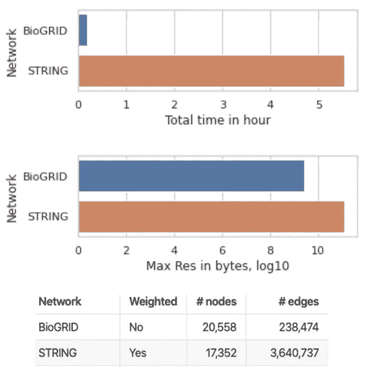
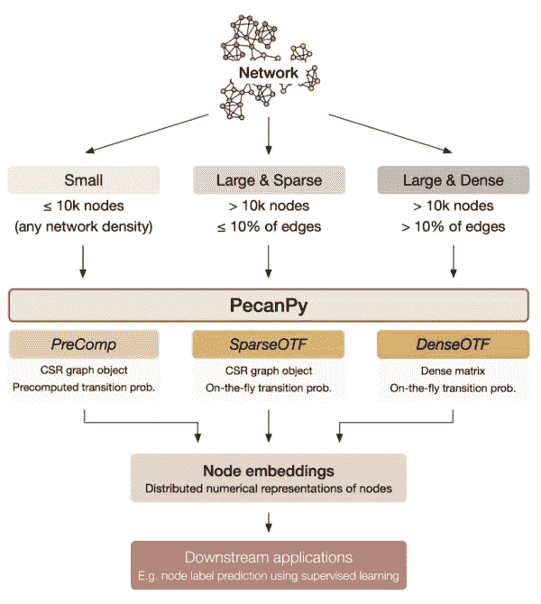

# 使用 PecanPy 以更少的内存运行 node2vec ultrafast

> 原文：<https://towardsdatascience.com/run-node2vec-faster-with-less-memory-using-pecanpy-1bdf31f136de?source=collection_archive---------26----------------------->

## [理解大数据](https://towardsdatascience.com/tagged/making-sense-of-big-data)

## 一种流行的图形嵌入方法的简单实现


来自 [Pixabay](https://pixabay.com/?utm_source=link-attribution&utm_medium=referral&utm_campaign=image&utm_content=99684) 的[大卫·马克](https://pixabay.com/users/12019-12019/?utm_source=link-attribution&utm_medium=referral&utm_campaign=image&utm_content=99684)的图片

Node2vec 是一种节点嵌入方法，它生成图中节点的数字表示(或嵌入)[1]。然后，这些嵌入被用于各种下游任务，例如节点分类和链路预测。如果你对 node2vec 不熟悉，可以看看我的另一篇文章来解释它的直觉。

# TL；速度三角形定位法(dead reckoning)

*   Node2vec 是一种非常流行的嵌入方法，用于生成图(也称为网络)中节点的数字表示，然而最初的实现是**慢**和**内存低效**。
*   **PecanPy** 是 node2vec 的超快速和内存高效的实现，可以通过 pip 轻松安装**，并且可以从命令行或在您的 Python 脚本中使用。**
*   作为一个使用字符串网络的例子，PecanPy 将运行时间从 **5 小时**减少到略超过**一分钟**，并将内存使用量从 **100GB** 减少到 **< 1GB** 。

# node2vec 的原始 Python 实现速度慢且内存效率低

最初的实现(在 [C++](https://github.com/snap-stanford/snap/tree/master/examples/node2vec) 和 [Python](https://github.com/aditya-grover/node2vec) 中实现)非常慢，内存效率也很低。在这篇博客文章中，我将介绍 PecanPy [2]，一个 **p** 并行化的，内存 **e** ffi **c** ient 和**a**accelerated**n**ode 2 vec in**Py**thon，我们将看到运行时间和内存使用都比最初的实现有了显著的改进。



图 1。两个生物网络 BioGRID 和 STRING 上 node2vec 的运行时和内存使用情况。

让我们来看两个嵌入生物网络 BioGRID 和 STRING 的例子。两个网络都有大约 20k 个节点，STRING 的密度稍大。使用原始 Python 实现完全嵌入字符串花费了超过 **5 个小时**和 **100GB** 的内存，并为 BioGRID 使用了超过 1GB 的内存，即使整个网络的文件大小只有 2.5 MB。*惯坏警告:使用 pec 嵌入字符串只花费了略超过* ***一分钟*** *，内存不到****1GB***

# *node2vec 最初实现的三个主要问题*

*以下问题专门针对最初的 Python 实现。尽管 C++实现在某些方面更有效，但我们将在下一节中看到，它仍然受到内存问题的困扰，并且运行速度比 PecanPy 慢。*

***并行性问题**:转移概率预处理和随机游走生成没有并行化，尽管这两个过程具有令人尴尬的并行性，即每个游走生成都是独立的任务，不依赖于任何其他的游走。*

***图形数据结构问题**:Python 原始实现使用 [networkx](https://networkx.org) 存储图形，对于大规模计算效率相当低。受 Matt Ranger 的这篇[博客文章](https://www.singlelunch.com/2019/08/01/700x-faster-node2vec-models-fastest-random-walks-on-a-graph/)的启发，PecanPy 对稀疏图使用紧凑稀疏行(CSR)格式，这种格式更紧凑地存储在内存中，最重要的是，运行速度更快，因为它可以更好地利用缓存。然而，CSR 有一个问题，如果图是密集的(比如完全连接，这在生物学中很常见，如[基因共表达网络](https://en.wikipedia.org/wiki/Gene_co-expression_network))，那么由于显式存储索引，在 CSR 中存储需要比所需更多的内存。为了处理密集网络，我们还添加了另一个选项来存储为 2D numpy 数组。*

***内存问题**:内存使用量远远超过网络文件大小的原因是二阶转移概率的预处理和存储。为了解决这个问题，我们可以简单地删除预处理步骤，并根据需要计算转移概率，而无需保存。然而，对于仍然可以保存所有二阶转移概率的小型稀疏网络，建议包括预处理步骤，因为它可以更快地生成随机游走，而无需在每个步骤中重新计算转移概率。*

**

*图 2。PecanPy 执行模式概述。*

*PecanPy 解决了上述所有问题，并提供了三种执行模式，包括 *PreComp* 、 *SparseOTF* 和 *DenseOTF* ，每种模式都针对不同大小和密度的图形进行了更优化。简而言之，两种 *OTF* (代表 On The Fly)模式通过即时计算转移概率来解决内存问题，而 *PreComp* 模式保留了在较小网络上的原始实现中的预处理步骤，以实现更快的遍历生成。最后，*稀疏*和*密集*表示是用 CSR 还是 numpy 数组来存储图形。*

# *基准测试结果*

**

*图 3。node2ec 在 8 个不同网络上的不同实现的运行时和内存使用情况*

*图 3 显示了原始实现和 PecanPy 之间的运行时和内存使用比较，使用了不同规模和密度的网络，包括 node2vec 论文[1]中测试的网络。首先，请注意，与最初的 Python 和 C++实现相比，PecanPy 的所有三种模式都实现了更快的运行时。特别是，嵌入字符串网络仅用了一分多钟。其次， *OTF* 策略显著降低了内存使用量。再看 STRING， *SparseOTF* 能够用不到 1GB 的内存完全嵌入网络，而两个原始实现都需要~100GB 的内存。此外，由于内存限制(使用 200GB 资源配置进行测试)，GIANT-TN 网络(26k 节点，完全连接)不能使用任何原始实现进行嵌入。*

*最后，PecanPy 生成的嵌入质量被证实与原始 Python 实现生成的嵌入质量相同。查看[2]了解更多信息。*

# *PecanPy 入门*

*你可以在 [GitHub](https://github.com/krishnanlab/PecanPy) 上查看最新(未发布)的 PecanPy。也可以通过 [pip](https://pypi.org/project/pecanpy/) : `pip install pecanpy`轻松安装，安装最新发布的 PecanPy 版本。使用由[基准库](https://github.com/krishnanlab/PecanPy_benchmarks)提供的工作流脚本，所有基准都是可再现的(您也可以使用它来基准测试您自己的 node2vec 实现)。*

*PecanPy 既可以从命令行使用，也可以作为 Python 脚本中的模块加载。例如，下面的命令行脚本嵌入了带有 *SparseOTF* 模式的[空手道网络](https://en.wikipedia.org/wiki/Zachary%27s_karate_club):*

```
*pecanpy --input karate.edg --output karate.emb --mode SparseOTF*
```

*或者换句话说，您可以将 PecanPy 作为一个模块加载，并从图中生成随机遍历，然后可以用它来生成嵌入:*

```
*from pecanpy import pecanpy# load graph object using SparseOTF mode
g = pecanpy.SparseOTF(p=1, q=1, workers=1, verbose=False)
g.read_edg("karate.edg", weighted=False, directed=False)# generate random walks
walks = g.simulate_walks(num_walks=10, walk_length=80)# use random walks to train embeddings
w2v_model = Word2Vec(walks, vector_size=8, window=3, min_count=0, sg=1, workers=1, epochs=1)*
```

# *与 ndoe2vec 的现有实现相比*

*尽管 node2vec 有许多其他现有的实现，包括由 Matt Ranger[开发的](https://www.singlelunch.com/2019/08/01/700x-faster-node2vec-models-fastest-random-walks-on-a-graph/) [nodevectors](https://github.com/VHRanger/nodevectors) 和由 Elior Cohen 开发的 [Python3 node2vec](https://github.com/eliorc/node2vec) ，但是它们都没有提供一个系统化的基准来显示到底加速了多少，并且很少处理内存问题。此外，现有的实现都没有显示嵌入的质量控制，尽管在优化代码时容易出错并引入错误，例如在随机漫步生成中，从而降低了所得嵌入的质量。PecanPy 提供了嵌入的系统性能基准和质量控制，使用[基准库](https://github.com/krishnanlab/PecanPy_benchmarks)中设置的工作流程可以完全重现。*

# *参考*

*[1] Grover A .，Leskovec J. (2016) node2vec:网络的可扩展特征学习。在:*第 22 届 ACM SIGKDD 知识发现和数据挖掘国际会议论文集*，KDD 2016 年，第 855–864 页。美国纽约州纽约市计算机协会。*

*[2]刘，Arjun Krishnan，pecan py:*node 2 vec*，*生物信息学*的快速高效并行 Python 实现，2021；，btab202，【https://doi.org/10.1093/bioinformatics/btab202 *