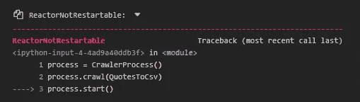

# 运行 Jupyter 笔记本上的零碎代码，没有任何问题

> 原文：<https://towardsdatascience.com/run-scrapy-code-from-jupyter-notebook-without-issues-69b7cb79530c?source=collection_archive---------6----------------------->

[**Scrapy**](https://scrapy.org/) 是一个开源框架，用于从网站中提取数据。它快速、简单且可扩展。每个数据科学家都应该熟悉这一点，因为他们经常需要以这种方式收集数据。数据科学家通常更喜欢使用某种计算笔记本来管理他们的工作流程。Jupyter 笔记本在数据科学家中非常受欢迎，其他选项包括[**【py charm】**](https://www.jetbrains.com/pycharm/)[**zeppelin**](https://zeppelin.apache.org/)[**VS Code**](https://code.visualstudio.com/)[**interact**](https://nteract.io/)**、Google Colab、**和[**spyder**](https://www.spyder-ide.org/)**等等。**

**使用 Scrapy 的刮擦通常是用一个`.py`文件完成的。它也可以从笔记本电脑初始化。问题是，当代码块第二次运行时，它抛出一个错误“`ReactorNotRestartable`:”。**

****

**由 [Clément Hélardot](https://unsplash.com/@clemhlrdt?utm_source=medium&utm_medium=referral) 在 [Unsplash](https://unsplash.com?utm_source=medium&utm_medium=referral) 上拍摄**

**使用`[crochet](https://pypi.org/project/crochet/)`包可以解决这个错误。`ReactorNotRestartable`使用该软件包可以减少错误。在这篇博文中，我展示了我从 Jupyter Notebook 运行 scrapy 代码而不出错的步骤。**

*****先决条件:*****

> **刺儿头:`pip install scrapy`**
> 
> **[钩针](https://pypi.org/project/crochet/) : `pip install crochet`**
> 
> **任何适合 python 的笔记本，我用的是 Jupyter 笔记本:`pip install notebook`**

*****演示项目:*****

**为了演示这些步骤，我从 [wikiquote](https://en.wikiquote.org/wiki/Main_Page) 中搜集了美国摇滚歌手[梅纳德·詹姆斯·基南](https://en.wikiquote.org/wiki/Maynard_James_Keenan)的引语，并将这些信息保存为. csv 文件，每次运行脚本时都会被覆盖，这对项目的重新开始很有用。这是通过使用自定义设置并传递一个以`FEEDS`为键的嵌套字典和一个以输出文件的名称为键的字典以及包含提要的不同设置的值来实现的。**

**为了初始化这个过程，我运行下面的代码:**

```
process = CrawlerProcess()
process.crawl(QuotesToCsv)
process.start()
```

**它第一次运行时没有问题，并将 csv 文件保存在根目录下，但是从下一次开始会抛出以下错误。**

****

**` ReactorNotRestartable '错误，图片由作者提供。**

**要再次运行代码而不出现问题，必须重启内核。现在随着钩针的使用，这个代码可以在一个 Jupyter 笔记本上使用，没有问题。**

**现在，我调用这个函数来运行代码，没有任何问题。**

```
run_spider()
```

**现在让我来看看这两种方法之间的区别:**

1.  **用`CrawlerRunner`代替`CrawlerProcess`。**
2.  **从`*crochet*`导入`setup`和`wait_for` ，并使用`setup()`初始化。**
3.  **在从 scrapy 运行蜘蛛的函数上使用`@wait_for(10)` decorator。`@wait_for`用于阻塞进入扭曲反应器线程的调用。点击[此处](https://crochet.readthedocs.io/en/1.5.0/api.html)了解更多信息。**

**瞧啊。不再有错误。脚本运行并将输出保存为`quotes.csv`。**

**如果文件包含脚本，这也可以使用`!python scrape_webpage.py`从 Jupyter 笔记本的. py 中完成。话虽如此，从笔记本上开发代码还是很方便的。此外，这种方法的一个警告是，如果使用`CrawlerRunner`而不是`CrawlerProcess`，日志会少得多。**

****

**由 [Roman Synkevych](https://unsplash.com/@synkevych?utm_source=medium&utm_medium=referral) 在 [Unsplash](https://unsplash.com?utm_source=medium&utm_medium=referral) 上拍摄的照片**

**[这里的](https://github.com/tamjid-ahsan/Run-Scrapy-code-from-Jupyter-Notebook)是我用来测试我的工作流程的所有代码和笔记本的 GitHub repo。**

**下次见！！！**