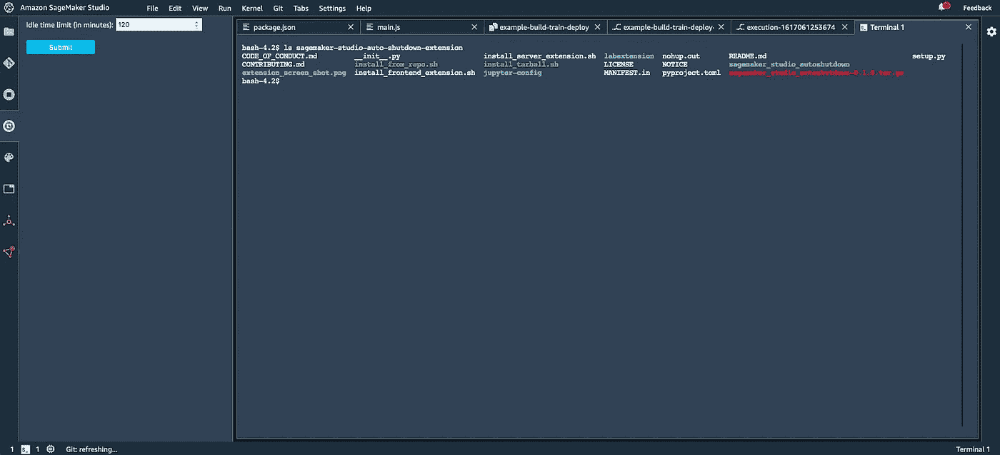
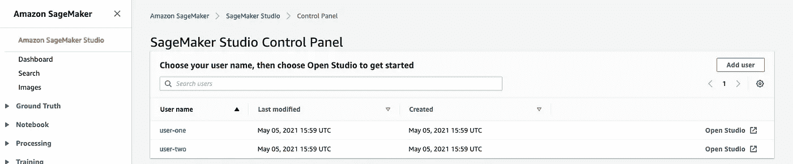
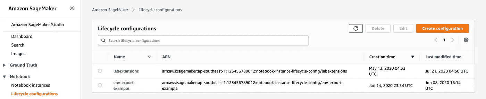
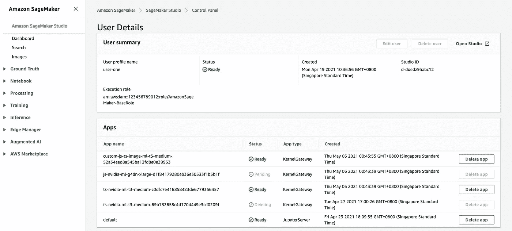
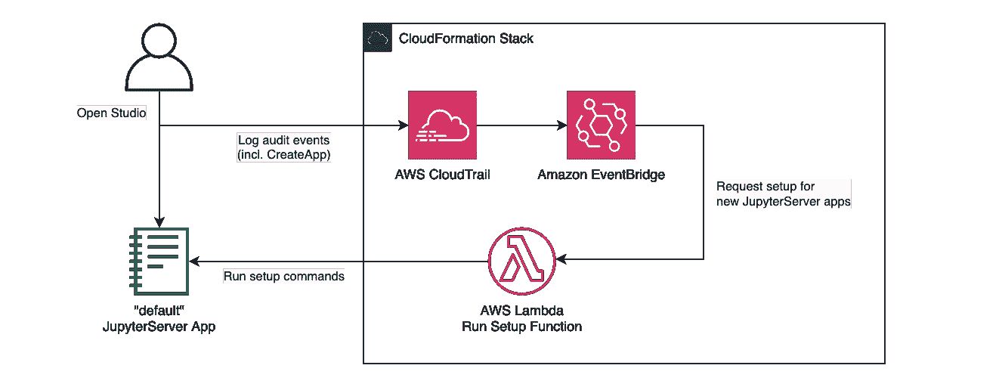

# 定制 SageMaker Studio

> 原文：<https://towardsdatascience.com/run-setup-scripts-automatically-on-sagemaker-studio-15222b9d2f8c?source=collection_archive---------7----------------------->

## 管理您团队的 SageMaker 笔记本的技巧，以及通过 Jupyter APIs 对自动化的深入探讨



安装了“自动关机”扩展的 Amazon SageMaker Studio 的屏幕截图

> **更新 2021–11–02:**好消息— SageMaker Studio 现在支持生命周期配置脚本！更多信息请参见[发布博客](https://aws.amazon.com/blogs/machine-learning/customize-amazon-sagemaker-studio-using-lifecycle-configurations/)、[开发者指南](https://docs.aws.amazon.com/sagemaker/latest/dg/studio-lcc.html)和[公开样本](https://github.com/aws-samples/sagemaker-studio-lifecycle-config-examples)。定制映像仍然是管理内核定制的首选，但配置脚本可以帮助完成一系列任务，包括本文中最初解决的使用扩展安装案例。

通过[亚马逊 SageMaker Studio](https://aws.amazon.com/sagemaker/studio/) ，AWS 提供了一种完全托管的云笔记本体验，被称为“第一个完全集成的机器学习开发环境”:基于流行的开源 [JupyterLab](https://jupyter.org/) ，但具有一系列扩展和集成，以加速云中的数据科学。

但是有经验的环境管理员会知道(尤其是在数据科学领域！)，了解托管服务有哪些选项可用于集中定制用户环境的配置或设置，而不会限制实验或工作效率，这一点很重要。

作为一名 ML 专家解决方案架构师，我在 AWS 工作时亲眼目睹了不同企业在这一领域的需求可能非常多样化:从实施合规性控制，到围绕特定的专用网络架构工作，甚至只是推出定制以改善用户体验。

在这篇文章中，我将:

*   首先简要回顾一下 SageMaker 架构的一些相关要点
*   然后回顾一些可用的标准配置选项，以及新 SageMaker Studio 与之前的 [SageMaker 笔记本实例](https://docs.aws.amazon.com/sagemaker/latest/dg/nbi.html)之间需要注意的一些重要差异
*   最后，介绍一种新颖的方法，您可以在 SageMaker Studio 用户配置文件上自动运行任意设置代码，以防您需要更多的灵活性！

# 引擎盖下:SageMaker 笔记本电脑的登录和存储

对于基本的访问控制，Studio 和 SageMaker 笔记本实例(nbi)都使用 AWS IAM 中的[角色进行基于角色的访问控制。NBI 或工作室的“用户配置文件”与特定的执行角色相关联，用户在登录笔记本时承担该角色及其权限。](https://docs.aws.amazon.com/IAM/latest/UserGuide/id_roles.html)

当第一次[设置 SageMaker Studio](https://docs.aws.amazon.com/sagemaker/latest/dg/gs-studio-onboard.html) 时，管理员选择 Studio“域”是否也通过 IAM 处理登录，或者通过 [AWS SSO](https://aws.amazon.com/single-sign-on/) 代替。

对于一个 IAM 域，任何识别出的 IAM 用户或身份，只要具有特定域&用户配置文件的[sage maker:CreatePresignedDomainUrl 权限](https://docs.aws.amazon.com/service-authorization/latest/reference/list_amazonsagemaker.html)，就可以生成一个预签名的 Url 来登录到该域&用户配置文件。这是在 SageMaker 的 AWS 控制台中单击“打开工作室”按钮时发生的事情——这也是 SageMaker 笔记本实例使用的相同过程(与`sagemaker:CreatePresignedNotebookInstanceUrl`权限略有不同)。



SageMaker 的 AWS 控制台中的 Studio 用户配置文件

对于配置了 SSO 身份验证的 Studio 域，用户改为通过 SSO 门户登录(甚至可能没有 AWS 控制台访问权限)，但在笔记本本身中运行代码时，仍将承担其用户配置文件的关联 IAM 角色的权限。

对于重启之间的持久存储，NBIs 在`/home/ec2-user-SageMaker`(Jupyter 根目录)挂载一个 [Amazon 弹性块存储](https://aws.amazon.com/ebs/) (EBS)卷。在 SageMaker Studio 中，为工作室“域”创建了一个单独的 [Amazon 弹性文件系统](https://aws.amazon.com/efs/) (EFS)。每个 Studio 用户配置文件在创建时都被分配了一个单独的 EFS 用户 ID，EFS 包含每个用户一个单独的顶级文件夹(命名为 EFS UID)，如 SageMaker 开发人员指南中的概述图[所示。](https://docs.aws.amazon.com/sagemaker/latest/dg/images/studio/studio-components.png)

因此，虽然 Studio 在文件存储方面带来了一些架构上的差异，并在经典的 SageMaker 笔记本实例上添加了一个新的身份验证选项；两者都允许我们使用执行角色对登录用户在笔记本中的操作进行细粒度控制，包括对以下内容的控制:

*   他们可以读取哪些源数据(比如通过 [s3:* IAM 动作](https://docs.aws.amazon.com/service-authorization/latest/reference/list_amazons3.html)读取不同的亚马逊 S3 存储桶或路径)
*   他们在 SageMaker 或其他服务上有什么能力(比如拒绝`sagemaker:DeleteFeatureGroup`保护共享资源)
*   他们可以启动哪些实例类型，以控制成本(使用 IAM *上的`sagemaker:InstanceTypes` *条件*动作*，如`sagemaker:CreateTrainingJob`或`sagemaker:CreateApp`
*   特定的[标签](https://docs.aws.amazon.com/general/latest/gr/aws_tagging.html)或 [VPC](https://docs.aws.amazon.com/vpc/latest/userguide/what-is-amazon-vpc.html) 设置是否在创建的资源上是强制性的
*   …还有许多其他的

# 自定义 SageMaker 笔记本实例设置

在经典情况下，管理员可以将 SageMaker 笔记本实例链接到一个[生命周期配置](https://docs.aws.amazon.com/sagemaker/latest/dg/notebook-lifecycle-config.html):它定义了在 NBI 首次创建和/或重新启动时执行的定制 shell 脚本。



[官方在线示例](https://github.com/aws-samples/amazon-sagemaker-notebook-instance-lifecycle-config-samples)展示了广泛的使用案例，包括:

*   启动一个监视进程，以便在 NBI 空闲了配置的时间后自动关闭它
*   将有用的 conda 或 pip 包安装到 SageMaker 提供的一个或多个内核环境中
*   在 EBS 装载上创建一个持久的基于 conda 的环境，以在重新启动之间保持库配置
*   安装 JupyterServer/JupyterLab 扩展或自定义其设置

…很明显这是一个非常灵活的工具，但仍然有一些限制:一个重要的限制是生命周期配置脚本必须在 5 分钟内完成，否则实例将无法启动——这可以通过使用 [nohup](https://en.wikipedia.org/wiki/Nohup) 作为后台进程启动长期运行的任务来解决。

由于笔记本实例与独立的基于 EBS 的存储是分开的，所以跨团队共享内核配置也是一个挑战:要求用户重启他们的实例来使用新的更新。

# 在 SageMaker 工作室，事情有点不同

SageMaker Studio 将运行笔记本内核从 JupyterServer 基础设施中分离出来，将两个进程容器化，并将运行容器称为“应用”。用户配置文件的“默认”或“JupyterServer”应用程序运行 Jupyter UI，而笔记本内核环境(或其他 UI 功能，如 [SageMaker Data Wrangler](https://docs.aws.amazon.com/sagemaker/latest/dg/data-wrangler.html) )运行在单独的应用程序中，这些应用程序可以独立启动和停止，或分配给不同的计算资源。

每次重新启动(或者用 Studio 的术语来说是“创建”)应用程序时，应用程序都会从受管容器映像中重新初始化，通常良好的做法是定期删除和重新创建应用程序，以获取更新的容器映像并使用安全补丁或功能更新。



AWS 控制台中的 SageMaker Studio 用户详细信息屏幕，显示用户正在运行的“应用程序”

利用这种容器化的设置，[定制映像功能](https://docs.aws.amazon.com/sagemaker/latest/dg/studio-byoi-create.html)为 Studio 带来了比 NBIs 更广泛的工具，用于管理和共享定制内核环境:管理员将内核注册为容器映像并进行版本控制，并在一个中心位置配置用户对它们的访问。

当然(就像在 SageMaker 笔记本实例上一样)，用户可以临时将额外的包安装到他们的内核，直到应用程序重启恢复默认环境——使用笔记本命令，如:

```
!pip install ***
# Or...
!conda install ***
```

由于域上的存储由集中的 EFS 文件系统支持，我们还可以构建集中的自动化来初始化或强制执行用户工作室环境中的某些内容:比如复制初始项目模板，或者强制同步一些共享的实用程序代码。例如，可以在 [Amazon EventBridge](https://aws.amazon.com/eventbridge/) 中设置一个规则，用 EFS root 访问权限触发一个 [Lambda 函数，将 starter 内容复制到新加入的用户的主文件夹中。](https://docs.aws.amazon.com/lambda/latest/dg/services-efs.html)

最后也是最重要的一点是:

> **【更新:2021–09 年不再真实，见** [**发布帖**](https://aws.amazon.com/blogs/machine-learning/customize-amazon-sagemaker-studio-using-lifecycle-configurations/) **】至少截至今天，SageMaker Studio 还没有直接相当于** [**的笔记本实例生命周期配置**](https://docs.aws.amazon.com/sagemaker/latest/dg/notebook-lifecycle-config.html) **内置。**

“默认的”JupyterServer UI 应用程序的容器由 SageMaker 维护，并在每次重新启动应用程序时刷新。因此，尽管管理员可以说已经改进了在 Studio 中管理内核环境(使用自定义映像)和控制用户内容(使用 EFS 集成)的选项，但我们仍然需要一种方法来在 JupyterServer 本身上运行自定义设置命令**然后再将其公开给用户。这将允许集中管理，例如:**

*   安装 JupyterLab 扩展
*   禁用文件下载选项(如本文[中针对 NBIs 的](https://ujjwalbhardwaj.me/post/disable-download-button-on-the-sagemaker-jupyter-notebook/)所述)
*   配置定制 git 或工件存储库设置

一种选择是将一个 shell 脚本加载到用户的主文件夹中(通过 EFS ),每次重启 JupyterServer 应用程序时，用户可以在“系统终端”中运行该脚本……当然，这取决于用户采取的行动。

**(2021–11 年更新)**自从在 Studio 中启动生命周期配置脚本以来，这些是为您的用户自动运行此类设置脚本的最简单和首选的方式。您可以找到一系列用例的[官方示例](https://github.com/aws-samples/sagemaker-studio-lifecycle-config-examples)，并为您的域中的哪些用户配置默认运行的脚本。在接下来的部分中，我将讨论一个比这个功能更复杂的解决方法，它可能在一些自动化边缘情况下仍然有意义，但是对于更直接的需求来说就不再需要了。

# 在 SageMaker Studio 上自动执行代码

利用 3 个关键组件，即使不使用生命周期脚本，我们也可以在 SageMaker Studio 中设置自动执行的脚本:

1.  Studio 基于 JupyterLab，这意味着经过认证的客户端可以利用公开记录的 [JupyterServer REST API](https://jupyter-server.readthedocs.io/en/latest/developers/rest-api.html) 和[Jupyter Client web socket API](https://jupyter-client.readthedocs.io/en/stable/messaging.html)来连接和运行命令——就像 UI web 客户端一样。
2.  对于**仅 IAM 认证的域**，SageMaker[CreatePresignedDomainUrl API](https://docs.aws.amazon.com/sagemaker/latest/APIReference/API_CreatePresignedDomainUrl.html)可以允许脚本登录到 Jupyter，假设客户端环境有权限。
3.  我们可以为“默认”/JupyterServer 应用程序捕获`sagemaker:CreateApp`事件，并使用这些事件来触发我们的客户端登录并运行设置命令。

虽然这种解决方案:

*   在脚本完成之前，无法显式阻止对环境的访问(请记住，NBI 生命周期配置脚本只能在 5 分钟内做到这一点)，并且
*   目前仅涵盖 IAM 认证的域(支持生成预先指定的 URL)

…它当然可以帮助我们自动运行设置代码，并为运行命令提供比静态脚本更具交互性、类似机器人流程自动化的界面。

作为一个具体的例子，我们将自动安装 [**SageMaker Studio 自动关机扩展**](https://github.com/aws-samples/sagemaker-studio-auto-shutdown-extension)——一个用于成本管理的 JupyterLab 扩展。

我最初为这个扩展贡献了*自动安装程序*解决方案，基于同样的方法:所以我们将在这篇文章中浏览代码片段，但是你可以参考 GitHub 中的[自动安装程序来获得完整的上下文(以及任何更新！).对于在生产中安装扩展的更简单的方法，您现在可以参考为它发布的特定的](https://github.com/aws-samples/sagemaker-studio-auto-shutdown-extension/tree/237ac95d84c3ca00c7f6a7aa61e2f10238f49504/auto-installer) [Studio 生命周期配置示例](https://github.com/aws-samples/sagemaker-studio-lifecycle-config-examples)。

## 步骤 1:登录 Jupyter

许多编程语言支持 HTTP、WebSockets 和一个[AWS SDK](https://aws.amazon.com/tools/)；但是我们将用 Python 演示一个客户机，因为它可能为许多 Jupyter/SageMaker 用户所熟悉。

客户端代码将在某种可以访问 AWS API 的环境中运行:无论是 Lambda 函数(通过函数的执行角色)，在本地笔记本电脑上测试(通过您的 [AWS CLI](https://docs.aws.amazon.com/cli/latest/userguide/cli-chap-install.html) 登录)，还是在其他地方。

只要您的环境拥有 sagemaker:CreatePresignedDomainUrl IAM 权限，我们就能够调用这个 API(通过 [Boto3](https://boto3.amazonaws.com/v1/documentation/api/latest/reference/services/sagemaker.html) ，Python 的 AWS SDK)来请求一个预签名的 Url，以作为目标用户进行身份验证:

```
smclient = boto3.client("sagemaker")
sagemaker_login_url = smclient.create_presigned_domain_url(
    DomainId=domain_id,
    UserProfileName=user_profile_name,
)["AuthorizedUrl"]
```

…然后我们可以简单地**获取**预先签名的 URL 来登录——注意将我们的请求链接到一个**会话**,这样任何需要的 cookies 都会为将来的请求保存下来。

```
import requests
reqsess = requests.Session()
login_resp = reqsess.get(sagemaker_login_url)
```

简单！这个过程与在浏览器中从 AWS 控制台单击“Open Studio”按钮是一样的:如果您的控制台用户有足够的权限，您的浏览器将被重定向到一个预先签名的 URL，该 URL 设置 cookies 和本地存储来初始化 Jupyter 会话。

然而，有可能 JupyterServer 应用程序之前没有运行或者还没有准备好。我们可以实施一个轮询检查，看看我们是否真的被重定向到 Jupyter，或者只是一个加载屏幕——如果需要，轮询“默认”应用程序的状态，直到它启动:

```
base_url = sagemaker_login_url.partition("?")[0].rpartition("/")[0]
api_base_url = base_url + "/jupyter/default"# Using XSRF as a proxy for "was Jupyter ready":
if "_xsrf" not in reqsess.cookies:
    app_status = "Unknown"
    while app_status not in {"InService", "Terminated"}:
        time.sleep(2)
        app_status = reqsess.get(
            f"{base_url}/app?appType=JupyterServer&appName=default"
        ).text
    ready_resp = reqsess.get(api_base_url)
```

## 步骤 2:打开系统终端

Jupyter 既使用 REST APIs(用于请求/响应类型的操作，比如与正在运行的内核列表或工作区中的内容进行交互)，也使用 WebSocket APIs(用于流式连接，比如终端窗口或笔记本内核本身)。

在我们的例子中，我们希望在系统终端中运行一些命令——所以首先需要通过下面的 [REST API](https://jupyter-server.readthedocs.io/en/latest/developers/rest-api.html) 创建终端。注意，遵循一个通用的[模式来防止跨站点请求伪造](https://cheatsheetseries.owasp.org/cheatsheets/Cross-Site_Request_Forgery_Prevention_Cheat_Sheet.html) (CSRF/XSRF)，API 要求我们在任何状态改变请求(比如 POST、PUT、DELETE)中传递一个来自会话 cookies 的令牌，而不是只读请求(比如 GET):

```
terminal = reqsess.post(
    f"{api_base_url}/api/terminals",
    params={ "_xsrf": reqsess.cookies["_xsrf"] },
).json()terminal_name = terminal["name"]
```

我们的终端会话现在已经创建好了，可以通过 WebSocket API 进行连接了。在本例中，我们将为此使用单独的[web socket-client](https://pypi.org/project/websocket-client/)Python 库，因此需要从基于[请求](https://pypi.org/project/requests/)的 REST 会话中复制 cookies:

```
import websocketws_base_url = \
    f"wss://{api_base_url.partition('://')[2]}/terminals/websocket"
cookies = reqsess.cookies.get_dict()ws = websocket.create_connection(
    f"{ws_base_url}/{terminal_name}",
    cookie="; ".join(["%s=%s" %(i, j) for i, j in cookies.items()]),
)
```

## 步骤 3:运行命令

Jupyter 用于终端的 WebSocket API 比用于笔记本内核的[更简单](https://jupyter-client.readthedocs.io/en/stable/messaging.html):消息是 JSON 编码的 2-list(类型，内容)。接收初始“设置”消息；此后，该连接类似于[标准终端流](https://en.wikipedia.org/wiki/Standard_streams)。客户端接收类型为`stdout`或`stderr`的文本消息，并可以发送作为`stdin`的文本输入。

重要的是要认识到，我们在这里做的是通过终端交互式地运行命令——这与在脚本中执行命令不太一样(尽管我们可以通过 [/contents REST API](https://jupyter-server.readthedocs.io/en/latest/developers/rest-api.html#post--api-contents-path) 将脚本文件作为文本发布，然后通过终端执行该文件来获得这种效果)。

对于每个命令，终端没有“成功或失败”的内置概念(比如退出代码)…甚至当一个命令完成时:只是在屏幕上输出文本，用户通过`stdin`输入。

对于一个基本的开始，我们可以通过`stdin`发送一个命令(带有一个尾随的换行符，就好像用户在输入之后按了 enter 然后继续监听终端输出，直到我们看到类似于下一个命令提示符的内容(使用正则表达式)。这样，客户端可以等到系统准备就绪后再发出下一个命令:

```
COMMAND_SCRIPT = [
    "git clone https://github.com/aws-samples/sagemaker-studio-auto-shutdown-extension.git",
    "pwd && ls",
    "cd sagemaker-studio-auto-shutdown-extension && ./install_tarball.sh",
]
prompt_exp = re.compile(r"bash-[\d\.]+\$ $", re.MULTILINE)for ix, c in enumerate(COMMAND_SCRIPT):
    ws.send(json.dumps(["stdin", c + "\n"])) while True:
        res = json.loads(ws.recv())
        if res[0] == "stdout" and prompt_exp.search(res[1]):
            # Ready for next command
            break
        time.sleep(0.1)
```

您可以使用其他检查来扩展这一点，根据特定命令的预期结果，从控制台输出中确定命令是“成功”还是“失败”。

## 第四步:自动执行

一旦我们有了工作的基本程序，最后一步就是打包客户端代码，并在我们希望它运行时自动触发它。对于启动 Studio Jupyter 容器的自动化设置，这将意味着在 SageMaker[create app](https://docs.aws.amazon.com/sagemaker/latest/APIReference/API_CreateApp.html)API 事件上运行应用类型`JupyterServer`。

在撰写本文时，应用程序状态的变化没有反映在[直接 SageMaker EventBridge 集成](https://docs.aws.amazon.com/sagemaker/latest/dg/automating-sagemaker-with-eventbridge.html)中。相反，您可以启用 [AWS CloudTrail](https://aws.amazon.com/cloudtrail/) 审计日志来捕获事件，然后使用 EventBridge 规则来触发相应的 [SageMaker CloudTrail 事件](https://docs.aws.amazon.com/sagemaker/latest/dg/logging-using-cloudtrail.html)。



显示由 SageMaker CreateApp 上的 EventBridge 和 CloudTrail 触发的 Lambda 函数的架构

在上面显示的简单示例中，我们将上面的客户端代码作为 Python Lambda 函数运行——尽管也有其他选项。

这引入了所有命令必须在 15 分钟[最大 Lambda 函数超时](https://docs.aws.amazon.com/lambda/latest/dg/gettingstarted-limits.html)内发送的约束，这将**也**包括等待应用/容器启动所花费的任何时间。这是因为 CreateApp API 调用是在完成时记录的，而不是在请求的应用程序变为“正在运行”时记录的。

实际上，这个时间限制可能不成问题:

1.  长期运行的设置总是可以作为脚本上传，并使用 [nohup](https://en.wikipedia.org/wiki/Nohup) 运行，就像经典的笔记本实例生命周期配置脚本一样。
2.  有了这个解决方案，人类用户已经可以在客户端**开始**运行命令的同时访问环境——所以我们无论如何都需要保持最关键的设置动作快速。

# 回顾

虽然亚马逊 SageMaker classic Notebook 实例中的配置定制主要限于“生命周期配置”外壳脚本，但 SageMaker Studio 有一些更广泛的选项可用于共享和管理内核环境(使用[自定义映像](https://docs.aws.amazon.com/sagemaker/latest/dg/studio-byoi.html)功能)和集中管理用户内容(通过 root 访问挂载共享的 EFS 文件系统，并操纵用户的个人文件夹)。

Studio 现在也支持生命周期配置脚本，这些对于需要定制核心 JupyterLab 平台本身的设置用例特别有用。尽管这些脚本可以为一系列任务提供简单的解决方案，但是记住管理用户内核和文件系统内容的其他选项是很有用的。

在本演练和开源 [SageMaker Studio 自动关机扩展](https://github.com/aws-samples/sagemaker-studio-auto-shutdown-extension)的原始[自动安装功能](https://github.com/aws-samples/sagemaker-studio-auto-shutdown-extension/tree/237ac95d84c3ca00c7f6a7aa61e2f10238f49504/auto-installer)中，我们展示了一种替代方法，您可以在新启动的 SageMaker Studio“默认”(UI)应用程序上自动运行安装命令:使用 Jupyter 的底层 API。

类似的触发器可以应用于运行外壳代码以响应不同的事件，相应的[笔记本内核 API](https://jupyter-client.readthedocs.io/en/stable/messaging.html)同样可以用于自动和交互地运行笔记本(或内核环境中的其他代码)。

正如解决方案所展示的，SageMaker[CreatePresignedDomainUrl](https://docs.aws.amazon.com/sagemaker/latest/APIReference/API_CreatePresignedDomainUrl.html)或[CreatePresignedNotebookInstanceUrl](https://docs.aws.amazon.com/sagemaker/latest/APIReference/API_CreatePresignedNotebookInstanceUrl.html)API 上的权限足以授予在这些环境上登录和代码执行的权限:因此，在授予这些权限时，一定要应用最小权限原则！出于同样的原因，如果考虑参数化 Lambda 函数运行的命令序列，您应该仔细评估您的信任架构。

要了解更多信息，您可能还想查看:

*   [SageMaker 开发者指南](https://docs.aws.amazon.com/sagemaker/latest/dg/studio.html)，了解关于设置 SageMaker Studio 和其他 SageMaker 特性的详细信息
*   [定制图像样本库](https://github.com/aws-samples/sagemaker-studio-custom-image-samples)，用于打包定制内核环境以在 Studio 中使用的示例
*   [安全数据科学参考架构示例](https://github.com/aws-samples/secure-data-science-reference-architecture)，了解更多参考模式——其中一些更面向 SageMaker 笔记本实例，但在许多情况下也可转移到 Studio
*   …以及新的 [Amazon SageMaker 节约计划](https://aws.amazon.com/savingsplans/ml-pricing/)，该计划提供灵活的节约，可将您的成本降低高达 64%,以换取一年或三年的使用承诺(以美元/小时计)——即使您使用不同的实例类型和 AWS 区域，也具有灵活性！

我希望你发现这些想法有用，并觉得更好地解决自己的 SageMaker 笔记本管理需求！