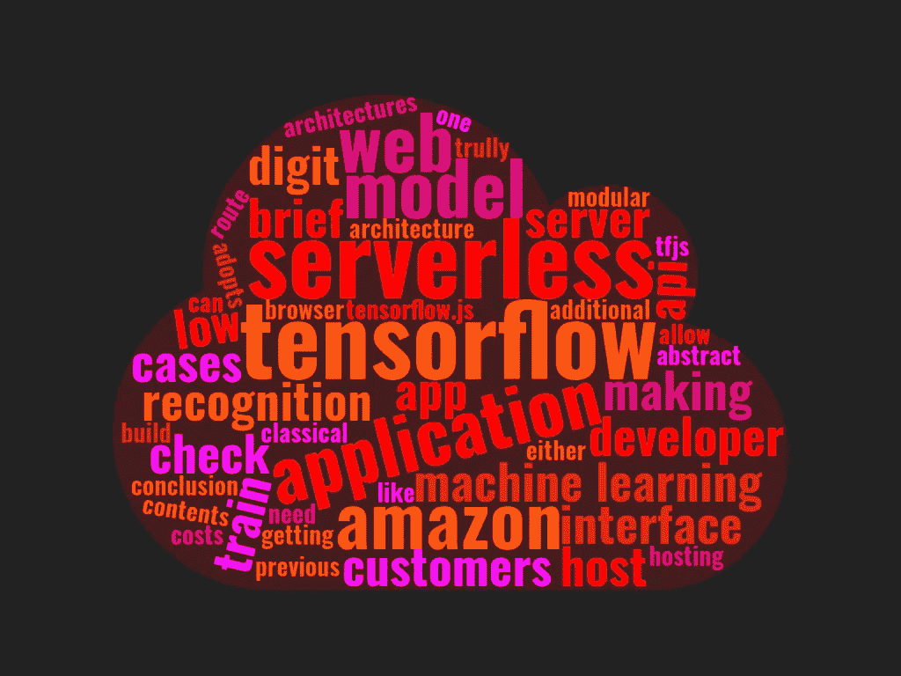
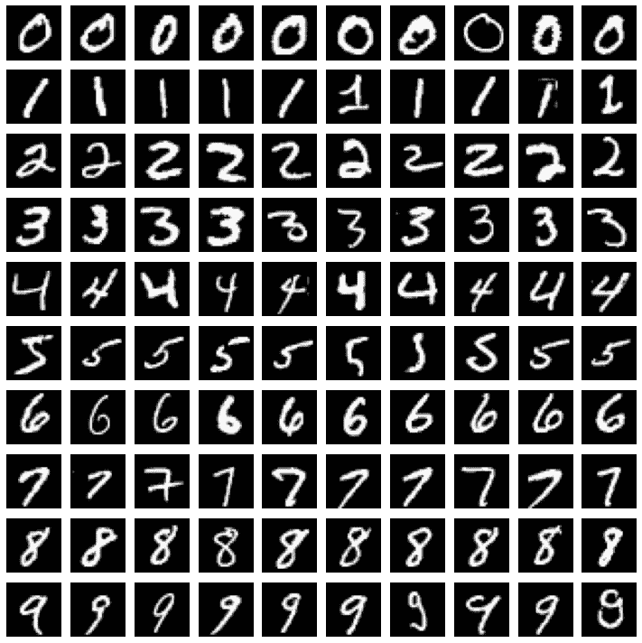
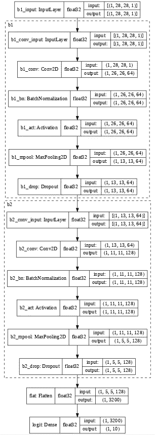
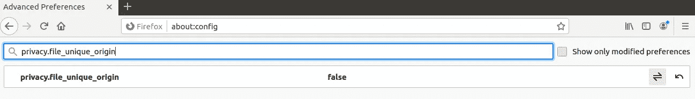
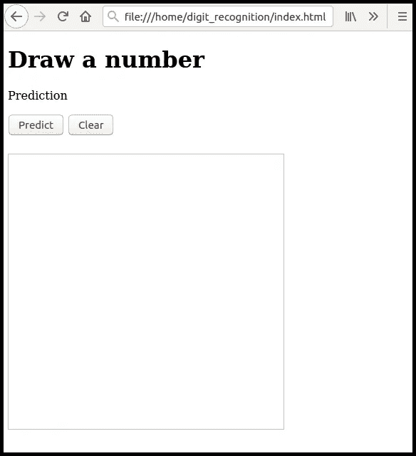
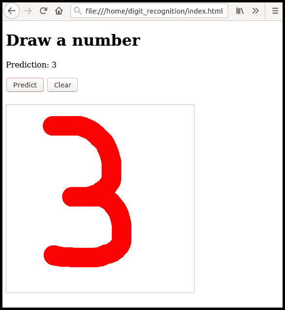
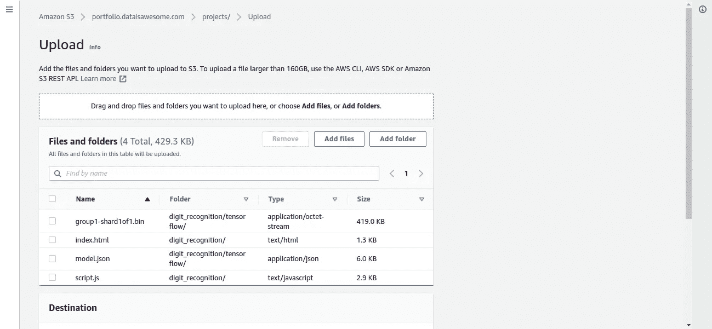
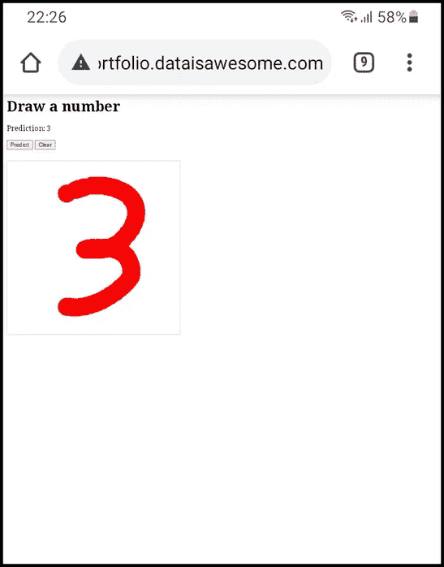

# 在浏览器中运行张量流模型

> 原文：<https://towardsdatascience.com/run-tensorflow-models-in-the-browser-84280b3c71ad?source=collection_archive---------26----------------------->

## 如何用 TFJS 和亚马逊 S3 无服务器托管机器学习模型



图片由作者使用[wordclouds.com](https://www.wordclouds.com/)生成。

# 目录

1.  介绍
2.  用 TensorFlow 训练数字识别模型
3.  在 S3 用 TensorFlow.js 托管模型
4.  结论
5.  参考

# 介绍

要让您的客户可以使用机器学习模型，需要通过应用程序编程接口(API)或图形界面(如 Web 应用程序(Web App))来访问它。

API 和 Web 应用程序都需要服务器来提供运行它们的计算需求。对于大多数用例，这个服务器是由开发人员配置和维护的，但在某些情况下，它不需要这样做。

无服务器架构允许开发人员从架构和维护中抽象出来，这样他们就可以真正专注于开发和改进他们的模型。与传统服务器相比，无服务器计算具有更多优势，例如:

1.  如果您的应用程序不经常使用(客户数量少，或频率低)，则成本较低。
2.  自动将模型从几个用户扩展到几千个用户。
3.  提高可重用性，因为无服务器通常采用模块化方法。

在本帖中，我们将介绍如何训练 Tensorflow 模型进行数字识别，并使其以无服务器的方式可用。

关于 Tensorflow 建模的简要介绍，请查看我之前的帖子[“tensor flow 入门”](/getting-started-with-tensorflow-e33999defdbf)。如果你想找一份关于 S3 无服务器托管的简介，看看这篇[“用亚马逊 S3 和 53 号公路建立一个无服务器网站”](/build-a-serverless-website-using-amazon-s3-and-route-53-c741fae6ef8d)。

# 用 TensorFlow 训练数字识别模型

在本节中，我们将使用通过 TensorFlow 库提供的 MNIST 数据集来训练一个简单的数字识别模型。

要加载数据集，请在笔记本的第一个单元格中键入以下内容。

这将显示训练数据输入(tx)和目标(ty)以及验证数据输入(vx)和目标(vy)的形状。

```
tx:(60000, 28, 28, 1), ty:(60000,) 
vx:(10000, 28, 28, 1), vy:(10000,)
```

现在，让我们为每个数字显示一组 10 个样本图像，以了解数据的样子。

这将生成下面的图像网格。请注意，该图像具有黑色背景和白色前景。这将与稍后定义我们的画布来绘制数字相关。



通过 TensorFlow 库提供的 MNIST 数据集中每个数字的图像样本集。图片由作者提供。

对于视觉模型，让我们从定义卷积构建模块开始。该模块将包括卷积、批量标准化、relu 激活、最大汇集和漏失层。

我们的完整网络将由 2 个“normConvBlock”组成，随后是一个扁平化层，最后是一个 softmax 激活的致密层。

为了训练模型，我们可以使用“亚当”优化器和分类交叉熵损失。在这个例子中，我们将使用“稀疏分类交叉熵”,因为我们的目标数据是顺序编码的。

将显示以下模型结构。



提议的模型架构。该模型由两个“normConvBlock”层组(b1，b2)组成，后面是平坦层和致密层。图片由作者提供。

我们现在准备训练我们的模型。为此，我们可以简单地用上面定义的处理过的数据调用“model.fit”。为了确保我们得到最佳的模型迭代，让我们如下定义一个早期停止回调。

令人惊讶的是，我们刚刚训练了一个模型来识别个位数！对于这个例子来说，模型的精确度已经足够好了(验证集的精确度约为 99%)。如果您需要更精确的模型，请更改模型结构或执行某种类型的数据扩充。

```
Epoch 11/20 59/59 [==============================] - 3s 50ms/step - loss: 0.0317 - acc: 0.9906 - val_loss: 0.0338 - **val_acc: 0.9899** Epoch 12/20 59/59 [==============================] - 3s 50ms/step - loss: 0.0292 - acc: 0.9913 - val_loss: 0.0496 - val_acc: 0.9823 Epoch 13/20 59/59 [==============================] - 3s 50ms/step - loss: 0.0275 - acc: 0.9918 - val_loss: 0.0422 - val_acc: 0.9866
```

## 完整脚本

如需完整的脚本，请点击以下链接进入我的 Github 页面:

[](https://github.com/andreRibeiro1989/medium/blob/main/tensorflowjs/digit_recognition/tensorflow_js_training.ipynb) [## 安德里贝罗 1989/中号

### tensor flow js/digit _ recognition/tensor flow _ js _ training . ipynb

github.com](https://github.com/andreRibeiro1989/medium/blob/main/tensorflowjs/digit_recognition/tensorflow_js_training.ipynb) 

或者通过以下链接直接访问 Google Colab 笔记本:

[](https://colab.research.google.com/github/andreRibeiro1989/medium/blob/main/tensorflowjs/digit_recognition/tensorflow_js_training.ipynb) [## 谷歌联合实验室

### tensorflow_js_training.ipynb

colab.research.google.com](https://colab.research.google.com/github/andreRibeiro1989/medium/blob/main/tensorflowjs/digit_recognition/tensorflow_js_training.ipynb) 

# 在 S3 用 TensorFlow.js 托管模型

在这一节中，我们将开发最简单的 HTML + Javascript 组件来与 TensorFlow.js 模型接口。

TensorFlow.js 是一个完全在浏览器中训练和运行机器学习模型的开源库，通过高级 API 使用 Javascript。

## 将模型从 TensorFlow 转换为 TensorFlow.js

要在浏览器中托管 TensorFlow 模型，我们需要执行的第一步是将其转换为 TensorFlow.js 模型。为此，我们只需从 tensorflowjs 库中调用' tensorflowjs . converters . save _ keras _ model'。

如果使用 Colab **将文件下载到您的本地机器以备后用**。

## 使用 HTML 和 JavaScript 创建 web 界面

让我们首先为我们的 web 应用程序创建文件夹结构。首先创建一个名为“digit_recognition”的主文件夹，并在其中创建两个名为“index.html”和“script.js”的文件。

此外，在“digit_recognition”中创建一个名为“tensorflow”的文件夹。将我们从 Colab 笔记本下载的两个文件“group1-shard1of1.bin”和“model.json”复制到这个新文件夹中。

您的文件夹结构应该如下所示:

```
- digit_recognition/
  - index.html
  - script.js
  - tensorflow/
    - group1-shard1of1.bin
    - model.json
```

**T3【Index.html】T5**

用任何代码编辑工具打开 index.html 文件，并将以下代码复制到其中。这个脚本定义了绘制一个数字并使用训练好的模型识别它的基本组件。

现在让我们来剖析上面的代码。

*   第 3 行到第 11 行定义了 html 文件的头。在这里，我们加载必要的 TensorFlow.js 库。
*   第 23 行创建了一个按钮，我们将使用它来调用模型推理函数(' predictModel ')。当按钮被按下时，模型将被触发，预测结果显示在

    标签中。

*   第 26 行创建了一个清除画布的按钮(“erase”)。
*   第 31 行定义了一个 canvas 对象，它将允许我们绘制一个数字，供我们训练过的模型稍后识别。
*   第 35 行来源于“script.js”文件，该文件包含 JavaScript 逻辑，用于将画布中的数据转换为张量，并对其应用模型。

***script . js***

使用任何代码编辑工具打开 script.js 文件，并开始添加以下代码片段。

1.  定义我们在这个脚本中需要的主要变量。

2.为不同的用户操作定义画布触发器。

在“鼠标按下”(点击并按住)时，脚本被触发以启动绘图过程并记录当前的鼠标/触摸位置。在“鼠标移动”时，脚本开始在画布上绘制。在“mouseup”(释放点击)时，脚本被触发以停止绘图过程。

3.检查设备是否支持触摸。这是在“设置位置”功能中选择正确事件所必需的。

4.设置接合(开始绘制)和分离(停止绘制)标志。

5.记录鼠标/触摸位置。请注意，我们需要知道设备是否支持触摸。

6.定义要在画布上绘制的主函数。

“拖动”标志定义了用户是“参与”还是“脱离”(第 8 行)。如果接通，在通过“设置位置”获得的过去记录的位置和当前位置之间画一条线(第 18 至 21 行)。

7.定义清除画布的函数。

8.定义加载张量流模型的函数。

“tf.loadLayersModel”函数从 url 或本地目录加载模型(第 5 行)。因为对于第一次预测，模型必须初始化权重，所以通常建议预热模型以防止第一次预测期间的延迟(第 8 行)。

9.定义从画布中获取当前数据的函数。

10.定义模型推理的函数。

“getData”从画布中加载数据(第 5 行)。' tf.browser.fromPixels '将画布数据转换为张量(第 8 行)。' tf.image.resizeBilinear '将图像从画布大小调整到模型大小(第 11 行)。' model.predict '获取模型预测(第 14 行)。第 17 行将概率最高的数字‘y . arg max(1)’设置到

标签中。

## 在本地测试模型

出于安全原因，浏览器限制从脚本发起的跨来源 HTTP 请求。这意味着 web 应用程序只能从加载应用程序的同一来源请求资源，除非来自其他来源的响应包含正确的跨来源资源共享(CORS)标头。

要在 Chrome / Chromium 中实现这一点，您可以安装“Moesif CORS”扩展。然而，这仍然会限制本地资源的加载。在本教程中，我们将使用火狐代替。

要在 Firefox 中允许 CORS，在 Firefox 搜索栏中键入“about:config ”,在新的搜索栏中键入“privacy.file_unique_origin ”,并将默认值更改为“false”。



火狐配置界面。图片由作者提供。

现在在 Firefox 中打开“index.html”文件，方法是双击文件名并选择“用 Firefox 打开”，或者将文件拖到 Firefox 窗口中。您将看到以下登录页面。



我们 web 应用程序的登录页面。图片由作者提供。

到目前为止，这不是最漂亮的网络应用，但它确实有用。现在，让我们通过绘制一个数字并单击预测按钮来测试该模型。



模型预测。图片作者。

太好了。我们的模型在本地有效！下一步是将网络应用推向像亚马逊 S3 这样的无服务器平台。

## 在亚马逊 S3 托管 web 应用程序

要托管我们的 web 应用程序，您首先需要创建一个亚马逊 S3 桶，并将其设置为静态 web 托管。如果你想快速了解如何做到这一点，请查看我之前的帖子[“使用亚马逊 S3 和 53 号公路建立一个无服务器的网站”](/build-a-serverless-website-using-amazon-s3-and-route-53-c741fae6ef8d)。

为了使我们新的无服务器 web 应用程序可用，我们只需要将文件推送到 S3。确保您推送整个项目文件夹“digit_recognition”。



上传网络应用到 S3。图片由作者提供。

我们现在可以在任何设备上使用任何浏览器测试应用程序(因为所有资源现在都在同一个来源，我们不需要激活 CORS 请求)。

为此，如果您有与您的 S3 桶相关联的域，请访问*http://DOMAIN/projects/digit _ recognition/index . html*，如果没有，请访问*https://S3 . eu-west-1 . amazonaws . com/DOMAIN/projects/digit _ recognition/index . html*。



使用移动触摸设备的模型预测。图片由作者提供。

## 完成脚本

完整的“index.html”和“script.js”脚本请点击下面的链接。在这次回购中，我还包括了一个使用 bootstrap 4 的更好看的应用程序(“index_mobile.html”和“script_mobile.js”)。

[](https://github.com/andreRibeiro1989/medium/tree/main/tensorflowjs/digit_recognition) [## 安德里贝罗 1989/中号

### tensor flow js/digit _ recognition/

github.com](https://github.com/andreRibeiro1989/medium/tree/main/tensorflowjs/digit_recognition) 

有关原始和引导 web 应用程序的演示，请点击以下链接:

[http://portfolio . dataisawesome . com/projects/digit _ recognition/index . html](http://portfolio.dataisawesome.com/projects/digit_recognition/index.html)(桌面、移动)

[http://portfolio . dataisawesome . com/projects/digit _ recognition/index _ mobile . html](http://portfolio.dataisawesome.com/projects/digit_recognition/index_mobile.html)(手机)

# 结论

使用无服务器计算允许您在不管理 web 服务器的情况下扩展应用程序，同时保持低成本。

在本教程中，我们探讨了如何使用 TensorFlow.js 和亚马逊 S3 以无服务器方式托管 TensorFlow 模型。要了解如何使用 TensorFlow.js 的更多信息，请确保查看 TensorFlow.js 官方页面中提供的[教程](https://www.tensorflow.org/js/tutorials)。

# 参考

[1]no nica Fee，"*什么是无服务器架构？主要优势和限制*(2020 年 8 月)
[https://new relic . com/blog/best-practices/what-is-server less-architecture](https://newrelic.com/blog/best-practices/what-is-serverless-architecture)

[2][https://www.tensorflow.org/datasets/catalog/mnist](https://www.tensorflow.org/datasets/catalog/mnist)

[3]乔什·戈登和萨拉·罗宾逊，《TensorFlow.js 简介:Javascript 中的机器学习》(2018 年 3 月)
[https://medium . com/tensor flow/Introducing-tensor flow-js-Machine-Learning-in-Javascript-BF 3 eab 376 db](https://medium.com/tensorflow/introducing-tensorflow-js-machine-learning-in-javascript-bf3eab376db)