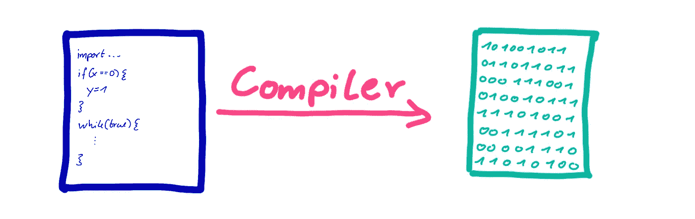
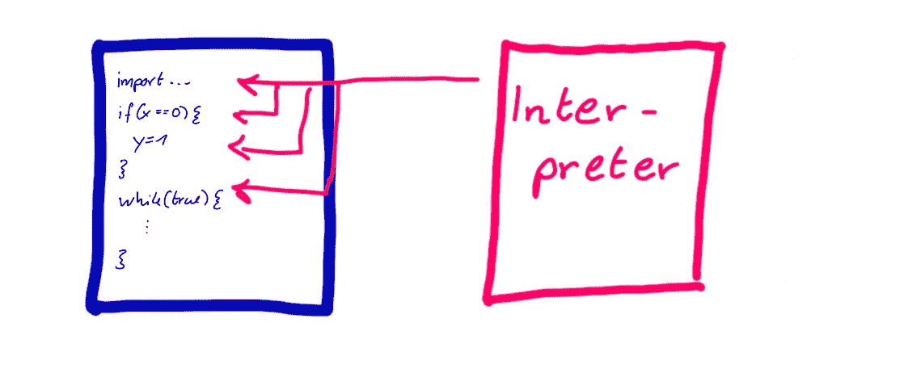
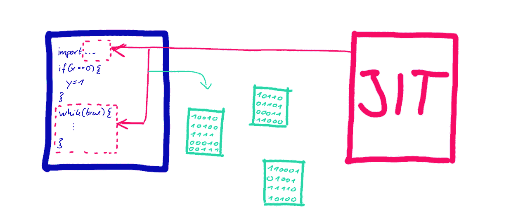

# 像 C 语言一样快速运行您的 Python 代码

> 原文：<https://towardsdatascience.com/run-your-python-code-as-fast-as-c-4ae49935a826?source=collection_archive---------0----------------------->

## 如何在不做任何改变的情况下提高 python 代码的性能。

图片由来自 Pixabay 的 Onur mer Yavuz 提供

作为一名博士研究员，我的工作至关重要的一点是快速编写一个想法，看看它是否可行。 *Python* 是实现这一点的优秀工具。它允许专注于想法本身，而不是被样板代码和其他乏味的事情所困扰。

然而， *Python* 有一个很大的缺点:**它比像 *C* 或者 *C++* 这样的编译语言要慢很多。**那么，在我们通过构建一个 *Python* 原型测试了一个想法之后，现在我们想把它变成一个快速且高性能的工具，我们该怎么做呢？大多数情况下，我们最终会做两倍的工作，手动将 *Python* 代码转换成 *C* 。如果我们的 *Python* 原型本身能够运行得更快，那不是很好吗？所有花在实现每件事情两次上的时间可以用来做更有意义和有趣的事情。

幸运的是，我偶然发现了问题的解决方案: ***PyPy* ，这是 *Python* 的快速替代方案。**

为了说明 *PyPy* 可以提供多大的加速，我在下面的例子中运行了默认的 *Python* 解释器和*PyPy py*:

基本上，该脚本在一个循环中将 0 到 100，000，000 之间的所有整数相加，并在完成时打印一条消息和脚本的运行时。

尽管这不是一个科学的评价，但这个生动的例子仍然令人振奋。与默认的 *Python* 解释器(大约需要 10 秒)相比， **PyPy 在 0.22 秒后就完成了它的执行！**另外，请注意，我们可以直接将我们的 *Python* 代码输入到*pypypy*中，不做任何修改。当你把它与速度大师 *C* 相比时，这个结果会更加令人印象深刻。在我的电脑上， *C* 中的等效实现需要 0.32 秒。虽然总体来说 C 依然是速度大师， **PyPy 在某些情况下也能打败 C。**

> "如果你想让你的代码神奇地运行得更快，你也许应该使用 PyPy . "
> —吉多·范·罗苏姆(Python 的创造者)
> 来源:[youtu.be/2wDvzy6Hgxg?t=1012](https://youtu.be/2wDvzy6Hgxg?t=1012)

当我们的程序无论如何都很快时，或者当大部分运行时间用于调用非 python 库时，PyPy 就不那么有效了。然而，如果我们有一个很慢的程序，大部分时间花在执行 *Python* 代码上， *PyPy* 可以创造奇迹。

# PyPy 为什么这么快？

这是你可能会问自己的问题，如果你是第一次被 *PyPy* 绊倒，这是理所当然的。开始时，这看起来像是魔法。我们运行完全相同的代码，用 *PyPy* 获得了看似免费的巨大加速。

虽然代码完全相同，但是代码的执行方式却有天壤之别。 *PyPy 的*性能提升背后的秘密是**实时编译，简称 JIT 编译**。

但是让我们慢慢来。

## 超前编译

像 C、C++这样的编程语言，还有 Swift、Haskell、Rust 等等都是提前编译的。这意味着在你用那些语言写了一些代码之后，你点击一个按钮，编译器将源代码转换成机器可读的代码，可以被一个特定的计算机架构读取。每当程序执行的时候，你的原始源代码早就没了。执行的只是机器码。

提前编译将源文件转换为机器码。

## 语言解释

*Python* ， *JavaScript* ， *PHP* ，类似的语言则采取了不同的方式。它们被解释。与将源代码转换成机器码相比，源代码保持不变。每次程序运行时，解释器逐行“查看”代码并为我们运行。

解释器逐行运行程序。

在 JavaScript 的例子中，每个网络浏览器都内置了一个解释器。标准的 *Python* 解释器叫做 *CPython。*然而，区分语言 *Python* 和运行我们代码的东西 *CPython* 是非常重要的。这是因为我们可以拥有完全不同的工具，都具有运行 *Python* 代码的能力。这就是 PyPy 进入画面的地方。

## 即时编译

*PyPy* 是利用即时编译的 *Python* 的替代实现。正在发生的是 *PyPy* 像解释器一样直接从源文件中运行我们的 *Python* 代码。然而， *PyPy* 并不是一行一行地运行代码，而是在执行代码之前将部分代码编译成机器码，可以说*只是在时间上*。

JIT 编译结合了提前编译和解释。

从这个意义上说，JIT 编译是解释和提前编译的结合。我们获得了提前编译的性能提升，以及解释语言的灵活性和跨平台可用性。

# 你如何从 PyPy 中获益？

既然我们已经理解了 *PyPy* 是如何实现惊人的性能提升的，我们就想使用它。 *PyPy* 在[pypy.org](https://www.pypy.org/)免费提供，安装简单。除了工具本身之外，该网站还包含大量关于微调 python 程序以进一步提高性能的提示和技巧。由于 *PyPy* 只是 *Python* 的替代实现，大多数时候它只是开箱即用，无需对您的 *Python* 项目做任何更改。它完全兼容 web 框架 *Django* ，科学计算包 *Numpy* 和众多其他包。它节省了我无数的用 C 重新实现原型的时间，我不想在我的编程工具包中错过它。

觉得这个故事有趣？你可以在这里成为灵媒会员来支持我的写作:[medium.com/@mmsbrggr/membership](https://medium.com/@mmsbrggr/membership)。你将获得所有媒体的访问权，你的部分会员费将直接支持我的写作。

欢迎在 LinkedIn 上向我提出私人问题和评论。如果你喜欢这篇文章，让我告诉你我的时事通讯:[marcelmoos.com/newsletter](https://marcelmoos.com/newsletter)。

</make-your-neural-net-confuse-dogs-with-pelicans-af7ad6ec95a5> 