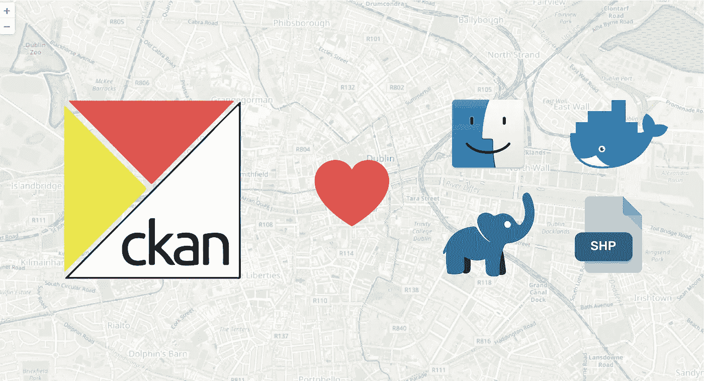
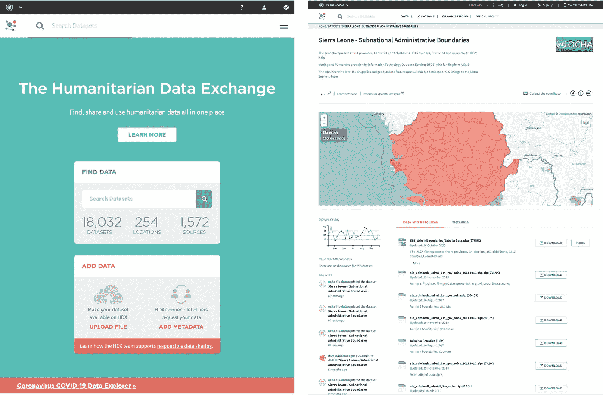
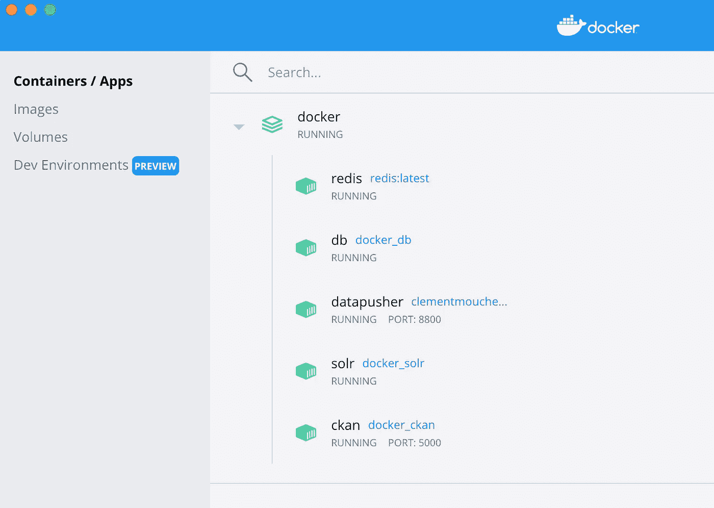
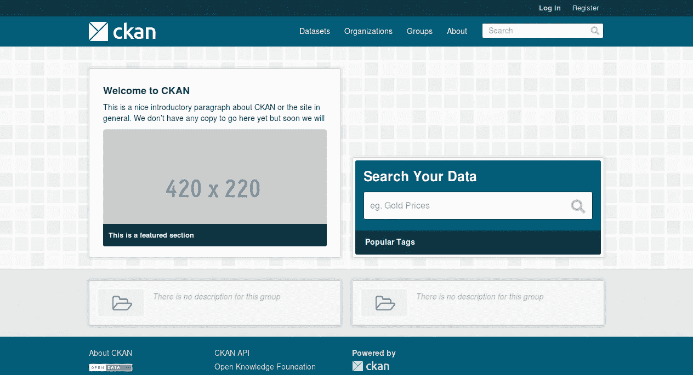
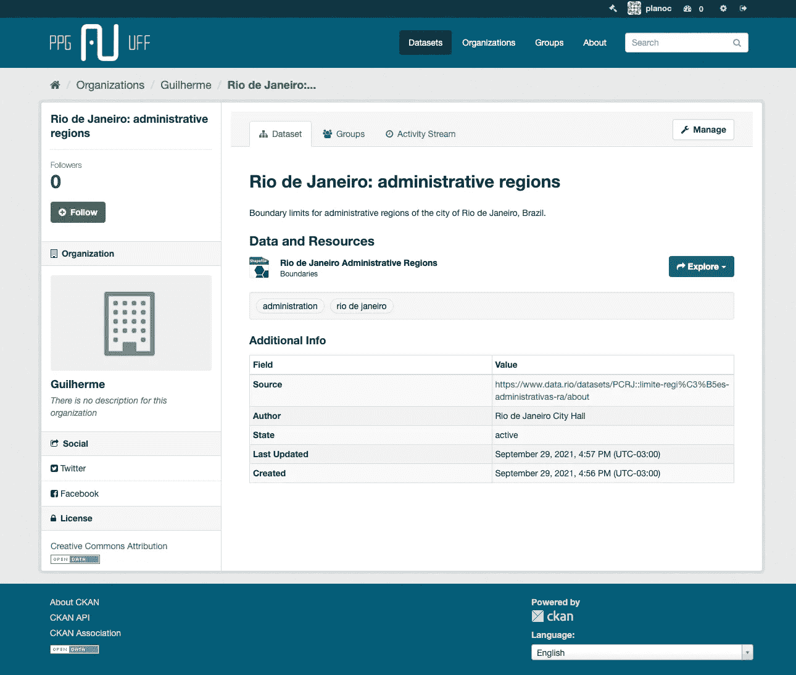
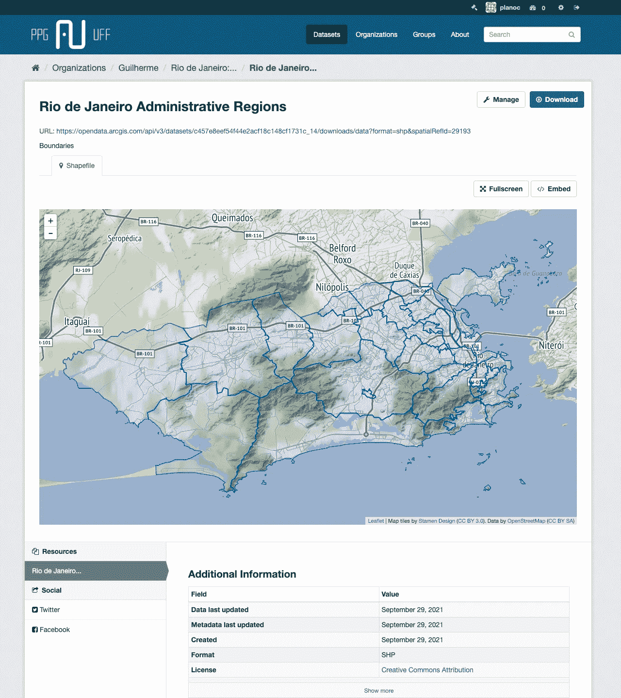

# 在 Mac 上运行 dockerized CKAN 地理空间开放数据门户

> 原文：<https://towardsdatascience.com/running-a-dockerized-ckan-geospatial-open-data-portal-on-a-mac-347a0346729d?source=collection_archive---------14----------------------->

## [实践教程](https://towardsdatascience.com/tagged/hands-on-tutorials)

## 关于如何利用 docker-compose 充分利用 OSX 世界领先的操作系统数据门户的实践指南

CKAN 很棒。它不仅是全球开放数据门户最受欢迎的系统之一:大量可用的插件和蓬勃发展的社区使它成为一个非常灵活和强大的工具，用于不同类型的数据和可视化，**包括地理空间**。

Docker 让运行 CKAN 实例变得简单多了，不需要运行 Ubuntu 机器

说到地理空间数据门户，其他工具可能更为人们所知。ESRI 无疑在说服顶级玩家(如全球的[联合国](http://unhabitatiraq.net/mosulportal/)和[地方政府](https://iede.rs.gov.br/)使用[**ArcGIS Enterprise**](https://enterprise.arcgis.com/en/)方面做得很好，但是这种设置会花费你几千美元。OSGEO 社区在开发 [**GeoNode**](https://geonode.org/) 和 [**GeoNetwork**](https://geonetwork-opensource.org/) 方面做得很好，但这将占用你的机器上的**大量**空间，因为这两者都需要 Postgres 数据库和 Geoserver 实例来存储数据和地理服务。

如果你正在寻找一些例子来说服自己，请查看 CKAN 网站上的[展示页面](https://ckan.org/showcase)。许多国家政府，如美国和加拿大，正在使用它作为他们的开放数据门户。我最喜欢的一个是联合国 OCHA 办事处的人道主义数据交换门户网站。

人道主义数据交换门户，您可以在其中按类别和位置搜索数据，并在嵌入式 web 地图中预先可视化空间数据。图片由作者提供。

因此，如果您正在寻找一个免费的轻量级解决方案来存储地理空间元数据，CKAN 会支持您。在本教程中，我们将设置一个基本的 CKAN 安装在 Mac 与 Docker，设置一些基本的插件，并使其地理空间友好。

# 让我们从头开始——一个非常好的起点

让我们开门见山吧:您可能最终阅读了这篇文章，因为您正试图在 Mac 上运行 CKAN 门户，而关于如何操作的文档并不理想。坏消息是 CKAN 被开发成主要在 Linux 上运行**(尽管你可以在 OSX 上运行源码安装)，所以你不能运行包安装。好消息是 CKAN 也作为 docker-compose recipe** 发布，所以你可以在 Mac 的 docker 容器中运行它。

1.  在我们开始之前，确保您的机器上安装了 Docker 和 Docker-compose。在 mac 上，这意味着你只需下载并安装 Docker-compose 自带的 [Docker 桌面应用](https://hub.docker.com/editions/community/docker-ce-desktop-mac)。

如果你不熟悉 Docker 的工作方式，也许值得[研究一下](https://docs.docker.com/compose/)。您需要知道的最起码的事情是，Docker 文件包含一个构建映像的方法，该映像作为一个容器中的卷依次执行。docker-compose 方法指向 docker 文件的集合，因此您可以在一个容器中有多个卷运行您的设置的不同部分，如数据库、web 服务器和应用程序。所有这一切都不需要建立一个虚拟机:**您只需运行这些服务工作所需的部分**。

2.现在打开您的终端，直接从 Github 获取 CKAN 的源代码:

`$ git clone https://github.com/ckan/ckan.git`

3.进入下载目录，并导航至 docker-compose 配方的存储目录:

`$ cd ckan/contrib/docker`

4.在为 CKAN 实例构建映像时，Docker 将被告知寻找。env 文件，它包含一些环境变量。我们将创造我们的。env 文件，方法是通过运行以下命令复制 CKAN 提供的模板(. env.template):

`$ cp .env.template .env`

5.这些变量没有太多需要改变的地方。有一件事是绝对必须的，那就是更改变量 CKAN_SITE_URL。为此，请打开新创建的。env 文件用你最喜欢的文本编辑器(由于这个文件以点开始，你的 Mac 会隐藏它；点击`CMD+SHIFT+.`使隐藏文件在 Finder 中可见)。该变量应该如下所示:

`CKAN_SITE_URL = http://docker.for.mac.localhost:5000`

6.现在我们已经准备好构建我们的 Docker 映像了！让我们调用 docker-compose，告诉它构建必要的图像，并在容器中将它们作为卷运行。

`$ docker-compose up -d --build`

如果一切顺利，您应该会在 Docker 桌面应用程序中看到一个正在运行的容器。ckan 的每个部分都有一个实例，比如数据库、web 服务器和 ckan 本身。图片由作者提供。

7.如果您遇到任何问题，运行以下命令来修剪 Docker 可能是值得的:

`$ docker container prune
$ docker volume prune
$ docker network prune
$ docker system prune`

8.在你的浏览器上检查[http://docker.for.mac.localhost:5000/](http://docker.for.mac.localhost:5000/)，你应该会看到 CKAN 网站正在运行！

它还活着！图片由作者提供。

# 就这些吗？

好的，很好。我们设法很快完成了基础安装，这将作为 CKAN 最初设定的**元数据**门户。不过，您可能会有兴趣将 CKAN 作为一个 ***数据*** 门户来运行。为此，您需要设置数据存储扩展，同时让我们也设置管理员用户名。

> 在本节中，我们将使用***production . ini***文件。这基本上是 CKAN 存储所有相关选项的地方，比如语言、用户和扩展。但是请注意，根据您使用的 CKAN 版本，这可能会被命名为 ***ckan.ini*** 。

1.  预先为数据存储设置用户:

`$ docker exec ckan ckan -c /etc/ckan/production.ini datastore set-permissions | docker exec -i db psql -U ckan`

> docker exec 命令意味着我们可以在任何特定的**运行**容器中运行命令——在本例中，我们已经访问了 ckan 分区。

2.访问 Docker Linux 虚拟机:

`$ docker run -it --privileged --pid=host justincormack/nsenter1`

3.现在您已经进入了 Linux 机器，让我们使用 [UNIX **vi** 编辑器](https://www.tutorialspoint.com/unix/unix-vi-editor.htm)对 *production.ini* 文件(或 *ckan.ini* 取决于 ckan 的版本)进行修改，CKAN 的大多数规则:
`$ vi var/lib/docker/volumes/docker_ckan_config/_data/production.ini`都在这个文件中

a.将`datastore datapusher`添加到`ckan.plugins` b。取消`ckan.datapusher.formats` c。将`ckan.locale_default`更改为您偏好的语言

> 要编辑 production.ini 文件，键入 **i** 进行插入。然后 **ESC** ，然后 **:x** 保存时退出 vi，或者 **:q！**不保存退出。要退出虚拟机，请键入 **exit** 。

4.一旦您退出了 VM，让我们重新启动容器来实现更改:
`$ docker-compose restart ckan`

5.要检查一切是否顺利，请访问[http://docker . for . MAC . localhost:5000/API/3/action/datastore _ search？resource _ id = _ table _ metadata](http://docker.for.mac.localhost:5000/api/3/action/datastore_search?resource_id=_table_metadata)
您应该会看到一个带有“success: true”属性的 JSON 对象。

6.现在让我们为 CKAN 创建超级用户:
`$ docker exec -it ckan ckan -c/etc/ckan/production.ini sysadmin add yourname`

你现在应该可以用`yourname`登录 CKAN 了。

7.作为将来的参考，如果您想让**停止**容器，只需访问存储和运行原始 docker-compose 文件的文件夹: `$ docker-compose down`

要重新激活它，只需运行
`$ docker-compose up`

让我们用我们的用户登录并上传一个数据集，看看它会是什么样子。我将上传一些存储在压缩 shapefile 中的行政边界，看看它是什么样子的。

图片由作者提供。

# 我以为你提到了地理空间？

为了让 CKAN 具有空间感知能力，我们需要安装两个扩展: [geoview](https://github.com/ckan/ckanext-geoview) 和 [spatial](https://github.com/ckan/ckanext-spatial) 。请记住，有许多扩展可能非常有用，比如[地图小部件](https://extensions.ckan.org/extension/spatialui/)。

在 CKAN 的 dockerized 实例中安装扩展的方法不止一种。您可以将这些步骤包含在菜谱中，并从一开始就安装它们。在这里，我们将把扩展**直接安装在这个特定的运行容器**上，因此这不会对我们用来构建这些映像的 docker 文件产生任何影响。

## 地理视图

**Ckanext-geoview** 是一个扩展，能够以网络地图的形式预可视化空间数据。那些可以是 shapefiles，geojson 甚至是 WMS。

1.  进入正在运行的 ckan 容器:
    `$ docker exec -it ckan /bin/bash -c "export TERM=xterm; exec bash"`

2.在运行容器内，激活 virtualenv:
`$ source $CKAN_VENV/bin/activate && cd $CKAN_VENV/src
$ git clone [https://github.com/ckan/ckanext-geoview.git](https://github.com/ckan/ckanext-geoview.git)
$ cd ckanext-geoview
$ pip install -r pip-requirements.txt
$ python setup.py install
$ python setup.py develop
$ cd ..
$ exit`

3.访问 Docker Linux 虚拟机:
`$ docker run -it --privileged --pid=host justincormack/nsenter1`

4.从虚拟机内部:
`$ vi var/lib/docker/volumes/docker_ckan_config/_data/production.ini`

5.在`ckan.plugins`中增加`resource_proxy geo_view geojson_view shp_view`

6.将`geo_view geojson_view shp_view`添加到`ckan.views.default_views`

> 同样，要用 vi 编辑器编辑 production.ini 文件，键入 **i** 进行插入。然后 **ESC** ，然后 **:x** 保存时退出 vi，或者 **:q！**退出而不保存。要退出虚拟机，请键入 **exit** 。

7.通过运行
`$ docker-compose restart ckan`重新启动容器

安装 Geoview 后，我们现在可以通过点击 *Explore* 按钮，直接在 CKAN 的网络地图中显示我们之前上传的数据。

图片由作者提供。

## 空间的

Spatial 是一个扩展，可将空间字段用于 CKAN 中存储的所有元数据。所以基本上，它将在底层 PostgreSQL 数据库中安装 PostGIS，并在我们的门户中启用空间索引和搜索。安装它会比 geoview 稍微复杂一点，但是我们会做到的。

1.  进入正在运行的 ckan 容器:
    `$ docker exec -it ckan /bin/bash -c "export TERM=xterm; exec bash"`

2.在运行容器中，激活 virtualenv，获取扩展的源代码并安装:
`$ source $CKAN_VENV/bin/activate && cd $CKAN_VENV/src/
$ git clone [https://github.com/ckan/ckanext-spatial.git](https://github.com/ckan/ckanext-spatial.git)
$ cd ckanext-spatial
$ pip install -r pip-requirements.txt
$ python setup.py install
$ python setup.py develop
$ cd ..
$ exit`

3.这就是棘手的地方。我们将从主机容器中更新 postgis 的权限:
`$ docker exec -it db psql -U ckan -f /docker-entrypoint-initdb.d/20_postgis_permissions.sql`

4.访问 Docker Linux 虚拟机:
`$ docker run -it --privileged--pid=host justincormack/nsenter1`

5.从虚拟机内部:
`$ vi var/lib/docker/volumes/docker_ckan_config/_data/production.ini`

将`spatial_metadata spatial_query`添加到`ckan.plugins`

添加`ckanext.spatial.search_backend = solr`

6.重启容器:
`$ docker-compose restart ckan`

​​7.重新进入正在运行的 ckan 容器并重新激活 virtualenv:
`$ docker exec -it ckan /bin/bash -c "export TERM=xterm; exec bash"
$ source $CKAN_VENV/bin/activate && cd $CKAN_VENV/src/`

8.从虚拟机内部，运行空间 initdb 命令:
`$ ckan--config=/etc/ckan/production.ini spatial initdb`

9.通过访问[http://docker . for . MAC . localhost:5000/API/3/action/status _ show](http://docker.for.mac.localhost:5000/api/3/action/status_show)再次重启容器并检查它是否工作

安装 Spatial 后，我们现在可以对数据集进行地理索引，并按空间范围进行搜索！

# 这是所有的乡亲

这一块就到此为止！我们已经成功地在 Mac 上运行了 CKAN 的 dockerized 实例，它具有两个重要的地理空间数据扩展！如果你有问题或建议，不要犹豫，随时给我写信！

如果你喜欢这篇文章，考虑给我买杯咖啡，这样我就可以继续写更多的文章了！

<https://www.buymeacoffee.com/guilhermeiablo> 