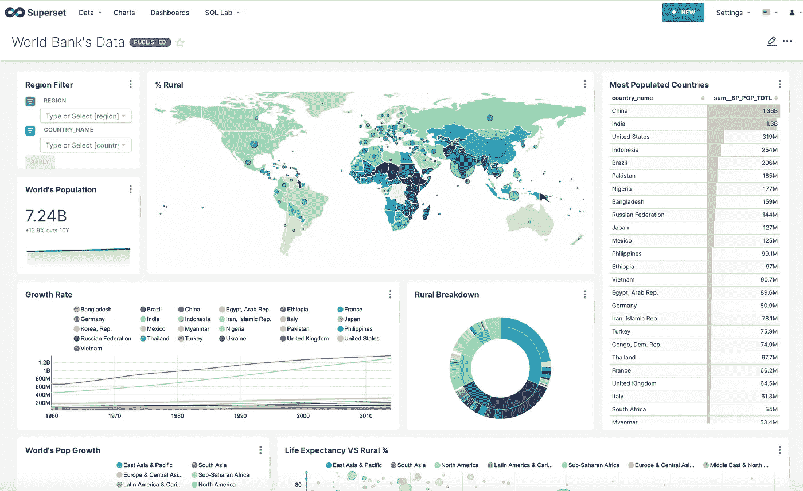

# 大规模运行 Apache 超集

> 原文：<https://towardsdatascience.com/running-apache-superset-at-scale-1539e3945093?source=collection_archive---------23----------------------->

## 大规模高效运行超集的一组建议和起点



样本超集仪表板(来源:[https://superset.apache.org/gallery/](https://superset.apache.org/gallery/)

W 谈到商业智能(BI)生态系统，专有工具在很长一段时间内都是标准。Tableau、Power BI 和最近的 Looker 是企业 BI 用例的首选解决方案。但是后来，Apache 超集发生了。

由于对依赖专有 BI 解决方案的诸多不便感到失望(如缺乏与某些查询执行引擎和供应商锁定的兼容性)，Maxime Beauchemin 使用 Airbnb 内部黑客马拉松从头开始构建 BI 工具。

该项目于 2016 年开源(最初为 Caravel ),并在过去五年中成为今天的 Apache 超集，作为开源项目为全球开发者提供专有 BI 工具(及更多)的功能。因此，毫不奇怪，它很快被数十家公司采用。

在最初发布五年后，当谈到大规模运行超集时，文档仍然有限，尽管该工具本身是云原生的，并且是为大规模运行而设计的。本文旨在提供一些起点和建议，可以在这方面帮助新的采用者。

# 都是关于容器的

无论您希望在哪个平台或云上运行超集，如果您正在计划可伸缩性，那么第一个构建块应该是准备您的定制容器映像。这将允许您拥有与您的用例相匹配的超集容器，并且可以部署到各种编排平台(如 ECS 或 Kubernetes)。

起点应该是官方的超集映像(DockerHub 上的[)，然后在 DockerHub 文件中，您可以为您的用例添加额外的依赖项(如数据库驱动程序)。例如，如果我们想使用 Redis，docker 文件应该是这样的:](https://hub.docker.com/r/apache/superset)

```
FROM apache/superset:1.0.1
# We switch to root
USER root
# We install the Python interface for Redis
RUN pip install redis
# We switch back to the `superset` user
USER superset
```

此外，您应该创建一个包含您的定制配置的 *superset_config.py* 文件。多亏了它，你可以覆盖超集的[主配置文件](https://github.com/apache/superset/blob/master/superset/config.py)中的值，比如认证方法或查询超时。

最后，我们可以通过添加以下命令来更新 Dockerfile 文件:

```
# We add the superset_config.py file to the container
COPY superset_config.py /app/
# We tell Superset where to find it
ENV SUPERSET_CONFIG_PATH /app/superset_config.py
```

这将确保我们的定制配置被加载到容器中，并被超集识别。然后，您可以简单地在 docker 文件中添加一个 CMD 步骤来实际运行超集。

# 缓存，缓存，缓存

无论您想将超集连接到哪个(哪些)数据库，如果您计划大规模运行它，那么您肯定不希望它在每次有人打开仪表板时运行多个查询。

该工具提供了不应被忽视的多种缓存可能性。至少，您应该尝试缓存超集自己的元数据和不同图表的数据。这样，在我们创建图表后，超集将把它的数据保存到我们配置的缓存中。之后，下次有人试图查看图表时(例如，通过仪表板)，超集将立即从缓存中检索数据，而不是在实际的数据库上运行查询。

基本上是一个 Flask 应用程序(它使用 Flask-AppBuilder 框架)，出于缓存的目的，Superset 使用[Flask-Cache](https://pythonhosted.org/Flask-Cache/)——这反过来支持多个缓存后端，如 Redis 和 Memcached。

如果您还想将超集用于长时间运行的分析查询，那么您可以[使用 Celery 配置一个异步后端](https://superset.apache.org/docs/installation/async-queries-celery)，这样您就可以拥有一个查询结果的专用缓存机制。

# 设置身份验证

不出所料，Superset 也依赖 Flask AppBuilder 进行认证。它提供了多种身份验证选项，如 OAuth 和 LDAP，可以轻松激活和配置。

对于可伸缩的设计，您可能希望激活一种身份验证方法，然后让用户在平台上执行自我注册。为此，您可以将下面两行添加到您的 *superset_config.py* 中:

```
AUTH_USER_REGISTRATION = True
AUTH_USER_REGISTRATION_ROLE = "a_custom_default_role"
```

# 权限很乱，不过没关系

关于 Superset 的一个不太理想的方面是它的权限管理，在它的存储库上有一个公开的问题(大约两年前公开的),详细说明了当前实现的不同问题，并提出了一个更好的替代方案。

幸运的是，数据访问权限很容易配置，这个问题与 Flask AppBuilder 生成的[特性相关的权限有关。](https://flask-appbuilder.readthedocs.io/en/latest/security.html#permissions)

为了避免管理长长的权限列表，一种有效的方法是克隆现有角色[中的一个](https://superset.apache.org/docs/security)，并根据您的用例对其进行定制，这样您就可以在默认情况下为您的用户提供这个新的定制角色。

# 结论

得益于其庞大的社区，Superset 迅速成为一个成熟且非常完整的项目(最近发布了 1.0 版本)。考虑到这一点，当您设计大规模 BI 平台时，它绝对应该被视为一个可行的选择。

当我们考虑到它的一长串特性和功能时，它大规模工作所需的不同配置步骤只是一个小小的代价。Airbnb 的设置以及他们如何利用其不同的功能(通过该公司博客上的一篇文章[详细讨论了这一点)是其强大的最好例子。](https://medium.com/airbnb-engineering/supercharging-apache-superset-b1a2393278bd)

最后，值得一提的是，Superset 的创造者 Maxime Beauchemin 最近成立了[预置](https://preset.io/)——一家为 Apache Superset 提供托管云服务的公司。如果您希望最大限度地减少必要的配置工作，那么选择预置会更方便。

*要了解更多数据工程内容，您可以订阅我的双周刊时事通讯 Data Espresso，在其中我将讨论与数据工程和技术相关的各种主题:*

[](https://dataespresso.substack.com/) [## 数据浓缩咖啡

### 数据工程更新和评论伴随您的午后咖啡。点击阅读数据咖啡，由马赫迪…

dataespresso.substack.com](https://dataespresso.substack.com/)