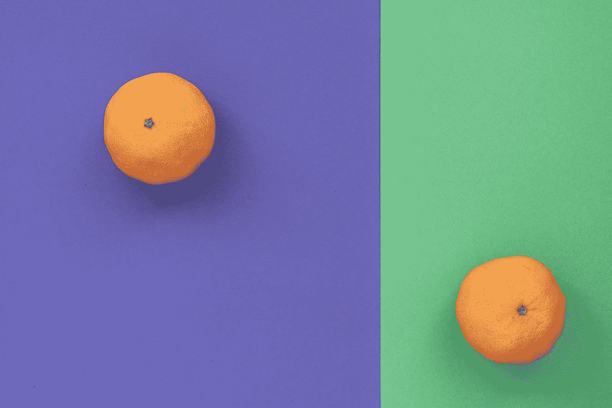
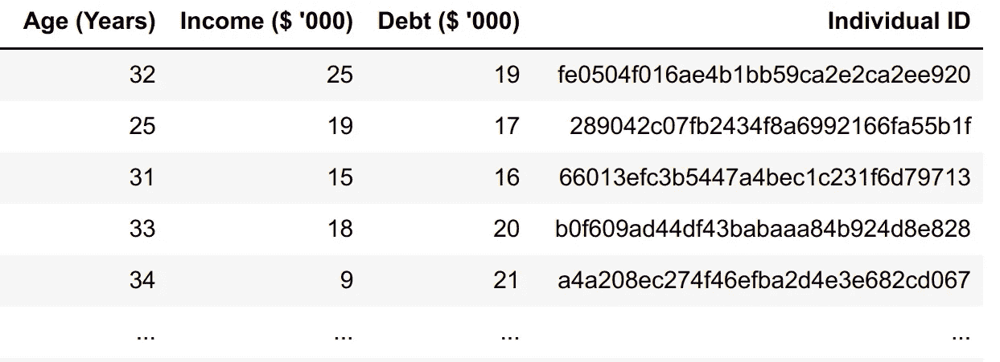
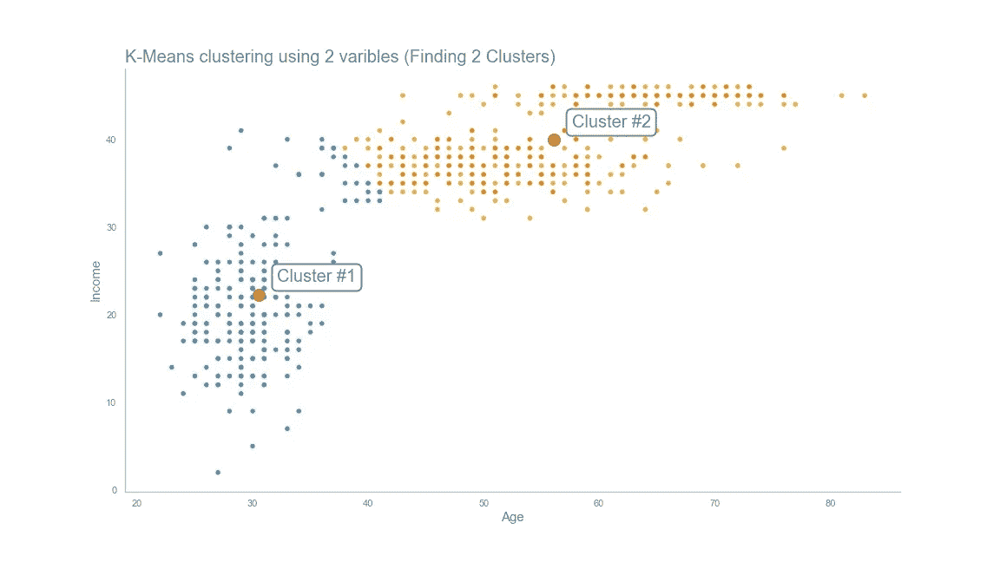
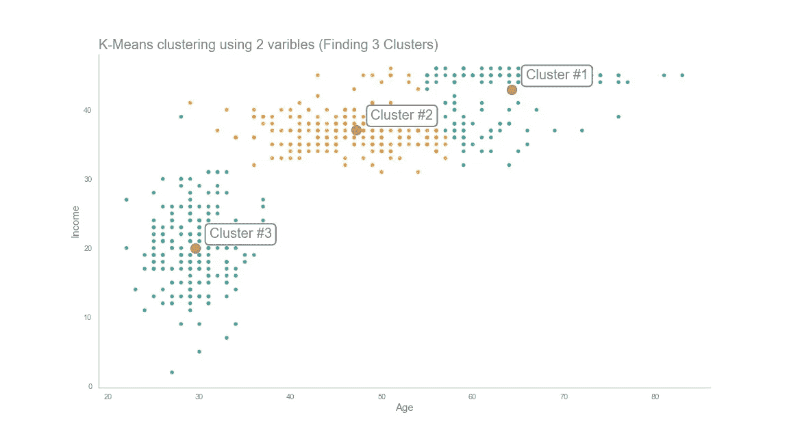
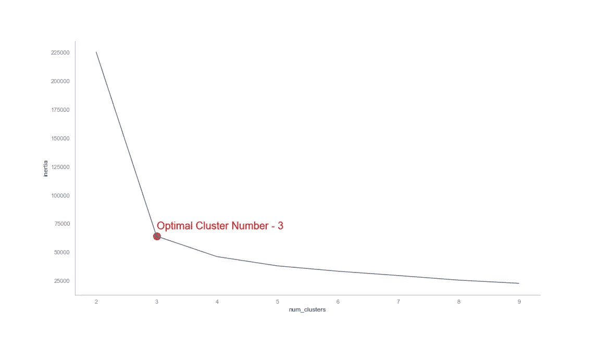

# 用 K-均值聚类进行竞选活动。

> 原文：<https://towardsdatascience.com/running-election-campaigns-with-k-means-clustering-ecc40a91135a?source=collection_archive---------15----------------------->

## 实用 ML

## K-均值聚类实用介绍。

照片由来自 [Pexels](https://www.pexels.com/photo/food-healthy-love-art-6008091/?utm_content=attributionCopyText&utm_medium=referral&utm_source=pexels) 的 [Andre Taissin](https://www.pexels.com/@andre-taissin-3252911?utm_content=attributionCopyText&utm_medium=referral&utm_source=pexels) 拍摄

假设你是下届总统选举的首席竞选策划人。由于疫情推动的技术采用，这次活动将在网上进行。因为它有助于覆盖整个国家，无需任何旅行，您的政党决定采取创新的方法。

你的任务是找到有相似兴趣(或需求)的人群。他们每个人都将有一个单独的在线活动。如果你的国家的未来取决于你，你会怎么做？

数据科学家使用聚类算法来帮助解决这个问题。K-means 是使用各种属性对大型数据集进行分组的最简单而有效的算法。这是一种在数据集中查找非重叠组的迭代方法。在你的情况下，找到有着相似需求和兴趣的不同的选民群体。每个人都成为一个且只有一个群体的成员。

k 是您希望拥有的集群数量。但是，你怎么知道正确的数字是多少呢？通读一遍，找出答案。

这篇文章将带你经历解决这个难题的步骤，并回答你在途中必须做出的一些关键决定。在本文中，我使用 python 实现了我们讨论的例子。

> 如果你感到迷茫，可以参考 [GitHub 资源库](https://github.com/ThuwarakeshM/PracticalML-KMeans-Election)。我在这个插图中使用的数据集不是原始的。如果你还想练习，那也在知识库里。

# 寻找具有两个变量的聚类。

让我们假设你可以访问你的国家的个人年龄年收入(和债务)水平(在一个电子表格中，如下图所示)。

作者图片

当然，你可以根据你以前的知识来创建小组。例如，高收入的千禧一代将是其中一个群体。但是，您决定深入研究，看看是否有其他方法来聚集它们。因此，你决定用这两个变量进行 K-means。

使用 python 来做是毫不费力的。您只需要几行代码来读取数据并执行 K-means 聚类。

你现在知道要考虑哪两个更突出的群体，以及他们的平均年龄和收入。你也知道每个人属于哪一组。

真是难以置信。但是，我们需要亲眼看到它才能更好地理解它，不是吗？同样，这很简单，只需要几行代码。

作者图片

想象有帮助。我们可以看到这些簇被很好地分开，并且它们的簇质心是有代表性的。

此时要问的一个有趣问题是，我们如何知道只有两个集群？还会有更多吗？让我们重复同样的步骤，假设数据集有三组。

作者图片

只有两个变量的聚类使可视化变得简单。但是，如果只需要考虑两个特性，您甚至可以创建逻辑组。我们能增加更多的功能吗？

此外，我们可以将集群的数量增加到任意值。但是什么是最佳数量呢？

我们将在接下来的章节中回答这些问题。但是在我们开始之前，让我们试着理解 K-means 算法是如何工作的。

# 引擎盖下发生了什么？

K-means 使用数据点之间的距离。因此，彼此靠近的数据点很可能落入同一聚类中。

开始时，K-means 随机选择 K 个数据点作为它的聚类中心。这里，K 是我们定义的任意数。在我们的例子中，这个*可以是*年龄 **25 岁，收入 20k(集群 A)** 和**年龄 50 岁，收入 100k(集群 B)** 。

然后，它会计算数据集中所有数据点与这些质心之间的距离。并且该算法将每个数据点分配给最近的质心。因此，这意味着一个收入为 30k 的 20 岁的人将在群集 A 中，而一个收入为 80k 的 60 岁的人可能在群集 b 中。

K-means 通过平均每个聚类的所有数据点来计算一组新的质心。因此，聚类 A 的新聚类质心可以是年龄 22 和 25k 收入。星团 B 的质心可能也发生了变化。这些将是下一次迭代的质心。

这个过程一直持续到聚类质心没有显著变化。

# 如果要考虑更多的特性呢？

根据年龄和收入寻找聚类似乎很简单。你可能不需要机器学习来做这件事。但是，在现实中，你将有一堆其他的变量要处理。这可能包括他们的教育水平、健康状况和财务状况。

然而，这两个维度帮助我们理解了算法。此外，只用两个变量也很容易想象。但是，让我们添加一个新的变量，使它更加现实。

假设你也有每个人的债务水平。这难道不是政治竞选的重要信息吗？

您无需对已经编写的代码做太多修改就可以做到这一点。只需将“债务”添加到要传递的变量列表中。

# 找到 k 的正确值。

K-means 查找聚类，但是它不确定集合的数量；你得自己定义。

如果你使用了一个较小的 K 值，你可能无法解决投票者的正确问题。你的承诺可能看起来很肤浅，因为有不同需求的人现在在同一个集群里。

另一方面，如果你使用了大量的 K，那么广告活动将会很昂贵。结果，你的派对可能会以取悦每一个毫无价值的利基市场而告终。

但是你怎么知道你得出的任意数字是合适的呢？

肘法可以帮你找到这个。

在这种方法中，我们使用数据点和它们的聚类质心之间的距离平方和(SSE)来确定 K 值。我们称这个值为惯性。随着聚类越多(K 越大)，惯性将总是随着到最近聚类的距离的减小而减小。

然而，在某种程度上，这种减少变得微不足道。因此，我们得出结论，此时的簇数是 k 的正确值。

下面是实现这一点的 python 代码片段。

我们用不同的 K 值拟合 K 均值，并将惯性值收集在一个列表中。然后，我们使用这些信息绘制下图。

作者图片

在这张图上，很明显，经过三个集群后，惯性的下降并不明显。

这一信息意味着，如果你将选民分成三组，属于同一聚类的人具有相似的特征。你可以策划三种不同的策略来解决它们。

相反，四个集群会让你的营销活动变得昂贵，因为每个集群需要不同的策略。两个群体可能会让选民觉得他们的需求没有得到满足。

# K-均值聚类的缺点。

你可能对 K 均值的初始聚类质心有疑问。如果它是随机选择的，那么每次算法运行时，聚类不会不同吗？

当然，陷入局部最小值是 K-means 算法的一个问题。

要解决这个问题，您可能需要多次运行该算法，然后选择最合适的算法。聚类质心和它们的成员之间的距离平方和可以帮助我们找到正确的拟合。这个数字越低越好。

K-means 算法对异常值很敏感。由于该算法在每次迭代时都会计算新的质心，离群值可能会扭曲它。在开始之前，请确保移除所有异常值。

但是，这些缺点更容易控制。一些让 K-means 不适合的严肃问题怎么办？

K-means 对于不同大小或密度的聚类表现不佳。因此，如果数据集的高收入老年人多于中年低收入者，K 均值可能会以无意义的聚类结束。

k 表示对于线性可分的簇表现良好。但是其他类型的数据呢？K-means 不能聚类不同的几何形状，如椭圆形和圆形。

然而，K-means 一直是数据科学家的最爱。

# 总而言之，

K-means 是一种简单而流行的聚类算法。它将数据点分组到不重叠的群集中。

在本文中，我们讨论了如何使用 python 执行 K-means 聚类。我们从两个变量开始。然后我们谈到增加更多的变量，为 k 找到一个正确的数。

在这篇文章中，我们一直遵循一个假设的政治竞选场景。虽然，在现实中，你可能有无数的其他变量，但基本步骤是相同的。此外，您可以在无数其他应用程序中使用 K-means 算法。例如，你可以用它来压缩图像以及对你电脑上的文件进行分类。

但这并不意味着它永远是最好的。我们已经讨论了 K-means 算法的几个缺点。例如，K-means 在复杂的几何形状上做得不好。DBSCAN 等算法可以更好地解决这个问题。但那是后话了。

> 感谢阅读，朋友！看来你和我有许多共同的兴趣。我很乐意通过 LinkedIn、T2、Twitter 和 Medium 与你联系。