# 使用 Google Cloud BigQuery ML 运行 Kedro 机器学习管道

> 原文：<https://towardsdatascience.com/running-kedro-machine-learning-pipelines-with-google-cloud-bigquery-ml-47cfe2e7c943?source=collection_archive---------19----------------------->

## [理解大数据](https://towardsdatascience.com/tagged/making-sense-of-big-data)

*Kedro 是一个面向数据科学家和数据工程师的流行开源框架。在这篇文章中，我们将展示如何通过在 Google Cloud 笔记本中部署 Kedro 管道来简化它们，将主数据保存在 BigQuery 中，并利用其使用标准 SQL 查询创建和执行机器学习模型的能力。*


照片由[弗洛里安·威特](https://unsplash.com/@allodium?utm_source=medium&utm_medium=referral)在 [Unsplash](https://unsplash.com?utm_source=medium&utm_medium=referral) 拍摄

# 介绍

Kedro 是一个用于数据管道的开源框架。它实现了行业最佳实践。它通常由日期科学和数据工程团队使用。看看下面这个来自他们的创作者的介绍视频， [QuantumBlack](https://quantumblack.com/) 。

我们将使用[原始太空飞行教程](https://kedro.readthedocs.io/en/latest/03_tutorial/01_spaceflights_tutorial.html)。我们身处 2160 年，Spaceflights 是一家带游客往返月球的公司。在本例中，我们将创建一个模型来预测旅行价格。这篇文章中的两个步骤:

1.  在谷歌云笔记本中部署 Spaceflights 原始教程
2.  通过以下更改修改管线:

*   使用 Google 云存储(GCS)存储原始数据和中间结果
*   将主数据保存在 BigQuery 表中
*   用 BigQuery ML 创建 ML 模型

为了运行本教程，您需要:

*   谷歌云账户
*   浏览器

# 在谷歌云笔记本中部署太空飞行教程

我们首先需要的是一个谷歌云项目。打开一个[云控制台](https://cloud.google.com/poc/cloud-console)，点击右上角的“激活云壳”图标。这将部署一个可通过浏览器访问的开发和操作环境。

记下您的[项目 ID](https://cloud.google.com/resource-manager/docs/creating-managing-projects#identifying_projects) 并选择一个离您的位置较近的[地区和区域](https://cloud.google.com/compute/docs/regions-zones#choosing_a_region_and_zone)来部署您的资源。

有了这些信息，我们可以从云 Shell 命令行创建一个笔记本(用您自己的值替换**粗体**中的文本):

```
PROJECT_ID=**mh-kedro**
REGION=**europe-west1**
ZONE=**europe-west1-b**gcloud config set project $PROJECT_ID
gcloud services enable notebooks.googleapis.comgcloud beta notebooks instances create "kedro-spaceflight-nb" \
--vm-image-project="deeplearning-platform-release" \
--vm-image-family="common-cpu" \
--machine-type=n1-standard-4 \
--location=$ZONE
```

从云外壳的第一次执行将弹出一个授权确认。几秒钟后，实例将被创建。在**云控制台**的左侧主菜单中，选择 AI 平台>笔记本，查看您的笔记本实例:

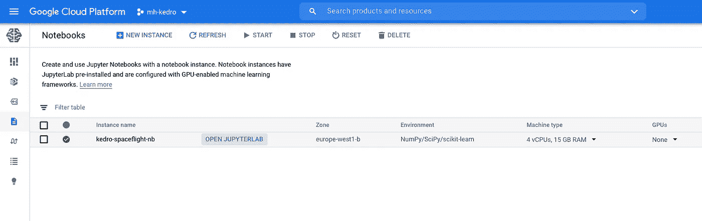

单击“打开 JUPITERLAB”访问您的 JupyterLab 会话。

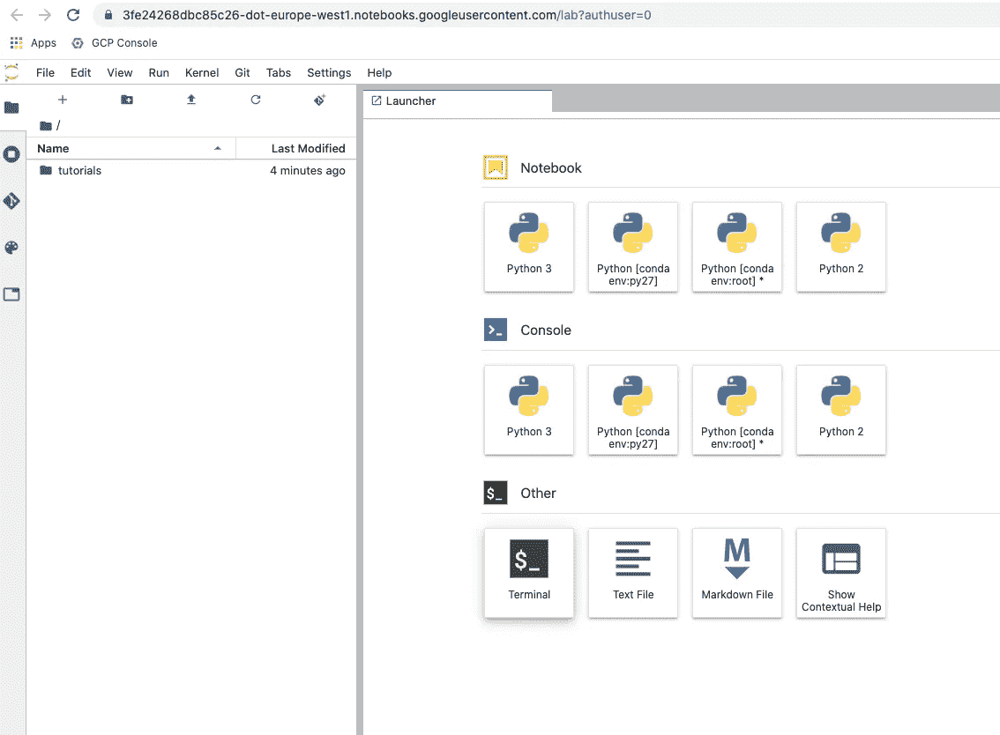

打开一个终端。我们将在这里工作。要安装 kedro，只需输入

```
pip install kedro
```

下一步是安装 spaceflights 教程。[原始文档](https://kedro.readthedocs.io/en/latest/03_tutorial/01_spaceflights_tutorial.html)详细解释了如何做。为了简洁起见，我们将使用“太空飞行”开头。

```
kedro new --starter=spaceflights
```

选择“spaceflights”作为项目名称，保留其他默认值

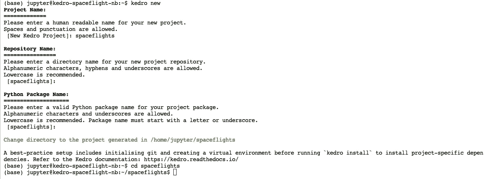

现在，让我们安装所需的库并运行项目:

```
cd spaceflights
git init
pip install -r src/requirements.txt
kedro run
```

这是输出:

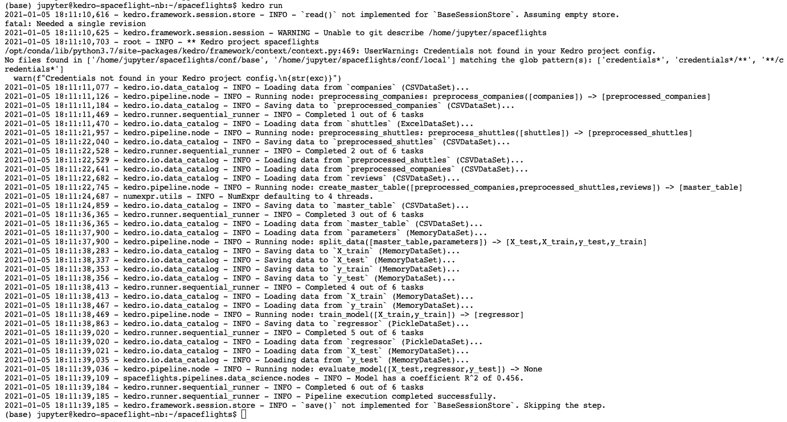

spacefligths 项目运行输出

注意每个节点的执行。我们在 data/02_intermediate 创建中间文件，并生成主数据文件**data/03 _ primary/master _ table . CSV**。

然后，我们使用该文件创建一个价格预测模型，作为对某些特性的线性回归。模型存储在文件**data/06 _ models/regressor . pickle**中。最后，我们显示了模型的 R^2 系数值:0.456。

在这一点上，可视化管道是很有趣的。Kedro 为此提供了 viz 工具。从您的终端运行:

```
pip install kedro-viz
kedro viz
```

这将打开一个监听 localhost:4141 服务器。

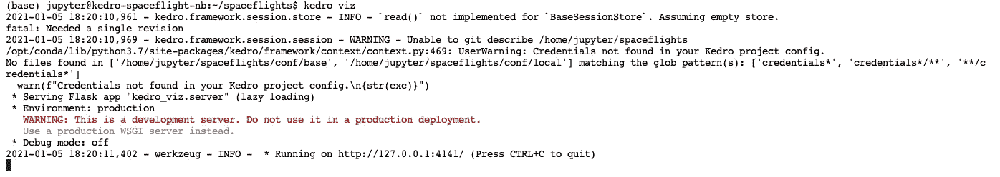

为了从我们的浏览器访问，我们需要通过键入以下命令从**云外壳**打开一个隧道:

```
gcloud compute ssh --project $PROJECT_ID --zone $ZONE "kedro-spaceflight-nb" -- -L 4141:localhost:4141
```

然后点击右上角菜单中的“网络预览”图标。将端口更改为 4141。

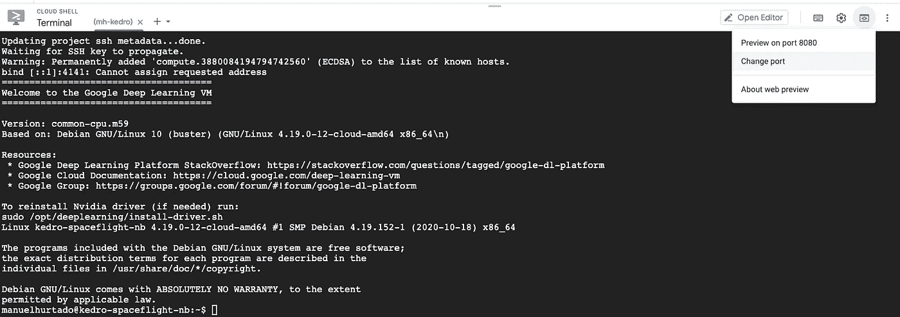

此时，会打开一个新选项卡，我们可以看到我们的管道:

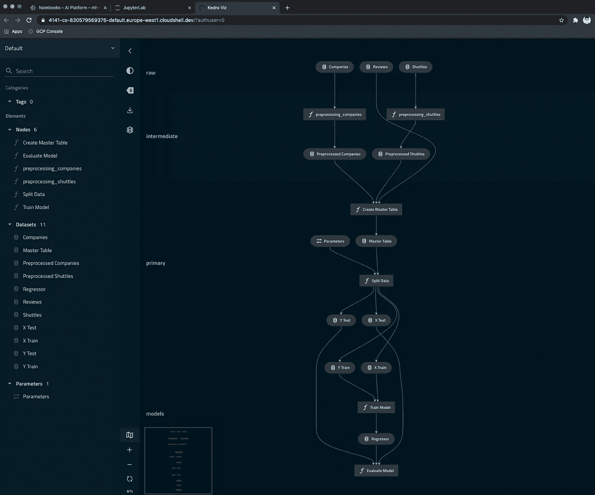

航天管道可视化

我们已经在一个 Google Cloud 笔记本实例中成功运行了我们的 kedro 管道。

到目前为止，管道是在本地运行的，使用本地文件系统存储中间数据、主数据、模式等。现在想象一个非常大的数据集。在某个时候，我们当地的环境会耗尽资源。我们如何扩展？

答案是在外部系统之间分配负载，并从 kedro 管道进行编排。特别是在这个例子中，我们将使用:

*   **用于原始和中间文件的谷歌云存储**
*   **BigQuery** 作为保存主数据的数据库
*   **BigQuery ML** 用于机器学习模型的创建和执行

# 创建 Google 云存储和 BigTable 资源

第一步是资源创建。转到您的**云外壳**，退出您的 ssh 隧道会话并键入:

```
gsutil mb -l $REGION gs://$PROJECT_IDbq --location=$REGION mk spaceflightsbq mk \
-t \
--description “Kedro tutorial master table” \
spaceflights.master \
id_x:INTEGER,shuttle_location:STRING,shuttle_type:STRING,engine_type:STRING,engine_vendor:STRING,engines:NUMERIC,passenger_capacity:INTEGER,cancellation_policy:STRING,crew:NUMERIC,d_check_complete:BOOLEAN,moon_clearance_complete:BOOLEAN,price:NUMERIC,review_scores_rating:NUMERIC,review_scores_comfort:NUMERIC,review_scores_amenities:NUMERIC,review_scores_trip:NUMERIC,review_scores_crew:NUMERIC,review_scores_location:NUMERIC,review_scores_price:NUMERIC,number_of_reviews:INTEGER,reviews_per_month:NUMERIC,id_y:INTEGER,company_rating:NUMERIC,company_location:STRING,total_fleet_count:NUMERIC,iata_approved:BOOLEAN
```

第一行创建一个 GCS bucket，第二行创建一个 BigQuery 数据集，最后一行创建一个表来保存主数据。

回到笔记本，安装额外的 python 依赖项来与 BigQuery 交互。接下来，我们必须将原始数据文件从 **data/01_raw** 复制到 GCS。我们可以在笔记本中直接使用 gsutil(用您的 PROJECT_ID 值替换 **mh-kedro** )。

```
pip install pandas-gbq google-cloud-bigquery
gsutil cp data/01_raw/* gs://mh-kedro/raw/
```

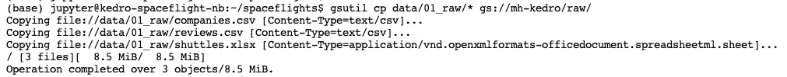

检查站

您可以从云控制台检查 GCS 上的文件:

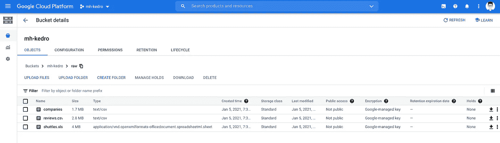

检查站

# 改变太空飞行管道:谷歌云存储

【查看[本回购](https://github.com/mahurtado/spaceflights)中的完整新文件】

这个真的很简单。Kedro 包括许多用于外部集成的[数据集](https://kedro.readthedocs.io/en/latest/kedro.extras.datasets.html)，以及使用[gcsf](https://gcsfs.readthedocs.io/en/latest/)的直接 GCS 支持。Kedro 在[数据目录](https://kedro.readthedocs.io/en/stable/05_data/01_data_catalog.html#)中定义其数据源。

我们只需更改我们的[项目目录文件](https://github.com/mahurtado/spaceflights/blob/main/conf/base/catalog.yml)中的文件名，指向我们的 GCS 存储桶:

在这里使用您自己的存储桶名称。

# 改变太空飞行管道:大查询

kedro 还通过 [pandas-gbq](https://pandas-gbq.readthedocs.io/en/latest/) 包含了一个直接的 BigQuery 集成。不需要更改代码，只需更改目录条目，如下所示:

请注意数据集和表的名称值。参数 **if_exist** 可以取两个值，这里使用 **replace** 在每次执行时创建新数据和删除旧数据。使用 **append** 在每次执行时写入额外的数据，或者如果表已经存在，如果想要给出一个错误，使用 **fail** 。

# 更改 spaceflights 管道:BigQuery ML

现在是时候创建和执行我们的机器学习模型了。使用 BigQuery ML，可以直接用 SQL 代码创建模型。这一次我们必须对原始的 spaceflights 教程代码进行一些修改。

首先，我们向数据目录添加两个新条目。这将用于在我们的新节点之间传递数据。在这种情况下，我们使用数据类型 **MemoryDataSet** ，它不链接到文件，而是直接指向内存。

然后，我们向参数文件添加两个新值:

在最初的**数据工程管道**中，只有很小的改变来创建我们的 MemoryDataSet。查看[节点](https://github.com/mahurtado/spaceflights/blob/main/src/spaceflights/pipelines/data_engineering/nodes.py)和[管道](https://github.com/mahurtado/spaceflights/blob/main/src/spaceflights/pipelines/data_engineering/pipeline.py)源文件中的详细信息。

在**数据科学管道中**是奇迹发生的地方。在[管道源代码](https://github.com/mahurtado/spaceflights/blob/main/src/spaceflights/pipelines/data_science/pipeline.py)中，我们删除了原始的“分割数据”节点，因为我们在模型创建期间直接进行数据分割。

主逻辑在[节点源文件](https://github.com/mahurtado/spaceflights/blob/main/src/spaceflights/pipelines/data_science/nodes.py)中实现。相关部分是:

1.  **模型创建和培训**

这里，我们从保存主数据的表中创建一个模型。一些细节需要评论:

*   使用的模型类型是线性回归。还有很多[其他型号](https://cloud.google.com/bigquery-ml/docs/introduction#supported_models_in)可供选择。
*   标签列是价格。这就是我们用模型预测的结果。
*   在这种情况下，拆分方法是随机的。随机拆分是确定性的:如果基础培训数据保持不变，则不同的培训运行会产生相同的拆分结果。
*   测试和训练数据集由参数**子样本**控制。0.2 表示 20%测试，80%训练。

2.**模型评估**

我们可以使用以下 SQL 代码评估模型:

# 运行修改后的 kedro 项目

现在是时候运行我们的模型了。从您的笔记本终端键入:

```
kedro run
```

输出是这样的:

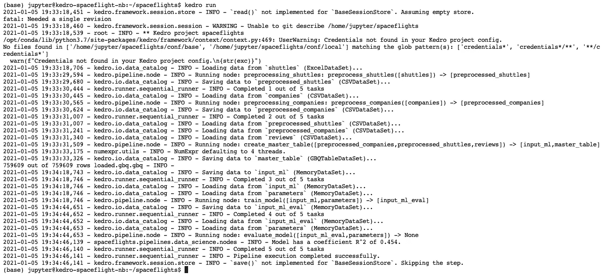

现在 R^2 系数是 0.454。是的，改进这种模式还有很多工作要做。

让我们来看看我们的新渠道:

```
kedro viz
```

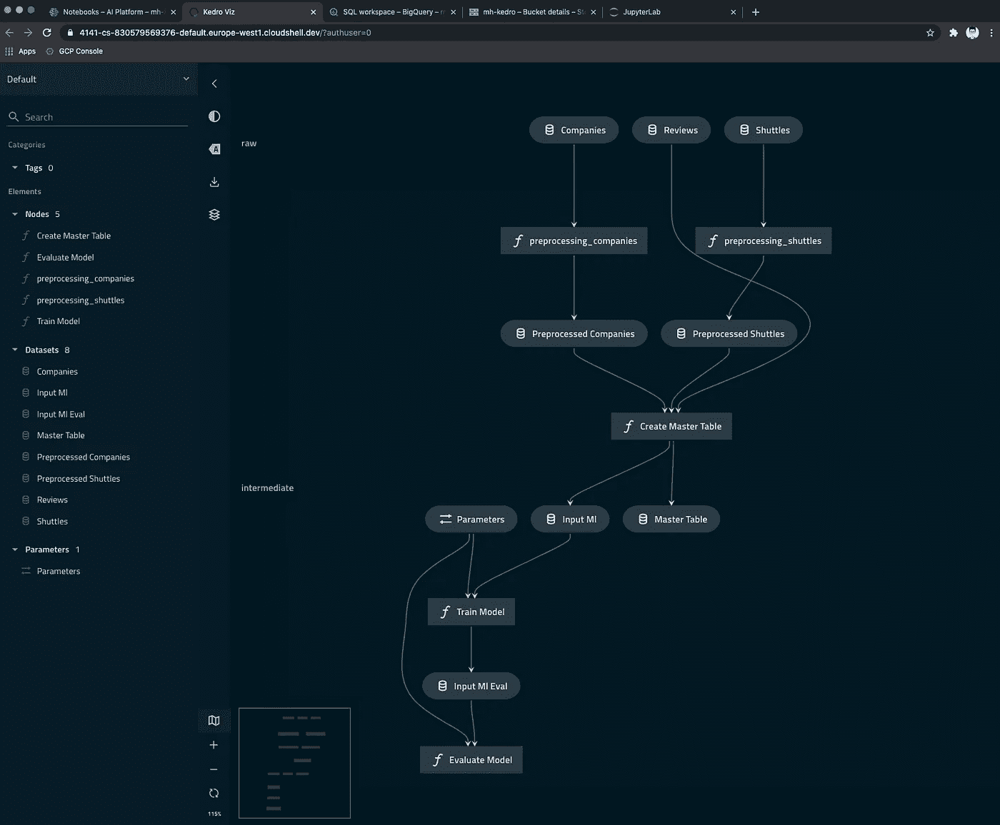

现在是在 BigQuery 中查看数据的好时机。转到云控制台，用您的数据进行实验

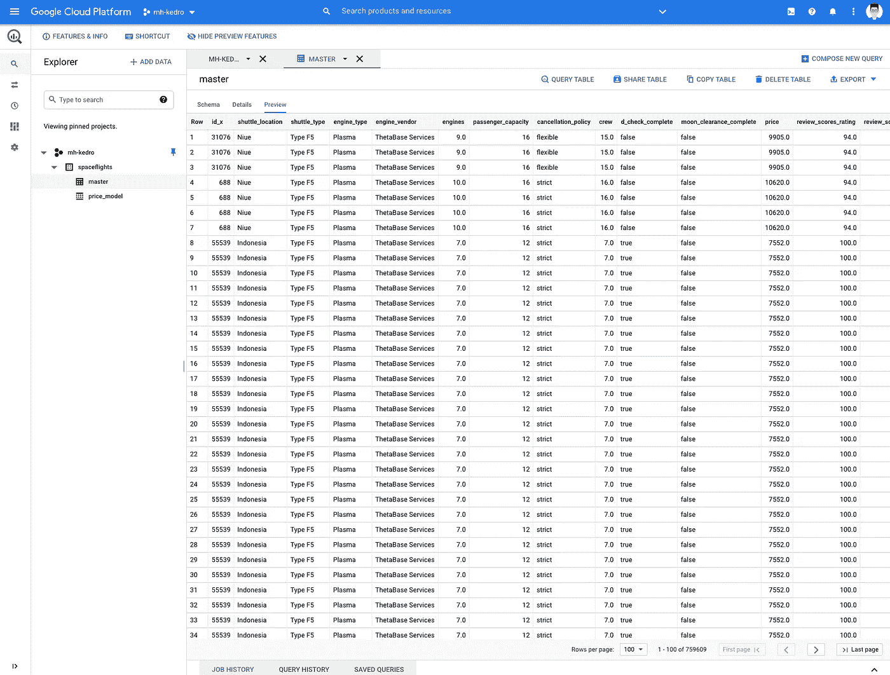

…还有你的模型。

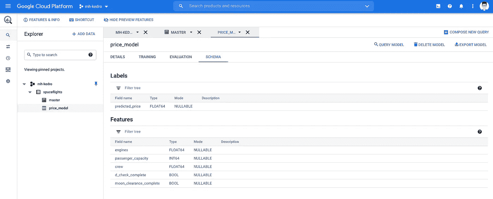

# 打扫

完成后不要忘记清理您的资源，这样您就不会产生费用。

这是我们的月球之旅的结束，我们回到了地球，我希望你喜欢这次旅行！