# 使用 Cygwin 运行 Keras

> 原文：<https://towardsdatascience.com/running-keras-using-cygwin-shell-987d211f3899?source=collection_archive---------34----------------------->

## 如何让你的运营团队骄傲

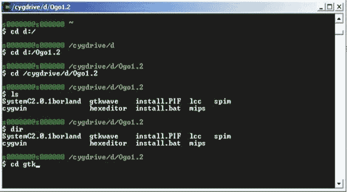

[来源](http://www.es.ele.tue.nl/~ljozwiak/education/5JJ70p/blocks/1/cygwin.html)

# **目的**

几个星期前，我们的一个业务部门成员告诉我，如果他们能够在他们的服务器上运行我们的 DL 引擎，“生活会更方便”。“服务器”这一概念意味着运行在 Cygwin 引擎上，在那里 python 并不总是被安装，如果是，版本是未知的，显然没有像 Keras 或 Pytorch 这样的包可以被安装(由于内部约束)。从他的角度来说，理想的情况是拥有一个执行 DL 任务的 shell 工具。那时我很清楚当我在我的电脑上使用 Torch 或 Keras 时它们是如何工作的，但是拿一个模型并把它们“Cygwin ”?我对此一无所知。可能有些读者现在会说，“这是小事”，他们是对的。然而，当我开始工作时，我发现有许多网站讨论了许多行动，但没有什么是端到端的描述。这就是这个帖子的动机。

## 早期步骤

当我开始工作时，我渴望在 Cygwin 上开发整个解决方案(梦想总是推动你前进)。因此，我采取的早期步骤贯穿于整个 Cygwin 安装程序，并且只是通过使用它。我路上的第一个“站”是**选择套餐**屏幕。

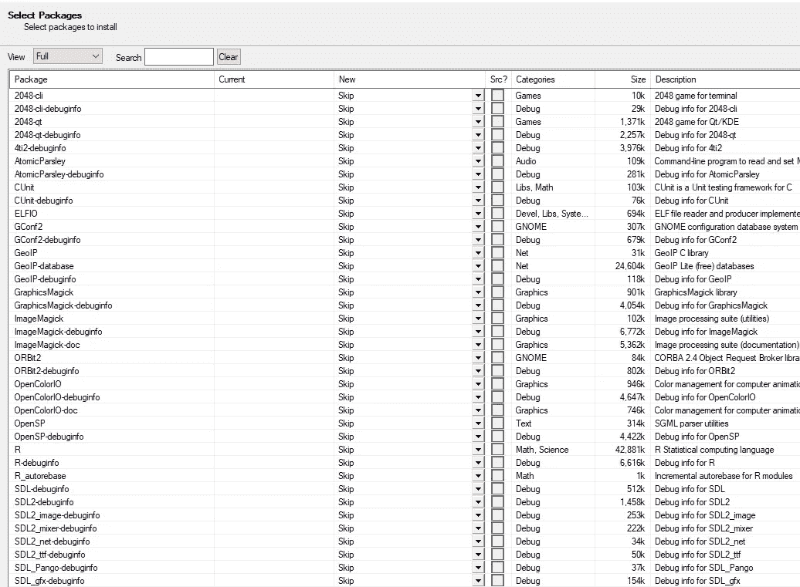

为了添加包，必须将该屏幕设置为**满**而不是**未决。**I**安装 **Openssh git** 和 **curl (** 安装如下图所示)**

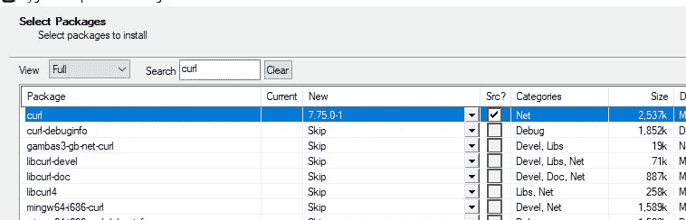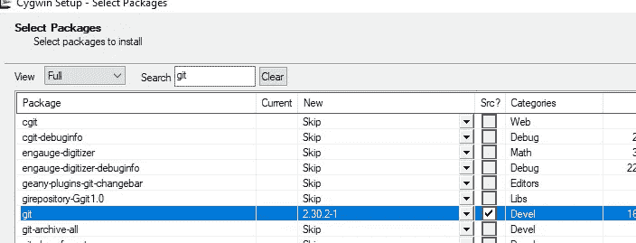

选择这些包并继续安装过程后，可以打开 Cygwin 屏幕并看到以下内容:


我们可以验证我们的装置运行良好

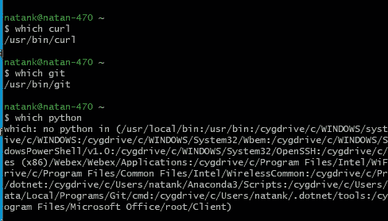

可以看出 **curl** 和 **git** 位于 Cygwin 内。Python？Cygwin 识别了我的 PC 上的 Python(事实上，我假设如果你读了这篇文章，你的 PC 上很可能有一个 Python)。由于这个项目是为不一定安装 Python 的环境开发的，所以我希望整个工作都在 Cygwin 上完成。因此，我返回到安装过程，并在**选择包**屏幕中添加了 Python(显然，Cygwin 提供了许多版本..我没有最喜欢的)

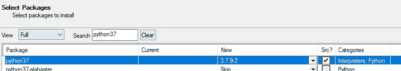

安装后“**哪个 python** 输出这个答案

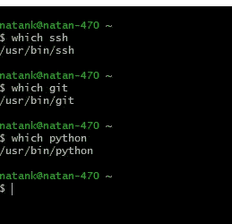

我们甚至可以验证 Python 可以在 Cygwin 中工作，如下图所示:

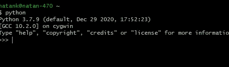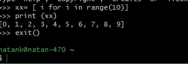

正如我在开始时提到的，目标是让 shell 文件从 Cygwin 屏幕上运行。因此，是时候检查 Cygwin 是否允许这样做了(非常琐碎，但需要测试)。我写了一个小小的玩具文件( **uu1.py** ，我对名字很在行)保存在 Cygwin 下的 **home/username** 里。

```
if __name__==**"__main__"**:
    a=2
    b=a+3
    print(**"gggg "**, a, b)
```

在运行之前，在文件的开头写入:

**#！/usr/bin/python3**

该文件夹是从 python3 的**获得的文件夹**

在 Cygwin 屏幕中，您可以编写

**chmod a+x 文件名**(在我的例子中是 chmod a+x uu1.py)

然后干脆**。/uu1.py.** 我们得到了:


好吧，Python 是管用的。现在我们需要引入一些额外的库(例如 numpy，matplotlib 等。)

显然，我们需要返回到 Cygwin 安装程序。**选择包**允许安装 **numpy** 和 **matplotlib。这个安装非常慢，因为它添加了几个包。。安装完成后，我给 **uu1.py:** 添加了一些代码**

```
if __name__==**"__main__"**:
    a=2
    b=a+3
    xx=[1,1,8]
    plt.plot(xx, **'r'**, label=**"trial Cyg"**)
    plt.savefig(**"mygraph2.png"**)
    print(xx)
    x = np.array([1, 2, 5.])
    print(x)

    print(**"gggg "**, a, b)
    print(np.random.randn(3, 4))
```

他的输出是:

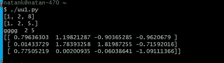

毫无疑问 **numpy** 起作用了。那么 **matplotlib** 呢？

检查文件夹( **home/natank/** )我得到了所需的带有正确图形的文件。对我来说，这就足够了。那些希望从 plt.show()获得屏幕上的图形的人可以在这里阅读

SciPy 怎么样？

你可能注意到了，直到现在，我们根本没有使用 **pip** 。

对于 **Scipy** 来说是需要的。在前进之前，验证您使用的是正确的 **pip** ，即位于 Cygwin 内的 pip

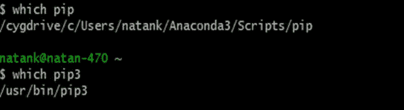

在上面的屏幕中，我们需要使用下面的 **pip** (pip3)。鞋面与另一种蟒蛇有关

如果你在 Cygwin 中没有 **pip** ，你可以从**选择包**屏幕安装它。

安装 **Scipy** 很简单:简单地使用 **pip3 安装 Scipy。**然而，这部分可能会消耗大量时间。尽管已经安装了一些必需的包(可能是在早期安装 **numpy** 和 **matplotlib** 的时候)，我仍然需要返回到**sleeded Packages**并安装额外的包。这里读，这里读，这里读，受益匪浅:。我需要添加整个列表:

*   `**liblapack-devel**`
*   `**libopenblas**`
*   `**wget**`
*   `**python37-devel**`
*   `**python37-paramiko**`
*   `**python37-crypto**`
*   `**gcc-fortran**`
*   `**python-gtk2**`
*   **tcl-tk**
*   `**libpng**`
*   **pkg-config**
*   l **ibffi - devel**
*   **zlib-devel**

在某些情况下，您可能需要添加 **python37-wheel**

现在我设法安装了 **Scipy。**我甚至问过 **uu1.py 的**同意

```
*#!/usr/bin/python3* import numpy as np
import matplotlib.pyplot as plt
import scipy as sc
import os
from scipy.special import cbrt

if __name__==**"__main__"**:
    a=2
    b=a+3
    xx=[1,2,8]
    plt.plot(xx, **'r'**, label=**"trial Cyg"**)
    plt.savefig(**"mygraph2.png"**)

    print (xx )
    x = np.array([1, 2, 5.])
    print (x)
    cb = cbrt([27, 64])
    print(**"scipy "**,cb)
    print (**"gggg "**,a,b)
    print (np.random.randn(3,4))
```

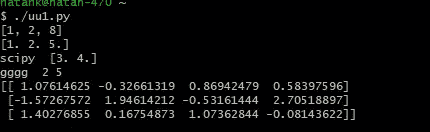

所以一切正常。我现在确信使用 Cygwin 运行 Keras 只需两分钟。但是，正如你可能知道的，一分钟的长度取决于观察者，两分钟可能会变成两天，大部分时间花在与 **Tensorflow** 拒绝错误的斗争上

我必须找到另一个框架。这里提供了一种选择。我决定尝试使用我自己的 Python 创建 exe 文件，并验证 Cygwin 是否支持它

# 在 Anaconda 中创建 Exe

## PyInstaller

据网上说，有几种方法可以创造。Python 中的 exe 文件。我决定测试的包是使用常规 **pip 安装的 **Pyinstaller** 。**

## 它实际上是如何工作的？

我就用下面这个玩具例子 **test_dl.py** :

```
import numpy as np
from keras.layers import Input,Dense,Dropout,concatenate
from keras.models import Model
import sys

if __name__ ==**'__main__'**:

    print (sys.argv)
    inp_dim =int(sys.argv[1])
    batch_size=int(sys.argv[2])
    r0 = np.random.randn(10,2*inp_dim)
    tt = Input(shape=(inp_dim,))
    tt1= Input(shape=(inp_dim,))

    xx=Dense(256,activation=**"relu"**)(tt)
    xx1 = Dense(256)(tt1)
    xx= concatenate([xx,xx1],axis=1)
    xx = Dropout(0.1)(xx)
    xx = Dense(256,activation=**"relu"**)(xx)
    xx = Dropout(0.1)(xx)

    xx= Dense(100,activation=**"relu"**)(xx)
    xx = Dropout(0.1)(xx)

    xx =Dense(1,activation=**"sigmoid"**)(xx)
    model = Model(inputs=[tt,tt1], outputs=xx)
    model.compile(loss=**'binary_crossentropy'**, optimizer=**'adam'**)

    print (model.summary())
    zz = model.predict([r0[:,:inp_dim],r0[:,inp_dim:]])
    print (zz)
    print (sys.argv[3])
```

我们将 CMD 屏幕(或 anaconda 提示符)设置为包含我们的源代码的文件夹，并键入下面的“**py installer—one file file _ name . py**

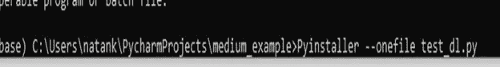

当这个过程结束时，您将在项目查看器中看到两个新文件夹 **build** 和 **dist** 以及一个名为 **file_name.spec** 的文件

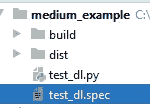

在**区**内你会发现。exe 文件

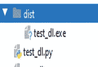

有两种方法可以运行它:

使用 **cd dist** 进入 dist 文件夹并运行(带有 sys.argv 的参数)

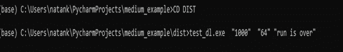

或者复制到 Cygwin 文件夹(home/user/)并如下运行:


## Sys.argv

我假设你们大多数人都熟悉 **sys.argv.** 对于那些不熟悉的人来说， **sys.argv** 是一个包含 exe 文件外部参数(如果有的话)的列表。第一个单元格总是文件的名称。

## 最终外壳文件

目标是:创造一个外壳。这是我们玩具例子中的一个:

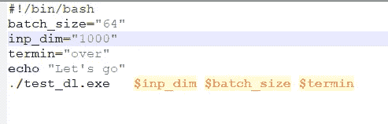

test_dl.sh

我们如下运行它:

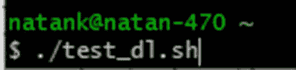

希望这篇帖子对部分读者有所裨益(假设读者的存在)

# 承认

我希望感谢 Yuval Shachaf 花费了大量的时间做这个项目和一些校对工作(剩下的错误是因为我没有听)

## 来源

[https://yourcfriend . com/WP-content/uploads/2019/05/Launching-and-use-Cygwin . png](https://yourpcfriend.com/wp-content/uploads/2019/05/Launching-and-using-Cygwin.png)(图片)

[https://towards data science . com/tensor flow-is-in-a-relationship-with-keras-introducing-TF-2-0-DCF 1228 f 73 AE](/tensorflow-is-in-a-relationship-with-keras-introducing-tf-2-0-dcf1228f73ae)

[https://upload . wikimedia . org/Wikipedia/commons/thumb/2/29/Cygwin _ logo . SVG/1200 px-Cygwin _ logo . SVG . png](https://upload.wikimedia.org/wikipedia/commons/thumb/2/29/Cygwin_logo.svg/1200px-Cygwin_logo.svg.png)