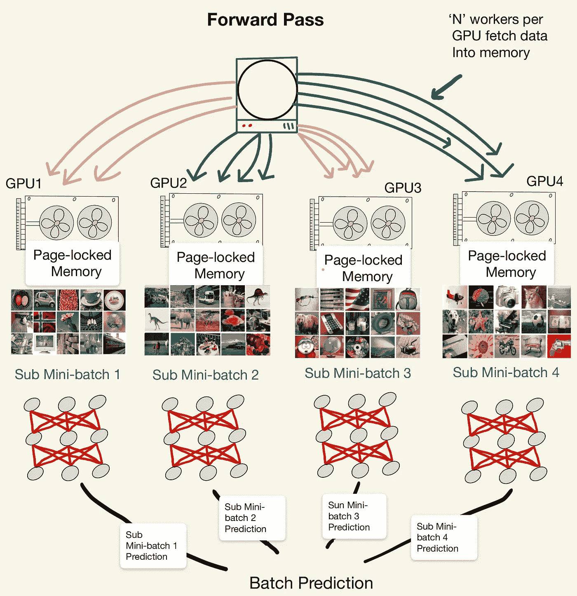
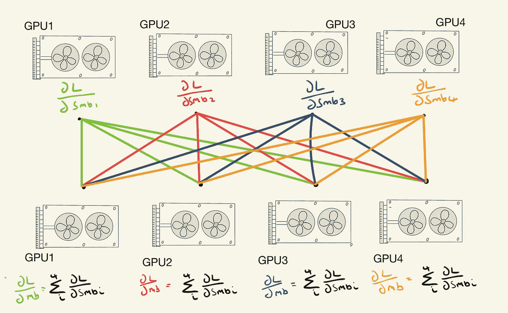

# 使用 Slurm 和 Pytorch Lightning 运行多个 GPU ImageNet 实验

> 原文：<https://towardsdatascience.com/running-multiple-gpu-imagenet-experiments-using-slurm-with-pytorch-lightning-ac90f3db5cf9?source=collection_archive---------21----------------------->


照片由 [imgix](https://unsplash.com/@imgix?utm_source=medium&utm_medium=referral) 在 [Unsplash](https://unsplash.com?utm_source=medium&utm_medium=referral) 上拍摄

## [理解大数据](https://towardsdatascience.com/tagged/making-sense-of-big-data)

从 MNIST 和 CIFAR 的沙坑梦幻世界毕业后，是时候转向 ImageNet 实验了。也许你也站在那里盯着那百万以上的数据集，问自己应该从哪个方向接近这头野兽。在这里，我将给出我采取的一步一步的方法，希望它能帮助你与怪物搏斗。

首先，警告:

*不要低估运行 ImageNet 实验所需的计算:* ***经常需要多个 GPU 每个实验需要几个小时。***

如果你正在读这一行，那么你已经决定你有足够的计算和耐心继续，让我们看看我们需要采取的核心步骤。我的方法在使用 SLURM(我的大学集群)、Pytorch 和 Lightning 的计算集群上使用多个 GPU。本教程假设一个基本的能力，导航他们所有的❤

# 关键步骤

1.在 Lightning 中设置 DDP

2.访问 ImageNet 数据集

3.Bash 脚本指令 Slurm

# 在 Lightning 中设置 DDP

*等等，DDP 是什么？*

问得好，DDP 代表分布式数据并行，是一种允许不同 GPU 和集群中不同节点之间进行通信的方法。有很多方法可以做到这一点，但是我们只讨论 DDP，因为它是推荐的，并且是用 Lightning 实现的。

DDP 在每个可用的 GPU 上训练模型的副本，并为每个 GPU 将一个小批量分成独占的片。向前传球非常简单。每个 GPU 在其子小批量上进行预测，并且预测被合并。简单。



*DDP 的前传。小批量与相同的模型参数一起在每个 GPU 之间平均分配。然后，每个 GPU 计算正向传递，并汇总输出预测*

向后传球有点棘手。DDP 的非分布式版本(叫做，你猜对了，DP)要求你有一个“主节点”,它收集所有的输出，计算梯度，然后将这个传递给所有的模型。

但是，DDP 对中央集权的官僚体制说不。相反，每个 GPU 负责将模型权重梯度(使用其子小批量计算)发送到其他每个 GPU。收到完整的梯度集后，每个 GPU 都会汇总结果。结果如何？每个 GPU 上的每个模型副本都有相同的更新。这种操作的名称是*全归约*操作。



*用于更新每个 GPU 上的模型的 all-reduce 操作。所有的 GPU 都向所有其他的 GPU 发送它们自己的梯度(记住它们是在一个子小批量上训练的),然后它们各自聚合。*

# 好吧，告诉我闪电帮我设置了这个？

是的，确实如此。我假设你有一点闪电经验的读者，所以将只专注于关键的事情去做:

**同步记录**

就像确保梯度更新是相同的一样，您还需要更新您必须考虑到通信需求的任何度量记录。如果不这样做，您的准确性将取决于 GPU，仅基于 GPU 看到的数据子集。

为多个 GPU 进行转换非常简单。只需在所有日志中添加“sync_dist = True”即可。

## 设置 GPU 设备和 DDP 后端

现在我们需要更新我们的训练器，以匹配我们正在使用的 GPU 数量。或者，您可以让 Lightning 计算出您有多少个 GPU，并将 GPU 的数量设置为-1。

如前所述，我使用 DDP 作为我的分布式后端，因此设置我的加速器。这里没什么可做的>>

```
trainer = Trainer(gpus=-1, accelerator='ddp')
```

这就是 Python 代码。根据您设置模型的方式，您可能还需要删除任何。到()或。cuda()调用——这会导致问题。

如果遇到什么困难:[https://py torch-lightning . readthedocs . io/en/stable/advanced/multi _ GPU . html](https://pytorch-lightning.readthedocs.io/en/stable/advanced/multi_gpu.html)

# ImageNet

闪电代码准备好了，是时候抓 ImageNet 了。通过 torchvision 下载数据集不再像以前那么简单。相反，我将给出我发现有效的两个选项

**长版**

[http://image-net.org/download](http://image-net.org/download)

点击上面的并请求访问。这可能需要几天时间才能被批准用于非商业用途。

**短版**

<https://www.kaggle.com/c/imagenet-object-localization-challenge/data>  

转到 Kaggle，加入 comp 并使用下面的 bash 命令下载数据。

```
kaggle competitions download -c imagenet-object-localization-challenge
```

在这两种情况下，当下载到您的集群实例时，您可能希望下载到 scratch 而不是您的主文件空间，因为，嗯，ImageNet 是一头野兽，很快就会超出最大的存储空间。

**创建您的 lightning 数据模块**

您可以像连接其他模块一样连接该数据模块，这样培训就可以按照以下方式进行:

```
data = ImageNet_Module()
model = YourModel()
trainer = Trainer(gpus=-1, accelerator='ddp', max_epochs=90)
trainer.fit(model, data)
trainer.test()
```

当然，您会希望将它放入一个漂亮的 Python 文件中，其中包含您希望 bash 脚本调用的所有铃声、哨声和定制模型。好了，我想我们已经准备好了最后一块胶水，SLURM 脚本。

# SLURM 脚本

至此，所有艰难的工作都完成了。下面我将给出我在我的大学集群上运行的示例脚本作为示例:

当然，你会受到分配的资源和限制的约束，但这应该有助于给你一个基本的轮廓来开始。要使用这个大纲，您需要设置 conda 环境，并在集群上安装所需的库。

# 这是所有的乡亲

好了，就这样了。

如果一切按计划进行，你现在应该在训练过程中。

对于我的设置，一个使用 4x RTX 8000 的现成 ResNet18 模型每个时期大约需要 30 分钟，批量大小为 128。

这是一个 n=1 的例子，说明如何使用 SLURM 和 Lightning 进行 ImageNet 实验，所以我确信在资源、库和版本略有不同的情况下会出现障碍和问题，但希望这将有助于您开始驯服野兽。

# **感谢您阅读❤**

# 使用的工具

*   Pytorch (1.7)
*   Pytorch 闪电(1.2)
*   SLURM 管理器(Uni 计算集群)
*   4 辆原始的夸德罗 RTX 8000