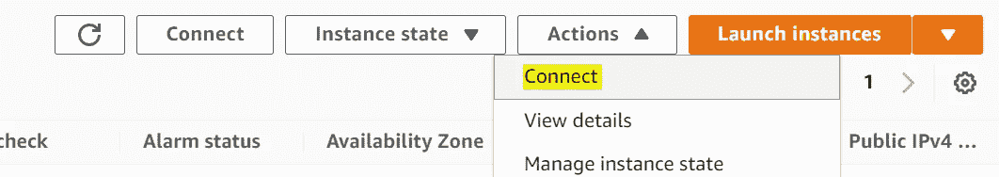

# 在 AWS EC2 上运行 MySQL 数据库——初学者教程

> 原文：<https://towardsdatascience.com/running-mysql-databases-on-aws-ec2-a-tutorial-for-beginners-4301faa0c247?source=collection_archive---------2----------------------->

## 数据科学

## 远程运行和管理 MySQL 数据库


图片由作者提供(使用 Canva)。

在本地计算机上运行数据库很容易，有时在开发阶段就足够了。但是，部署大多数应用程序需要在远程服务器上运行数据库。远程部署数据库的解决方案有成千上万种。本文向您展示了如何在 AWS EC2 服务上创建一个简单的数据库并远程管理它。

本文是为没有云数据库部署经验的初学者编写的。此外，如上所述，有许多基于云和非基于云的解决方案来部署数据库。例如，AWS 有一个名为 AWS RDS 的专用服务，用于在云上部署数据库。我们将在以后讨论其中的一些解决方案，并对它们进行比较。今天，让我们在 AWS EC2 实例上部署一个 MySQL 数据库。

# 步骤 A:启动一个 AWS EC2 实例。

首先，我们需要一个 AWS 帐户。您可以在几分钟内免费设置一个 AWS 帐户。

<https://aws.amazon.com/free/?all-free-tier.sort-by=item.additionalFields.SortRank&all-free-tier.sort-order=asc>  

本文更详细地解释了这些步骤。

<https://dan852.medium.com/how-to-create-an-amazon-aws-free-tier-account-e4cc099a8e94>  

创建您的免费 AWS 帐户并登录后，单击服务(在 AWS 徽标旁边)，并从列表中选择“EC2”(即代表亚马逊弹性计算云，这是一种对云计算机的花哨说法)。


从加载的页面/仪表板中，选择“启动实例”


AWS 向您展示了启动 EC2 实例必须遵循的 7 个步骤。


## 步骤 A1:选择一个 Amazon 机器映像(AMI)

首先，让我们为我们的项目选择一个操作系统。为此，最好的免费选择是 Ubuntu Server 20.04，它符合免费层的条件。


## 步骤 A2:选择实例类型

我们不需要大型机器来测试这个想法。让我们使用一个简单但免费的选项，如 t2.micro。如果我们愿意，以后可以升级它。


单击“下一步”配置实例详细信息

## 步骤 A3:配置实例详细信息

这是至关重要的一步，但是对于这个演示来说，这里没有什么需要真正改变的。你把它压碎了！！！

## 步骤 A4:添加存储

在这里，您必须设置您的存储大小。要获得免费层定价资格，请选择 8GB(默认值)。当处理更大的数据库时，您可能需要增加它(当然，您必须为此付费)。


## 步骤 A5:添加标签

你也可以忽略这部分，直接跳到下一步。

另外，为了将来，请看一下这个[链接](https://d1.awsstatic.com/whitepapers/aws-tagging-best-practices.pdf)，了解 AWS 标记的最佳实践。

## 步骤 A6:配置安全组

在这一步，我们应该配置 EC2 实例上的哪些端口应该向外界公开(包括您和您的本地计算机)。目前，我们只开放端口 22，用于通过 SSH(一种通过互联网或网络在计算机之间进行交互和数据传输的安全协议)连接到我们的系统。您可以根据需要打开不同的端口，如 HTTP 或许多其他端口。出于演示的目的，我们只需要打开 SSH 端口(即 22)。

> 警告:对于这个演示，您不需要打开 MySQL 端口(默认为 3306)来与 MySQL 数据库进行交互。在没有适当的认证和安全措施的情况下对外开放这个端口是非常危险的。稍后我将向您展示如何通过更安全的连接与您的数据库进行通信。


## 步骤 A7:检查实例启动

仔细检查一切，然后点击启动按钮。一秒钟后，会弹出一个窗口，要求您选择一对密钥。密钥对使您能够通过互联网安全地连接到 EC2 系统。密钥是一个`.pem`文件，您必须将它存储在一个安全的地方。

> 警告:任何有权访问此文件的人都可以连接到您的 EC2 机器并使用它。

你有两个选择。首先，如果您已经有一个密钥对，您可以使用现有的密钥。第二种选择是选择一个新的密钥对。在这里，我为这个演示生成一个新的密钥对。我给它一个名字，并在一个安全的文件夹中“下载密钥对”。


您的新 EC2 实例需要几秒钟(有时几分钟)就可以使用了。要检查 EC2 实例的状态，请单击 Services(也在 AWS 徽标旁边)> > > EC2 >>> Instances。

您将看到您的实例列表(或者一个实例，如果它是您的第一个实例)。确保您的实例已准备好(见下图)。


> 警告:请记住在您完成测试后停止或终止您的实例(除非您决定保留它)。一个正在运行的实例在试用期内可能是免费的，但是如果您忘记停止或终止它，您将在试用期后收到来自 AWS 的账单。

## 步骤 A8:连接到 EC2 实例

如果您的 EC2 系统正在运行，现在您可以选择您的实例，并从顶部菜单中选择 Actions >>> Connect。



从打开的页面中选择“SSH client ”,您应该会看到关于如何连接到您的实例的完整说明。在这里，我遵循同样的指示。

基本上，您需要一个名为 SSH Client 的工具来安全地连接到 EC2 机器。如果你的系统安装了 Linux、Mac 或 Windows 10(或更高版本)，你必须安装“SSH 客户端”并准备好运行。一些 Windows 用户应该在开始使用 SSH 客户端之前在他们的计算机上启用/安装它。这里有一个[链接](https://www.howtogeek.com/336775/how-to-enable-and-use-windows-10s-built-in-ssh-commands/)展示了如何做。

打开终端并转到包含 AWS 密钥文件的文件夹(。pem 文件)。对我来说，我将我的密钥文件(`my_test_key.pem`)保存在一个名为`test_mysql_aws`的文件夹中。

```
cd test_mysql_aws

chmod 400 my_test_key.pem

ssh -i “my_test_key.pem” ubuntu@ec2SSSSSS214.us-east-2.compute.amazonaws.com
```

同样，当您在 EC2 仪表板中单击 Connect 时，您可以找到完整的说明。

# 步骤 B:在 AWS EC2 实例上安装 MySQL。

如果您成功地构建并连接到 EC2 实例，那么是时候在您的实例上安装 MySQL 服务器了。我的首选方法是使用 APT 包库管理工具。

```
sudo apt updatesudo apt install mysql-server
```

安装完成后，MySQL 服务器应该会自动运行。您可以使用下面的命令来检查它。

```
sudo systemctl status mysql
```

它必须返回一些关于 MySQL 服务器的信息，比如`Active: active (running)`。让我们以 root 用户身份登录。

```
sudo mysql
```

您现在必须为您的 root 用户设置密码。用强密码替换`your_password_here`。

```
mysql> ALTER USER 'root'@'localhost' IDENTIFIED WITH mysql_native_password BY 'your_password_here';mysql> FLUSH PRIVILEGES;
```

现在，让我们退出并使用 root 凭据登录。

```
mysql> exit$ sudo mysql -u root -p
```

输入您的 root 密码，希望您能回到 MySQL 命令行。

# 步骤 C:创建一个虚拟数据库

虽然这不是本节所必需的，但是我假设您熟悉 SQL 命令。如果您不熟悉 SQL，我强烈推荐您学习这三门课程，但是您现在可以继续学习。

课程一:[https://academy.vertabelo.com/course/sql-queries](https://academy.vertabelo.com/course/sql-queries)

课程二:[https://academy . vert abelo . com/course/SQL-insert-update-delete](https://academy.vertabelo.com/course/sql-insert-update-delete)

课程三:[https://academy.vertabelo.com/course/creating-tables-in-sql](https://academy.vertabelo.com/course/creating-tables-in-sql)

首先，让我们在数据库中创建一个虚拟数据库(`mysql_test`)和一个虚拟表(`test_table1`)。

```
CREATE DATABASE mysql_test;USE mysql_test;CREATE TABLE test_table1 (id INT, name VARCHAR(45));
```

让我们也在数据库中插入一些虚拟数据。

```
INSERT INTO test_table1 VALUES(1, 'Joe'), (2, 'Jane'), (3, 'Jack'), (4, 'Jessica');
```

最后，让我们显示表中的所有数据，以确保没有出错。

```
SELECT * FROM test_table1;
```

在您的 MySQL 应用程序中，您一定会看到如下所示的小表。

```
+------+---------+
| id   | name    |
+------+---------+
|    1 | Joe     |
|    2 | Jane    |
|    3 | Jack    |
|    4 | Jessica |
+------+---------+
4 rows in set (0.00 sec)
```

# 步骤 D:安装 MySQL Workbench 以简化管理

MySQL Workbench 是一个可视化的数据库管理工具。它帮助您在短时间内完成复杂的数据库管理任务，而不牺牲任何灵活性。我们可以在本地计算机上安装这个应用程序，并管理任何本地或远程数据库。

让我们使用这个强大的工具来访问和管理我们刚刚构建的 AWS EC2 实例上的 MySQL 数据库。你可以从[这里](https://dev.mysql.com/downloads/workbench/)下载并安装该应用。安装简单明了，只需点击几下鼠标。这个[链接](https://mysql.tutorials24x7.com/blog/how-to-install-mysql-workbench-8-on-windows)也可以帮你完成安装。

> 记住:对于这个演示，我们将 MySQL Workbench 安装在本地计算机上，而不是 EC2 实例上。

在本地系统上安装 MySQL Workbench 后，您应该会看到如下图所示的第一个页面。


图片由作者提供。

点击 MySQL 连接旁边的+。


图片由作者提供。

给你的连接起一个任意的名字(例如`AWS SQL test`)。从连接方法下拉菜单中，选择“SSH 上的标准 TCP/IP”SSH 主机名是您的 EC2 实例公共 IPv4 DNS 地址。您可以在 EC2 仪表板上找到这个地址，方法是单击您的实例并从选项卡菜单中选择 details。

此外，将 SSH 用户名改为`ubuntu`并找到您的 SSH 密钥文件(即。pem 文件，以便通过 SSH 进行连接)。最后，确保你的用户名是`root`。单击 OK，您的连接应该出现在第一页上。


点击新的连接，它会询问你的 MySQL 根密码。输入密码后，您可以在 Schema 选项卡下看到您的数据库和表(参见下图)。


在查询区域，您可以编写和运行 SQL 命令。键入以下命令，突出显示它们，然后单击 Execute 按钮(如下图中的红色箭头所示)。

```
USE mysql_test;SELECT * FROM test_table1;
```


如您所见，它显示了 AWS EC2 上的`mysql_test`表的内容。MySQL Workbench 可以帮助您方便安全地管理 AWS 上的数据库(通过 SSH 隧道)。

# 摘要

在本文中，您将开始在 AWS EC2 实例上部署 MySQL 数据库。您将学习如何设置 EC2 实例，连接到它，安装 MySQL Server，配置您的服务器，创建一些数据库和表，最后用 MySQL Workbench 管理它们。