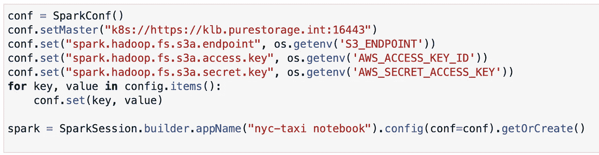
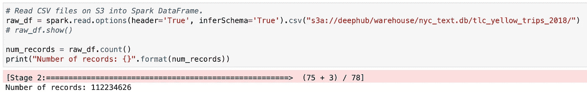
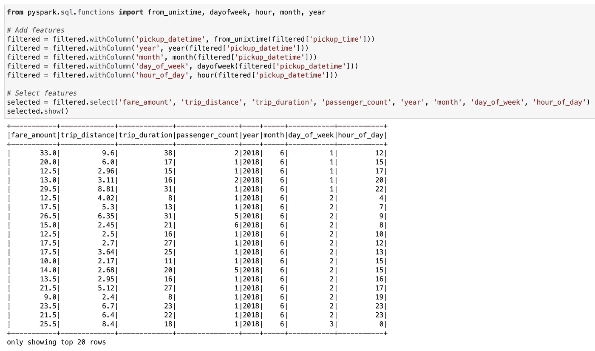
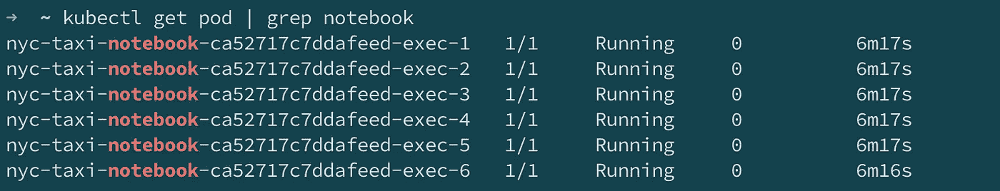
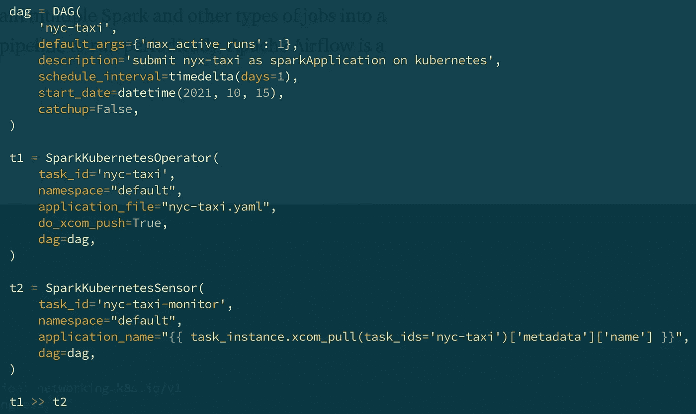
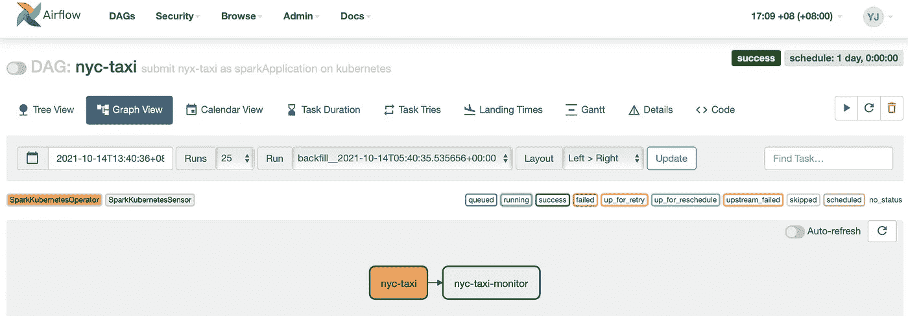
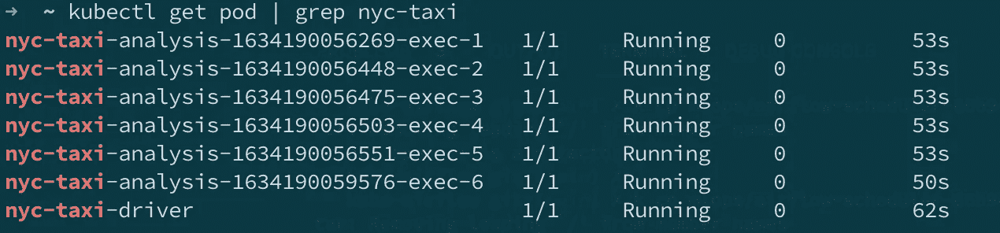

# 在 Kubernetes 上运行 Spark:方法和工作流程

> 原文：<https://towardsdatascience.com/running-spark-on-kubernetes-approaches-and-workflow-75f0485a4333?source=collection_archive---------10----------------------->

## 在 Kubernetes 上为开发、数据探索和生产运行 Spark 作业的最佳方式

拉扎勒斯库·亚历山德拉在 [Unsplash](https://unsplash.com?utm_source=medium&utm_medium=referral) 上的照片

在从事 Apache Spark 应用程序工作的这些年里，我一直在开发和生产环境之间切换。我会使用 Visual Studio 代码之类的 IDE 来编写 Scala 或 PySpark 代码，针对一小部分数据进行本地测试，将 Spark 作业提交给 Hadoop YARN 以在生产中运行，希望它只适用于真正的大数据。我会花大量时间处理本地和生产环境的 Spark 依赖关系，并确保它们同步。对于机器学习应用程序来说，这个工作流变得更加痛苦，因为需要 PySpark、Python 库和 Jupyter notebook 环境的组合。即使对于拥有许多工程师的企业来说，为 Spark 应用程序开发、数据探索和生产运行建立和维护环境仍然是一项挑战。

在 Kubernetes 上输入 Spark。有了 Kubernetes 上的 Spark，以及理想情况下像 FlashBlade S3 这样的快速对象存储，我们可以使用单一环境轻松运行所有这些不同的 Spark 任务。

*   由多个 Spark pods 支持的 Jupyter 笔记本电脑，可用于小型和大型数据的快速原型制作和数据探索。
*   在 yaml 文件中声明一个 Spark 应用程序，并提交它以在生产中运行。
*   Apache Airflow 来协调和调度具有多个作业的管道。

与以前的工作流程相比，这个新的工作流程更令人愉快。我的所有任务都利用相同的 Kubernetes 环境。在容器映像中管理依赖关系，以便它们在开发和生产中保持一致。性能问题可以在开发阶段检测出来，因为大规模测试变得更加容易。最重要的是，不再需要管理 Hadoop 集群。

我在之前的[博客](/apache-spark-with-kubernetes-and-fast-s3-access-27e64eb14e0f)中解释了如何设置 Spark 在 Kubernetes 上运行并访问 S3。这一次，我将描述我在 Kubernetes 上运行 Spark 进行开发、数据探索和生产的新工作流。

# 超级充电 Jupyter 笔记本，带 Kubernetes 上的 PySpark

Jupyter Notebook 对于快速原型开发和数据探索非常方便，因为开发人员和数据科学家可以在其基于 web 的交互式开发环境中直接开始编码。然而，由于它运行在单个 Python 内核中，处理大数据可能会很慢。另一方面，PySpark 允许我们用 Python 编写 Spark 代码并在 Spark 集群中运行，但它与 Jupyter 的集成并不存在，直到最近的 Spark 3.1 版本，它允许 Spark 作业在 Kubernetes 集群中本地运行。这使得从 Jupyter 笔记本电脑处理大数据成为可能。

通过几行代码配置，我们现在可以在 Jupyter 笔记本中编写 PySpark 代码，提交代码在 Kubernetes 集群中作为 Spark 作业运行。

在 Jupyter 的 Kubernetes 会议上发起火花

在示例笔记本 blow 中，我的 PySpark 代码从存储在 FlashBlade S3 的 CSV 文件中读取了 112M 条记录，然后执行了一些功能工程任务。由于记录数量巨大，如果在单个进程上运行，这可能会非常慢。

将 1.12 亿张 S3 唱片读入 PySpark

PySpark 中的特征工程

然而，在这种情况下，在后端，繁重的处理由 Kubernetes 中运行的 Spark 作业来处理。下面是笔记本推出的 Kubernetes 中的 Spark pods。

Jupyter 笔记本推出的 Kubernetes 中的 Spark pods

因为后端是完全分布式的 Spark 作业，所以速度很快。我们现在可以从浏览器处理和浏览 Juypyter 笔记本中的大量记录。

# 简化生产中的 Spark 提交

工作流程的下一步是将 Spark 代码提交给生产部门。曾经讨论过是否应该将笔记本视为生产代码。一些公司如网飞已经在做这个 T2，但是我认为大多数公司还没有做到。在我的工作流程中，我会将笔记本代码复制并提炼为一个 Python 文件，将其放在 S3，在 yaml 文件中声明一个 PySpark 作业，并使用 Spark on k8s 操作符将其提交给 Kubernetes。你可以在我的[以前的博客](/apache-spark-with-kubernetes-and-fast-s3-access-27e64eb14e0f)中找到细节。

在 Spark 3.x 中，向 Kubernetes 提交 Spark 作业有两种方法:

*   使用传统的 spark 提交脚本
*   在 k8s 操作器上使用 Spark

我选择在 k8s 上使用 Spark 操作符，因为它是 Kubernetes 的原生操作符，因此可以从任何有 Kubernetes 客户端的地方提交。使用这种方法，提交 Spark 作业是一个标准的 Kubernetes 命令:`kubectl apply -f nyc-taxi.yaml`。这有助于简化 Spark 提交。它也更加灵活，因为在节点上不需要 Spark 客户机。

你可能已经注意到了，这与我在上面部分中从 Jupyter 在 Kubernetes 会话上启动 Spark 的方式不同，在那里使用了传统的 spark-submit。这是真的，因为我想让 Spark 驱动程序运行在 Jupyter 内核中进行交互式开发。而在生产中，我们需要再现性、灵活性和便携性。

# 协调和安排管道

虽然在 k8s 上的 Spark operator 很适合提交一个 Spark 作业在 Kubernetes 上运行，但我们经常希望将多个 Spark 和其他类型的作业链接到一个管道中，并安排管道定期运行。对此，Apache Airflow 是一个流行的解决方案。

Apache Airflow 是一个以编程方式创作、调度和监控工作流的开源平台。它可以在 Kubernetes 上运行。它还可以与 Kubernetes 很好地集成。我将跳过如何在 Kubernetes 上运行 Airflow 的细节，以及从 Airflow 如何编排 Spark 作业在 Kubernetes 上运行。现在，让我们关注它带来的行为和价值。

在示例 blow 中，我定义了一个简单的管道(在 Airflow 中称为 DAG ),其中包含两个顺序执行的任务。第一个任务使用 Spark on k8s 操作符向 Kubernetes 提交一个名为 nyc-taxi 的 Spark 作业，第二个任务检查在第一个状态中提交的 Spark 作业的最终状态。我还将 DAG 设置为每天运行。

气流中定义的简单管道

在 Airflow UI 上，DAG 看起来是这样的:

气流界面上的纽约市出租车分析 DAG

运行时，DAG 中的第一个任务将在 Kubernetes 上通过 Spark on k8s 操作符启动多个 Spark pods，如`nyc-taxi.yaml`文件中所定义的，就像`kubectl apply`命令一样。

火花舱被气流旋转起来

Airflow 有助于管理多任务工作流的依赖性和计划。因为它重用作业并在相同的 Kubernetes 环境中运行，所以引入气流的开销是最小的。

# 结论

有了 Kubernetes 上的 Spark 和用于数据的外部 S3 对象存储，我的数据工程过程大大简化了。我会打开浏览器，开始快速原型制作和数据探索。感谢 Kubernetes 上 Spark 的强大功能，我不必将我的原型开发和探索局限于一小组样本数据。一旦我熟悉了原型，我就把代码放到 Python 文件中，用一个 Kubenetes 命令修改并提交它，以便在生产中运行。对于复杂的管道，我会用气流来编排作业，以帮助管理依赖性和调度。

这是我的数据工程工作流程。我喜欢我只需要一个单一的环境来实现所有这些。