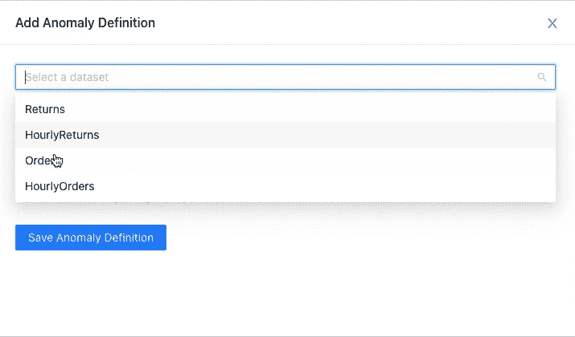
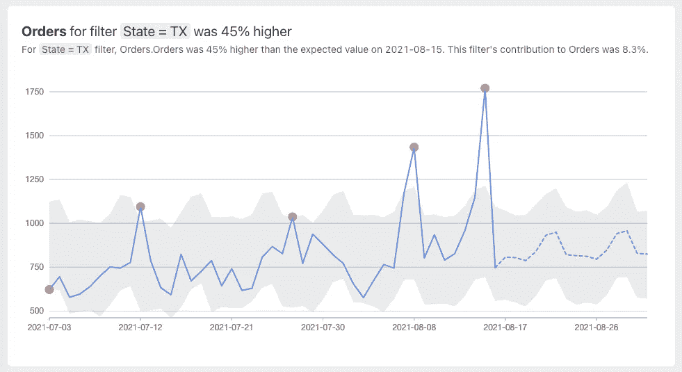

# 对 SQL 数据大规模运行时间序列异常检测

> 原文：<https://towardsdatascience.com/running-timeseries-anomaly-detection-at-scale-on-sql-data-4407eb3d3bd3?source=collection_archive---------12----------------------->

## 多维数据、SQL、熊猫和先知


从[展开的插图](https://undraw.co/)

时间可能是衡量标准最重要的维度。

在商业世界中，业务主管、分析师和产品经理会随着时间的推移跟踪指标。

在创业领域，风投希望指标周环比增长 5%。

在公开股票市场，长期投资者按季度评估指标，以做出买入/卖出决定。短线交易者以小得多的时间粒度——几分钟或几小时——监控股价，以做出同样的决定。

在系统监控领域，团队以秒或分钟为基础跟踪指标。

在数据科学领域，时间序列分析是工作的重要组成部分。

尽管时间可能是数据中最重要的维度，但数据确实有许多其他维度。这些维度具有不同的基数。一些高基数维度可能有数千个唯一的维度值。

手动监控数千个维度值及其组合的指标几乎是不可能的。这就是时间序列分析，尤其是时间序列异常检测派上用场的地方。

# 对业务数据运行异常检测的挑战

1.  **大多数业务数据都在 SQL 数据库中**

时间序列分析需要时间序列数据作为输入。但是大多数业务数据是表格形式的，存放在关系数据仓库和数据库中。分析师通常使用 SQL 来查询这些数据库。我们如何使用 SQL 来生成时间序列数据？

**2。如何按维度拆分指标？**

一些尺寸可以有数千个唯一的尺寸值。对所有维度值运行异常检测将是昂贵且嘈杂的。我们如何只为我们的分析选择重要的维度值？

**3。大规模异常检测成本高昂**

假设你为一家在线零售商工作。你的商店销售 1000 种产品。您希望对这 1000 种产品中的每一种产品的每日订单运行异常检测。这意味着:

*指标数= 1(订单)
维值数= 1000 (1000 件产品)
指标组合数= 1000 (1 个指标* 1000 个维值)*

这意味着异常检测过程每天必须运行 1000 次，每个指标组合一次。

假设您想要通过另一个维度—州(50 个唯一值)来监控订单。您还希望通过这两个维度的组合来监控指标。这意味着异常检测过程现在每天必须运行 51，050 次。

*51，050 = (1 个指标* 1000 个产品)+ (1 个指标* 50 个州)+ (1 个指标* 1000 个产品* 50 个州)*

为了了解基础设施的定价，我们来看看 [AWS 异常检测](https://aws.amazon.com/quicksight/pricing/)服务的定价。AWS 将向您收取每月 638 美元的费用，用于每天跟踪 51K 个指标组合。

这就是你运行异常检测程序所要支付的费用。在流程每次运行之前，您需要运行一个查询来从数据仓库中提取数据。51K 指标组合意味着每天对您的数据仓库进行 51K 次查询，这是额外的成本。

这还只是云基础设施的成本。

**4。大规模异常检测有噪音**

这 51K 个度量组合中的每一个都有可能成为异常。即使这些组合中有 0.1%被证明是异常，对于一个指标，您每天都会看到 51 个异常。

您或您的团队每天有足够的带宽对如此多的异常情况采取行动吗？大概不会。

如果你不对这些异常采取行动，这些异常不会增加任何商业价值。相反，它们只会增加你的成本。

**5。当检测到异常时，如何深入挖掘并进行根本原因分析？**

假设您有以下异常情况:

> **昨天**状态= CA** 的订单**减少了 15%

这可能会引发如下问题:

*   该州所有城市的订单都减少了吗？如果不是，是哪些城市？
*   所有产品的订单减少了，还是特定的几个产品的订单减少了？

怎样才能快速回答这些问题？

面对这些挑战，我们开始构建[**cue observe**](https://github.com/cuebook/CueObserve)**。下面是我们如何解决这些问题。**

## 1.创建虚拟数据集

数据集类似于数据的聚合 SQL 视图。我们使用聚合函数编写 SQL GROUP BY query 来汇总数据，将其列映射为维度和指标，并将其保存为虚拟数据集。

以下是 BigQuery 的 GROUP BY 查询示例:

## 2.定义异常

我们现在可以在数据集上定义一个或多个异常检测作业。异常检测作业可以在聚合级别监控指标，也可以按维度拆分指标。

当我们按维度分割指标时，我们限制了唯一维度值的数量。我们使用三种方法之一来限制:

1.  **前 N 名**:基于尺寸值对度量的贡献的限制。
2.  **最小百分比贡献**:基于尺寸值对度量贡献的限制。
3.  **最小平均值**:基于指标平均值的限制。



作者图片

## 3.执行数据集 SQL

作为异常检测过程的第一步，我们执行数据集的 SQL 查询，并以 Pandas 数据帧的形式获取结果。该数据帧充当识别维度值和异常检测过程的源数据。

## 4.生成子数据帧

接下来，我们创建新的数据帧，实际的异常检测过程将在这些数据帧上运行。在此过程中，我们通过对维度进行过滤来查找维度值并创建子数据框架。需要创建子数据框的维度值由上述 3 个维度分割规则之一决定。例如，如果维拆分规则是 Top N，则内部方法会确定前 N 个维值并返回一个字典列表，每个字典都包含维值字符串、其百分比贡献和子数据框架。

提到的子数据帧只是在过滤了特定的维值并删除了除时间戳列和度量列之外的所有其他列之后的数据帧。

```
datasetDf[datasetDf[dimensionCol] == dimVal][[timestampCol, metricCol]]
```

## 5.聚集子数据帧

准备子数据帧的一个重要步骤是聚合时间戳，这可以在前面的代码片段中看到。

```
"df": aggregateDf(tempDf, timestampCol)
```

这种聚合包括在时间戳列上对过滤后的子数据帧进行分组，并在度量列上对其求和。我们还将时间戳列重命名为“ds ”,将指标列重命名为“y ”,因为 Prophet 要求 dataframe 列也这样命名。

## 6.生成时间序列预测

我们现在将时间序列数据帧输入到 Prophet 中。每个数据框架都在 Prophet 上单独训练，并生成预测。在聚集之后，每个数据帧必须具有至少 20 个数据点，因为少于 20 个数据点将是太少的训练数据，不能获得合理的好结果。关于数据帧的粒度，还需要考虑其他一些因素，如 Prophet 做出的预测数量以及训练数据间隔。对于每小时的粒度，我们只在最近 7 天的数据上训练 Prophet。

我们用预定的参数和区间宽度初始化 Prophet，以获得合理的宽置信区间。稍后，我们计划让这些设置也可以配置。在获得未来的置信区间和预测值后，我们将所有大于零的预测值裁剪掉，并从 Prophet 的输出中删除所有多余的列。

## 7.检测异常

接下来，我们将实际数据与 Prophet 的预测数据以及不确定性区间带结合起来。这些波段估计数据的趋势，并将用作确定数据点异常的阈值。对于原始数据帧中的每个数据点，我们检查它是否位于预测带内，并相应地将其分类为异常。

最后，我们将流程的所有单个结果与元数据一起存储在一种易于可视化表示的格式中。下面是一个异常可视化的例子。



作者图片

# 结论

为了对多维业务数据运行异常检测，我们通过查询编写一个 SQL 组，将其列映射为维度和度量，并将其保存为虚拟数据集。然后，我们在数据集上定义一个或多个异常检测作业。我们限制尺寸值的数量，以最大限度地减少噪音并降低基础设施成本。

当异常检测作业运行时，我们执行数据集 SQL 并将结果存储为 Pandas 数据帧。我们从数据帧中生成一个或多个时间序列。然后，我们使用 Prophet 为每个时间序列生成一个预测。最后，我们为每个时间序列创建一个可视卡片。