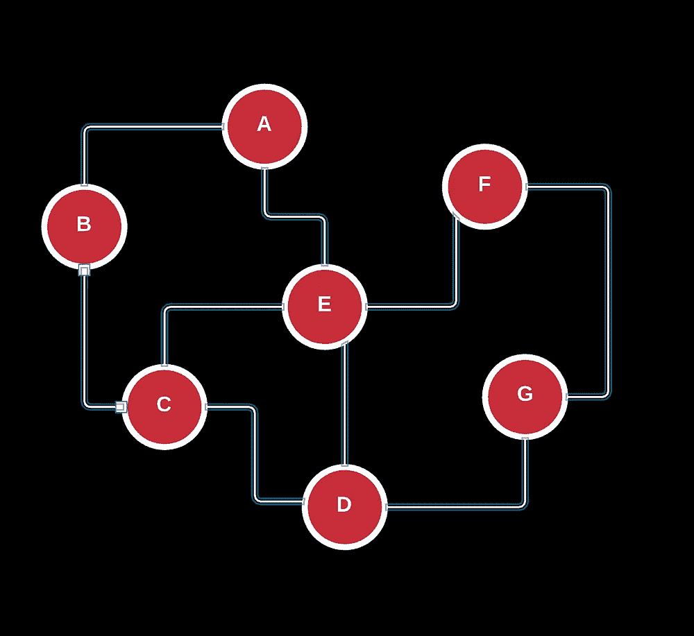
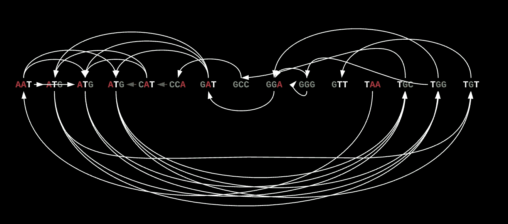
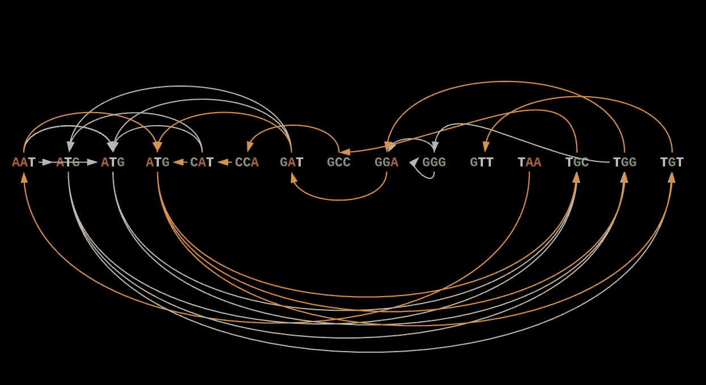

# 俄罗斯桥、欧拉回路和基因组组装？

> 原文：<https://towardsdatascience.com/russian-bridges-eulerian-circuits-and-genome-assembly-9fd1d84832e9?source=collection_archive---------26----------------------->


> 这是我试图更好地解释数学、生物和计算机科学的交集。文章中用于理解的最严格的例子都在 Pavel Pevzner 和 Phillip Compeau 的[书](https://www.bioinformaticsalgorithms.org/)中，但是由我进行了格式化和扩展。

**数学和生物学的交叉确实是一件值得思考的美好事情。**当然，我们的 DNA 遵循的基本原则与世界上几乎所有的东西都一样是有道理的(*数学*)，但是这些点以这样一种方式连接起来，使得一切都变得非常清楚。

当我继续在生物学和工程学的交叉领域工作的时候，像这样的想法几乎是我理解和欣赏生物学的核心，也是我为什么喜欢它的首要原因。

一个非常重要的例子是*图论与一个关键过程的独特*交叉，这个关键过程是生物学中每一个重大发现的先驱:基因组组装。

**我写这篇文章的目的**不仅是为了帮助你了解更多关于计算生物学的知识，也是为了解释为什么我认为每个人都应该为计算生物学而疯狂，并通过一个简单明了的例子来说明它的潜力。

好吧，我谈了很多关于数学和科学的诗意，但是技术层面呢？**为什么理解图论和再造我们的基因组如此重要？**

## 这一切都始于对人类基因组的整体理解。

我将让麻省理工学院的大卫·吉福德来解释为什么基因组组装是令人着迷的，因为他总结得很好。

> “(基因组组装)是所有现代生物学的基石。在研究进化、观察基因结构方面，我们几乎所有的事情都依赖基因组参考……这真的是一个非常基本的概念。

基因组组装指的是组织 DNA 的子成分以获得可以描述整个生物体的遗传信息的表示的过程。

例如，人类基因组只是我们身体使用的每一个 DNA 序列的目录。把它想象成人类的字典。如果你上过高中生物课，你会知道人类有 23 对染色体(染色体是几个 DNA 分子的浓缩版本)。

当然，每条染色体都由一个与这些 DNA 分子结合的组蛋白骨架组成，当我们对每个基因组中每一个独特的 DNA 序列进行测序时，我们得到了一个非常长的序列字典，几乎有**30 亿个碱基对长的** DNA。

持怀疑态度的科学家或工程师可能会看到这种情况，并说“**30 亿个碱基对太长了。我们究竟如何一次读取这么多数据？”**

你没有错。对 30 亿个碱基对进行测序不仅在计算上很困难，而且我们的技术仍然无法一次性对一个基因组进行测序，主要是因为提取超长序列带来的**信息损失。**

如果你还记得[人类基因组计划，](https://en.wikipedia.org/wiki/Human_Genome_Project#:~:text=The%20Human%20Genome%20Project%20(HGP,physical%20and%20a%20functional%20standpoint.)正是因为这个原因，绘制整个人类基因组的比赛非常艰难。

实验室中的生产挑战，如获得足够的样本、防止污染、获得实际序列的准确表示和绘制其功能图，都是我们正在慢慢克服的一些主要障碍([我们今年刚刚完成了整个基因组的测序)](https://www.theatlantic.com/science/archive/2021/06/the-human-genome-is-finally-complete/619172/)。

这些都是基因组组装中的基本问题。**为了测序或读取你的基因组，你首先需要找到一种方法来获得你的基因组的较小代表，然后将它们放在一起启动测序。**

现在，我们能够对“人类基因组”进行测序，是的，但是地球上的数十亿人和我们能够对其基因组进行测序的其他生物呢？如果我们能找到更好更准确的方法来组装我们的基因组，我们能对自己和周围的世界了解多少？

这是前提。为了首先对你的基因组进行测序和解释，你首先需要能够组装它。

## **我们如何最有效地组装生物体的基因组？**

基本原理是，我们希望从几个 DNA 副本或**重叠群**中收集一组片段，这些片段包含中心但不相关的信息，然后将它们组合起来，以找到这些片段的正确顺序。

**重叠群**或连续序列通过鉴定特定重叠群之间重叠区域的支架进行组合。我们可以以阅读对的形式将某些重叠群重叠在一起。这可以被认为是一个单词的前缀和后缀，我们可以用它们来排列单词，使我们的字典按照字母排列。

另一种思考方式是，我们的序列中有一些缺口，因为我们最初可能丢失了一些读数。

如果你知道这些重叠群的最后部分和第一部分是什么，你可以用在它们各自的开始和结束处包含这两部分的重叠群来桥接它们。

在此之后，你可以使用许多不同的管道来排列和排序这些支架，例如**序列标签位点**，它可以帮助在实际的染色体中排序某些支架。最终，这些可以被推断和解释，以产生最终的基因组图谱或我们类比中的字典。

这个过程被称为 ***从头全基因组鸟枪组装*** ，看似简单，实则不然。初始扩增或变性引起的突变或无序阅读等问题都使这一过程复杂化，更不用说让我们难以找到这些重叠群应该排列的确切顺序。

**一些问题和关键障碍包括但不限于:**

1.  由于 DNA 是双链的，没有办法知道给定的读数来自哪条链，这意味着我们不知道对于特定方向(3 '或 5 ')的给定重建是使用读数还是其反向互补。
2.  从左到右阅读基因组不是很有用，因为当你向序列中引入新的核苷酸时，大多数算法的复杂程度会增加。你不仅不确定你在寻找什么样的片段、模式或统计异常，而且随着长度的增加，缩小这个范围变得更加困难。
3.  现代测序机器经常出现错误，这使得很难具体地“读取”完整的基因组。→测序错误使基因组组装变得复杂，因为它们通常会阻止我们识别重叠的读数
4.  由于缺乏知识，基因组的一些区域可能没有被任何读数覆盖，使得不可能重建整个基因组。这些往往是我们自己理解中的盲点，而计算测序方法和基因组图谱可以帮助预防。


WG 鸟枪测序->我们从一组 DNA 拷贝中随机选择不同的重叠群。

这被称为从头组装，我们需要在没有任何先验知识或参考的情况下，从零开始组装一组读数。

**一个快速的** **迂回** : S/O 到[麻省理工学院开放课件](https://www.youtube.com/watch?v=ZYW2AeDE6wU):我们可以根据我们所拥有的覆盖率，设计一个特定于基因组的算法。覆盖率是我们在所有读数中总共有多少核苷酸以及它们占整个基因组长度的百分比的另一个名称。


M =以核苷酸计的基因组大小| p = pair_end 长度| r = read 长度| Sgb =基因组大小

我们可以使用泊松分布*来模拟碱基在我们的读数中是否被覆盖的概率*，因为我们拥有的数据本质上是随机和独立的。 ***覆盖率*** 可以认为是分布的 or 均值，因此在这种情况下方差也等于覆盖率。请注意，覆盖率是相对于整个基因组而言的。


因此，如果我们试图找到一个基数未被覆盖的概率，它将构成图的一部分，直到平均值或(因此是 x 的阶乘！)因为我们在努力求每个概率的和。


泊松分布公式-> k 是给定指数下核苷酸的频率

这为什么有用？嗯，你可以用概率来找到关键的重叠点，尤其是你阅读中的重复部分。

恢复正常: TLDR: DNA 组装很重要，很有挑战性，但解决起来也很有趣。我只讨论了 DNA 组装，但是我们如何把它变成一个计算问题呢？

## 从随机字符串到方法的框架问题。

我们需要马上认识到我们的问题中的一些事情。首先，我们可以**假设覆盖率几乎是完美的**(这实际上是不现实的)，但确实有助于在早期建立直觉。我们还知道**这些读数大部分长度相同，**这样可以很容易地帮助我们识别重叠。


长度为随机构型或 3 聚体-> 3 个核苷酸

鉴于我们对组装所述基因组的初始方法的了解，很明显，我们可以通过*观察它们的重叠区域* **(前缀和后缀)**来建立顺序，从而组装这些配置。


我们知道 GCC 与 CCA 重叠，那么 CAT 与 CCA 重叠，以此类推。

基于它们的前缀或后缀是否与集合中的任何其他 *k-mer* 重叠，可以使用相同的系统来找到排列中的第一个和最后一个 *k-mer* 。在我们这里，这是 TAA 的 **TA** 和 GTT 的 **TT** 。


这些读数可以基于它们的重叠按如下顺序排列。


根据上面的顺序和一系列步骤，很明显这种方法对于找到最终的输出并不那么有用，因为我们可能会陷入**局部最小值** ( *低深度排序*)。尽管如此，还是有可能在几次随机迭代后得到最终输出。


天真的方法->找到任何重叠的读取

但是正如我上面所说的，这对于基于试错法的更小的读取集合来说可以很好地工作，但是由于重复的 *k-mers* 或重叠区域，它仍然会变得有问题。

虽然一些重叠区域在给定的一组读数中可能更常见，但其他的不太可能，因此您可能有几个潜在的选项和路径，**可能会导致您出现不正确的排列**(注意，这甚至没有考虑潜在的突变和错误)。

**有效计算重叠的概率几乎是不可能的，因为这种概率仅仅取决于重叠的种类和整个读取集。**

取序列**atttatatttat**和 2 读取 **TT 和 AT。TTA 出现在序列中的概率是 5/14，等于 AT，但实际上，TT 出现的概率比 AT 高得多，因为 TT 可以与自己重叠。同样，这是一个简化的例子，但是重复确实使得找到正确的重叠更加困难。**

基于这个简化的例子，我已经清楚地表明随机迭代和猜测检查是一个非常低效的想法。这就是我们的数据表示变得非常有用的地方，不仅可以删除冗余的读取，还可以找到客观上正确的快速简单的路径。

## 图论、循环和符号的快速介绍。

首先，要知道图表实际上只是可视化数据之间联系的一种奇特方式。数据是图中的节点，连接是边。


图的节点和边->这是一个有向循环图，其中每个节点指向另一个节点

以下面这个为例。这就是所谓的 ***有向图*** ，它展示了一对一或一对多的关系。

这里，*我们看到一组标为 V 的节点和一组标为 e 的边或关系，*利用这些，我们可以画出连接来描述这些相邻的对是如何相互连接的。

现在，假设我想让你找到 a，b，c 作为一个字符串的所有可能的组合，以字母 a 开始。有了这个可视化，很明显你可以通过在图上走两个不同的**步**来创建两个表示: **(a - > b - > c)** 和 **(a - > c - > b)** 。注意因为图是有向的，所以我们不能做 **(a- > b- > a)** 之类的。

在我们的例子中，这对于查找订单和安排非常有用，从而大大降低了图形的复杂性。这为我们的问题提供了约束，可以用图论来表达和解决。

还有其他图形，如**加权有向无环图(神经网络)、无向图、树和有根树的树状部分、二分图等等。**



无向、加权、完全和有向非循环(从左到右、从上到下)

如果你已经注意到了，图通常通过方向、它们的边/连接的性质( **u 和 v)** 以及循环的数量来区分。

在我们的可视化中，有很多问题包含图论，从最短路径问题(您的 GPS 路线)，测量连通性和平衡(是否所有节点都以某种方式在某些限制下相互连接)，以及找到自包含、强连接的组件。

## 有向图和字符串图重叠布局共识

为了更容易地表示我们的阅读和重叠，我们可以回到符号的前缀和后缀。假设一些前缀连接到其他后缀，并且有几个重复，我们可以构建一个**图，特别是一个有向图**，它的节点代表实际的读数，边代表前缀或后缀。



有向连接图->节点是读数，边代表重叠前缀/后缀

这种方法正式称为**重叠**–**布局**–**一致性**方法，其中每个读数映射到图中序列中的每个其他读数，重叠由边决定。

注意这是一个**平衡的、强连接的图**，其中通过一些路径，每个节点或配置连接到另一个。我还生成了下面的一些代码示例，以帮助您处理和试验这一点

下面是我们的图的字典和距离矩阵表示。你在这里真正要解决的是给定的事实，即每个阅读是相同的长度和相同的重叠，你实际上是试图从一组阅读中找到最短的字符串序列，通过最大化每个阅读与另一个阅读的重叠程度(增加覆盖率-> 1)。


功能输出

给定这个图表，我们怎样才能找到最终组装基因组的正确顺序和方向呢？

如果我们从一个图来看，我们知道可以通过访问每个节点或只读取一次来找到最优解，而到达那里的唯一方法是找到我们应该访问的读取的理想顺序。这比看起来要困难得多，因为大多数图都可以是循环的，或者因为重叠部分的重复而具有独立的组成部分。

## 这种行走被称为哈密尔顿路径**。**

***哈密尔顿路径*** 是一种特殊的图的行走，其中图中的每个节点被恰好访问一次，而不管它是如何到达那里的。如果在我们的行走过程中，我们到达了我们开始的同一个节点，这就是所谓的哈密顿回路。



橙色路径突出显示了连续连接每个节点的哈密顿路径

同样，这似乎很容易解决，但事实是，这个问题被认为是 NP 完全的。为什么？因为求解哈密顿回路的唯一方法，是我们最初尝试过的蛮力方法。

你可以从 CSC 463:[http://www.cs.toronto.edu/~ashe/ham-path-notes.pdf](http://www.cs.toronto.edu/~ashe/ham-path-notes.pdf)这里看到这个证明

我撒了个谎，我们这个具体例子的图示。强力算法被认为具有 O(N)的时间复杂度。虽然蛮力算法可以最小化路径上的总成本，或者简单地说，找到由所有读取组成的最短公共超串，但这不适用于数亿次读取。

## 那我们现在怎么办？让我们稍微重新组织一下这个问题。

我认为一个计算机科学专业的学生可能不会选择使用贪婪的字符串算法，这很好，因为在一个典型的基因组中有重复的阅读。

因此，我们可以尝试最大化重叠，这样当两个重复设置在一起时，您会被卡住。**这越来越令人困惑了。让我们再细分一下。**

我们知道，我们的**重叠群**的图形表示的属性需要是这样的，即路径必须能够连接所有可能的重叠群而不重复。

我们想补充的另一点是，我们想要图的简化表示，或者说**图应该是解开的。**

在这种情况下，我们不能将 *k-mers* 表示为节点，因为有向边仅表示与下一个节点的前缀重叠的后缀。相反，**如果我们想要最大化重叠和覆盖，您会想要实际的前缀和后缀作为图**中的节点，而 *k-mers* 作为连接每个节点的边或胶水。


对于真实世界的数据，大多数收集的重叠群将具有来自多个拷贝的重复，**它们可能具有潜在的突变，或就此而言的漏读**。如果我们使用哈密顿量来绘制路径和序列，它*会限制稍后使用特定超参数重建基因组的能力，例如错误阈值*(称为汉明距离)*或消除重复*(我们将在稍后讨论)。


德布鲁因图和方法

请注意，如果我们决定改变前缀和后缀的实际长度，同时保留实际读取的边内容，这种表示会如何变化。

这也允许我们减少图中的总边数。对于传统的哈密尔顿函数，从一个节点到另一个节点可能有几个连接，而在这里，*每个前缀仅通过由它们的重叠产生的读数连接到特定的后缀，而没有其他。*

例如，如果我们有重复的读取，如上述示例中的 ATG，则哈密尔顿函数将不得不为这些读取指定单个节点，因为要使哈密尔顿路径工作，每个节点都必须被访问一次。因此，您不能重叠任何节点来简化图形。

这在具有哈密尔顿步行的重叠图的正式定义中被清楚地概述:

> 一个**图**是一个**重叠图**，如果它的顶点可以与直线上的区间一一对应，使得两个顶点相邻当且仅当区间**部分重叠**，也就是说，它们有非空交集，但都不包含另一个。

在这个新的图中，由于我们的新表示将读数存储为图中的边而不是节点，我们现在可以将路径的新标准定义为**任何恰好通过图中每条边一次的行走。**

我们的循环将会是同样的事情，但是在我们开始的节点结束。

这张图被称为**德布鲁因图**，非常有用。

De Bruijn 图也是有向图，但是具有**欧拉图**的性质。这是什么意思呢？

## 嗯，你听说过哥尼斯堡七桥吗？

哥尼斯堡市有七座桥，让游客可以跨越普雷格河的不同河段。


这座城市想要找到一条道路，这样游客可以从任何一座桥开始，穿过城市中的每一座桥回到同一座桥。本质上，这被称为我们的**哈密尔顿路径**，但这是不可能的。

这是因为对于为真的哈密尔顿路径，每个节点必须有偶数度，而在这里，每个节点有奇数度。

然而，莱昂哈德·欧拉提出的解决方案满足了一部分约束条件。他指出，该图有一条 ***欧拉路径*** ，在这条路径上，每个游客都有能力恰好穿过每座桥一次，但永远不会回到他们出发的地方。

## 所以让我们介绍一下欧拉图、路径以及它们之间的一切。

如果有一条路(欧拉路)恰好访问图中的每条边一次，则该图可以是欧拉图。然而，不是每个图都有欧拉路径，也不是每个有欧拉路径的图都有欧拉环。

这些属性对基因组组装有些用处，但是让我们来确定欧拉图的一些属性。一个有向图只能是欧拉图，如果每个顶点与其中两个顶点的距离相等，其中一个顶点的进出度为 1，另一个顶点的进出度也为 1。


[欧拉](https://www.google.com/url?sa=i&url=https%3A%2F%2Fslideplayer.com%2Fslide%2F10790188%2F&psig=AOvVaw3nfLX1OF6ERiAjE-4nYHZb&ust=1626278138751000&source=images&cd=vfe&ved=0CAsQjhxqFwoTCKiH95q04PECFQAAAAAdAAAAABAJ)循环和路径

为什么这很重要？好吧，我们先定义一下学位是什么意思。**一个节点的度由连接到该节点的边数与该节点连接到其他节点的边数之差决定。**


节点的度是其入度和出度之差

为了让我们能够开始一条欧拉路径，起始顶点只需要有一条回到节点的路，因为那会让路径终止。


原图[鸣谢](https://cdn-images-1.medium.com/max/1600/0*yQh8EHn9GmBdQ9PM.png):欧拉路径- > BBADCDEBC |节点 A 的偶数度 D(A)= 1–1 或 D(A) = i(A)-o(A)

在这种情况下，B 是起始节点，因为它只有 1 条输入边和 2 条输出边。因此，节点 B 的 o(B)为 2，i(B)为 1。这个的度是|o(B) — i(B)| = 1。以类似的方式，C 是端节点，因为它有 2 条输入边和 1 条输出边。因此，节点 C 的 o(C)为 1，i(C)为 2。

所有其他节点都有偶数度，它们的 o(v)和 i(v)之差总是偶数，不管 i(v)和 o(v)是什么。


所以回到我们的 De Bruijn 图，如果基因组是线性的，起始前缀将总是图中只有 1 条输出边的节点，如果基因组是圆形的，则度为 1。

我们的欧拉路径是有用的，有几个原因，**主要是它有助于防止数据中序列和重复的丢失。**

对于哈密尔顿图，一些行走可以访问每个节点，但是不能以正确的顺序接受所有可能的重复。*此外，随着基因组长度的增加，求解哈密尔顿路径变得更加困难。*

我们现在已经把我们的问题重新定义为欧拉路径寻找问题。然而，为了找到所述路径，我们需要能够构建所述德布鲁因图，该图可以帮助我们可视化该路径。


请注意我们的距离矩阵的大小是如何从重叠图的 16×16 变为德布鲁因图的 11×11 的。

给定一组重叠群，您可以使用一个简单的脚本构建 De Bruijn 图:

它的输出以字典格式表示了 De Bruijn 图。


现在困难的部分来了，在我们的德布鲁因图中找到一条欧拉路径。如果你要创建一个强力方法来检查每条边是否被使用过一次，对于一个更大的图来说是无效的，主要是因为你可能会在一个给定的行走中陷入许多局部欧拉循环。

我们可以利用这一点，而不是创建几个随机的遍历，你可以*随机遍历图形，直到你到达一个停止点。*这可能是当你在你开始的同一个节点结束，或者如果没有其他边可以走。

**一旦你走进死胡同，这可以帮助你快速识别出图的尽头，然后回溯穿过图的每一条边。**

演示这一点的一种流行方法是将图分成几个单向图，其中每个节点的 o(v)和 i(v)均为 1。这类似于图的随机游走，如果图是真正的欧拉图，那么除了 2 之外的每个节点都有一条未使用的边。


学分:生物信息学第 1 卷

一旦你到达一个循环或路径的末端，你可以回溯直到你读取一个有未使用边的节点。现在，这可以成为您下一次步行的起点，您可以消除您在上一次步行中访问过的边缘。


这个下一个循环在具有未使用的边的另一个节点处结束，并且这个过程继续，直到遍历了所有的边。由于图是平衡的，所以该算法对于循环很有效，并且类似的过程对于欧拉路径也有效，在欧拉路径中，唯一的约束是网络的最后一个节点将在第一次行走中被确定，因为该图将总是几乎不平衡的。

这就是众所周知的 Hierholzer 算法，这个很棒的视频教程对此做了很好的解释，你应该看看它来获得一些直觉。

这是一个实现欧拉循环行走的简单脚本:

使用这个例子[数据集](https://gist.github.com/devpatelio/e2d87ed4180d272c56e63931fe7ac45d)，你可以在这里检查你的欧拉周期的答案。

对于欧拉路径，我们可以为德布鲁因图实现类似的算法(就像欧拉圈一样)，如下所示。

使用这个示例[数据集](https://gist.github.com/devpatelio/bab71b75c664b76fbbbdb72315f9a848)，您可以使用下面的格式化函数来验证您的答案。

## 我们已经研究了基因组组装的一些更基础的部分，但现在我们需要研究实用的部分。

当我学习基因组组装时，最初困扰我的一件事是，我们解决方案的较小部分，如重叠长度为 k-1 或只有一个可能的解决方案的假设，是否怀疑我正在做的很多事情。

嗯，没那么多。这个过程的目的是更好地了解基因组组装是如何利用真实世界的数据完成的，拥有理想的例子只会加强我们的基础。


人类基因组组装示例:微光索引+最小化误差+最大化重叠

话虽如此，让我们进入阅读，特别是他们的长度。需要注意的一个关键点是，阅读长度越长，最终序列就越准确。

较长的读数具有较大重叠覆盖的优势，因此与重叠长度的误差空间有限的较短序列相比，对重叠更加严格。


可变阅读长度对图谱[覆盖范围](https://www.google.com/url?sa=i&url=https%3A%2F%2Fwww.researchgate.net%2Ffigure%2FEffect-of-variable-read-length-on-map-coverage-A-Coverage-distribution-of-short-mid_fig3_292610356&psig=AOvVaw0v7rR1xDoAGPYgg1yhFIAM&ust=1626279431561000&source=images&cd=vfe&ved=0CAsQjhxqFwoTCOjM4IS54PECFQAAAAAdAAAAABAD)的影响:对于消化不足(处理环境温和)和消化过度(处理环境极端)，核小体图谱的覆盖范围分布随着阅读时间的延长而增加。

这也有助于在管道中早期发现突变或错误，并消除基因组某些部分比其他部分拷贝数更多的扩增偏差(如上面的比较所示)。

到目前为止，大多数推荐的阅读长度(k)约为 300 个核苷酸长。这是有意义的，因为阅读长度变得越长，我们的图表就变得越不混乱，并且从一开始就越接近原始基因组。

然而，对于 30 亿长的基因组来说，300 聚体重叠群几乎不算什么。这不仅提出了几个精度问题，而且使计算更加困难。

为了突出这一点，让我们以 **TAATGCCATGGGATGTT 为例。**如果我们按字典顺序看它的 *k-mer* 组成，你会得到

['AAT '，' ATG '，' ATG '，' ATG '，' CAT '，' CCA '，' GAT '，' GCC '，' GGA '，' GGG '，' GTT '，' TAA '，' TGC '，' TGG '，' TGT']。

注意这适用于任何指定的 *k-mer* 。

如果你还记得最初激发决策路径想法的强力方法，你会知道初始序列的另一个可能的重构是 **TAATGGGATGCCATGTT。**

如果你观察这个序列的 k-mer 组成，它也恰好是

['AAT '，' ATG '，' ATG '，' ATG '，' CAT '，' CCA '，' GAT '，' GCC '，' GGA '，' GGG '，' GTT '，' TAA '，' TGC '，' TGG '，' TGT']

这是与前一个序列相同的 k-mer 组成，但两者有很大不同。这意味着一些图可能有多条欧拉路径，这使得我们的整个过程变得复杂。

但是，如果我们将 k-length 从 3 增加到 5，你可以很容易地看到，这个问题对于 5-mer 来说是可以避免的。

> ['AATGC '，' ATGCC '，' ATGGG '，' ATGTT '，'**CATGG【T17]'，' CCATG '，' GATGT '，' GCCAT '，' GGATG '，' GGGAT '，' TAATG '，' TGCCA '，' TGGGA']**
> 
> ['AATGG '，' ATGCC '，' ATGGG '，' ATGTT '，'**cat gt【T19]'，' CCATG '，' GATGC '，' GCCAT '，' GGATG '，' GGGAT '，' TAATG '，' TGCCA '，' TGGGA']**

CATGG 和 CATGT 不匹配，因为读取长度越长，重复的空间就越小。现在，在 30 亿长基因组和 300 长核苷酸上限的背景下，这个问题会变得非常复杂。

如果我要传递上面显示的重叠群的 De Bruijn 表示，我将得到 2 个不同的欧拉路径作为问题的解决方案。

**就这一个例子来说，我们很容易认为我们的测序出现了错误，导致仅 1 个核苷酸出错**。这是一个完全合理的假设，但最终结果可能会大相径庭。

幸运的是，有一种方法可以解决这个难题，它来自于我们最初的测序过程。

*当我们对我们的初始基因组进行多次鸟枪法测序时，你会得到更长的随机重叠区域，这些区域在几个拷贝中是不同的。*


在我们最初的方法中，我们只能组装单个序列，而不能组装重叠的序列。我们希望得到洋红色和蓝绿色重叠序列，以及它们的重叠群集合。**给定一系列 *k-mers* 来表示跨序列的重叠区域，我们如何做到这一点？**

## 让我们跳到所谓的成对合成图。

成对合成图实质上是由设定距离分隔的几对读数。


(k，d) = (3，1)的 3-mer 配对表示

这是一个 ***(3，1)成对阅读组合*** ，因为每个阅读之间有 1 个核苷酸的距离。你用这种表示法所做的是，你现在已经在阅读和缺口之间画出了联系，以这种方式，这些对的重叠只能对应于一个特定的序列，而不是别的。


成对读取 DeBruijn 图表示

您仍然可以在 De Bruijn 图中将其表示为一组节点和边，但现在每个边是一对读取，节点是该对中每个读取的成对前缀和后缀。要了解为什么这种表示更有用，我们可以看看之前的 De Bruijn 图。


德布鲁因图和方法

假设我们有 CCA 和 AAT，在成对表示中，你有一个由长度为 5 的路径拼写的唯一字符串(这是最终的重叠)，但不是有多余的额外序列， ***你可以写 AAT-CCA，这表明有一个 2k + d 的更长路径。***

如果您确实重叠了它，您将得到 AATGCCA，其中现在您已经将 AAT、ATG、TGC、GCC 和 CCA 编码在 5 长度 mer 中，而不是 3 * (k=3) mer 中。

这也消除了不必要的重复，并允许你简化你的潜在路径，而不必通过消除 ATG 的重复来大幅增加你的阅读长度。

使用该系统的目的是利用覆盖范围，因为您现在可以拥有两条覆盖范围较大的特定路径，它们需要无任何误差地匹配。

为了说明这一点，我们可以看看相同的例子，我们有相同的 *k-mer* 集，现在使用我们的成对组合来比较两个 **TAATGCCATGGGATGTT** 和 **TAATGGGATGCCATGTT** 。

['TAA| ***GCC*** '，' AAT| ***CCA*** '，' ATG| ***CAT*** '，' ***TGC*** |ATG '，'***GCC***|***TGG***'，' ***CCA***

['TAA| ***GGG'*** ，' AAT| ***GGA*** ，' ATG| ***GAT'*** ，' ***TGG*** |ATG '，'***GGG***|

*线对之间的差异非常明显，这有助于区分不同的路径，同时优化单个解决方案。*

*关于配对的另一点是它们很有用，因为它们代表了我们所关注的阅读的*前缀*和*后缀*。*

*对于字符串 **AGCAGCTGCTGCA，**可以用路径**AG-AG→GC-GC→CA-CT→AG-TG→GC-GC→CT-CT→TG-TG→GC-GC→CT-CA 来拼写。***

******

***通过重叠，您将得到匹配的 **AGCAGCTGCTGCA。*****

***但是如果我们转换到另一个潜在的欧拉路径，成对读取的顺序将是 AG-AG→GC-GC→CT-CT→TG-TG→GC-GC→CA-CT→AG-TG→GC-GC→CT-CA。***

***然而，这种重叠不会起作用，因为现在你会得到不同的核苷酸: **AGC？GC？GCTGCA。*****

******

***我们可以使用类似的方法来公式化给定的一组读对的德布鲁因图，其中如果当前节点的后缀=下一个节点的前缀 (因此显示重叠)，则节点(两对的前缀或后缀)仅连接到另一个。***

***以下代码可用于将一组对读转换为 De Bruijn。***

***从那里，我们可以使用与之前完全相同的欧拉路径算法。***

***为了组装最终的基因组，我们使用上面演示的方法，其中我们可以使用以下函数找到重叠区域:***

***给定下面的例子:***

```
***4 2
GAGA|TTGA
TCGT|GATG
CGTG|ATGT
TGGT|TGAG
GTGA|TGTT
GTGG|GTGA
TGAG|GTTG
GGTC|GAGA
GTCG|AGAT***
```

***你最终的重构将是 GTGGTCGTGAGATGTTGA 其中 k=4，d=2。***

## ***好了，现在是时候解决基因组组装的一些实际问题了。***

***你可能已经注意到这里有很多假设。首先，覆盖率总是被认为对每个基因组都是完美的，但这通常是不正确的。***

***事实上，覆盖总是不完美的。Illumina 的测序技术被认为是世界上最好的，能够对 300 聚体进行测序，但错过了几个关键的重叠群。而那些被它选中的往往总是有错误。***

***尽管如此，该公司已经在他们的白皮书[中概述了几项改进。](https://www.illumina.com/Documents/products/technotes/technote_denovo_assembly_ecoli.pdf)***

***为了真正解决覆盖率和准确性问题，大多数现代汇编程序使用读中断方法，即采用几个长重叠序列，并使用 FM 索引将它们分成读对。**之后，使用基因组上重叠群的索引，您可以交叉阅读对以实现完美的覆盖。*****

***因此，您可以使用我们当前的过程来处理组装阅读对的模糊性，然后使用基因组中重叠群的索引位置来对齐阅读中断方法中的 *k-mers* ，复杂度为 O(logN)。***

***索引重叠群不仅移除了图中的可传递边，还压缩了我们的表示以解开我们的图。*当我们用它和我们的阅读对一起寻找支架中的缺口并填补它们时。****

***与此同时，读取的大小是至关重要的，就像我们之前概述的那样，在给定足够多的 DNA 拷贝和重叠区域的情况下，较小的 *k-mer* 将增加总覆盖率，但也会使我们的图表在计算上更加昂贵。***

***我们通常可以用其他超参数来模拟 De Bruijn 图，例如最小或最大重叠长度，其可以为重叠段和实际读数之间的最小汉明距离的理想欧拉路径解决方案创建几个分支和路径。***

*****汉明距离和熵**是一组序列之间变化的度量。 ***海明距离为 0 意味着集合中的所有序列都是相同的，高于 0 意味着存在多个碱基对差异。******

******熵可以认为是对一组序列之间的错配变异进行建模的概率分布。******

******

***熵越低，分布中的不确定性和变化就越少，或者说该链就越保守。***

***主题熵通常适用于 ***加权图建模，在这种情况下，我们可以使用较低的熵作为两次或多次读取之间的重叠更有可能准确的标志*** 。***

```
***[[0.2 0.2 0\.  0\.  0\.  0\.  0.9 0.1 0.1 0.1 0.3 0\. ]  
 [0.1 0.6 0\.  0\.  0\.  0\.  0\.  0.4 0.1 0.2 0.4 0.6]  
 [0\.  0\.  1\.  1\.  0.9 0.9 0.1 0\.  0\.  0\.  0\.  0\. ]  
 [0.7 0.2 0\.  0\.  0.1 0.1 0\.  0.5 0.8 0.7 0.3 0.4] ]***
```

***第一个输出是计数矩阵，它模拟序列中给定位置的核苷酸的概率分布。例如，矩阵的第一列 T 为 0.7，表示最佳重叠区域将从核苷酸 T 开始***

***结果，熵是每个单独行的熵之和，因此在**9.916556772。*****

***你可以用类似的方法找到基因组中出现多次的碱基不匹配的部分。 ***你可以用熵来计算一个使用守恒重叠*** 的最优覆盖，之后你可以**修剪节点中的不匹配**并移除气泡(我们稍后会谈到)。***

***通常情况下，大多数基因组无法从头到尾组装起来，因此这是一个关键步骤，不仅因为这很昂贵或者现代技术无法对更长的链进行测序，而且同时对整个基因组进行测序容易出现几个错误，尤其是从头开始。***

***大多数测序应用基于全基因组测序，其中您使用组装构建整个生物体的基因组，这种方法是准确的，因为通过多年的研究，大多数生物体都有参考材料。***

***对于与完全外来的生物体相关的从头方法，它变得更加困难。然而，r**read-break 方法允许个人在一定范围内分析关键变量，因为大多数读数通常都有不可告人的功能。*****

***这些可以是转录因子结合位点、复制起点、转座因子、核糖体 rRNA 基因和卫星 DNA。*碱基信息有助于识别突变，通过组装映射功能，每次都能更好地改进流程。****

***我们基因组的**多样性经常会带来组装方面的问题，但它也有助于创建准确的参考材料，这些材料在医疗系统的每个主要部分都发挥着重要作用，从临床护理、罕见疾病的诊断，到制定个性化的疗法和治疗。*****

***无论如何，如果有一个无法解释的单核苷酸错误，我们最初的德布鲁因图将会有一个缺失的边，使得不可能找到欧拉路径。***

***从基因组的角度考虑重叠群的一个好方法是看德布鲁因图中的无分支图。***

***如果您能从我们的欧拉循环部分重新计数，这只是您将进行的第一次随机行走，其中该图中的节点对于除开始和结束之外的每个中间节点都具有 1 的 in(v)和 out(v ),因为它们不会分别具有 in()或 out()。***

***对于我们图中的重叠群，你可以把它想象成**路径，当一个节点有不止一条边或选择时，这条路径就结束了，因此这有助于产生几条无分支路径。*****

***我们正在寻找的是**最大无分支图**，它不同于无分支路径，因为它们可以通过任何一组节点，非常类似于初始随机行走。***

***一个最大的非分支图实际上是任何一个路径，一旦有一个以上的可能路径(度> 1)可以选择，它就结束了。***

*****TAATGCCATGGGATGTT** ，有九个最大无分支路径，拼出了**重叠群** TAAT、TGTT、TGCCAT、ATG、ATG、ATG、TGG、GGG 和 GGAT →由于重复，不使用读取对就很难推断出唯一的欧拉路径，因为它们只在完全覆盖的情况下工作，并且通常很少得到所述读取对。***

*****单点或核苷酸改变的易错读数**是测序的主要障碍。多个长度的多个误差会产生与原始路径的几个偏差。***

***这被称为**气泡**，其由潜在读取排列的发散然后会聚路径定义。***

******

***在人类基因组测序的情况下，您可以通过基线基因组识别大多数气泡，并识别 DNA 序列中的潜在错误，但如果您的目标是捕捉所说的突变呢？***

***模拟整个基因组的 De Bruijn 图通常有数百万个气泡，这些气泡具有不同类型的误差，可以创建一个非常误导的图片。例如，不精确的重复序列困扰着人类基因组计划，因为与其他重复序列相比，1 个重复序列中的单个*点突变将产生相同的气泡，这使得选择正确的重复序列更加困难。****

***然而，在大多数情况下，您可以修剪掉气泡，因为它们的覆盖率很低，但是没有任何关于消除错误的具体内容，这在大多数汇编器中都是精简的。***

***使用所有这些策略，大多数工业字符串图汇编器通常平均获得 94%以上的覆盖率，对于人类来说接近 99%，这对于获得患者的准确图像来说非常好。***

## ***基因组组装可以被认为是理解构成所有生命的语言的第一个基础步骤。***

***组装可能是流水线中简单的一部分，但它是推进生物信息学和计算生物学领域的重要组成部分。***

***为了对汇编器的实际用例进行更多的评论，大多数服务都是基于映射汇编器的，它利用了已知基因组的参考引导重建。一些开源的工具包括 [AMOS](https://www.ncbi.nlm.nih.gov/pmc/articles/PMC3072823/) (一个模块化的开源汇编器 **)** ，其中包括用于**从头汇编**的工具和不同的工具，如生成支架和重叠图，Illumina 的用于小基因组的[铲](https://en.wikipedia.org/wiki/SPAdes_(software))，以及 [**IDBA-UD**](http://denbi-metagenomics-workshop.readthedocs.io/en/latest/assembly/idba_ud.html) ，虽然更老，但也是开源的。***

***重要的是要认识到，计算的作用大大加快了我们在 4GB 内存上组装整个基因组的能力。建立在终止和焦磷酸测序基础上的早期技术继续帮助随着时间和成本提高阅读长度。***

***从测序到组装，我们本质上是在用线索和特征破译基因之谜。通过这一过程，我们对几种生物和我们自己的了解比以往任何时候都多，并且能够根据某些基因的位置和表达方式来利用它们的独特性质来解决一些基本问题。***

***我们现在正处于这样一个阶段，测序技术似乎是改进组装计算方法的最大障碍，然而通过我在本文中概述的一些过程，生物信息学家已经能够开拓从比较基因组学到个性化医学的新领域和新方法。***

***从头组装仍然是该领域的一个重要问题，如[廖](https://link.springer.com/content/pdf/10.1007/s40484-019-0166-9.pdf)等人所述，***

> ***第一个挑战是测序误差，这可能会在组装结果中引入伪像 Illumina 等平台中的测序偏差具有碱基组成偏差，这通常会导致测序深度不均匀。第三个是重复基因组的拓扑复杂性(重复占整个哺乳动物基因组的 25-50%)…最后一个挑战是巨大的计算资源消耗。尽管小基因组(如细菌基因组)的从头组装只需要几分钟，但是大基因组(如哺乳动物基因组)的组装通常需要几天到几周，并且需要超过几十到几百 GB 的峰值 RAM 存储器***

***通过这一过程，我学到了很多东西，这使我不仅能够在理解行业的许多关键问题的同时，考虑到基因组学作为一个领域的实际障碍，而且我也很高兴能够了解更多信息，并致力于组装和分析中一些更有问题的方面。***

***我希望你们现在和我一样对生物和工程领域抱有同样的热情。***

> ****更* ***打造*** *即将到来。****

***感谢你花时间阅读这篇文章，我希望你从中有所收获。如果你想获得更多的技术或者只是联系我，你可以在[*LinkedIn*](https://www.linkedin.com/in/dev-patel-25456219a/)*，*[*Email*](http://hello.devpatel@gmail.com/)*，或者*[*GitHub*](https://github.com/devpatelio)*上找到我。还有* [*网站*](http://devpatelio.github.io) *【在作品中因为没有作品:)】。也可以在这里* *订阅我的简讯* [*。*](https://forms.gle/5NSznjghj2EEMcdM8)***

***我将在 CS/DL/CB 列车上呆更长的时间，所以如果你有任何我应该知道/谈论的很酷的论文、想法、技术或人，我将非常感激。***

*****我咨询了一些你应该看看的资源(尤其是。5、1 和 8)。*****

> ***[1。https://www.bioinformaticsalgorithms.org/](https://www.bioinformaticsalgorithms.org/)
> 2。[https://link . springer . com/content/pdf/10.1007/s 40484-019-0166-9 . pdf](https://link.springer.com/content/pdf/10.1007/s40484-019-0166-9.pdf)3 .[https://www.ncbi.nlm.nih.gov/pmc/articles/PMC3072823/](https://www.ncbi.nlm.nih.gov/pmc/articles/PMC3072823/)4。[http://www.cs.toronto.edu/~ashe/ham-path-notes.pdf](http://www.cs.toronto.edu/~ashe/ham-path-notes.pdf)5。[https://www.youtube.com/watch?v=xR4sGgwtR2I](https://www.youtube.com/watch?v=xR4sGgwtR2I)6
> 。[https://www.youtube.com/watch?v=otOipgZF0ag](https://www.youtube.com/watch?v=otOipgZF0ag)
> 7。[https://www.youtube.com/watch?v=5wvGapmA5zM](https://www.youtube.com/watch?v=5wvGapmA5zM)8。【https://www.youtube.com/watch?v=ZYW2AeDE6wU[9。](https://www.youtube.com/watch?v=ZYW2AeDE6wU)[https://www.youtube.com/watch?v=KASvlXYPCBI](https://www.youtube.com/watch?v=KASvlXYPCBI)***