# 萨拉米咖啡研磨

> 原文：<https://towardsdatascience.com/salami-coffee-grinding-fb9ebd489cbd?source=collection_archive---------13----------------------->

## 咖啡数据科学

## 在时间中切割研磨

一杯[意大利香肠浓缩咖啡](/coffee-solubility-in-espresso-an-initial-study-88f78a432e2c)是指你使用多个杯子，同时抽取一杯来检验味道和/或萃取的差异。这是一个有助于理解镜头如何随时间变化的实验。我决定将同样的概念应用于研磨，因为我注意到一些咖啡豆的研磨分布与 20 克咖啡有很大不同。

这些结果显示了从研磨开始到结束的颗粒分布差异，这可能解释了为什么垂直分布方法(如 [WDT](https://www.home-barista.com/weiss-distribution-technique.html) )比水平分布技术(如 [OCD](/ocd-tools-dont-work-for-espresso-5b2f988af495) )能提高提取率。

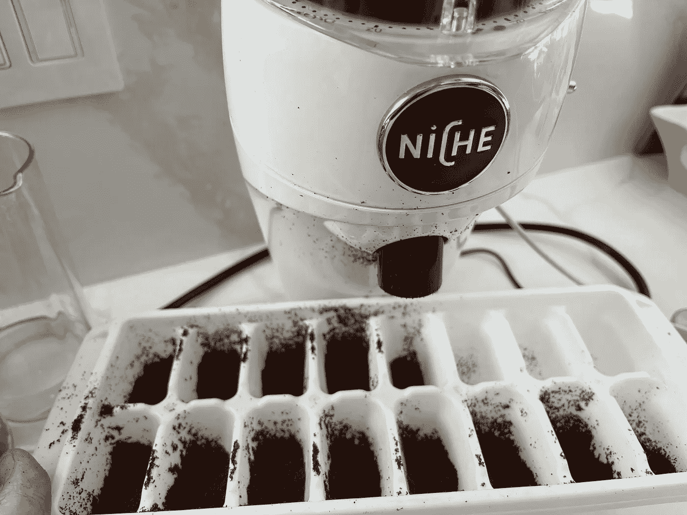

所有图片由作者提供

我用了一个冰块托盘，效果很好，在整个研磨过程中我收集了 13 个样本。然后我测量了每个样品的研磨分布。第一组显示了前两个样本，第 8 个样本(研磨中间)和第 13 个样本(最后一个样本)。

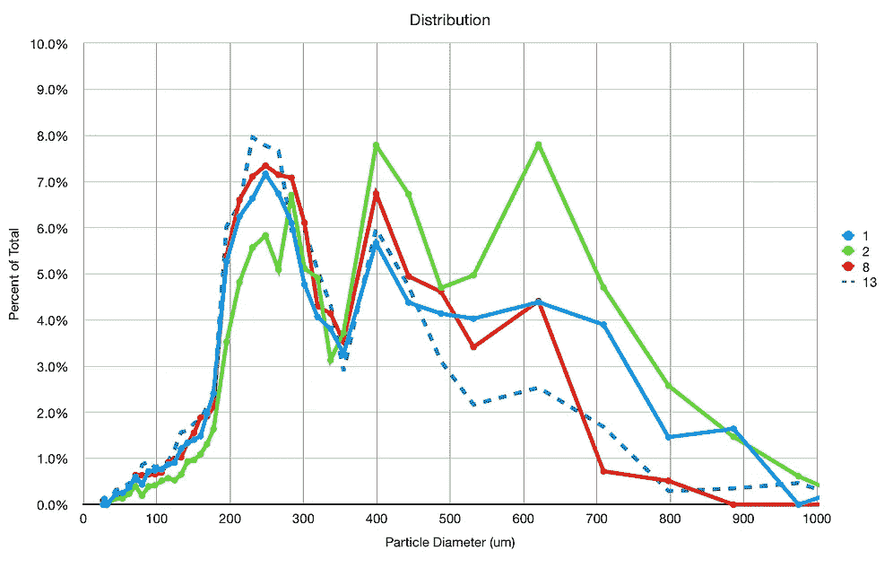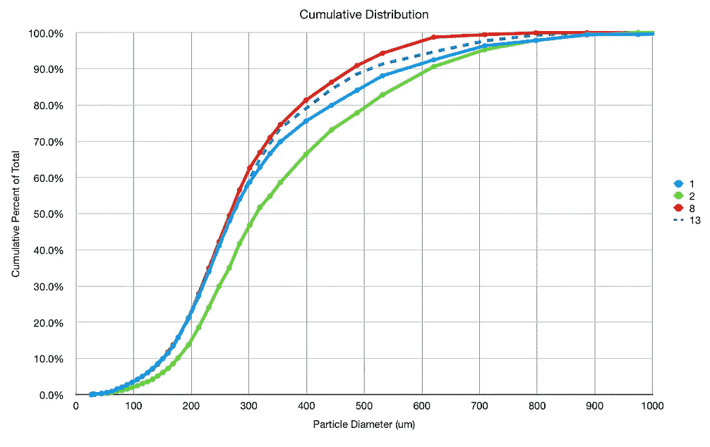

我发现前几个样品比其余的更粗糙。以下是前四个样本:

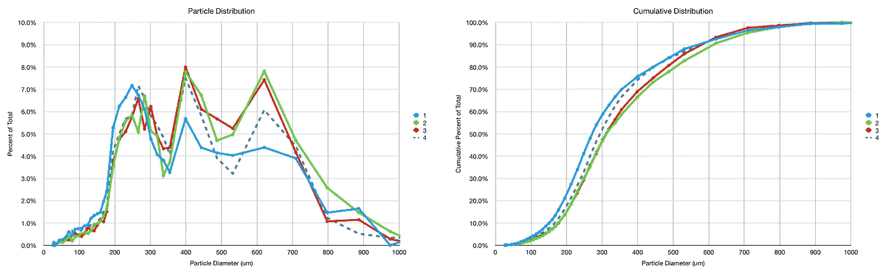

然后研磨开始稳定，这样到最后，样本之间不会有太大的时间差异。以下是最后四个样本:

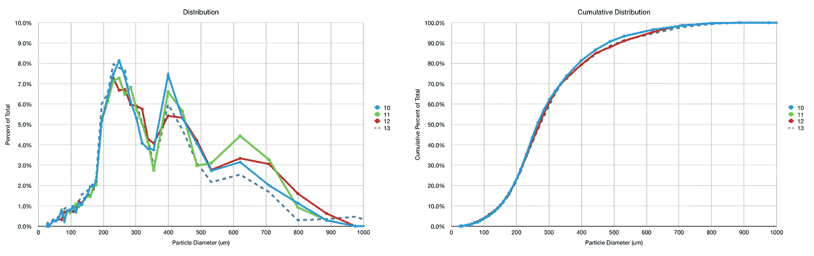

我们可以使用累积条形图以另一种方式查看这些数据:

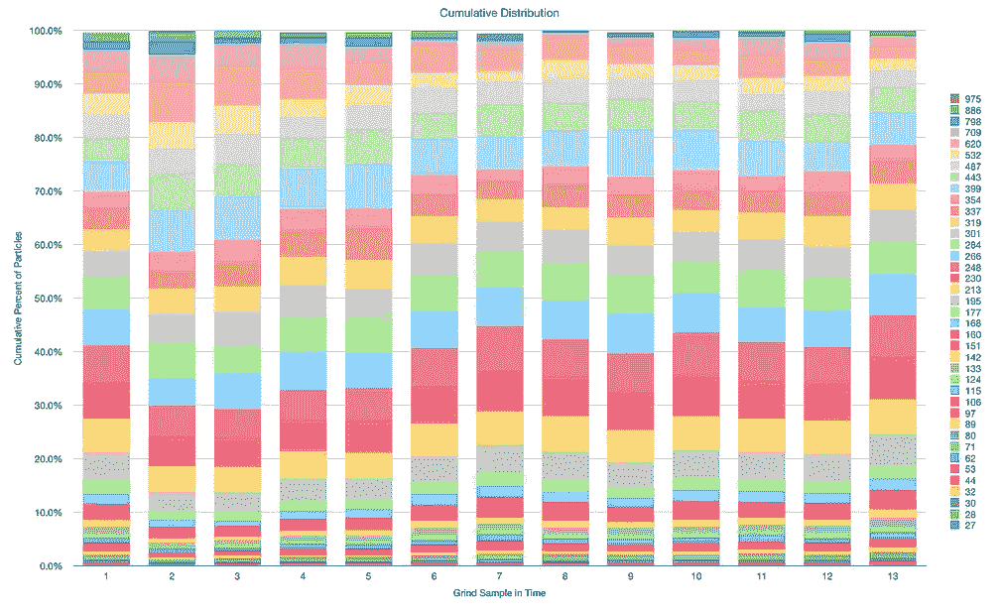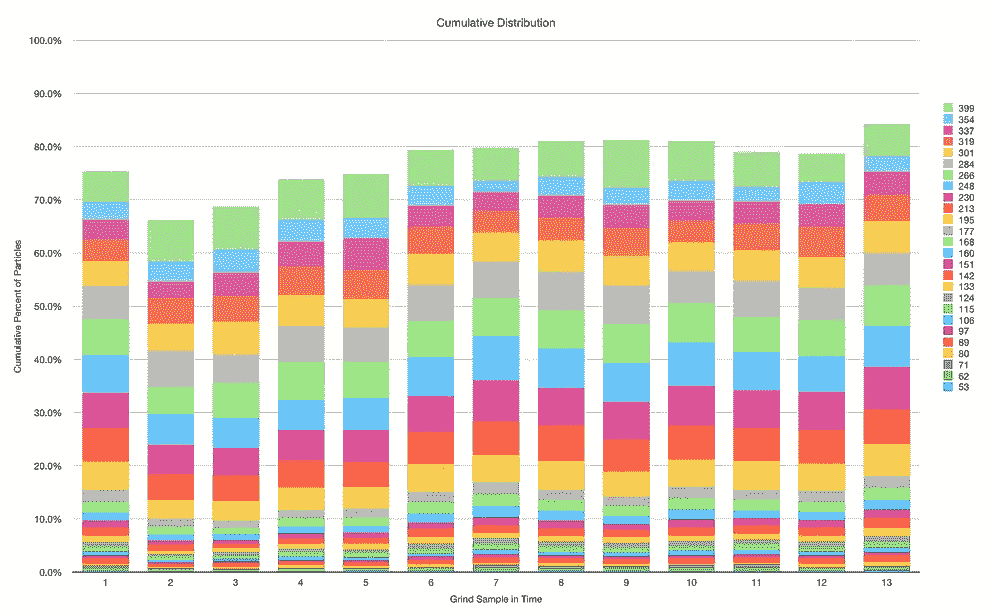

那么如果把重点放在几个点的累积分布上，前几个样本的粗糙程度就更清晰了。

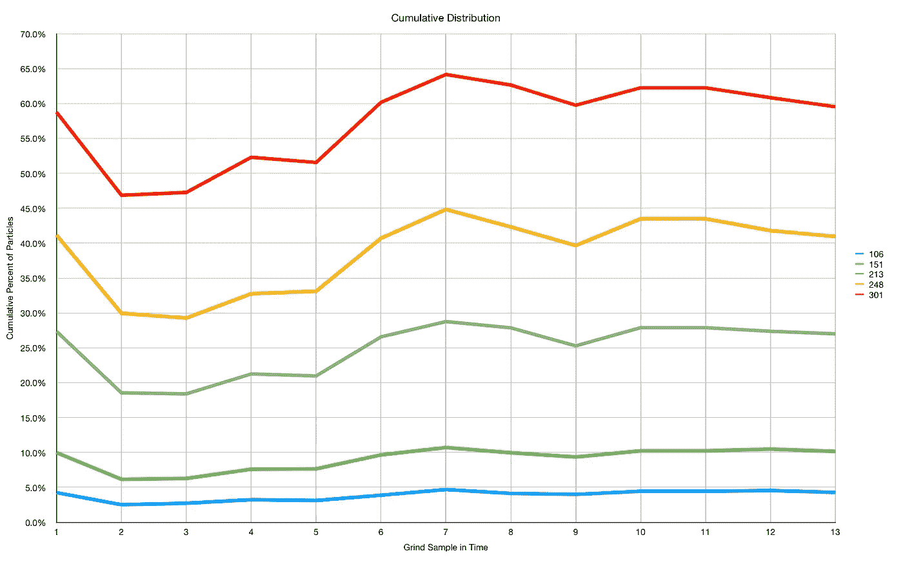

我想知道这是否是因为研磨机在达到稳定状态之前就装满了研磨物。

# 应用模式识别

查看这些数据的另一种方法是使用[模式识别](/the-shape-of-coffee-fa87d3a67752)。我想看看每个样本中产生的粒子形状是否有很大不同，所以我使用线性二进制模式(LBP)对每个粒子进行分类，然后我对这些粒子进行 K-means 聚类，并进行相互比较。

有了这些，我可以根据每个粒子所属的簇来判断不同样本有多相似:

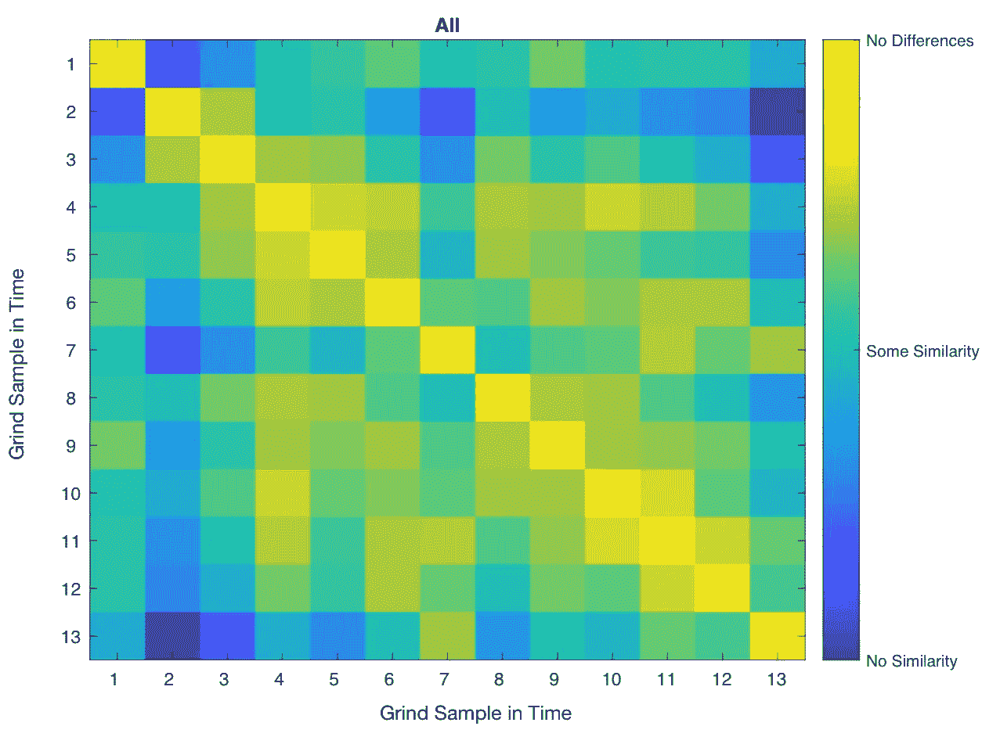

这表明第一个样本实际上是样本 2 和 3 的异常值。样品 4、5 和 6 似乎像样品 10、11 和 12 一样聚集得很好。

我们可以用细小的(<400um) and coarse (>400 微米)颗粒来分割它。<400um similarity matrix is very similar to all the particles because 70% of particles are on the fine size.

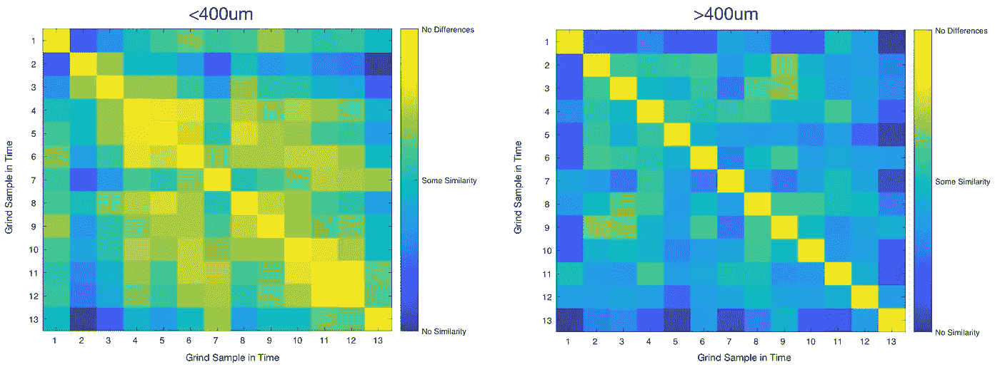

What is interesting in the > 400um 矩阵就是样品 1 和其余样品还是有这样的差别。最后一个样本在这方面是相似的。

我们可以将这些进一步分解成几个颗粒大小:

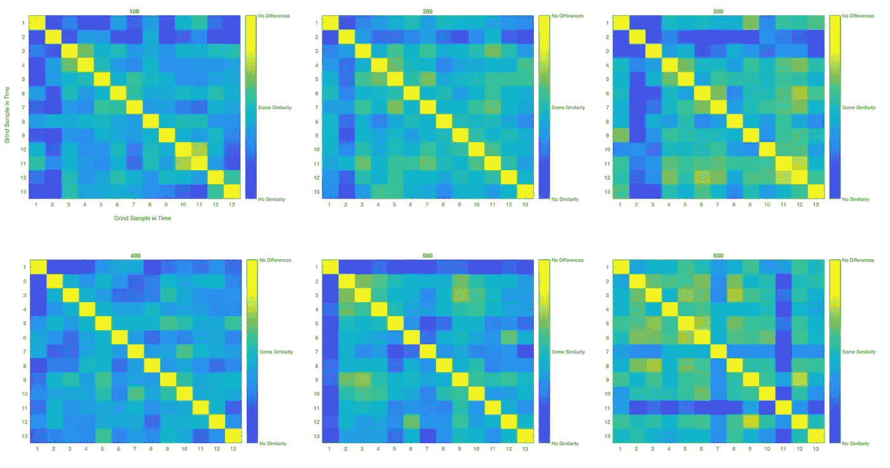

300um 似乎在样品 3 后显示出稳定性。这些休息没有告诉一个故事有很大不同于前。

# 更多的数据点

在我的一些其他实验中，我一直在探索增加烘焙咖啡豆储存的湿度，在六天中，我测量了 1 克和 20 克的研磨分布，每天研磨新鲜的咖啡豆。所以我可以比较第一部分和其他部分。

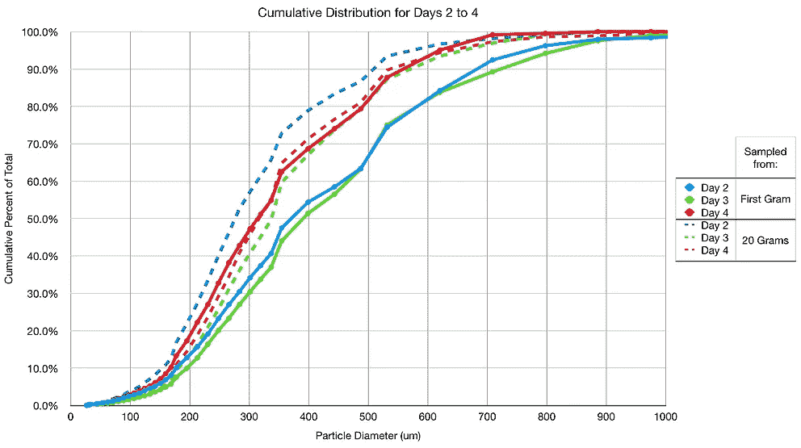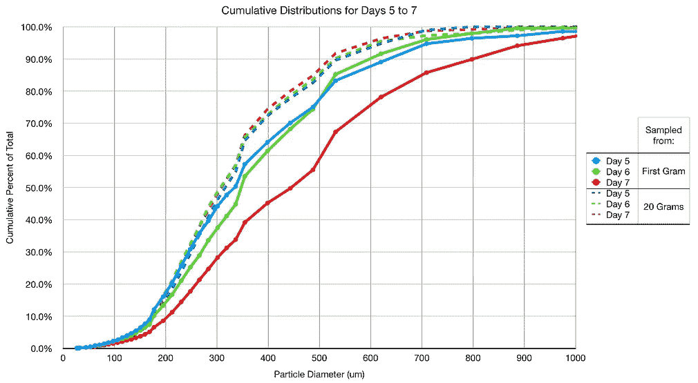

从 1 克样品到 20 克样品，总体上趋向于更细的研磨。我用另一种方式绘制了它:

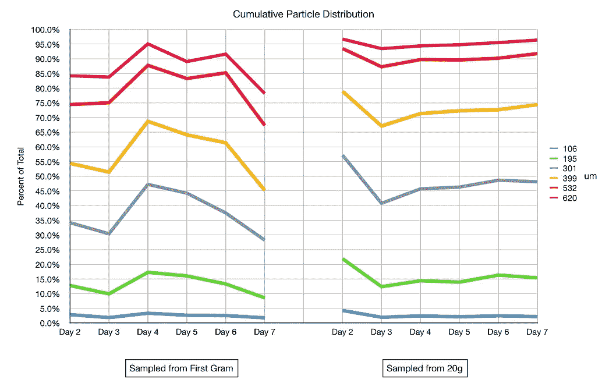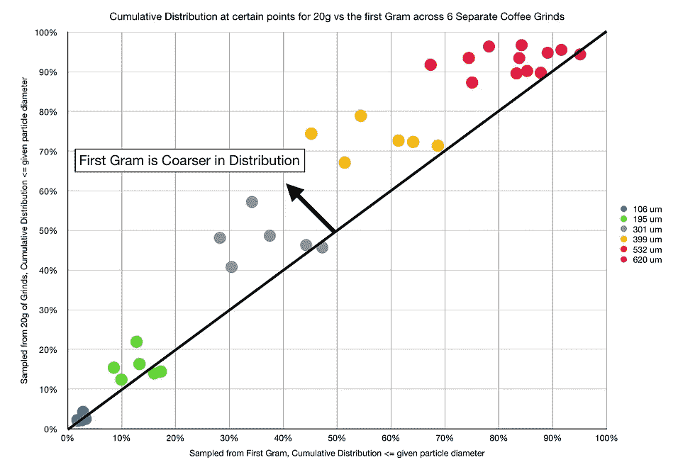

这些样品有助于强化萨拉米香肠研磨样品不仅仅是一次性的，而是研磨机功能的一部分。

这个实验对我来说既简洁又有益。我不认为研磨是同质的，但这绝对不是我所期望的。

我想知道直接在篮子里研磨是否会导致底部的粉末分布过于粗糙。我怀疑这就是为什么像 WDT 或某种分布的方法可以帮助拍摄，因为实际研磨分布在不同的层是不同的。

让我们在[断奏](https://rmckeon.medium.com/a-summary-of-the-staccato-lifestyle-dd1dc6d4b861)镜头的背景下思考这个信息。最基本的断奏镜头在底部有一个较精细的图层，在顶部有一个较粗糙的图层。如果你直接在过滤篮中研磨，底部的粉末会比顶部的更粗糙，就像一个倒置的断奏。

我通常把它磨成一个杯子，在把它放进过滤篮之前稍微混合一下。通常情况下，我最后会把地面的顶部放在过滤器的底部。

这些测量也可以解释为什么[咖啡师 Hustle](https://www.baristahustle.com/blog/the-great-distribution-debate-results/) 的实验没有显示出体重的差异。他们没有测量颗粒分布，但研磨分布的真正差异是一个垂直函数。

这些结果更有力地说明了夯实前需要分配地面，无论是在研磨机中还是在过滤篮中。我不知道咖啡结块在多大程度上影响了拍摄后分配地面的需要(因为我生活在干燥的气候中，很少出现结块问题)，但肯定研磨分配指向了分配的需要。

# 第一个示例解释

家庭浓缩咖啡爱好者脸书小组的托德·戴维斯指出，第一个样本可能是异常值，因为它是研磨机中残留的咖啡渣。在进行这个测试之前，我没有清理研磨机，不是故意的，而是因为忘记了。所以第一个样品可能是不同的烘焙或者不同的研磨环境。无论如何，这是最合理和简单的解释，所以谢谢你托德！

如果你愿意，可以在 Twitter 和 YouTube 上关注我，我会在那里发布不同机器上的浓缩咖啡视频和浓缩咖啡相关的东西。你也可以在 [LinkedIn](https://www.linkedin.com/in/robert-mckeon-aloe-01581595?source=post_page---------------------------) 上找到我。也可以关注我[中](https://towardsdatascience.com/@rmckeon/follow)和[订阅](https://rmckeon.medium.com/subscribe)。

# [我的进一步阅读](https://rmckeon.medium.com/story-collection-splash-page-e15025710347):

[浓缩咖啡系列文章](https://rmckeon.medium.com/a-collection-of-espresso-articles-de8a3abf9917?postPublishedType=repub)

[工作和学校故事集](https://rmckeon.medium.com/a-collection-of-work-and-school-stories-6b7ca5a58318?source=your_stories_page-------------------------------------)

[个人故事和关注点](https://rmckeon.medium.com/personal-stories-and-concerns-51bd8b3e63e6?source=your_stories_page-------------------------------------)

[乐高故事启动页面](https://rmckeon.medium.com/lego-story-splash-page-b91ba4f56bc7?source=your_stories_page-------------------------------------)

[摄影飞溅页](https://rmckeon.medium.com/photography-splash-page-fe93297abc06?source=your_stories_page-------------------------------------)

[使用图像处理测量咖啡研磨颗粒分布](https://link.medium.com/9Az9gAfWXdb)

[改善浓缩咖啡](https://rmckeon.medium.com/improving-espresso-splash-page-576c70e64d0d?source=your_stories_page-------------------------------------)

[断奏生活方式概述](https://rmckeon.medium.com/a-summary-of-the-staccato-lifestyle-dd1dc6d4b861?source=your_stories_page-------------------------------------)

[测量咖啡磨粒分布](https://rmckeon.medium.com/measuring-coffee-grind-distribution-d37a39ffc215?source=your_stories_page-------------------------------------)

[咖啡萃取](https://rmckeon.medium.com/coffee-extraction-splash-page-3e568df003ac?source=your_stories_page-------------------------------------)

[咖啡烘焙](https://rmckeon.medium.com/coffee-roasting-splash-page-780b0c3242ea?source=your_stories_page-------------------------------------)

[咖啡豆](https://rmckeon.medium.com/coffee-beans-splash-page-e52e1993274f?source=your_stories_page-------------------------------------)

[浓缩咖啡用纸质过滤器](https://rmckeon.medium.com/paper-filters-for-espresso-splash-page-f55fc553e98?source=your_stories_page-------------------------------------)

[浓缩咖啡篮及相关主题](https://rmckeon.medium.com/espresso-baskets-and-related-topics-splash-page-ff10f690a738?source=your_stories_page-------------------------------------)

[意式咖啡观点](https://rmckeon.medium.com/espresso-opinions-splash-page-5a89856d74da?source=your_stories_page-------------------------------------)

[透明 Portafilter 实验](https://rmckeon.medium.com/transparent-portafilter-experiments-splash-page-8fd3ae3a286d?source=your_stories_page-------------------------------------)

[杠杆机维护](https://rmckeon.medium.com/lever-machine-maintenance-splash-page-72c1e3102ff?source=your_stories_page-------------------------------------)

[咖啡评论和想法](https://rmckeon.medium.com/coffee-reviews-and-thoughts-splash-page-ca6840eb04f7?source=your_stories_page-------------------------------------)

[咖啡实验](https://rmckeon.medium.com/coffee-experiments-splash-page-671a77ba4d42?source=your_stories_page-------------------------------------)