# 工资、工作满意度、数据工作趋势

> 原文：<https://towardsdatascience.com/salary-satisfaction-trend-of-data-jobs-f47bdf72afa3?source=collection_archive---------25----------------------->

## 从堆栈溢出调查数据中我们能学到什么

图片来自 unsplash.com

我们现在处于数据时代，在过去的几年里，就业市场见证了对数据相关工作的持续需求。数据科学家、数据分析师和数据工程师是数据相关工作的三大主流。对于任何有兴趣进入该领域或已经进入该领域的人来说，了解数据就业市场的现状将是有益的。当你在数据职业道路上迈出下一步时，工作要求、工资和满意度等信息可以给你更多的洞察力。在这篇文章中，我使用了一个特殊的数据集， [Stack Overflow 年度开发者调查](https://insights.stackoverflow.com/survey)，来探索一些有趣的问题。这篇文章将涉及一些数据分析和建模，有三个主要部分:

**第一部分:工资**

*   什么数据角色工资最高？
*   不同国家数据角色的薪酬；
*   不同工作年限的工资；
*   数据领域不同性别的薪酬；
*   薪水与工作满意度。

**第二部分:数据工作的变化，比较 2020 年和 2019 年的数据**

*   数据角色数量的变化；
*   工资变动；
*   工作满意度的变化。

**第三部分:工作满意度**

*   基于 XGBoost 的多类分类预测工作满意度:
*   来自建模的洞察力。

# 数据注释:

在展示分析结果之前，有必要解释一些重要的数据处理步骤。但是您可以随意跳过这一部分，并在需要时返回。

该调查主要针对具有一般开发背景的人，包括软件开发和数据分析。2020 年的调查数据包含 64，461 份回复。我利用了问题“DevType ”,并对数据进行了预处理，以便只分析拥有数据相关角色的响应者。问卷中的问题如下。

> **以下哪一项描述了您？请选择所有适用的选项。**
> 
> []学术研究员
> **[]数据或业务分析师(名为 DA)
> []数据科学家或机器学习专家(名为 DS)**
> []数据库管理员
> []设计师
> []开发者、后端
> []开发者、桌面或企业应用
> []开发者、嵌入式应用或设备
> []开发者、前端
> []开发者、全栈
> []开发者、游戏或图形开发者、移动
> []开发者、 QA 或测试
> [] DevOps 专员
> []教育家
> **[]工程师、数据(名为 DE)**
> []工程师、现场可靠性工程经理
> []营销或销售专业产品经理
> []科学家
> []高管(C Suite、VP 等。 )学生
> []系统管理员
> []其他

请注意，一个响应者可以有多个 DevType 选项，甚至可以选择多个数据角色(即 DA、DS、DE)。我只保留与数据角色相关联的数据条目，并按不同类型的数据角色将它们分开。因此，两个新创建的实例可能来自具有多个数据角色的同一个数据实例。

为了使分析结果更加一致，我还过滤了“雇佣状态”,只保留当前被雇佣的响应者。有了这样的数据准备，我们对数据角色的分析有 11，186 个实例。对 2019 年的调查数据进行了相同的数据准备，创建了 17370 个实例，用于与**第 2 部分**中的 2020 年数据进行对比。

# 第一部分:关于工资的事实

我们先来看看这三个数据作业的分布情况。这里我们可以看到它们的数字非常接近，DA 排在第一位，然后是 DS，DE(图 1a)。就平均工资(以美元计)而言，我们可以看到 DS 和 DE 几乎相同，而 DA 的工资略低(图 1b)。

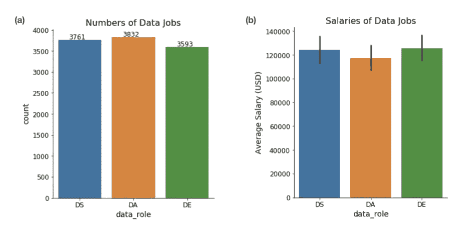

图 1 .(a)2020 年调查的数据角色分布。(b)数据工作的工资。图片作者。

当进一步显示不同国家(回答最多的前 9 个国家)的工资时，我们可以在图 2 中看到一些有趣的细节:

*   美国的数据工作收入最高。美国的平均工资大大高于其他国家，甚至高于西方世界的其他发达国家(即德国、英国、加拿大)。
*   与 DA 相比，DS(和 DE)不一定是收入更高的工作。事实上，我们看到在加拿大和法国，DA 的工资比 DS 高得多。这可能会让你想起一句谚语:数据科学家是 21 世纪最性感的工作。它可能没有你想象的那么性感，至少从调查数据告诉我们的薪水来看是这样的。然而，堆栈溢出调查数据不一定代表真实世界的人口。

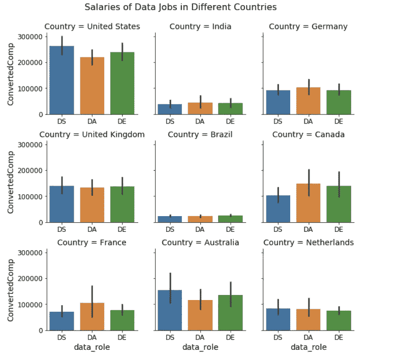

图二。不同国家数据工作的薪水。图片作者。

与工资相关的一个重要因素是工作经验的年限。在调查数据中，我们以「专业编码年数」作为工作经验的代理，以「专业编码年数」将受访者分为四组。在图 3 中，从“0-3 岁”到“6-13 岁”，我们可以看到工资逐渐缓慢增加，而在“13 岁以上”群体中，工资有了大幅提高。

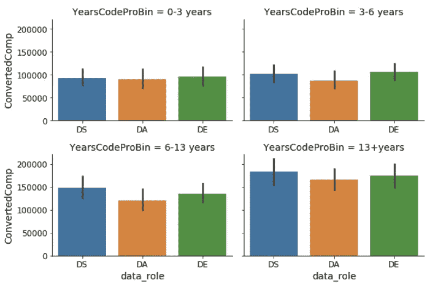

图 3。不同「专业编码年」组别的数据工作薪酬。这些组以这样的方式分类，使得大小尽可能相等。图片作者。

另一个有趣且重要的检查点是该领域的性别分布。开发人员领域的性别差异是一个长期关注的问题。在这里，我们在数据字段中也看到了这个问题(图 4)。

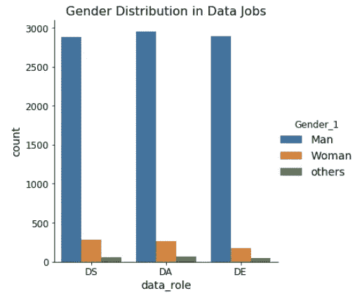

图 4 数据工作的性别分布。为了绘图的简单，所有非二元性别都被认为是“其他”组。图片作者。

就工资而言，我们可以看到男女之间没有实质性差异(图 5a)，但女性的工资差距较大(差异较大，图 5b)。

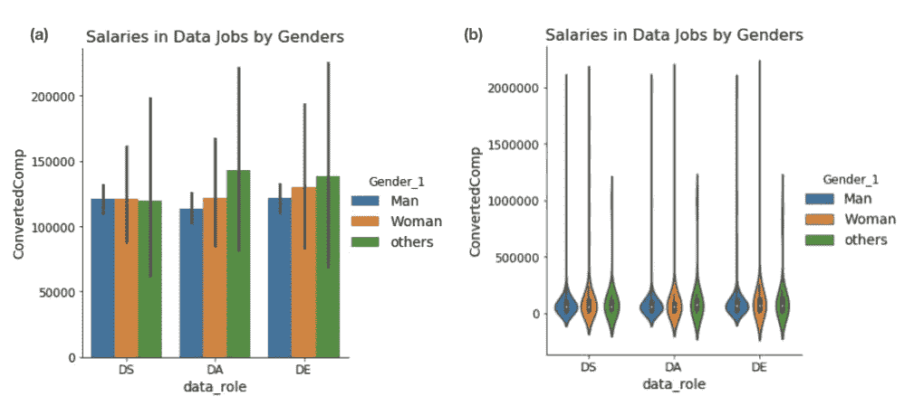

图 5。按性别分列的数据工作工资。(a)条形图。(b)小提琴情节。图片作者。

最后，我们来看看工作满意度和薪资的关系。正如你所料，工作满意度并不总是与工资正相关，这也是图 6a 中的数据所显示的。这也可能表明，有一群数据工程师对他们的工作非常不满意，尽管他们的工资很高(见图 6b 中最右边的高绿色条)。当然，在现实世界中，还有许多其他因素会影响我们的工作满意度。而在 **Part 3** 中，我会应用机器学习建模来预测工作满意度，找到更多洞察。

图 6。薪水和工作满意度。图片作者。

# 第 2 部分:数据工作的变化，比较 2020 年和 2019 年的数据

在这一部分，我们来看看数据领域的一些趋势。因为我们的分析依赖于堆栈溢出调查数据，并且 2018 年的调查表格与 2019 年和 2020 年的有很大不同，所以我们将仅使用 2019 年和 2020 年的数据进行比较。我们首先注意到，2020 年从原始数据中筛选出的有效调查回复总数为 53，159，15.69%的回复者从事与数据相关的工作。相比之下，2019 年的调查数据有 77，420 份有效调查回复，16.71%的回复者有与数据相关的工作。

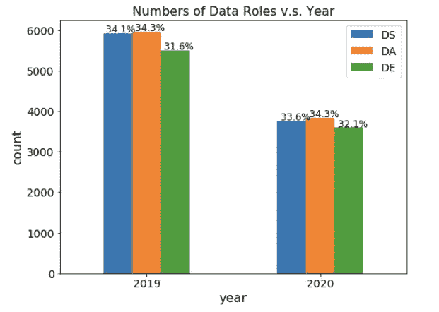

图 7。数据角色和分布的数量，2019 对 2020。请注意，由于我们创建数据实例的方式，总数大于调查响应的数量。图片作者。

首先，数据显示，数据角色的分布在这三个角色之间几乎没有变化(图 7)。2019 年的统计数据更大，因为 2019 年的调查中有更多的回复，这并不一定意味着 2020 年数据相关工作的数量有所减少。

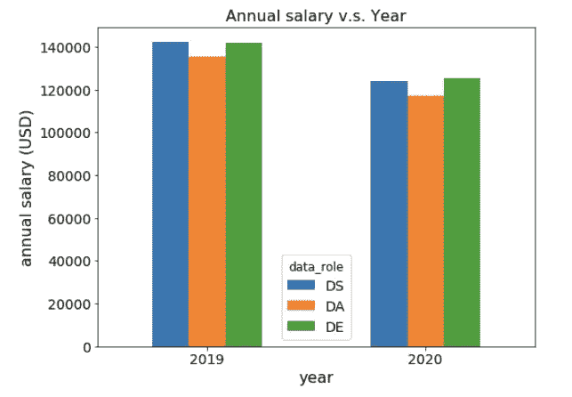

图 8。2019 年和 2020 年薪资对比。图片作者。

说到工资的变化，可能是我遇到的最意外的结果了。我们可以看到所有三种数据工作的工资都有所下降，总体降幅约为 16，000 美元(图 8)。

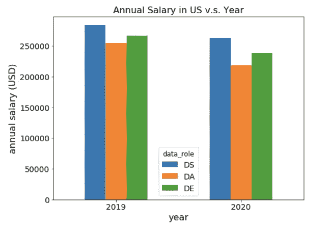

图 9。2019 年和 2020 年薪资对比，仅美国数据。图片作者。

为了进一步验证这种变化，我只用美国的数据做了这个图。并且观察到工资的类似下降(图 9)。这一次，我们看到 DS 的工资仅略有下降，而 DA 和 DE 的工资下降幅度更大。使用其他数据来源来交叉检查就业市场中数据工作的下降是否属实将是有趣的。如果是这样，原因是什么？我们在这里能得到什么启示？顺便提一句，我最初认为薪水的下降可能是由于新冠肺炎以及市场的低迷。但 2020 年的调查数据实际上是在 2020 年 2 月收集的，因此疫情还没有发挥作用。

最后，让我们看看工作满意度，这是帮助洞察就业市场的另一个重要因素。问卷中关于工作满意度的问题如下:

> 你对目前的工作有多满意？(如果你做多份工作，请回答你花时间最多的那一份。)
> 
> o 非常不满意(-2)
> o 稍微不满意(-1)
> o 既不满意也不满意(0)
> o 稍微满意(1)
> o 非常满意(2)

我把不同等级的满意度转换成从-2 到 2 的值。平均分数在图 10 中给出。我们可以观察到，在 2019 年和 2020 年，DS 的满意度最高，其次是 DE 和 DA。此外，从 2019 年到 2020 年，所有三种数据工作的满意度都有所下降，与工资的变化方向相同。

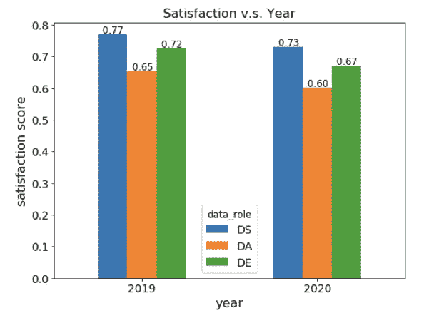

图 10。2019 年和 2020 年工作满意度对比。图片作者。

# 第三部分:工作满意度预测

在这篇文章的最后一部分，我对建立一个预测工作满意度的机器学习模型感兴趣。正如我们之前看到的，工作满意度问题有五种可能的答案。因此，预测将是一个多分类问题。

为了避免不同年份的数据分布不一致，将只使用 2020 年的调查数据进行建模。另外，请注意数据是不平衡的。“非常满意”和“稍微满意”占总数据的 60%以上，而“非常不满意”不到 10%。

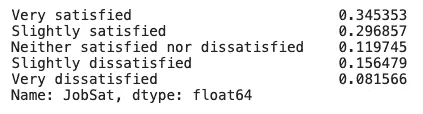

图片作者。

一些重要的数据处理步骤包括:1)数据清洗；2)缺失数据插补；3)分类数据编码；4)特征选择/工程师。我将在这里跳过这些技术细节，你可以参考笔记本和 [GitHub 库](https://github.com/Chancylin/StackOverflow_Survey)中的代码了解更多细节。对于建模，我使用 XGBoost 算法和 oneVsRest 方法来处理这个多分类问题。

## 3.1.探索性数据分析

在展示建模结果之前，我将展示一些 EDA 作为数据科学项目的常规，让您快速了解工作满意度。如**第一部分**所示，薪酬和工作满意度并不一定相互关联(图 6)。其他潜在影响工作满意度的重要因素呢？

如图 11 所示，公司规模和工作满意度之间确实存在某种模式，但是很难得出一个普遍的结论。很有可能，在小公司中，“非常满意”的比例往往高于“稍微满意”。

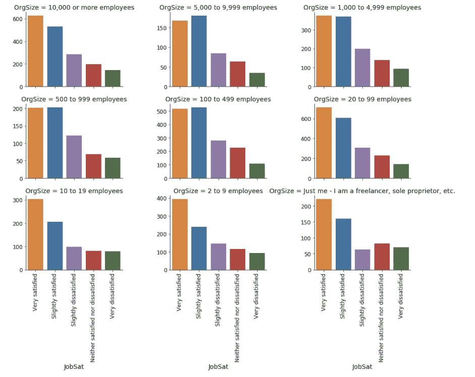

图 11。不同规模公司的工作满意度分布。图片作者。

加班是另一个与一般意义上的工作满意度相关的因素。然而，如果有的话，模式是模糊的(图 12)。的确，在从不过劳的群体中，“非常满意”阶层并不是最有反响的。

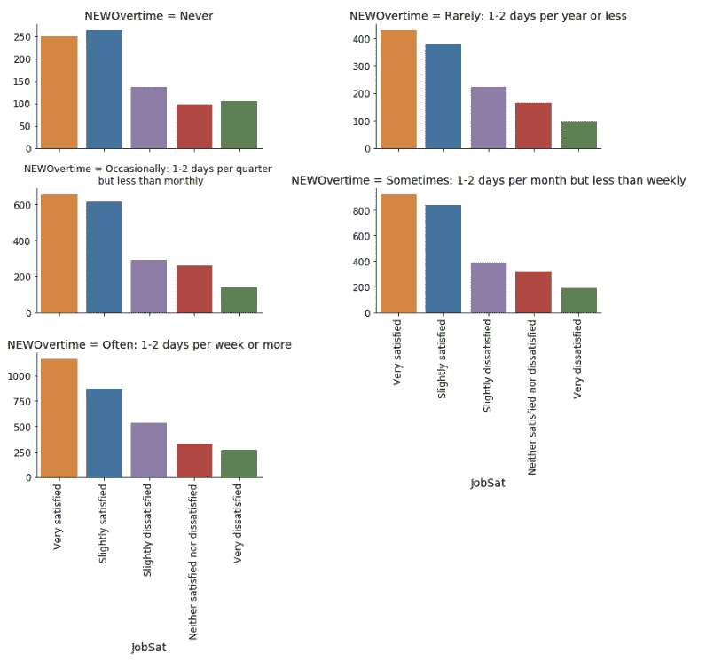

图 12。不同加班时间群体的工作满意度分布。图片作者。

最后，我们来看看不同国家的工作满意度分布情况。有一个现象很突出:在印度和巴西等发展中国家,“非常满意”的比例相对较低。然而，现在就断定这是数据领域的一个特殊现象还为时过早。相反，无论在哪个领域，发展中国家“非常满意”的比例较低可能是一个普遍现象。

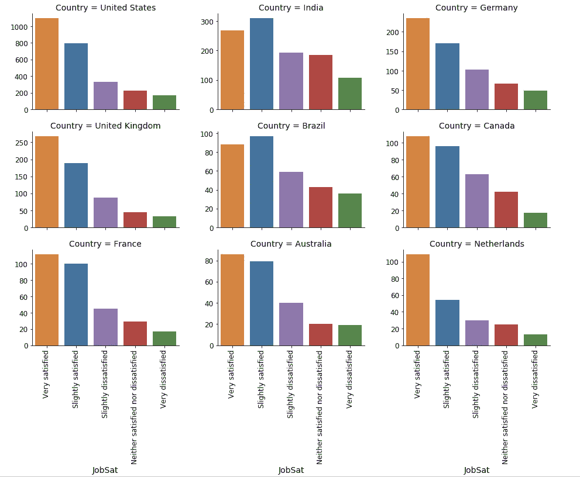

图 13。不同国家的工作满意度分布。注意，为了简单起见，我们在建模步骤中没有使用 Country 作为特征。国家是一个高基数特性，应该使用更高级的编码技术，而不是简单的一次性编码。图片作者。

## 3.2.使用 XGBoost 的多分类

这里我们通过检查混淆矩阵跳到模型性能。我们的模型有两个观察结果:

*   尽管在建模步骤中已经应用了几种技术来解决过拟合问题，但是模型仍然存在过拟合问题；
*   该模型可以在合理的水平上正确地预测辅修课，尽管将实例预测为“非常满意”和“稍微满意”会产生许多错误。
*   该模型被“非常满意”和“稍微满意”所混淆(图 14，右)。

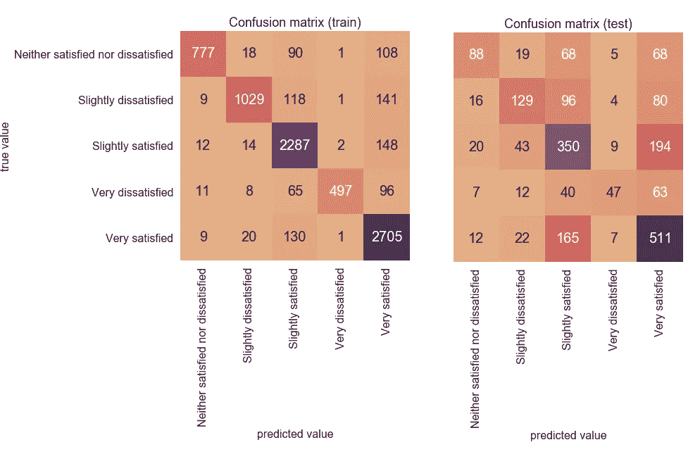

图 14。用混淆矩阵模拟性能。左图:训练数据的混淆矩阵。右图:测试数据的混淆矩阵。图片作者。

当然，该模型还有改进的空间，但是与使用朴素贝叶斯的基线模型相比，该模型的性能相当好，我在这里没有展示。此外，数据集本身可能具有挑战性，因此无论如何难以学习一般模式(即，过拟合问题)。

## 3.3.模型可解释性和洞察力

为了理解模型并获得更多的洞察力，让我们检查在树构建过程中计算的顶部特征(图 15)。

一位热编码的使用给解释带来了一些不便，因为原始特征现在被分解成多个二进制特征。最重要的两个特征是关于“NEWOnboardGood”的:“NEWOnboardGood_1”表示“是”回答“你认为你的公司有好的入职流程吗”的问题，“NEWOnboardGood_2”表示“否”。显而易见，良好的入职流程通常与高工作满意度相关。

我们也把“本科生专业”剧看作是继“NEWOnboardGood”之后的一个重要特色。事实上，模型从数据中学到的是:

*   如果应答者有自然科学本科专业(如生物、化学、物理等。)，更有可能是他们“非常满意”；
*   对于本科专业为其他工程学科(如土木、电气、机械等)的响应者也是如此。)

“Bash/Shell/PowerShell”这个特性很有趣，使用“Bash/Shell/PowerShell”作为编程语言之一的应答者比不使用它的应答者更有可能“非常满意”。至少这是模型从数据中学到的。

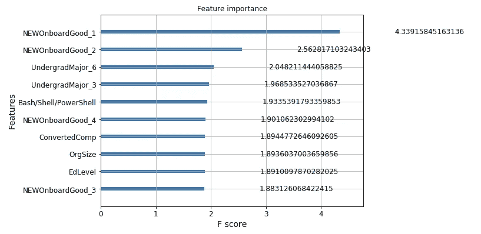

图 16。在 XGBoost 的树构建过程中通过 gain 计算的特征重要性。图片作者。

我们可以使用 [SHAP](https://github.com/slundberg/shap) ，一个非常通用的模型解释工具，来更好地理解模型行为。鼓励您在笔记本中探索更多内容。在这里，我将向您展示基于 SHAP 价值观的主要特征，并发布两个工资和公司规模相关性图的示例。

首先，我们将看到由 SHAP 值给出的顶部特征(图 17)不同于从节点分裂期间的信息增益计算的那些(图 16)。SHAP 值方法被认为更符合评估特征重要性(见 SHAP 论文参考)。在这里，最靠前的特征是“薪水”、“NEWOnboardGood_1”、“年龄”、“YeasCode”、“OrgSize”，在我看来比较符合常识。

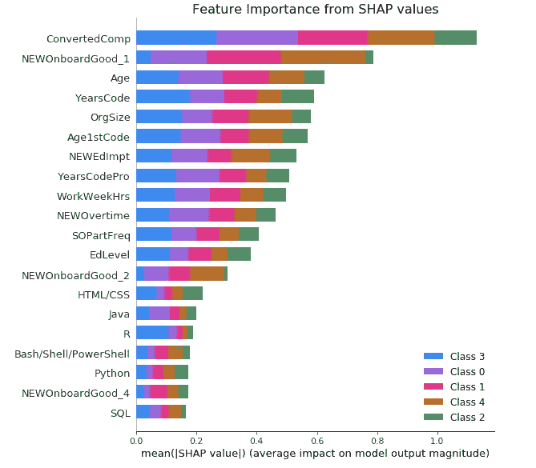

图 17。与图 16 中来自信息增益的特征相比，来自 SHAP 值的顶部特征。从 0 到 4 级:“既不满意也不不满意”、“稍微不满意”、“T2”、“稍微满意”、“非常不满意”、“非常满意”。图片作者。

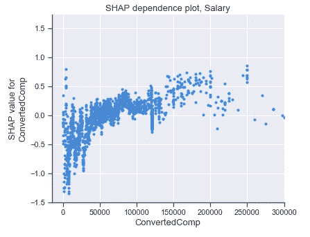

图 18。工资的 SHAP 依赖图。图片作者。

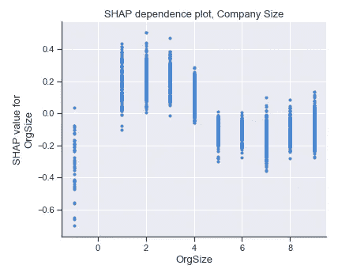

图 19。公司规模的 SHAP 依赖图。OrgSize 的映射是:{1:'只有我—我是自由职业者、个体经营者等。'，2: '2 到 9 名员工'，3: '10 到 19 名员工'，4: '20 到 99 名员工'，5: '100 到 499 名员工'，6: '500 到 999 名员工'，7:' 1000 到 4999 名员工'，8:' 5000 到 9999 名员工'，9:' 10000 或以上员工'，-1:'缺少' }。图片作者。

图 18 中的 SHAP 依赖图告诉我们，如果一个实例“非常满意”，工资将如何有助于预测。我们可以看到，总的来说，更高的工资将有助于预测实例更有可能“非常满意”，因为增加的趋势表明。

对于公司规模而言，较小的规模往往对预测“非常满意”做出积极贡献(图 19)。

## 结论

在本文中，我们使用堆栈溢出调查数据做了一些探索性分析，并对数据领域有了一些了解。

1.  我们分析了不同数据角色的薪酬分布，并考虑了其他因素，如国家、经验年限、性别。
2.  我们对比了 2019 年的调查数据和 2020 年的数据。令人惊讶的是，数据相关工作的薪水和工作满意度都有所下降。
3.  最后，我们建立了一个 XGBoost 多分类模型来预测工作满意度，并通过检查特征的重要性和依赖关系来提取对工作满意度的一些见解。

本文中的分析和建模更多的是出于实践目的，没有进一步的研究就不能得出可靠的结论。最重要的是，堆栈溢出调查数据本身可能有偏差，不一定代表真实世界的人口。我希望你能从这篇文章中找到乐趣。要查看更多技术细节，请参考 [GitHub 库](https://github.com/Chancylin/StackOverflow_Survey)。