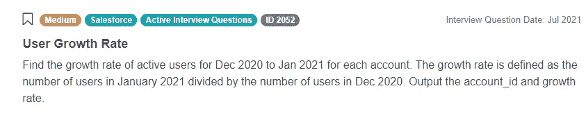
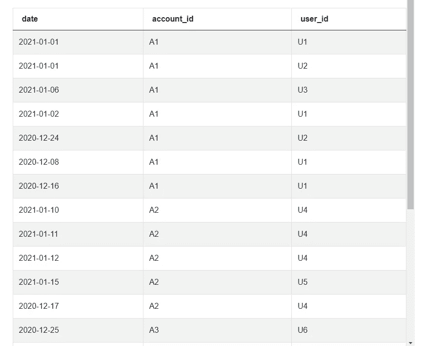
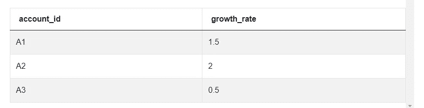
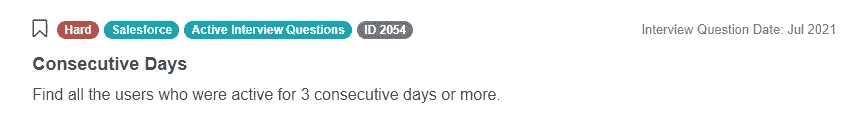
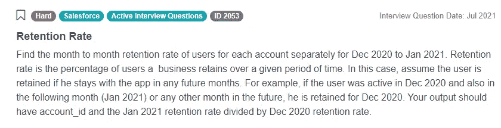
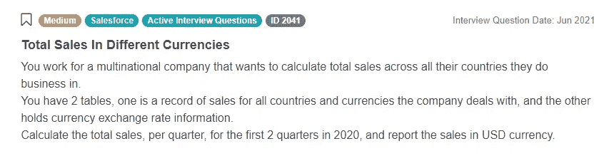
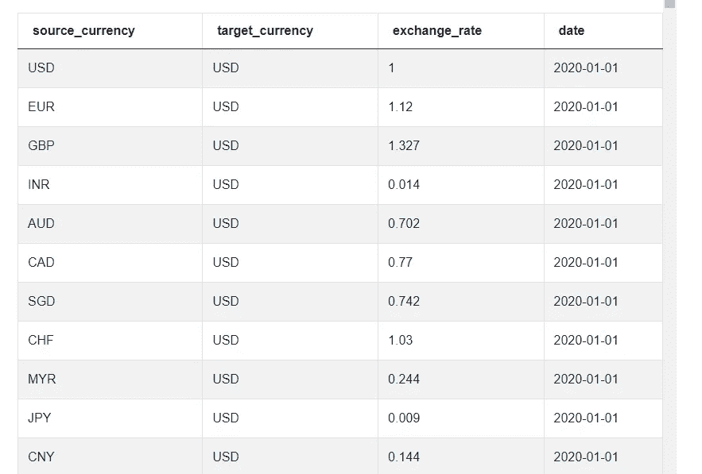
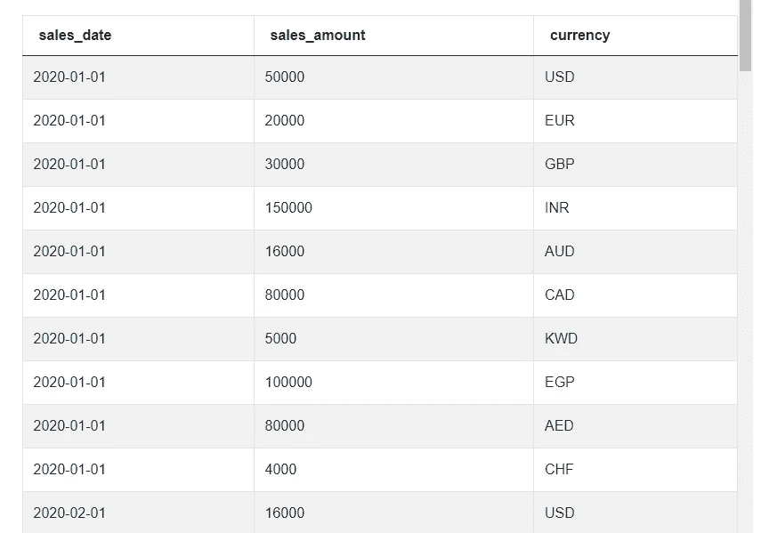

# Salesforce 数据科学家编写面试问题

> 原文：<https://towardsdatascience.com/salesforce-data-scientist-coding-interview-questions-6dad64c4a85f?source=collection_archive---------27----------------------->

## *在本文中，我们将涵盖您可能会在 Salesforce 上被问到的最重要的数据科学家编码面试问题。如果你准备去面试一个数据科学家的职位，你必须知道这些问题。*


由[塞巴斯蒂安·赫尔曼](https://unsplash.com/@officestock?utm_source=medium&utm_medium=referral)在 [Unsplash](https://unsplash.com?utm_source=medium&utm_medium=referral) 上拍摄的照片

Salesforce 是一家软件公司，也是客户关系管理(CRM)平台的提供商。它提供了广泛的基于云的解决方案，以改善和简化公司及其客户之间的合作。Salesforce 是一家全球性公司，总部位于旧金山，在全球 29 个国家设有办事处。2021 年，根据员工完成的调查，Salesforce 在《财富》杂志的“100 家最适合工作的公司”中排名第二。

# Salesforce 的数据科学家角色

Salesforce 雇佣了许多数据科学家和数据工程师，分布在许多地点和团队，每个人通常负责一个产品。虽然每个职位的具体情况因团队而异，但许多数据专家都致力于解决一些问题，如预测业务指标、为客户群和参与度建模，以及通过对结构化和非结构化数据执行分类和聚类来创造有意义的客户体验。此外，他们可能开发端到端的数据产品，审查和更新现有数据，或者建立和维护机器学习管道。

Salesforce 的数据科学家或数据工程师通常期望的堆栈包括 SQL(通过 PostgreSQL)、Python(带有 Pandas 和 Sklearn)和 Spark。此外，候选人应该具备机器学习、项目生命周期、性能监控和软件测试方面的知识。Salesforce 还广泛使用 Docker、AWS 或 Airflow 等技术。

# 在 Salesforce 数据科学家编码面试问题中测试的技术概念


作者在 [Canva](https://canva.com/) 创建的图像

本文讨论了最近 Salesforce Data Scientist 面试中候选人被问到的一些 SQL 问题。传统上，Salesforce 的 [SQL 面试问题](https://www.stratascratch.com/blog/sql-interview-questions-you-must-prepare-the-ultimate-guide/?utm_source=blog&utm_medium=click&utm_campaign=medium)相当多样化，涵盖的主题包括将单个数据点与平均值进行比较(AVG)、计算每个时间段的出现次数(计数、提取)、根据标准查找数据(HAVING、MAX/MIN、greater/low than 等)。)、排序(ORDER BY)、查找重复项(DISTINCT)或连接表(JOIN)。

然而，最近大多数候选人面临着基于同一张简单表格的各种面试问题。Salesforce 数据科学家面试问题与及时分析用户参与度的变化有关。在本文中，我们将分析这个最近的数据集，并讨论您可能会被问到的问题的解决方案。

# Salesforce 数据科学家面试问题 1:用户增长率

*我们被要求找出每个账户从 2020 年 12 月到 2021 年 1 月的活跃用户增长率。我们获悉，增长率定义为 2021 年 1 月的用户数除以 2020 年 12 月的用户数。我们应该编写一个 SQL 查询，只输出 account_id 和增长率。*



截图来自 [StrataScratch](https://www.stratascratch.com/?utm_source=blog&utm_medium=click&utm_campaign=medium)

可以在这里看到这个 Salesforce 数据科学家面试问题，自己练习解答:[https://platform . stratascratch . com/coding/2052-user-growth-rate？python=](https://platform.stratascratch.com/coding/2052-user-growth-rate?python=&utm_source=blog&utm_medium=click&utm_campaign=medium)

为了回答这个问题，我们提供了一个简单的数据表“sf_events”。

以下是数据的一个示例:



截图来自 [StrataScratch](https://www.stratascratch.com/?utm_source=blog&utm_medium=click&utm_campaign=medium)

如我们所见，只有 3 列。列“date”的类型为“datetime ”,它表示某个用户处于活动状态的时间。其他列“account_id”和“user_id”的类型为“varchar ”,允许唯一标识某个帐户的用户。在本例中，有 3 个帐户(A1、A2 和 A3)，每个帐户可能有几个用户。

要回答这个 Salesforce 数据科学家访谈问题，我们需要处理此表中的数据，最终目标是计算每个客户的增长率。该解决方案有 3 个主要步骤:

1.  对于每个月，创建一个新表，其中包含给定月份中每个帐户的活动用户数；
2.  使用内部联接合并所有月份的表；
3.  对于每个帐户，用 1 月的用户数除以 12 月的用户数(增长率)。

在这个例子中，我们感兴趣的是两个月:2020 年 12 月和 2021 年 1 月。让我们从 2020 年 12 月开始，只看用户参与度来解决这个问题。我们希望返回每个帐户在本月活跃的用户数量。因此，我们可以从写:

```
SELECT account_id,
       count(DISTINCT user_id) AS dec_count
FROM sf_events
GROUP BY account_id
```

这将返回两列:“account_id”和该帐户中处于活动状态的用户数，我们称之为“dec_count”。由于 GROUP BY 语句，每行将包含一个不同的“account_id”。此外，在 COUNT 语句中使用 DISTINCT 语句非常重要，因为我们只对活动用户的数量感兴趣，而不是他们活动的次数。然而，上面的查询将返回所有月份的用户总数，另一方面，我们只对 2020 年 12 月感兴趣。因此，有必要使用 WHERE 添加一个约束，并利用列“date”的类型为“datetime”这一事实:

```
WHERE EXTRACT(MONTH
                 FROM date) = 12
      AND EXTRACT(YEAR
                 FROM date) = 2020
```

包含上面的代码将成功地按日期过滤用户参与度，并将返回 2020 年 12 月的相关值。为了能够在以后重用该查询，我们可以将其视为子查询，并将其命名为' dec_2020 '。此外，我们可以编写一个类似的代码来计算从 2021 年 1 月开始的用户数量，并将其命名为' jan_2021 '。关键的区别在于 WHERE 语句——需要替换代表月份和年份的数字。

```
dec_2020 AS
  (SELECT account_id,
          count(DISTINCT user_id) AS dec_count
   FROM sf_events
   WHERE EXTRACT(MONTH
                 FROM date) = 12
     AND EXTRACT(YEAR
                 FROM date) = 2020
   GROUP BY account_id),

jan_2021 AS
  (SELECT account_id,
          count(DISTINCT user_id) AS jan_count
   FROM sf_events
   WHERE EXTRACT(MONTH
                 FROM date) = 1
     AND EXTRACT(YEAR
                 FROM date) = 2021
   GROUP BY account_id)
```

有了这个，我们就能计算增长率了。为此，我们首先需要组合子查询‘dec _ 2020’和‘Jan _ 2021’产生的表。我们将使用 INNER JOIN 来仅包括在两个月中有任何用户活动的帐户，否则没有增长率可计算。

再次查看面试问题以了解结果应该以什么格式返回也很重要，在本例中为:“输出 account_id 和增长率”。因此，我们将选择“account_id ”,然后按如下方式计算增长率:jan_count / dec_count。由于使用了内部连接，我们可以从两个子查询中的任何一个中选择列‘account _ id’。至于增长率，我们还是确保以浮点数的形式返回吧。使用 AS 语句为这个新列命名也是一个好习惯。

```
SELECT jan_2021.account_id,
       jan_count / dec_count::float AS growth_rate
FROM jan_2021
INNER JOIN dec_2020 ON jan_2021.account_id = dec_2020.account_id
```

我们现在已经涵盖了构建 Salesforce 的这个[数据科学编码面试问题](https://www.stratascratch.com/blog/data-science-coding-interview-questions-with-5-technical-concepts/?utm_source=blog&utm_medium=click&utm_campaign=medium)的解决方案所需的所有步骤。仍然需要将这些步骤结合起来，以创建产生预期输出的最终查询。将两个子查询“dec_2020”和“jan_2021”与上面的查询组合起来的一个简单方法是使用 with 语句。最终的解决方案如下所示:

```
WITH dec_2020 AS
  (SELECT account_id,
          count(DISTINCT user_id) AS dec_count
   FROM sf_events
   WHERE EXTRACT(MONTH
                 FROM date) = 12
     AND EXTRACT(YEAR
                 FROM date) = 2020
   GROUP BY account_id),
     jan_2021 AS
  (SELECT account_id,
          count(DISTINCT user_id) AS jan_count
   FROM sf_events
   WHERE EXTRACT(MONTH
                 FROM date) = 1
     AND EXTRACT(YEAR
                 FROM date) = 2021
   GROUP BY account_id)
SELECT jan_2021.account_id,
       jan_count / dec_count::float AS growth_rate
FROM jan_2021
INNER JOIN dec_2020 ON jan_2021.account_id = dec_2020.account_id
```



截图来自 [StrataScratch](https://www.stratascratch.com/?utm_source=blog&utm_medium=click&utm_campaign=medium)

注意，有多种方法可以编写这个查询。现在，您可以想出自己的代码，并提交到我们的平台上，以接收其他用户的反馈。请务必查看其他人提交的解决方案，以获得更多灵感。

# Salesforce 数据科学家面试问题 2:连续几天

让我们看看另一个 Salesforce 数据科学家面试问题，它使用了相同的数据集，但提出了不同的挑战。在这种情况下，我们被要求查找所有连续 3 天或更长时间处于活动状态的用户。我们得到了与问题 1 中完全相同的数据表。



截图来自 [StrataScratch](https://www.stratascratch.com/?utm_source=blog&utm_medium=click&utm_campaign=medium)

链接到此 Salesforce 数据科学家面试问题:[https://platform . stratascratch . com/coding/2054-连续-天？python=](https://platform.stratascratch.com/coding/2054-consecutive-days?python=&utm_source=blog&utm_medium=click&utm_campaign=medium)

尽管这个面试问题很短，但实际上，这个任务比前一个案例更棘手。虽然可以使用一个相当短的查询来解决这个问题，但是困难的部分是如何从一个排序的表中提取连续的日期。仅这项任务就需要更高级的 SQL 函数和语句的知识。解决方案应遵循以下一般步骤:

1.  仅查询“user_id”和“date”列，并按升序排序；
2.  使用 ROW_NUMBER()函数按日期分别对每个用户的数据进行排序
3.  通过从事件日期中减去等级，只留下连续的日期来过滤结果；
4.  仅选择这些在过滤结果中至少出现 3 次的不同用户 id。

# Salesforce 数据科学家面试问题 3:保留率

这是另一个问题，我们得到了与问题#1 和问题#2 相同的数据集。然而，这一次我们被要求分别找出 2020 年 12 月至 2021 年 1 月每个账户的逐月用户保留率。我们被告知，保留率是一个企业在给定时间内保留用户的百分比。我们可以假设，如果用户在未来几个月继续使用该应用程序，他就会被保留下来。此外，我们给出了一个例子:如果用户在 2020 年 12 月是活跃的，并且在接下来的一个月(2021 年 1 月)或未来的任何其他月份也是活跃的，则他被保留到 2020 年 12 月。最后，我们被告知输出应该包含 account_id 和 2021 年 1 月的保留率除以 2020 年 12 月的保留率。



截图来自 [StrataScratch](https://www.stratascratch.com/?utm_source=blog&utm_medium=click&utm_campaign=medium)

链接到这个 Salesforce 数据科学家面试问题:[https://platform . stratascratch . com/coding/2053-retention-rate？python=](https://platform.stratascratch.com/coding/2053-retention-rate?python=&utm_source=blog&utm_medium=click&utm_campaign=medium)

这个问题的解决方案不需要很高的 SQL 水平，但是，它需要使用 CASE 语句的知识。在这种情况下，最终查询也会相对较长，因为在输出最终结果之前需要执行多个子查询。以下是解决方案应该遵循的步骤:

*   对于每个月，查询给定月份中活动的用户及其帐户；这与问题 1 的第一步非常相似；
*   对于每个用户，检查他们活动的最后日期；
*   计算每个月的保留率:计算每个帐户在给定月份中活跃的用户数，以及他们活跃的最后日期发生在本月之后的用户数；
*   将月留存率表示为百分比，即留存用户数除以一个账户中的所有用户数，再乘以 100；
*   按照问题:对于每个客户，将 2021 年 1 月的留存率除以 2020 年 12 月的留存率来调整输出。

# Salesforce 数据科学家面试问题 4:不同货币的总销售额

尽管 Salesforce 的大多数最新数据科学家面试问题都集中在我们在之前的问题中看到的简单数据表上，但我们已经收到了用于构建面试任务的另一个数据集的报告。

让我们来考虑一下这个问题，假设你在一家跨国公司工作，该公司希望计算他们开展业务的所有国家的总销售额。有两个表，一个是公司处理的所有国家和货币的销售记录，另一个保存货币汇率信息。任务是计算 2020 年前两个季度每季度的总销售额，并以美元货币报告销售额。



截图来自 [StrataScratch](https://www.stratascratch.com/?utm_source=blog&utm_medium=click&utm_campaign=medium)

此问题链接:[https://platform . stratascratch . com/coding/2041-不同币种总销售额？python=](https://platform.stratascratch.com/coding/2041-total-sales-in-different-currencies?python=&utm_source=blog&utm_medium=click&utm_campaign=medium)

问题中提到，这次有两个表有数据。保存货币汇率信息的表名为“sf_echange_rate ”,有 4 列，而包含销售记录的表名为“sf_sales_amount ”,有 3 列。查看数据类型和数据示例:

*顺丰 _ 汇率*



截图来自 [StrataScratch](https://www.stratascratch.com/?utm_source=blog&utm_medium=click&utm_campaign=medium)

*顺丰 _ 销售 _ 金额*



截图来自 [StrataScratch](https://www.stratascratch.com/?utm_source=blog&utm_medium=click&utm_campaign=medium)

虽然这个问题的解决方案并不特别困难，但以汇率日期和销售日期相匹配的方式正确连接这两个表是至关重要的。要实现这一点，并报告每个季度的值，了解 DATE_PART()函数是很有用的，它可以很容易地从 datetime 类型中提取重要信息。该解决方案应遵循以下步骤:

*   联接两个表，使“source_currency”与“currency”匹配，并且“date”中的月和年与“sales_date”中的月和年匹配；
*   按季度对日期进行分组，并对每个日期进行求和，得出“销售额”乘以正确的汇率。
*   通过仅保留 2020 年的前两个季度来过滤结果。

## 结论

我们希望这篇文章通过关注 Salesforce 使用的最新[数据科学家面试问题](https://www.stratascratch.com/blog/data-science-interview-guide-questions-from-80-different-companies/?utm_source=blog&utm_medium=click&utm_campaign=medium)对准备面试有所帮助。如果您在解决这些任务时遇到困难，请在我们的平台上随意浏览 Salesforce 访谈中的所有 SQL 问题。使用“方法提示”功能来显示解决问题的一般步骤，并与其他用户讨论您的代码，以获得更多的见解和反馈。您还可以找到本文中描述的所有问题的完整查询。在练习使用来自 Salesforce 的真正的 SQL 问题后，您应该有适当的准备来面对面试中的技术问题！

*最初发表于*[T5【https://www.stratascratch.com】](https://www.stratascratch.com/blog/salesforce-data-scientist-coding-interview-questions/?utm_source=blog&utm_medium=click&utm_campaign=medium)*。*