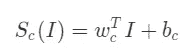
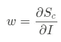
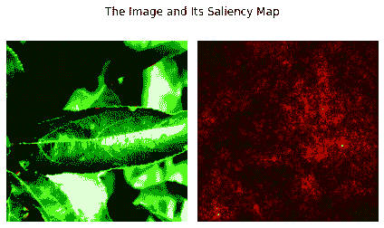

# 使用 PyTorch 可视化深度学习模型的显著图

> 原文：<https://towardsdatascience.com/saliency-map-using-pytorch-68270fe45e80?source=collection_archive---------7----------------------->

## 通过查看深度学习模型的梯度来解释深度学习模型的结果。


丹尼·米勒在 [Unsplash](https://unsplash.com/s/photos/networks?utm_source=unsplash&utm_medium=referral&utm_content=creditCopyText) 上的照片

# 动机

当我们使用逻辑回归或决策树等机器学习模型时，我们可以解释哪些变量对预测结果有贡献。但是，当我们使用深度学习模型时，这一步会很困难。

深度学习模型是一个黑箱模型。这意味着我们无法分析模型如何根据数据预测结果。随着模型变得越来越复杂，模型的可解释性会降低。

但这并不意味着模型不可解读。我们可以推断深度学习模型，但我们必须研究它的复杂性。

在本文中，我将向您展示如何基于梯度可视化深度学习模型结果。我们称这种方法为显著图。我们将使用一个名为 PyTorch 的框架来实现这个方法。

事不宜迟，我们开始吧！

# 显著图

在进入显著图之前，先说一下图像分类。给定这个等式，



在哪里，

*   Sc(I)是 c 类的分数
*   I 对应于图像(在一维向量上)。
*   w 和 b 对应于 c 类的重量和偏差。

从等式中可以看出，我们将图像向量(I)与权重向量(w)相乘。我们可以推断，权重(w)可以定义图像上的每个像素对类(c)的重要性。

那么，我们如何得到对应于给图像(I)的分数(S)的权重(w)？我们可以通过看梯度得到那些变量之间的关系！

但是等等，梯度到底是什么？我不想在上面解释那么多微积分，但我会告诉你这个。

> 梯度描述了一个变量(比如 x)对另一个变量(比如 y)的影响程度。

当我们使用该类比时，我们可以说梯度描述了图像(I)的每个像素对预测结果的贡献有多强。寻找权重(w)的等式看起来像这样，



通过知道每个像素的权重(w ),我们可以将其可视化为显著图，其中每个像素描述了该像素影响预测结果的能力。

现在，让我们开始实施吧！

# 实施

在本节中，我们将使用 PyTorch 实现显著图。我们将使用的深度学习模型已经为名为“植物病理学 2020”的 Kaggle 竞赛进行了训练。要下载数据集，您可以通过链接[访问此处](https://www.kaggle.com/c/plant-pathology-2020-fgvc7)。


这是我们必须要做的步骤，

*   建立深度学习模型
*   打开图像
*   预处理图像
*   检索梯度
*   想象结果

现在，我们要做的第一件事是建立模型。在这种情况下，我将使用 ResNet-18 架构使用我的预训练模型权重。此外，我已经建立了模型，所以我们可以使用 GPU 来获得结果。代码看起来像这样，

在我们建立模型之后，现在我们可以建立图像。为此，我们将使用 PIL 和 torchvision 库来转换图像。代码看起来像这样，

在我们转换图像后，我们必须对其进行整形，因为我们的模型读取 4 维形状(批量大小、通道、宽度、高度)上的张量。代码看起来像这样，

```
**# Reshape the image (because the model use 
# 4-dimensional tensor (batch_size, channel, width, height))**
image = image.reshape(1, 3, 224, 224)
```

在我们重塑图像之后，现在我们将图像设置为在 GPU 上运行。代码看起来像这样，

```
**# Set the device for the image**
image = image.to(device)
```

然后，我们必须设置图像捕捉梯度时，我们做反向传播。代码看起来像这样，

```
**# Set the requires_grad_ to the image for retrieving gradients**
image.requires_grad_()
```

之后，我们可以通过将图像放在模型上并进行反向传播来捕捉梯度。代码看起来像这样，

现在，我们可以使用 matplotlib 可视化梯度。但是有一项任务我们必须完成。该图像有三个通道。因此，我们必须在每个像素位置上从这些通道中取最大值。最后，我们可以使用如下所示的代码来可视化结果，

这是可视化的样子，



从上图可以看出，左边是图像，右边大小是显著图。回想一下它的定义，显著图将显示每个像素对最终输出贡献的强度。

在这种情况下，这张图片上的叶子有一种叫做锈病的疾病，你可以在它上面的黄色斑点上看到。如果你仔细观察，有些像素的颜色比其他任何图像都要亮。说明那些像素对最终结果的贡献巨大，就是铁锈本身。

因此，我们可以自信地说，通过查看模型的正确信息，模型已经预测了结果。

# 结论

干得好！现在，您必须实现自己的显著图来解释您的深度学习模型。希望大家能针对自己的案例实现显著图，别忘了关注我 Medium！

如果你想和我讨论数据科学或机器学习，你可以在 [LinkedIn](https://www.linkedin.com/in/alghaniirfan/) 上联系我。谢谢你看我的文章！

## 参考

[1] Simonyan K，Vedaldi A，Zisserman A. 2014。卷积网络深处:可视化图像分类模型和显著图。arXiv:1312.6034v2 [ [cs。简历](http://cs.CV)
【2】拉斯托吉 A. 2020。使用 PyTorch 中的显著图可视化神经网络。[数据驱动投资者](https://medium.com/datadriveninvestor/visualizing-neural-networks-using-saliency-maps-in-pytorch-289d8e244ab4)。
【3】[https://github . com/sijoonlee/deep _ learning/blob/master/cs 231n/network visualization-py torch . ipynb](https://github.com/sijoonlee/deep_learning/blob/master/cs231n/NetworkVisualization-PyTorch.ipynb)