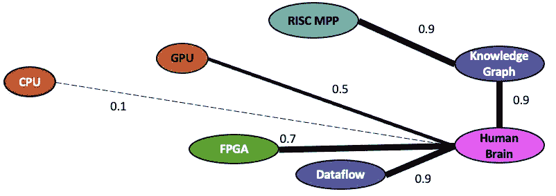
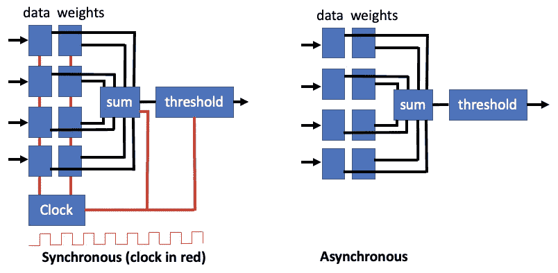
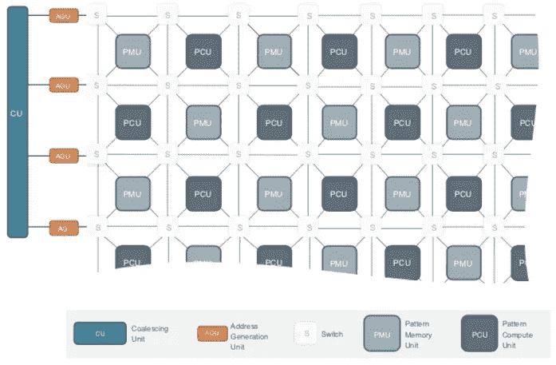
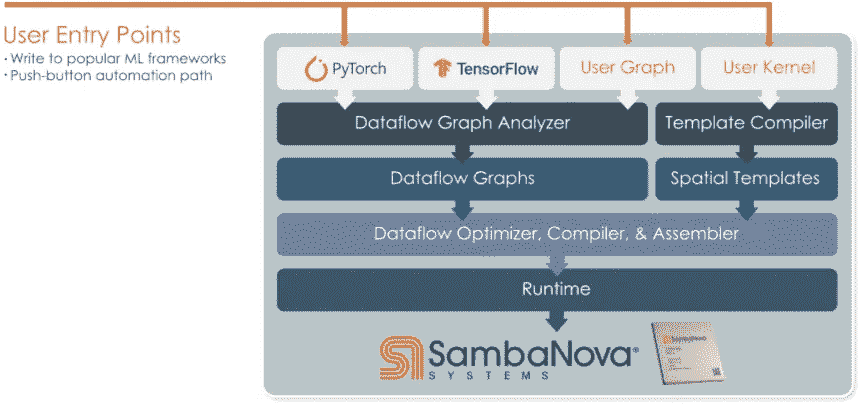

# SambaNova 的 6 . 76 亿美元融资

> 原文：<https://towardsdatascience.com/sambanova-lands-676m-funding-eaa7c0571592?source=collection_archive---------20----------------------->

## 数据流架构及其如何影响您的 it 策略

SambaNova 是数据流架构的一个例子，它在架构上与人脑有许多相似之处。这个数字是我自己对硬件、知识图和人脑之间相似性得分的直观衡量。请注意，我将数据流与人脑的相似度评分定为 0.9。作者的作品。

本周，一家新的人工智能初创公司 SambaNova 获得了 6.76 亿美元的 D 轮融资，使其成为世界上获得资金最多的人工智能初创公司*。我的许多研究企业知识图和大规模机器学习的同事可能对资金的规模有点困惑。的确，一开始，连我都为这么小的公司获得这么大的资金而感到惊讶。然而，在研究了 SambaNova 的 40B 晶体管数据流芯片架构后，我现在明白了为什么他们的系统值得这种程度的关注。*

*这个博客将回顾什么是数据流架构，SambaNova 如何实现这个架构，为什么这个投资有意义，以及你需要做什么来将这个新的开发集成到你的整体 IT 策略中。*

## *NLP 和 EKG*

*让我们首先回忆一下，组织中 80%以上的知识都与非结构化数据相关联。企业知识图(EKG)架构师需要像伯特和 GPT 这样的高质量定制自然语言过程(NLP)模型来:*

1.  *从大型文档中提取统一的概念，*
2.  *对要搜索的文档进行分类，*
3.  *并提取特定的事实，我们可以很快整合到我们的心电图。*

*你的客户发来的每封电子邮件都应该在几分钟内(而不是几天内)进入你的 EKG，并直接影响他们的[嵌入](https://dmccreary.medium.com/understanding-graph-embeddings-79342921a97f)。这不仅是电子邮件分类，而是针对产品评论、评论，甚至社交媒体帖子。对于许多公司来说，构建高质量机器学习 NLP 模型的成本一直是首要问题。像生命科学和医疗保健这样的行业也需要专门的词汇，这些词汇不包括在 Huggingface 上托管的数千个标准 NLP 模型中。*

*随着上周 SambaNova 基金的宣布，这些成本障碍可能最终会变得不那么令人担忧。*

## *声称 NLP 模型训练性能提高了一个数量级*

**

*SambaNova 图来自他们的网站[这里](https://sambanova.ai/blog/a-new-state-of-the-art-in-nlp-beyond-gpus/)。经 SambaNova 许可使用的图像。*

*让我们从 SambaNova 的说法开始:对于训练像 BERT 和 GPT 这样的大型语言模型，他们 1/4 机架的硬件比 1024 个 NVIDIA V100 GPUs 具有数量级的性能优势。当然，他们提供的网页在细节上还是有点粗略。尚不清楚他们关于“性能提高一个数量级”的说法是否与构建大型 NLP 模型(如伯特或 GPT)的时间有关，或者与购买价格或 ROI 等其他指标有关。*

*请注意，本页没有提到价格比较。SambaNova 可以将他们的硬件定价为$2M 克雷图形引擎级别！这仍然可以为一些需要快速模型训练时间的公司提供价值。然而，我认为这个价格会让大多数公司负担不起他们的硬件，所以让我们期待他们更好的定价吧。*

*让我们假设这不仅仅是营销炒作，最终，SambaNova 用独立第三方支持的可复制基准和定价来支持他们的说法。我们希望他们能让许多小公司买得起硬件。*

*现在让我们来看看这是如何实现的。当英伟达是全球[最有价值的芯片制造商](https://venturebeat.com/2020/07/10/nvidia-overtakes-intel-as-most-valuable-u-s-chipmaker/)并拥有近 20，000 名员工时，一家新的创业公司(LinkedIn 上不到 200 名员工)如何创建一个具有“压倒 GPU”性能的系统？为了理解他们的说法可能是有效的，我们需要理解数据流硬件与串行 CPU 和 [SIMD](https://en.wikipedia.org/wiki/SIMD#:~:text=Single%20instruction%2C%20multiple%20data%20(SIMD,on%20multiple%20data%20points%20simultaneously.) GPU 芯片的设计有什么根本不同。回想一下，GPU 最初是为了加速视频游戏而设计的，而不是在海量深度学习数据集上执行训练。*

## *了解异步数据流硬件*

**

*图 2:左边的全局时钟(同步)感知器电路与右边的异步数据流(未锁定)电路的比较。图片由作者提供。*

*20 世纪 80 年代，当我还是贝尔实验室(Bell Labs)的 VLSI 电路设计师时，我对芯片设计师为高速电信系统构建高度专业化定制芯片的不同方法非常着迷。其中一种方法是构建接收数据输入并立即将数据转换为输出**的电路，而无需时钟**。这些电路被称为异步[数据流](https://en.wikipedia.org/wiki/Dataflow_architecture)架构，因为它们连续不断地从输入流向输出，从不使用时钟来通知电路何时可以开始计算。*

*在数据流电路领域，我们使用术语“内核功能”或简称“内核”来描述诸如加法、乘法、求和或平均等功能的原子库。我们在标量、向量或多维数组上执行这些功能。*

*尽管数据流电路具有出色的性能特征，但它们也面临着一些设计挑战:*

1.  *您无法确定地预测给定函数(内核单元)的输出何时有效。两个零的乘法可能很快就能完成，但两个大数的乘法可能需要更长的时间。*
2.  *让本地化的数据流彼此协同工作并与复杂的总线逻辑协同工作是一项挑战。*

*因此，根据输入数据和内核之间的时序，相同输入的输出可能会有所不同。可测试性也是一个挑战。[整个会议](https://ieeexplore.ieee.org/stamp/stamp.jsp?arnumber=740015)都致力于解决这些问题。这两种架构之间的差异如图 2 所示。*

*以下是一些关于数据流架构的事实:*

1.  *它们没有一个单独的程序计数器——它们不是典型的冯·诺依曼架构。*
2.  *通常不太需要中央“全局时钟”来同步电路。仍然需要全局时钟来将数据移入和移出通信总线，但它们的总体作用较小。*
3.  *任何电路块的输出都仅取决于输入数据的可用性。这应该会提醒您纯粹的函数式编程单元。*
4.  *当正确的结果出现在输出信号上时**的精确定时是复杂的。确定这一点的电路可能会加倍复杂。***
5.  *如果设计者能够找出同步逻辑的方法，数据流电路可以比传统 CPU 更快地实现并行数据转换。设计一个电路在结果完成时发出信号是一个不小的问题。*
6.  *只有一小部分电路设计者接受过设计异步数据流逻辑电路的培训。*

*虽然同步电路已经主导了几乎所有的芯片设计，但当执行快速、有时不精确的计算时，数据流架构仍有其一席之地。问题是，它们只在需要高速并行计算性能的专业环境中更具成本效益。设计一个可以用作通用计算系统的数据流芯片并不容易。*

*即使你可以设计一种新的数据流芯片架构，其性能是 CPU 的 100 倍，另一个挑战是如何训练开发人员停止考虑编写过程化的 IF/THEN/ELSE 代码，并让他们考虑使用数据流解决问题。许多新创公司的商业计划不会因为缺乏硬件性能而失败。他们未能招募到足够多知道如何为芯片编程的开发人员。即使在今天，只有不到 1%的数据科学家和 Python 开发人员能够开始理解如何将超快速并行处理 FPGA 集成到他们的生产代码中。尽管 FPGAs 是一项已经存在了 30 年的成熟技术。*

*如果你有兴趣听最近关于数据流架构的播客，这里有一个播客，Kunle Olukotun 谈论数据流架构。奥卢科通是桑巴诺瓦的创始人之一。在这个播客中，Olukotun 谈到了在传统的冯·诺依曼“软件 1.0”解决问题的方法中，仅仅是移动数据就花费了多少能量。*

## *深入桑巴诺瓦建筑*

**

*SambaNova 芯片架构将数据流计算单元放置在内存单元旁边，并通过高速交换机连接它们。经 SambaNova 许可使用的图像。*

*我可以用整个博客来深入研究 SambaNova 如何将他们的 400 亿晶体管 [7 纳米](https://en.wikipedia.org/wiki/7_nm_process) TSMC 制造的芯片划分成数据流块。简而言之，他们将内核逻辑划分为数据流内核电路，这些电路被设计成称为可重新配置数据流单元(rdu)的逻辑块。和 RDU 可以使用片上网络交换机快速重新配置。*

*总而言之，他们将数据流内核电路(PCU)与内存交错，并使用高速片上开关在这些单元之间移动数据。他们通过分析深度学习神经网络的静态结构，将核心功能放在 PCU 中。然后，软件将 PCU 和内存连接在一起，以最大限度地减少芯片周围的数据移动。这听起来编程起来非常复杂。幸运的是，如果你使用的是 TensorFlow 的 PyTorch，你只需要修改几行代码。*

# *入口点:挂钩 Python 代码*

**

*SambaNova 系统的主要入口直接通过 PyTorch 和 TensorFlow。经 SambaNova 许可使用的图像。*

*SambaNova 系统的关键是他们如何整合所有这些数据流内核来训练你的神经网络。当你编写大多数训练神经网络的深度学习算法时，你指定了数据流的有向图的拓扑。SambaNova 截取这段代码，在其硬件中构建数据流图，并产生与使用 CPU 或 GPU 相同的结果。困难的部分是由数据流图分析器完成的，它将图转换成可以编译成硬件连接的格式。*

*这类似于 FPGAs 编程的相同过程。但与 FPGA 不同的是，它改变芯片中的布线，使布线在芯片上电时永久不变，SambaNova 在交换机中动态路由数据，不需要两秒钟；交换机可以在几毫秒内重新路由 RDU 的输入和输出。*

## *进入深度神经网络的机器学习*

*尽管同步 von-Naumann 架构在过去 40 年中占据主导地位，但一些芯片架构师仍然认为设计数据流架构的极端挑战是可以克服的。这些工程师中的许多人都隶属于斯坦福电子工程和计算机科学系，以及由 Kunle Olukotun 领导的斯坦福普适并行实验室。*

*在 2018 年左右，人们也清楚地看到，对以训练深度神经网络为中心的计算有着强烈的需求。公司每年花费数百万美元训练这些网络，他们选择的工具围绕两个 Python 库:TensorFlow 和 PyTorch。这为数据流开发人员提供了一种方式来轻松中断 python 库调用并使用他们的硬件，而无需从头重写算法。现在，新的硬件开发人员只需将“钩子”构建到 Python 库中，就可以使用他们的硬件来训练神经网络。*

## *人工智能的未来:低成本的专用 BERT 盒*

*当 OpenAI 宣布他们的 175B 参数 [GPT-3](https://en.wikipedia.org/wiki/GPT-3) 时，它在整个 AI 社区发出了冲击波。虽然他们没有表明他们在 GPU 上花了多少时间来训练这些庞大的模型，但我们可以推断出在 500 万美元到 1000 万美元之间。这使得使用伯特和 GPT 建立新的深度学习模型超出了大多数学术研究机构的预算范围。它还向硬件社区发出信号，表明对专门从事深度神经网络训练的硬件的需求正在增长。*

*现在，构建深度学习模型的大部分成本都集中在 NLP 和图形领域。BERT 和数以百计的 BERT 变体现在是最流行的需要扩展的语言模型。标准的 BERT 受到进程中输入令牌数量的限制，并且 BERT 训练成本随着输入令牌数量的增加而呈指数增长。许多公司和开源项目都关注 BERT 大型基准测试，以及在分布式 GPU 上扩展这些模型所需的巧妙技巧。*

*我们需要记住，SambaNova 不是第一家声称他们的硬件比传统 GPU 快一个数量级、成本低得多的公司。Graphcore 和 T2 Cerebras 已经提出这些声明好几年了。他们在公共数据集上公开发布他们的性能基准，您甚至可以尝试复制(如果您有能力购买评估硬件的话)。这就把我们带到了下一个话题:我们如何知道供应商说的是不是真话？*

## *对客观机器学习基准的需求*

*任何客观的采购流程的首要规则之一是以适度的怀疑态度对待供应商发布的任何性能基准。我记得在 20 世纪 80 年代打开我的《计算机世界》杂志，看到甲骨文和赛贝斯都在整版的背靠背广告中宣称他们各自的**速度比对方快十倍。他们所要做的就是调整配置文件中的几个参数来减慢对手的速度。这让我很早就认识到供应商基准是不可信的。***

*当你仔细阅读许多软件供应商的软件许可协议时，这个问题变得更加困难。未经书面批准发布基准测试违反了您的许可协议。一些供应商甚至拒绝给你许可证密钥来运行你自己的内部基准，我个人认为这是一种不道德的做法。*

## *MLCommons 和 MLPerf*

*在机器学习领域，现在有一些小的努力来标准化机器学习基准，如 [MLCommons](https://mlcommons.org/en/) 项目。但即使是这些“客观”的网站，有时也很容易被大型行业参与者资助的所谓独立顾问所吸收。*

*如果您决定尝试了解类似于 [MLPerf](https://docs.google.com/spreadsheets/d/e/2PACX-1vQL7EcfUDBNoLrx8rsmiZ_GZrrLHL0FD8Em9yIlukv1lQWGBBxRaB8i3lg2q52s3nmH19Y-DFYqZd3W/pubhtml?gid=0&single=false&widget=false&headers=false&chrome=true#) 基准测试的基准测试，请确保了解训练和推理基准测试之间的差异，密集和稀疏数据表示之间的差异，以及 SIMD 硬件非常适合密集矩阵问题(如图像)但可能不适合稀疏问题(如 NLP、BERT 和图形卷积)的事实。*

*获得原始执行速度来训练大型深度神经网络只是第一步。下一步是了解进行这种计算的长期成本和投资回报率。许多软件优化可以降低训练成本和推理成本。知道您的组织中有多少人将来会需要这种类型的硬件也是很难预测的。尽管云服务提供商都很乐意向你出售 GPU 时间，但他们可能不会对你探索创新的新机器学习硬件感兴趣。*

## *带回家的点数*

*你真的不需要知道**数据流架构是如何工作的。但你确实需要知道，它们**可能**会完全颠覆机器学习市场和现有 GPU 硬件的价值。这里有几点可以带回家:***

1.  *如果你每月花费超过 5 万美元来训练你的机器学习模型，请考虑这些新的硬件选项。*
2.  *如果你还在用“R”和 SAS 做数据科学，考虑到新一代硬件厂商只会支持 TensorFlow 和 PyTorch 这样的 Python 库。现在可能是重新培训你的员工的好时机。*
3.  *如果你正准备购买大量的 GPU 来进行深度学习，可以考虑租赁它们，这样一年后你就可以升级到专门的深度计算机硬件。*
4.  *如果您目前拥有大量 GPU，请考虑在它们过时之前将其出售。GPU 可能很快就会成为数据中心中贬值最快的组件之一。*
5.  *如果您正在使用云服务提供商(CSP ),请询问您的 CPS 是否有计划来帮助您评估低成本的 BERT boxes 及其同类产品。*
6.  *如果你想要更快和更低成本的**推理**，考虑低成本的硬件选项，比如可以在两秒钟内重新编程的 FPGAs。正如奥卡姆剃刀教导我们的那样，有时最简单的解决方案就是最好的解决方案。*
7.  *不要盲目相信供应商的基准。在您自己的数据中心对您自己的数据进行基准测试。在进行基准测试时，要考虑所有因素，包括网卡和交换机的成本。*
8.  *如果您看到您的供应商做出不公平的声明，在 Twitter 上发布您的内部基准测试结果之前，请检查您的许可协议。*
9.  *拒绝与不允许你客观评估他们的主张的供应商合作。请他们将代码发布在 GitHub 等公共源代码库上。*
10.  *支持开放透明的机器学习基准。*

## *摘要*

*SambaNova 的资助声明并不孤立。许多新公司正在构建定制的硅硬件，以帮助降低计算成本。从 Raspberry Pi 的 RS2040 到英特尔 PIUMA 图形加速器，每个人都在行动，半导体行业颠覆的时机已经成熟。我们期待在这些新系统上运行客观的基准测试！*