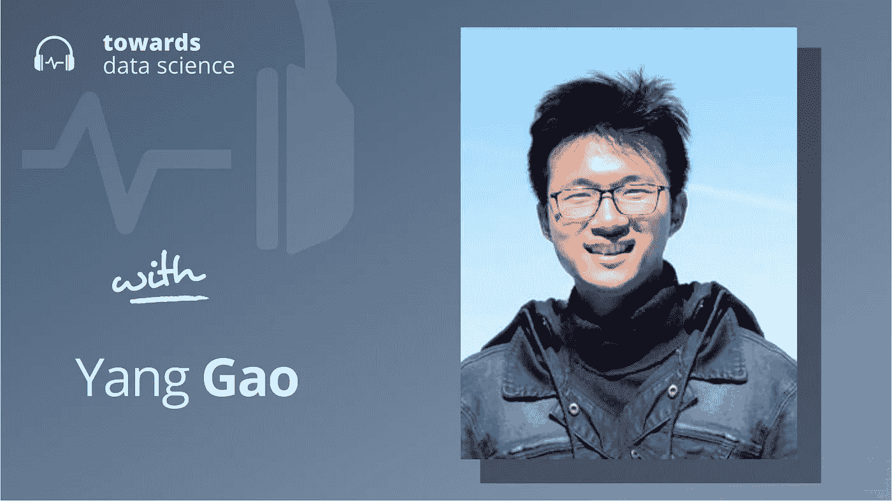

# 样本高效人工智能

> 原文：<https://towardsdatascience.com/sample-efficient-ai-4380739eda7c?source=collection_archive---------28----------------------->

## [播客](https://towardsdatascience.com/tagged/tds-podcast)

## 高阳关于制造学习速度和人类一样快的人工智能

[苹果](https://podcasts.apple.com/ca/podcast/towards-data-science/id1470952338?mt=2) | [谷歌](https://www.google.com/podcasts?feed=aHR0cHM6Ly9hbmNob3IuZm0vcy8zNmI0ODQ0L3BvZGNhc3QvcnNz) | [SPOTIFY](https://open.spotify.com/show/63diy2DtpHzQfeNVxAPZgU) | [其他](https://anchor.fm/towardsdatascience)

*编者按:TDS 播客由杰雷米·哈里斯主持，他是人工智能安全初创公司墨丘利的联合创始人。每周，Jeremie 都会与该领域前沿的研究人员和商业领袖聊天，以解开围绕数据科学、机器学习和人工智能的最紧迫问题。*

从历史上看，人工智能系统学习速度很慢。例如，计算机视觉模型通常需要看到数万个手写数字，才能区分 1 和 3。即使是玩游戏的人工智能，如 DeepMind 的 AlphaGo，或其最近的后代 MuZero，也需要比人类更多的经验来掌握特定的游戏。

因此，当有人开发出一种算法，可以像人类一样快地达到人类水平的性能时，这是一件大事。这就是为什么我邀请高阳和我一起参加本期播客的原因。杨是伯克利大学和清华大学的人工智能研究人员，他最近与人合著了一篇论文，介绍了 EfficientZero:一种强化学习系统，在短短两个小时的游戏体验后，就学会了在人类层面上玩雅达利游戏。这是采样效率的巨大突破，也是开发更通用、更灵活的人工智能系统的重要里程碑。

以下是我在对话中最喜欢的一些观点:

*   自 AlphaGo 以来，人工智能研究人员已经认识到将强化学习与搜索方法相结合的前景，这涉及到考虑许多潜在的下一步行动，并在选择一个行动之前模拟它们的结果。通过明确地将“规划”的元素引入 RL 范式，这开始更紧密地模仿人类的思考。杨将 AlphaGo、AlphaZero 和 MuZero 的巨大性能提升归功于这一搜索过程。
*   RL 中的另一个重要区别是基于模型的系统和无模型系统之间的区别，前者构建环境的显式模型，后者不构建。在 AlphaGo 之前，几乎所有领先的 RL 工作都是在无模型系统上完成的(例如，PPO 和深度 Q 学习)。基于模型的系统是不实际的，因为学习环境建模是困难的，并且在更简单的动作选择任务之上增加了一个重要的复杂性层，而无模型系统可以专门关注该任务。但现在，计算资源和一些新的算法技巧已经可用，基于模型的系统正迅速成为更灵活、能力越来越强的选择。
*   DeepMind 的 MuZero 是迈向实用的基于模型的 RL 的重要一步。MuZero 被设计用来玩各种视频游戏，使用屏幕上的像素作为输入。然而，与它的前辈不同，它构建的游戏环境模型并没有试图预测每个游戏中的像素在未来的时间步骤中会如何变化。相反，它将游戏环境映射到一个潜在的空间，压缩游戏的表示，使其只包含相关信息。这种更低维度的表示方式使得预测未来时间步骤中游戏环境的显著特征变得更加容易，也更加符合人类学习玩游戏的方式:例如，当我们踢足球时，我们不会跟踪球场上的每一片草，或者每个球员脸上的表情——我们维护着一个非常精简的竞技场心理模型，其中包括一些细节，如球员的位置、球的位置和速度等。
*   EffcientZero 在很多方面对 MuZero 进行了改进。首先，它能够考虑假设的形式，“如果我执行动作 X，未来会是什么样子？”这种能力是通过自我监督的学习过程开发的，在这个过程中，EfficientZero 利用其过去关于环境对类似行为的反应方式的经验。
*   其次，EfficientZero 还提出了所谓的“混淆问题”(aliasing problem)，这是强化学习中一个众所周知的问题，因为 RL 代理的环境模型通常被设计为预测关键事件将发生的准确时间步长(例如，足球将飞入球门的精确视频帧)。但这种精确度并不是必需的，事实上是适得其反的，因为它会导致过度敏感的学习信号:即使一个智能体的环境模型几乎一切都正确，但它的预测却差了几分之一秒，它最终也不会得到任何奖励！EfficientZero 通过粗粒度化时间维度来纠正这一点，确保模型因预测“足够接近实际目的”而得到奖励。再一次，这背后有一个与人类学习的强大类比:好的老师会给学生一个问题的大部分正确的部分分数，而不是提供二进制的 100%/0%分数。这给了学生更多的信号去抓住，也避免了过度适应没有实际意义的细节层次。
*   如何将 EfficentZero 的样本效率与人类的样本效率进行比较还不是很明显。EfficientZero 论文中分享的方法是让一群人玩一系列不同的 Atari 游戏，两小时后查看他们的中值或平均分数，并将其与 EfficientZero 在相同的游戏时间内训练后的表现进行比较。虽然这种策略确实使 EfficientZero 优于人类，但它几乎肯定低估了 EfficientZero 的实际样本效率。杨认为，从某种意义上来说，一个第一次玩雅达利游戏的 8 岁儿童，一生都在为这个游戏做准备(训练)——掌握因果关系，甚至是帮助他们在游戏中导航的文化线索，即使他们以前没有见过这个游戏。另一方面，EfficientZero 每次推出新游戏时，都必须从头开始学习。

你可以在推特上关注杨。

## 章节:

*   0:00 介绍
*   杨背景 1:50
*   6 点穆泽罗的活动
*   13:25 穆泽罗到效率零点
*   19:00 样品效率比较
*   23:40 利用算法调整
*   27:10 进化对人脑和人工智能系统的重要性
*   35:10 的人工采样效率
*   38:28 AI 在中国的生存风险
*   进化和语言
*   49:40 总结