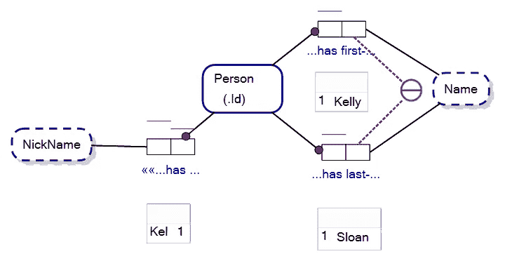
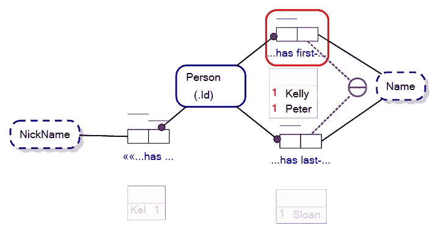
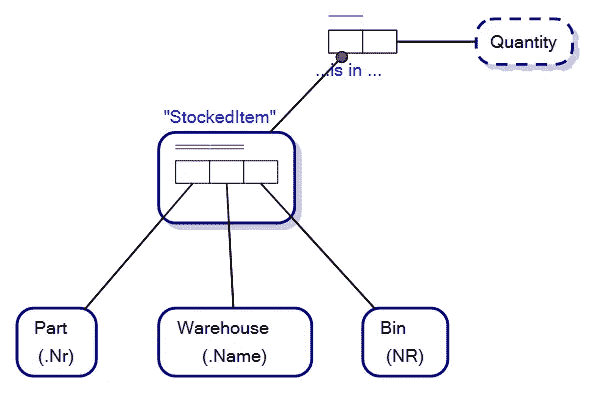
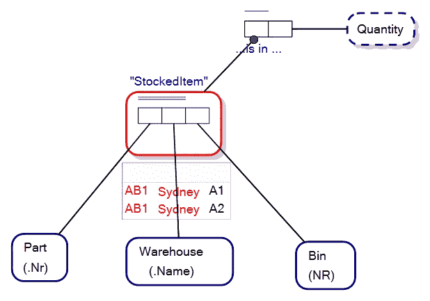
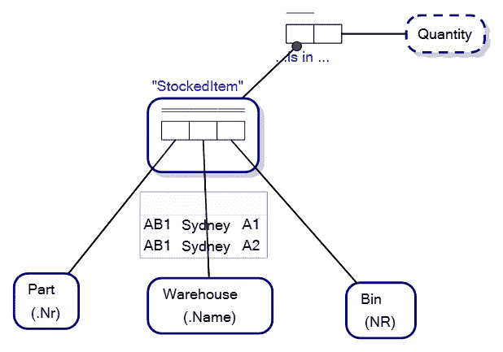

# 样本群体—对象-角色建模

> 原文：<https://towardsdatascience.com/sample-populations-object-role-modeling-870f964e6a94?source=collection_archive---------38----------------------->

## 人口抽样变得容易

对象-角色建模(ORM)是一种图形概念建模技术，主要用于数据库分析和设计，但也可用于任何你想记录或定义数据结构的情况。

下面是一个典型的对象-角色模型:

对象-角色模型。图片作者。

上面的 ORM 模型表明，在我们的[话语世界](https://en.wikipedia.org/wiki/Domain_of_discourse) (UoD)中，每个人都由他们的 Person_Id 唯一标识，具有唯一的名和姓组合以及唯一的昵称。

事实类型下的方框是样本总体。在我们的 UoD 中，凯莉·斯隆有一个人名为 *1* ，名为*凯莉*，姓为*斯隆*，昵称为*凯尔*。

这是否使对象-角色建模，或者使你能够绘制 ORM 模型的软件，成为一个数据库？

不一定。样本总体被引入 ORM，以允许建模者测试模型，看它是否适合目的。例如，如果我们将一个名字为 Steven ***但是名字为*** 并且 personId 为 *1* 的人引入到我们的模型中，我们的[内部唯一性约束](/internal-uniqueness-constraints-object-role-modeling-77b27f12c353)表明每个人只有一个名字(在事实类型中，Person 有名字),那么就违反了唯一性约束。现在请注意，在我们的软件中，事实类型以红色突出显示(即包含错误),错误通过样本总体中 PersonId，1 的两个实例也以红色突出显示来指示。

样本总体中包含错误的对象-角色模型。图片作者。

乍一看，这似乎很简单，但这就是样本总体的全部意义……它们可以用来表明一个观点，并在创建数据模型时帮助解决问题。

例如，以下面的对象角色模型为例。它为库存管理解决方案对存储在仓库箱柜中的零件进行建模:

库存管理解决方案的对象-角色模型。图片作者。

StockedItem 事实类型中的唯一性约束是针对 Part 和 warehouse 所扮演的角色的，这表明在我们的 UoD 中，Part 只存储在 Warehouse 中的一个 bin 中。

为了帮助设想模型，下面的图片显示了一名员工在仓库的一个箱子里伸手拿零件:

一名仓库保管员在仓库的箱子里寻找零件。图像通过 Dreamstime.com 授权给维克多摩根特。ID 102810076 七十四张图片| Dreamstime.com

但是，如果箱柜不够大，无法存储仓库中一种零件类型的所有库存，该怎么办？在这种情况下，我们可以选择将相同的零件存放在同一仓库的多个箱子中。

我们的模型不支持这一点，所以当我们创建一个表达我们的新需求的样本群体时，错误显示在我们的对象-角色建模软件中:

对象-角色模型中样本总体的错误。图片作者。

为了解决这个问题，我们将内部唯一性约束扩展到 cover、Part、Warehouse 和 Bin，消除了样本总体中的错误。

解决样本总体错误的对象-角色模型。图片作者。

对象-角色建模中的样本总体就是这么简单。它们是帮助你分析和解决概念模型的工具。

感谢您的阅读，如果时间允许，我会写更多关于对象-角色建模和概念建模的内容。

— — — — — — — — — — — — — — — — — — — — — — — — -