# 使用 Python 对分布进行采样

> 原文：<https://towardsdatascience.com/sampling-distributions-with-python-f5a5f268f636?source=collection_archive---------2----------------------->

## 用 Python 实现大学统计

# 介绍

在一系列的每周文章中，我将涉及一些重要的统计学主题。

目标是使用 Python 来帮助我们获得对复杂概念的直觉，从经验上测试理论证明，或者从零开始构建算法。在本系列中，您将会看到涵盖随机变量、抽样分布、置信区间、显著性检验等主题的文章。

在每篇文章的最后，你可以找到练习来测试你的知识。解决方案将在下周的文章中分享。

迄今发表的文章:

*   [伯努利和二项随机变量与 Python](/bernoulli-and-binomial-random-variables-d0698288dd36)
*   [用 Python 从二项式到几何和泊松随机变量](/geometric-and-poisson-random-variables-with-python-e5dcb63d6b55)
*   [用 Python 实现样本比例的抽样分布](/sampling-distributions-with-python-f5a5f268f636)
*   [Python 的置信区间](/confidence-intervals-with-python-bfa28ebb81c)
*   [使用 Python 进行显著性测试](/significance-or-hypothesis-tests-with-python-7ed35e9ac9b6)
*   [用 Python 进行组间差异的双样本推断](/two-sample-inference-for-the-difference-between-groups-with-python-de91fbee32f9)
*   [分类数据的推断](/inference-for-categorical-data-9f3c6034aa57)
*   [高级回归](/advanced-regression-f74090014f3)
*   [方差分析— ANOVA](/analysis-of-variance-anova-8dc889d2fc3a)

像往常一样，代码可以在我的 [GitHub](https://github.com/luisroque/College_Statistics_with_Python) 上找到。

# 抽样分布

我们经常发现自己想要估计一个总体的参数，例如，它的均值或标准差。通常，我们无法从总体人群中收集数据。在这种情况下，我们估计总体参数的唯一方法是从总体中随机抽样。我们定义样本的大小 *n* 并计算每个样本的统计量。这个统计量是我们用来计算总体参数的。请注意，我们为每个随机样本计算的统计数据可能与总体值相差很远，因为它是一个随机样本。这就是为什么我们要多次执行这个过程，我们称之为试验。

让我们定义一个简单的例子。我们有 100 名运动员，他们的球衣号码从 0 到 99 不等。首先，我们计算总体、和σ的参数。

```
import numpy as np
import matplotlib.pyplot as plt
from scipy.stats import bernoulli, norm, poisson
from scipy import stats
from scipy.stats import kurtosis, skew
import seaborn as snsX = np.random.choice(np.arange(0, 100), 100, replace=False)
print(f'μ={X.mean()}')
print(f'σ={X.std()}')μ=49.5
σ=28.86607004772212
```

我们随机抽取 100 个大小为 5 的样本。

```
rs = []
for i in range(100):
    rs.append(np.random.choice(X, 5))
rs = np.array(rs)# 5 examples of our random samples

rs[:5]array([[87, 73, 61, 91, 99],
       [10,  5, 46, 72, 92],
       [ 1,  3,  7, 59, 88],
       [ 1, 42, 87, 21, 42],
       [65,  9, 54, 88, 67]])
```

对于每一个，我们计算一些统计数据；在这种情况下，样本意味着 x̄.因此，x̄是 100 个值的数组(每个样本的平均值)。让我们打印前 5 个值，然后绘制一个直方图，以便更好地理解抽样分布的形状。事实上，这是样本量等于 5 时样本均值的**采样分布。**

```
x_bar = rs.mean(axis=1)
print(x_bar[:5])
plt.hist(x_bar, bins=100);[82.2 45\.  31.6 38.6 56.6]
```

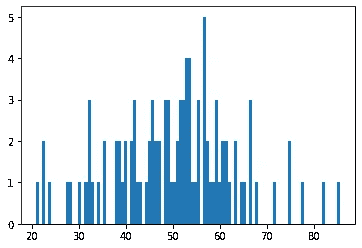

图 1:样本大小为 5 时样本均值的抽样分布直方图。

# 样本比例的抽样分布

我们将通过创建两个随机变量(RV)来开始这一部分，一个伯努利 RV 和一个二项式 RV(如果您不熟悉细节，请参见本系列中我以前的文章)。


图 2:《瑞克和莫蒂》是一部动画系列片，讲述了一位超级科学家和他不太聪明的孙子[的故事。](https://commons.wikimedia.org/wiki/File:Rick_and_Morty.svg)

手头的问题如下，有 20，000 个不同的宇宙，里克和莫蒂生活在其中，我们想计算如果我们访问一个随机的宇宙，我们可以找到莫蒂的比例。设 *X* 为如下伯努利 RV:

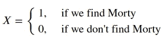

我们已经在过去的文章中看到

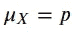

和

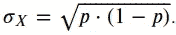

现在，我们定义一个新的 RV，它等于 *X* 的 10 次独立试验的总和。这是一个二项式 RV

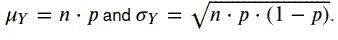

现在是时候访问一些宇宙，并在那里随机寻找莫迪了。想象一下，我们每次访问 10 个宇宙，这确实是我们从宇宙总体中抽取的样本。请注意，我们可以认为这些样本是独立的，即使我们为 10 个样本选择了不同的宇宙。这是因为与总体相比，样本数量非常少。事实上，有一个 10%的规则，假设在没有从一定规模的人口中替换的随机抽样中的独立性。

该去找莫蒂了。

```
p = 0.6
n = 10
X = bernoulli(p)
Y = [X.rvs(n) for i in range(10000)]plt.hist(np.sum(Y, axis=1));
```

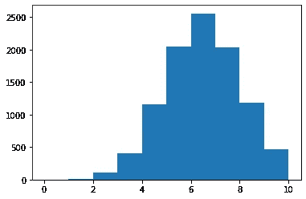

图 Morty 搜索的抽样比例的抽样分布直方图。

这就是抽样比例的抽样分布。如何计算它的均值和标准差？您的样本比例的期望值是我们在访问中发现的死亡比例，显示了总体参数的无偏估计。同理，样本比例的标准差就是我们的二项随机变量 *Y* 除以 *n* 的标准差。

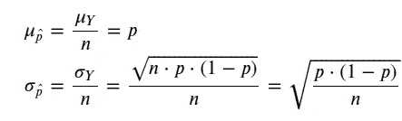

```
print('Empirically calculated expected value: {}'.format(np.mean(np.mean(Y, axis=1))))
print('Theoretical expected value: {}'.format(p))Empirically calculated expected value: 0.5977399999999999
Theoretical expected value: 0.6print('Empirically calculated standard deviation: {}'.format(np.std(np.mean(Y, axis=1))))
print('Theoretical standard deviation: {}'.format(np.sqrt(p*(1-p)/n)))Empirically calculated standard deviation: 0.15472844728749785
Theoretical standard deviation: 0.15491933384829668
```

给你。我们得出了非常相似的值。首先，通过对随机宇宙进行 10 次参观旅行的大量试验。其次，通过计算这个采样分布的理论值。在本文中，我们将确切地理解为什么这两种方法会产生相似的结果。

# 样本比例抽样分布的正态性

有两种情况可以认为抽样分布的形状近似正态。

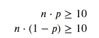

让我们试一个例子。你经营一家音乐商店，每周收到 100 张新 CD(把这些看作是随机样本)。您的供应商表示，他们交付了大约 10%的摇滚 CD。你计算每周样本中摇滚 CD 的每周比例。

```
n = 100
p = 0.1
print(n*p)
print(n*(1-p))10.0
90.0
```

条件满足。让我们画出来，看看最终的分布。

```
X = bernoulli(p)
Y = [X.rvs(100) for i in range(10000)]normal = np.random.normal(p*n, np.sqrt(n*p*(1-p)), (1000, ))
density = stats.gaussian_kde(normal)
n_, x, _ = plt.hist(normal, bins=np.linspace(0, 20, 50), 
                   histtype=u'step', density=True) 
plt.close()

plt.hist(np.sum(Y, axis=1), density=True)
plt.plot(x, density(x));
```

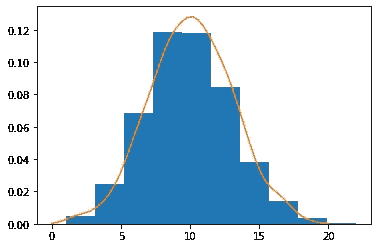

图 4:摇滚 CD 每周抽样比例的抽样分布。

看起来不错，基本正常。如果收到摇滚 CD 的概率不是 10%，而是变成了 3%，会怎么样？

```
n = 100
p_ = 0.03
print(n*p_)
print(n*(1-p_))3.0
97.0
```

第一个条件不满足。

```
X = bernoulli(p_)
Y_ = [X.rvs(100) for i in range(10000)]normal = np.random.normal(p_*n, np.sqrt(n*p_*(1-p_)), (1000, ))
density = stats.gaussian_kde(normal)
n_, x, _ = plt.hist(normal, bins=np.linspace(0, 20, 50), 
                   histtype=u'step', density=True) 
plt.close()

plt.hist(np.sum(Y_, axis=1), density=True)
plt.plot(x, density(x));
```

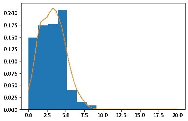

图 5:概率为 3%的 Rock CDs 每周抽样比例的抽样分布。

事实上，我们的分布是向右倾斜的。

为什么这些条件很重要？当我们需要回答关于抽样比例概率的问题时，这些是相关的。比如回到我们的例子，考虑 10%概率收到摇滚 CD 的初始信息。假设您在第一次试用时发现 12%的 CD 是摇滚 CD。假设真实比例是由您的供应商提供的，您搜索的样本中超过 12%是摇滚 CD 的概率是多少？

我们已经知道抽样分布是近似正态的。所以我们需要建立我们的正态分布，计算 P(p>0.12)。

```
print('Empirically calculated expected value: {}'.format(np.mean(np.mean(Y, axis=1))))
print('Theoretical expected value: {}'.format(p))Empirically calculated expected value: 0.09973800000000001
Theoretical expected value: 0.1print('Empirically calculated standard deviation: {}'.format(np.std(np.mean(Y, axis=1))))
print('Theoretical standard deviation: {}'.format(np.sqrt(p*(1-p)/n)))Empirically calculated standard deviation: 0.029996189024607777
Theoretical standard deviation: 0.030000000000000002n = 100
p = 0.10
p_ = 0.12
print(f'P(p>0.12)={1-norm.cdf(p_, p, np.sqrt(p*(1-p)/n))}')P(p>0.12)=0.252492537546923
```

# 推断人口平均数

在第一部分中，我们用两种不同的方法计算了在宇宙样本中发现的死亡数。第一种方法是推导出抽样比例的抽样分布的理论性质。第二种是通过使用抽样分布的统计来估计参数。在本节中，我们将更好地理解第二种方法。

让我们从定义总体均值开始:

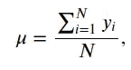

其中 *N* 代表 20，000 个宇宙的人口规模。样本均值ȳ可以定义为，

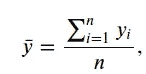

其中 *n* 代表样本大小，或者我们从总体中抽取的一个简单随机样本，大小为 10。

```
p = 0.6
n = 10
X = bernoulli(p)
Y = [X.rvs(n) for i in range(10000)]# One random sample

y_bar = np.mean(Y[0])
y_bar0.9
```

请注意，ȳ是我们用来推断总体参数的统计数据。然而，这些可能是不同的，因为我们是从人群中随机抽取样本。

# 中心极限定理

我们想得到关于中心极限定理(CLT)的直觉，然后我们将得到它的兴趣和应用。但是，首先，让我们定义一个明显的非正态分布。

```
elements = np.arange(6)
probabilities = [0.3, 0., 0.05, 0.05, 0.2, 0.4]
X = np.random.choice(elements, 100, p=probabilities)sns.histplot(X, stat='probability');
```

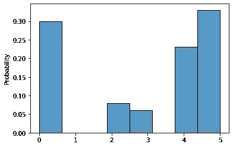

图 6:样本的非正态原始分布。

现在，我们可以从中提取样本。我们将抽取大小为 4 的样本，并计算其平均值。

```
s_1 = np.random.choice(elements, 4, p=probabilities)
print(s_1)
x_bar_1 = np.mean(s_1)
print(x_bar_1)[0 5 4 0]
2.25
```

让我们做同样的程序一万次。

```
s = []
n=4
for i in range(10000):
    s.append(np.random.choice(elements, n, p=probabilities))
s = np.mean(np.asarray(s), axis=1)print('Kurtosis: ' + str(np.round(kurtosis(s),2)))
print('Skew: ' + str(np.round(skew(s),2)))
print('---')
print('μ=' + str(np.round(np.mean(s), 2)))
print('σ=' + str(np.round(np.std(s), 2)))
sns.histplot(s, stat='probability');Kurtosis: -0.36
Skew: -0.27
---
μ=3.06
σ=1.06
```

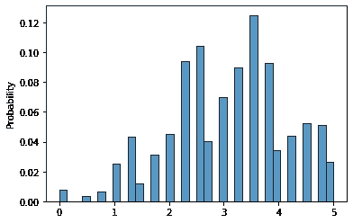

图 7:样本大小为 4 的样本均值的抽样分布。

上面的发行版看起来不再像我们最初的发行版了。CTL 告诉我们，当你取更多的样本并计算它们的平均值时，得到的分布将接近正态分布。我们可以通过偏度和峰度的值来衡量它，对于正态分布来说，这个值应该为零。正偏态分布的尾巴在右边，而负偏态分布的尾巴在左边。如果分布有正峰度，它比正态分布有更厚的尾部；相反，在消极的情况下，尾巴会更细。

CLT 还告诉我们，随着样本量的增加，近似值会变得更好。因此，让我们通过将样本量从 4 增加到 20，然后增加到 100 来测试它。

```
s = []
n=20
for i in range(10000):
    s.append(np.random.choice(elements, n, p=probabilities))
s = np.mean(np.asarray(s), axis=1)print('Kurtosis: ' + str(np.round(kurtosis(s),2)))
print('Skew: ' + str(np.round(skew(s),2)))
print('---')
print('μ=' + str(np.round(np.mean(s), 2)))
print('σ=' + str(np.round(np.std(s), 2)))
sns.histplot(s, stat='probability');Kurtosis: -0.1
Skew: -0.09
---
μ=3.06
σ=0.47
```

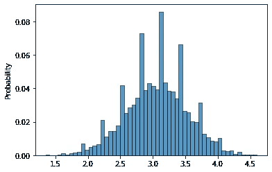

图 8:样本大小为 20 的样本均值的抽样分布。

```
s = []
n=100
for i in range(10000):
    s.append(np.random.choice(elements, n, p=probabilities))
s = np.mean(np.asarray(s), axis=1)print('Kurtosis: ' + str(np.round(kurtosis(s),2)))
print('Skew: ' + str(np.round(skew(s),2)))
print('---')
print('μ=' + str(np.round(np.mean(s), 2)))
print('σ=' + str(np.round(np.std(s), 2)))
sns.histplot(s, stat='probability');Kurtosis: -0.08
Skew: -0.03
---
μ=3.05
σ=0.22
```

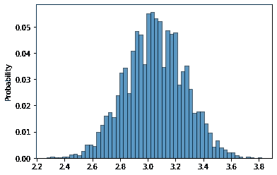

图 9:样本量为 100 的样本均值的抽样分布。

注意最后一个图是如何类似于正态分布的。有一个惯例，即大于 30 的样本量足以近似正态分布。此外，请注意我们为不同样本量绘制的抽样分布的平均值和标准偏差值。毫不奇怪，均值与原始分布相同。但是标准差的值确实很奇怪，因为它一直在缩小。事实上，这是一个需要注意的重要性质:我们对样本均值的抽样分布的标准差是原始总体标准差除以样本容量的平方根。因此，我们可以把它写成:

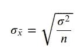

```
print("Theoretical value: " + str(np.sqrt(X.var()/n)))
print("Empirically computed: " + str(s.std()))Theoretical value: 0.20789179878003847
Empirically computed: 0.2151977077573086
```

这个过程并不特定于样本均值；例如，我们可以计算样本和。

```
s = []
for i in range(10000):
    s.append(np.random.choice(elements, 100, p=probabilities))
s = np.sum(np.asarray(s), axis=1)print('Kurtosis: ' + str(np.round(kurtosis(s),2)))
print('Skew: ' + str(np.round(skew(s),2)))
sns.histplot(s, stat='probability');Kurtosis: -0.04
Skew: -0.02
```

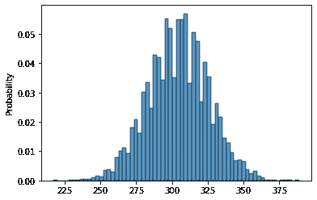

图 9:样本总数为 100 的样本的抽样分布。

我希望现在你明白为什么正态分布经常被用来模拟不同的过程。即使您不知道您想要以统计方式描述的过程的分布，如果您添加或取您的测量值的平均值(假设它们都具有相同的分布)，您会突然得到一个正态分布。

# 结论

我们在这篇文章中面临的问题是总体参数的估计。通常我们不能收集足够的数据来代表整个人口，因此，我们需要找到另一种方法来估计其参数。我们探索的方法是从人群中随机抽取样本。从随机样本中，我们计算统计量，然后用它来推断总体的参数。我们研究了抽样比例的抽样分布和样本均值的抽样分布。

我们还探索了 CLT。它告诉我们，独立于我们想要统计描述的过程的原始分布的形状，对于大于 30 的样本大小，从该原始分布获得的样本的平均值或总和将接近正态分布。

保持联系: [LinkedIn](https://www.linkedin.com/in/luisbrasroque/)

# 练习

你将在下周的文章中找到答案。

1.  里克在一个遥远的星球上对 75 名公民进行了 SRS 调查，以了解抽样调查的公民中有多少人对自己的生活水平感到满意。假设生活在这个星球上的 10 亿公民中有 60%对自己的生活水平感到满意。对自己的生活水平感到满意的公民比例的抽样分布的均值和标准差是多少？
2.  某个拥有超过 1，000，000 个家庭的星球的平均家庭收入为 1，000，000 美元，标准差为 150，000 美元。Rick 计划随机抽取 700 个家庭样本，计算样本平均收入。然后，计算样本均值的抽样分布的均值和标准差。
3.  Rick 正在对不同的入口枪进行质量控制测试，因为在制造过程中存在一些可变性。比如某枪，目标厚度 5mm。厚度分布向右倾斜，平均值为 5 毫米，标准偏差为 1 毫米。该零件的质量控制检查包括随机抽取 35 个点，并计算这些点的平均厚度。样本平均厚度的抽样分布是什么形状？样品中的平均厚度在目标值 0.2 毫米以内的概率是多少？

## 上周的答案

```
def geomcdf_1(p, x):
    # implementing first approach
    prob = 0
    for i in range(x-1):
        prob+=p*(1-p)**i
    return probdef geomcdf_2(p, x):
    # implementing second approach
    prob = 1-(1-p)**(x-1)
    return prob
```

1.  你有一副标准的牌，你在挑选牌，直到你得到一张女王(如果他们不是女王，你替换他们)。你需要挑 5 张牌的概率是多少？而不到 10？而且超过 12 个？

```
# Exactly 5

p = 4/52

p**1*(1-p)**40.055848076855744666# Less than 10

geomcdf_2(p, 10)0.5134348005963145# More than 12

1 - geomcdf_2(p, 13)0.3826967066770909
```

2.Jorge 对冰柜进行检查。他发现 94%的冰柜成功通过了检查。设 C 为 Jorge 检查的冷冻箱数量，直到一个冷冻箱未通过检查。假设每次检查的结果都是独立的。

```
# Our probability of success is actually the probability of failing the inspection

p=1-0.94
p**1*(1-p)**40.04684493760000003
```

3.佩德罗罚球命中率为 25%。作为热身，佩德罗喜欢罚任意球，直到他罚进为止。设 M 为佩德罗第一次任意球射门的次数。假设每个镜头的结果是独立的。找出佩德罗第一次投篮不到 4 次的概率。

```
p=0.25

# We can use our two functions

geomcdf_2(p, 4)0.578125geomcdf_1(p, 4)0.578125# which are computing

1-0.75**30.578125# and

0.25+0.25*0.75+0.25*0.75**20.578125
```

4.构建一个计算泊松 PMF 的函数，除了使用来自`numpy`的`np.exp`之外，不使用任何来自外部包的函数。选择一些参数，并将您的结果与`scipy`中的`pmf`函数进行比较。

```
def fact(k):
    k_ = 1
    for i in range(1, k+1):
        k_ *= i
    return k_def poisson_pmf(k, λ):
    return np.exp(-λ)*λ**k/fact(k)poisson_pmf(1, 2)0.2706705664732254poisson.pmf(1, 2)0.2706705664732254
```

5.构建一个计算泊松 CDF 的函数，而不使用任何外部包。选择一些参数，并将您的结果与`scipy`中的`cdf`函数进行比较。

```
def poisson_cdf(x, λ):
    p = []
    for i in range(x+1):
        p.append(poisson_pmf(i, λ))
    return sum(p)poisson_cdf(2, 2)0.6766764161830635poisson.cdf(2, 2)0.6766764161830634
```