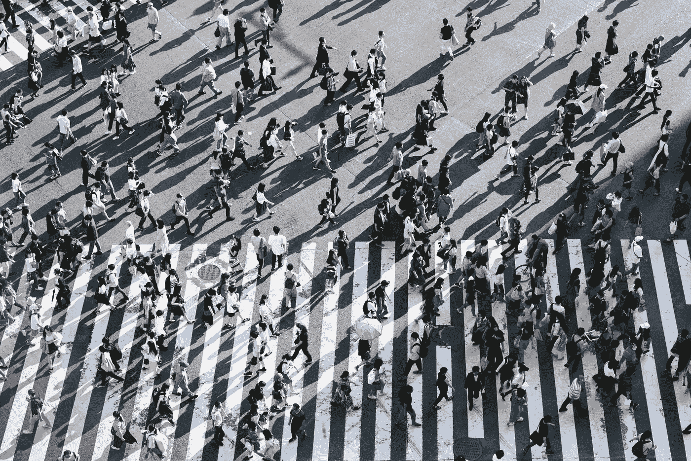
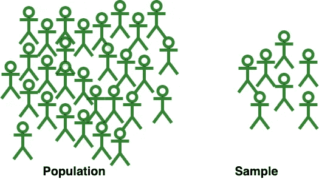
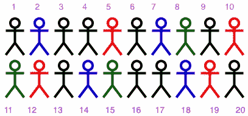
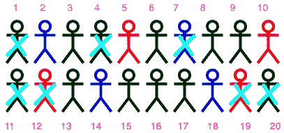
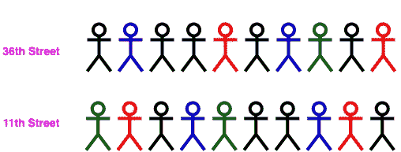
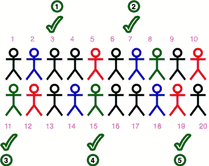

# 统计学中的抽样技术

> 原文：<https://towardsdatascience.com/sampling-techniques-in-statistics-9c77a39e0948?source=collection_archive---------7----------------------->

## 统计学中不同抽样技术的简单介绍

图片由[良治](https://unsplash.com/@ryoji__iwata)在 [Unsplash](https://unsplash.com/photos/IBaVuZsJJTo) 上拍摄

每当我们遇到任何统计研究时，我们都会听到许多不同的统计术语。😳我们最常听到的一个术语是抽样。在本文中，我们将尝试理解什么是采样，然后深入研究不同采样技术的细节。

# 抽样

**抽样**，简单来说，就是从人群中选择一个群体(样本)，我们将从中收集数据用于我们的研究。取样是研究的一个重要方面，因为研究的结果主要取决于所用的取样技术。因此，为了得到准确的结果或能很好地估计总体的结果，应该明智地选择抽样技术。

现在让我们先了解一下统计学上的样本和总体究竟是什么。

总体是指我们从中抽取用于研究的统计样本的元素或个体的集合。这是我们想要得出结论的整个群体。群体中元素或个体的数量称为群体规模。

***注:*** *在统计学研究中，人口并不总是刻画人。它可以是任何东西，印度的羊的数量；美国小学生的总人数；互联网上所有博客网站的数量。*

**另一方面，样本**是总体的子集。它是您从中收集数据的特定组。样本中元素或个体的数量称为样本容量。选择样本的过程称为**取样**。比如印度拉贾斯坦邦的羊的样本；美国纽约小学生样本；互联网上的数据科学博客网站样本。

***注:*** *样本的大小总是小于总体的大小。*

但是，我们为什么需要样本呢？🤔这是一个很好的问题。👏让我们先了解这一点。

我们为什么需要样本？

答案简单明了。从人口中的每个个体(或元素)收集数据几乎是不可能的。因此，抽样有助于我们获得整个人口的信息。很明显，这些结果不可能完全准确，但却是总体的最接近的近似值。此外，重要的是，选定的群体应具有人口代表性，并且不以任何方式带有偏见。

这是一个简单的人口说明和从中抽取的样本。

作者图片

有许多抽样技术，但我们将只讨论统计学中几种常见的抽样技术。请注意，我们不会深入比较这些技术。

# 取样技术

## **简单随机抽样(SRS):**

假设我们有一个 20 人的群体，我们需要从这个群体中得到一个 7 人的样本。为了便于理解，让我们给这些人编号。现在，我们将在 1 到 20 之间随机选择 7 个数字，反对这些数字的人将成为我们样本的一部分。如果与所选数字相对的人已经在我们的样本中，我们将跳过该数字，选择另一个数字。

作者图片

假设我们选择 4，然后 7，然后 11，然后 20，然后 1，然后 12，然后 20。既然已经选了 20，我们就再选一个数字，假设这次是 19。为了便于理解，我们将选出的人划掉。

作者图片

***注:***

1.  我们跳过了重复的数字，因为我们不会对同一个人进行两次调查或采访。
2.  *随机数有不同的生成方式。您可以通过编程或通过将所有这些数字放入一个包中并每次选择一个来实现。*

这种类型的抽样称为**简单随机抽样**。当总体是同质的时，这种抽样是最合适的。我们可以注意到，这个样本中的每个成员都有平等的机会(概率)被选中。在这种情况下，选择的概率是 1/20。

## 分层抽样:

让我们取和上面一样的样品。假设我们这次想要 9 号的样品。让我们把这些人分成不同的组，让这些组基于这些人穿的衣服的颜色。

作者图片

根据颜色，我们将这 20 个人分成 4 组。这些更小的群体中的每一个都被称为一个阶层，每个阶层都可以由一个特征来定义，在这种情况下，这个特征就是衣服的颜色。因此，基于关于样本成员的先验信息来创建阶层。一个阶层中的成员是同质的，而一个阶层的成员与另一个阶层的成员是异质的。因此，当群体本身是异质的，并且可以从中分离出同质层时，就使用这种方法。

现在，从这些层中的每一层中选出成员，也就是说，从每一层中抽取一个样本。当我们对有许多不同阶层的人口进行抽样时，我们一般要求样本中各阶层的比例应与人口中的比例相同。

> 一个玩具例子，只是为了理解这个概念。
> 
> 黑人比例
> 
> =(黑数/总数)*样本量= (9/20)*8 = 3.6
> 
> 红色的比例= (4/20) * 8 = 1.6
> 
> 蓝色的比例= (4/20) * 8 = 1.6
> 
> 绿色的比例= (3/20) * 8 = 1.2
> 
> 如果我们近似这些数字，我们可以选择 4 个黑色，2 个红色，2 个蓝色和 1 个绿色来很好地代表人口。

***注:*** *可采用随机抽样或其他任何抽样技术从各层中抽取成员。*

## 整群抽样:

整群抽样经常与分层抽样混淆，但这两种抽样技术互不相同。主要的区别在于，使用整群抽样，你可以用自然群体来区分你的人群。比如像城市街区、学区、年龄、性别等聚类。

让我们再次考虑我们的人口，假设第一排的人住在第 36 街，第二排的人住在第 11 街。每一个都是一个集群。

作者图片

现在，我们可以从这两个集群中选择一个集群(这可以通过简单的随机抽样来完成)。假设我们选择第 11 街，那么我们现在将调查住在第 11 街的每一个人。

***注:*** *我们可以选择任意多的集群。*

整群抽样有两种方式:

**单阶段整群抽样**，我们随机选择整群并调查整群的每个成员；或者**两阶段整群抽样**，我们首先随机选择整群，然后从这些整群中随机选择成员。

## 系统取样:

在这种抽样技术中，我们系统地选择成员。特别是，通过先将所有成员按顺序排列，在群体的规则间隔中选择成员。

让我们考虑一下 20 人的样本人口。假设我们要选择 5 个人，我们的系统是从第三个人开始，每四个人选一个。我们将继续这样做，直到我们得到 5 人的样本。(勾号表示选中的人。)

作者图片

***注:***

1.  *为了让每个成员都有平等的入选机会，建议采用随机抽样的方式选出第一个(起始)成员。*
2.  系统抽样会导致偏倚。

## 方便取样:

这是最简单的采样技术之一，但也是最危险的采样技术之一，因为样本是根据可用性选择的。例如，调查你办公室的每一个人，研究当地的每一只猫。这样的样本不能代表总体。

***注:*** *应使用随机化，以便我们的样本能很好地代表我们的总体，并能使我们接近关于我们总体的准确结果。*

抽样技术——简单抽样、聚类抽样、分层抽样和系统抽样都是概率抽样技术，并涉及随机化。然而，便利抽样是一种非概率(或非随机)抽样技术，因为它依赖于研究人员选择样本的能力。非概率抽样技术可能导致有偏差的样本和结果。

还有其他的采样技术。比如立意、配额、转诊/滚雪球抽样都是非概率抽样技术。多阶段抽样是一种概率抽样技术。然而，涵盖所有的采样技术超出了本文的范围。😐

***注:*** *我这里用的是人作为例子。为了简单起见，我给不同的人涂了不同的颜色，但是这些颜色并不代表什么。*

我希望这篇文章能帮助你理解这些采样技术背后的基本概念。😀

**参考文献:**

这篇文章的灵感来自于 Steve Mays 在 YouTube 上的一些很棒的视频。🙏此外，请查看这个名为 [StatQuest](https://www.youtube.com/channel/UCtYLUTtgS3k1Fg4y5tAhLbw) 的精彩频道。

谢谢大家阅读这篇文章。请分享您宝贵的反馈或建议。快乐阅读！📗 🖌

[领英](https://www.linkedin.com/in/chetna-khanna/)