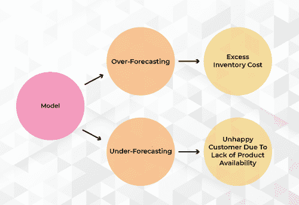
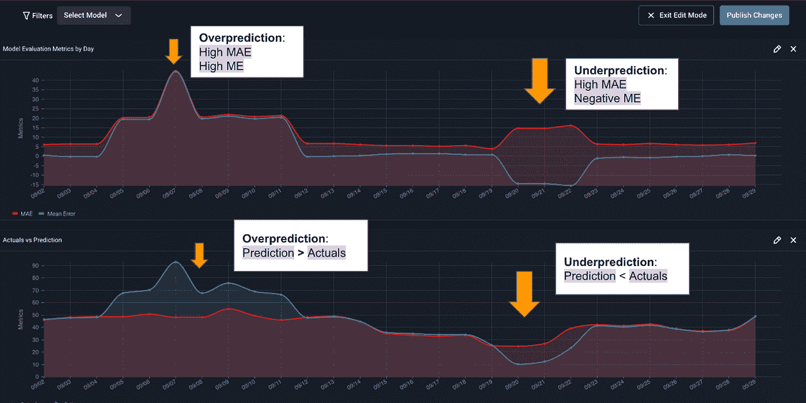

# 圣诞老人今年应该密切关注他的需求预测模型

> 原文：<https://towardsdatascience.com/santa-should-monitor-his-demand-forecasting-models-closely-this-year-7014f63cb27c?source=collection_archive---------20----------------------->

图片作者(鸣谢:阿里泽艾)

## 需求预测模型的 ML 监控和可观察性的最佳实践正好赶上混乱的供应链、暴躁的客户和突然的雪橇漂移(哦，哦，哦，不)

需求预测是一门经过时间考验的学科，它使用历史数据(传统上是购买数据)来预测给定时间段内的客户需求。对于运营和定价策略至关重要的是，几乎每个类别的企业都以某种形式使用需求预测来优化一切，从商店货架上的食品分配到数据中心的硬件计算能力，甚至(假设)是一个快乐的老精灵在树下递送的礼物。

半个多世纪以来，企业一直使用统计和计量经济学方法来预测需求，而人工智能和机器学习的出现正在帮助自动化这一过程，并使预测变得更加复杂和精确。在这些进步的推动下，企业通常依赖需求预测模型的准确性来确保一致的客户体验和卓越的运营。[然而，最近的事件](https://www.nytimes.com/2021/06/01/business/coronavirus-global-shortages.html)让人质疑这些车型的表现是否可以[想当然](https://www.mckinsey.com/industries/consumer-packaged-goods/our-insights/rapidly-forecasting-demand-and-adapting-commercial-plans-in-a-pandemic)。

## 为什么在需求预测中使用模型监控和 ML 可观察性？

与大多数处理未来事件的预测建模问题一样，需求预测在理论上和实践中被广泛认为是困难的，因为在做出预测时模型中有许多不确定性未被考虑。

在后 COVID 时代尤其如此，曾经的异常事件变得更加常见。今天的企业不仅要适应不断变化的消费者口味和记录需求，还要适应复杂的供应链，在这个供应链中，通货膨胀、延迟、短缺和其他不可预见的因素越来越常见。总之，[近一半的](https://deloitte.wsj.com/articles/supply-chain-snarls-throw-a-double-punch-to-costs-and-sales-01633115778) (44%)企业首席财务官报告称，2021 年第三季度供应链上的延迟和短缺增加了成本，32%的人报告称因此导致销售额下降。

由于需求预测模型的输出通常用于规划环境中，这些变化带来的性能下降的连锁影响可能不会立即显现出来。然而，每次性能下降或模型或概念漂移都会给[带来重大的](https://www.bloomberg.com/news/features/2021-10-04/out-of-stock-shortages-for-christmas-shopping-put-retailers-at-risk)财务损失。

ML 监控和可观察性对于在这些事件发生时提醒团队、量化它们对模型的影响程度以及产生对根本原因的洞察以快速补救问题是至关重要的。简而言之，拥有一个 [ML 可观察性](https://arize.com/ml-monitoring/)策略[可能是零售商拥有足够的库存来满足假日需求，还是因为缺货而失去数百万的销售机会的区别](https://www.bloomberg.com/news/features/2021-10-04/out-of-stock-shortages-for-christmas-shopping-put-retailers-at-risk)。

## 需求预测中的常见方法和挑战

需求预测 ML 模型一般分为两类:**时间序列模型**和**回归模型**。

时间序列模型适用于历史数据，用于预测一段时间内的销售量(即销售额)。根据行业的不同，时间序列模型通常不需要特征——只需要实际数据，如激光打印机上的历史销售数据来预测未来的销售——因此没有特征漂移的风险。有了可控的参数和坚实的统计学基础，时间序列模型通常也很容易解释。

时间序列模型的一个缺点是，它们通常需要数年的数据才能做出准确的预测，这限制了它们的可用性。例如，一家消费电子公司可能会推出一种新的可穿戴设备或一款更好的智能手机，但由于这是一种新产品类别或发明，它们本身缺乏可比的历史销售数据。

即使有这种数据，专门根据历史数据拟合的时间序列模型的总体准确性可能不如根据特征建立的模型高。尽管漂移不是一个大问题，但现实世界中的表现仍然会下降，因为历史数据通常不会编码未来事件的信息(例如，新冠肺炎导致了 2020 年股市的下跌)。

另一方面，回归预测模型不需要相同级别的历史数据。用于预测固定时间段(即未来七天)的需求量，或预测未来“n”天的需求量，以未来天数(n)为特征，回归预测可以利用更复杂的模型来生成更准确的预测。考虑到相同的模式可以用于其他部分，它们也相对更容易升级和重新培训。

出于这些原因，回归预测模型在各行各业都非常普遍——从航空公司如何对冲燃油价格飙升，到零售商在假期期间为过道端盖和其他高流量区域定价的策略，这些模型无所不包。然而，它们也不是没有缺点，因为复杂性和偏差-方差权衡会使这些模型更容易发生漂移(更多内容见下文)。

当然，这不必是一个非此即彼的选择。许多组织发现回归模型和时间序列模型在不同的情况下都很有用。例如，我们的一个与大型食品零售商合作以防止浪费的合作伙伴在同一个仪表板中监控时间序列预测和回归预测以及销售数据(实际值)，按生产、位置和商店细分模型。

优化零售需求预测中的业务成果|图片由 Arize AI 提供

在实践中，预测不足或预测过高可能会很快发生，并且很难排除故障，从而导致成本超支或客户不满意，从而降低盈利能力。管理需求预测模型的团队面临的常见挑战包括:

*   回归模型对漂移的敏感性很高。虽然复杂性和更多的特征可以提高模型的准确性，但随之而来的噪声源和概念漂移(潜在变量的属性发生意外变化)的增加可能会导致模型失败。例如，一个利用数百个特征来预测房价的复杂模型可能会很快受到不断变化的购房行为或监管变化的挑战。
*   像新冠肺炎这样的事件会放大并加速漂移。在新冠肺炎飓风过后不久，很少有模型能够预测到美国的大规模移民浪潮，这一浪潮是由该国很大一部分劳动力突然并可能永久在家工作引起的。在像这样的异常事件中，漂移对回归模型的影响可能是如此之大，以至于一个更简单的时间序列模型可能值得换成一个过渡时期。
*   **有限的功能多样性使故障排除变得困难。**构建需求预测模型的 ML 团队通常依赖于缺乏特异性的特性，这使得故障排除更加困难。一般来说，对于他们试图解决的问题(例如，平均房价、司机延迟、评级等)而言，高度具体(通常是数字)的特征往往是理想的，因为你可以转换它们、规范化它们、删除条目或将其限制在某个值。这与 location_id 等分类要素(离散，无顺序)或顺序要素(离散，但通常是任意顺序)形成对比。例如，在零售业，像“中号”的“packet_size”这样的序数特征可能意味着一个中号的背包或一件中号的青年 t 恤——这使得它在计算(比如)棉花价格的突然上涨可能对单位成本造成的影响时用处不大。

## 需求预测模型的监控和可观察性的最佳实践

考虑到这些挑战和大多数组织中需求预测的高风险，我们如何才能确保令人满意的绩效，了解预测何时以及为何偏离目标，并确定如何应对？

**绩效指标:需要一个可视化的村庄**

回归模型预测中的偏差和误差度量是发现性能问题和优化业务目标的关键。

常见指标包括:

*   **平均误差(ME):** 平均历史误差(偏差)；正值表示预测过高，负值表示预测过低。虽然平均误差通常不是模型在训练中优化的损失函数，但它测量偏差的事实对于监控业务影响通常是有价值的。
*   [**【MAE】**](https://arize.com/glossary/mean-absolute-error/):模型预测值与真实值之间的绝对值差，在整个数据集中取平均值。对模型性能的“第一印象”,因为它没有被一些预测的极端误差所扭曲。
*   [**平均绝对百分比误差****【MAPE】**](https://arize.com/glossary/mean-absolute-percentage-error/):衡量一个模型产生的误差的平均大小；模型预测准确性的一个更常见的度量标准。
*   **均方误差(MSE)** :模型的预测值和地面真实值之间的差值，经过数据集的平方和平均。MSE 用于检查预测值与实际值的接近程度。与**均方根误差(RMSE)** 一样，这种方法对较大的误差给予较高的权重，因此在企业可能希望严重惩罚较大的误差或异常值的情况下可能很有用。

应该注意的是，平均误差不足以说明偏差。在特征漂移事件中，在给定的时间周期中存在过预测和欠预测，平均误差可以被相反的度量值抵消。这就是并排显示平均误差和平均绝对误差的大小和方向很有帮助的原因，两者都可以用于确定模型在给定时间段内的性能何时低于标准。

作者图片(阿里泽·艾)

所有的指标[都有权衡](/forecast-kpi-rmse-mae-mape-bias-cdc5703d242d)，额外的背景对于理解一个模型是否表现不佳有很大的影响。在选择需要密切关注的最有用的指标时，了解您正在优化的业务成果是至关重要的。一家希望避免大幅低估的公司——比如，一家零售商正在为占其年度销售额大部分的假日期间做准备——可能会围绕均方根误差或均方差进行优化，并密切跟踪它和均方差的图表，以揭示预测偏差的问题。在实践中，观察上述所有指标会产生切实的影响。

**识别性能问题**

一旦根据偏差和误差指标确定需求预测偏离目标，团队就可以识别导致性能下降的部分(或特性和价值的组合)。例如，如果一家包装食品制造商在给定时间段内具有较高的平均绝对误差和较高的平均误差，这可能是因为模型的训练数据包含了比现实世界中常见的更多的品牌忠诚者的购买。从那里，ML 团队可能会从更喜欢购买通用产品的人那里采集更多的销售数据，以重新训练模型——或者为识别出的表现较差的部分训练一个单独的模型，并在生产中分割这两个模型。

**漂移检测、诊断的重要性**

如前所述，监控漂移或分布变化并排除故障至关重要，特别是考虑到回归需求预测的复杂性。测量种群稳定性指数作为分布检查，ML 团队可以检测分布中的变化，这些变化可能会使某个要素作为模型的输入变得不那么有效。

例如，如果一家大型零售商的平均绝对误差很高，但平均误差为负，那么它很可能低估了需求。深入调查，零售商的 ML 团队可能会发现这是由消费者偏好的变化引起的——比如，[比过去几年更早购买节日礼物](https://www.wsj.com/articles/stores-to-customers-behind-on-christmas-shopping-supply-chain-11635375486)，而且尺寸更大。有了这种洞察力，他们可以相应地重新训练模型。通过拥有一个 [ML 可观察性平台](https://arize.com/model-monitoring/)，组织可以快速可视化并找出这些问题的根源。这在异常事件中变得更加重要。

## **结论**

鉴于新冠肺炎事件后各行业产品开发和全球运营的性质不断变化，我们可能会见证需求预测模型应用的[一代一次的重置](https://www.wsj.com/articles/companies-grapple-with-post-pandemic-inventories-dilemma-11636290000)。例如，零售商可能比过去几年更愿意接受额外的库存——认为预测不足比预测过度成本更高，因为有可能失去客户。

ML 可观察性可以帮助团队优化这些结果，避免代价高昂的错误，并保持在快速变化的顶端。通过识别导致高估或低估的特征，并快速找到问题的根源，团队可以确保未来的预测既准确又乐观。作为额外的参考，这里的[是一个 ML 可观察性平台如何帮助客户处理需求预测。](https://docs.arize.com/arize/resources/use-cases/timeseries-forecasting)

# 联系我们

如果这个博客引起了你的注意，并且你渴望了解更多关于[机器学习可观察性](https://arize.com/platform-overview/)和[模型监控](https://arize.com/model-monitoring/)，请查看我们其他的[博客](https://arize.com/blog/)和 [ML 监控](https://arize.com/ml-monitoring/)上的资源！如果您有兴趣加入一个有趣的 rockstar 工程团队，帮助模型成功生产，请随时[联系](https://arize.com/contact/)我们，并在此处[找到我们的空缺职位](https://arize.com/careers/)！