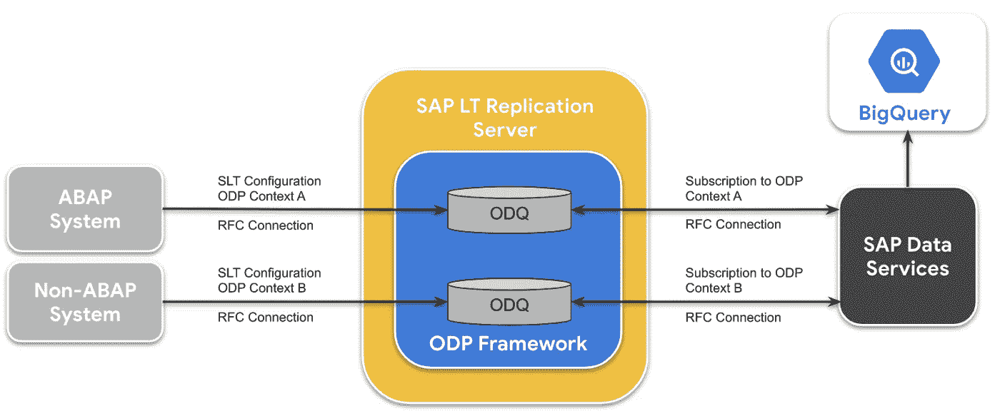
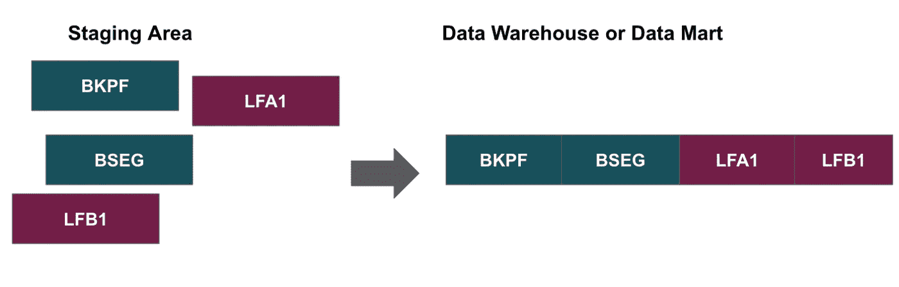
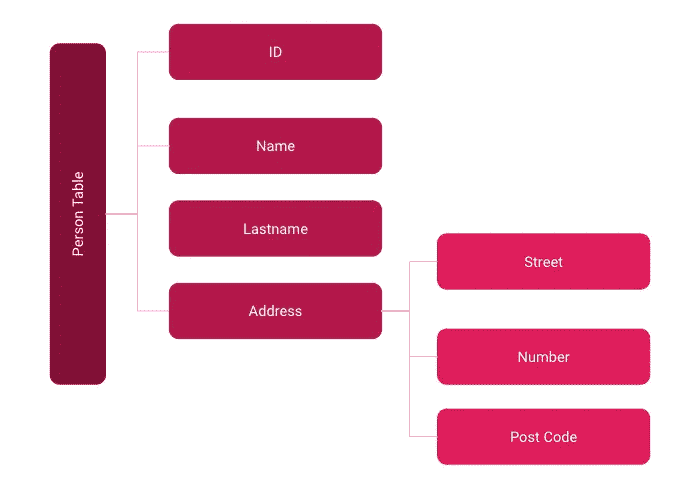

# 谷歌云中的 SAP 数据分析

> 原文：<https://towardsdatascience.com/sap-data-analytics-in-the-google-cloud-3a08b10dc0a6?source=collection_archive---------44----------------------->

## 如何将 SAP 与谷歌云平台相结合

克里斯蒂安·卢在 [Unsplash](https://unsplash.com/s/photos/nature?utm_source=unsplash&utm_medium=referral&utm_content=creditCopyText) 上的照片

如何将 SAP 与谷歌云平台(BigQuery、Data Studio 或 recently looker 等强大数据分析工具的提供商)相结合，以获得强大的数据分析平台和宝贵的见解。如果您对 SAP 数据的实用数据分析方法感兴趣，[这篇文章](https://medium.com/@christianlauer90/sap-data-analytics-examples-for-internal-audit-financial-tax-accounting-and-controlling-analysis-1fbc81d01eac)可能也会让您感兴趣。

## 建造一座建筑

SAP HANA 已经内置了 SAP 数据服务，因此您可以轻松地将数据从 SAP 应用程序或其底层数据库导出到 BigQuery[1]。然而，GCP 和思爱普的结合对于那些仍然生活在 ERP 世界中的公司来说也是可能的。

以下几点显示了将数据从 SAP 加载到 Google Services 的可能性:

*   使用 talend/Google data flow/等数据集成工具，通过 RFC(远程函数调用)接口提取数据。
*   编写 ABAP 程序
*   fivetran 等第三方连接器
*   使用 SAP 复制服务器

因此，可能的解决方案如下所示:

SAP 到大型查询—图片来自 Google [2]

## 实现增量负载

获取数据是第一步。之后，您将处理如何实现一个 delta 逻辑的问题，因为您可能不想通过满载定期加载所有数据。这只会带来加载时间长、没有历史数据等缺点。尤其是控制、内部审计等部门。通常基于历史数据视图构建他们的数据分析。

虽然 SAP 数据服务已经内置在 CDC 向导中，但其他数据集成方法可能需要一些额外的工作。要实现这一步，非常了解 SAP 表和表结构是很重要的。在自己的逻辑上实现增量加载尤其可以借助两个表来实现: **CDHDR** (改变标题)和 **CDPOS** (改变位置)。这些表跟踪主数据或事务数据的变化。

## 数据转换

随着基于列的数据仓库工具(如 BigQuery)的出现，由于性能以及源系统和目标系统之间不同的表结构或数据类型，数据转换通常是必要的。

一个例子是，在 SAP 中，你有 BKPF(会计凭证标题)和 BSEG(会计凭证段)表。由于其基于列的结构，对 BigQuery 中的数据进行**反规范化**是有意义的。解决方案可以是连接 BKPF 和 BSEG，如果需要的话，还可以连接其他主数据和参考表——例如借助 BigQuery DTS ( **数据传输服务**)的帮助。因此，您可以得到一个非规范化的数据对象体系结构，如下图所示:

插图:从原始表格到非规范化数据对象-作者图片

## 嵌套数据

另一个获得性能和成本效率的转换是使用**嵌套数据结构**。BigQuery 或 Amazon 的 Redshift 等较新的数据仓库技术确实能更好地处理这种数据结构。使用嵌套数据的用例有，例如标题/段表，如 BKPF 和 BSEG，或者如果一个表包含的列变化不大，如:

*   `name`
*   `lastname`

结合历史上经常变化的栏目，如[3]:

*   `address`(一个嵌套重复的字段及其后续嵌套字段):
*   `address.address`
*   `address.city`

如果你问自己什么是嵌套数据——简而言之:BigQuery 支持从支持基于对象的模式的源格式(例如 JSON)加载和查询嵌套和循环数据。这些列可以保持关系，而不会像关系模式或规范化模式那样降低性能[4]。

嵌套和重复数据的图示-按作者分类的图像

地址列包含一个值数组。数组中的不同地址是重复出现的数据。每个地址中的不同字段是嵌套数据。点击阅读更多相关信息[。](/how-to-work-with-nested-data-in-bigquery-84f15646b0b1)

## 实施(自助)报告

最后一部分将实现报告和数据分析的可能性。有了 BigQuery，数据分析师已经有了一个很好的分析工具。数据科学家可以使用数据实验室或 GCP 内众多 ML 服务之一。Data Studio 可能是业务用户共享 KPI、仪表板等的合适解决方案。为了在 BigQuery 中实现角色/用户访问模型，通常使用 BUKRS 属性(公司代码)，这样用户就只能看到分配给他的公司代码的数据，这也是 SAP 处理用户权限的方式。

## 摘要

SAP 和 GCP 的结合将为贵公司带来巨大的数据分析能力和可能性。SAP 系统托管了大量想要分析的有趣数据，而 GCP 提供了许多数据分析/科学家工具和服务，可以实现这一点。谷歌云和较新的 SAP-HANA-Cloud 架构本质上很容易相互结合，但旧系统也可以集成。因此，稳固的 SAP 财务系统符合专为数据分析而设计的敏捷的 Google world 一个非常有用的组合。

## 资料来源和进一步阅读:

[1] SAP 社区，[HANA SDA—Google big query](https://blogs.sap.com/2018/04/08/hana-sda-google-bigquery/)(2018)

[2]谷歌，[https://cloud . Google . com/solutions/sap/docs/big query-replication-from-sap-apps？hl=de](https://cloud.google.com/solutions/sap/docs/bigquery-replication-from-sap-apps?hl=de) (2021)

[3]谷歌，【https://cloud.google.com/bigquery/docs/nested-repeated】T4(2021)

[4] Google，[指定嵌套和重复的列](https://cloud.google.com/bigquery/docs/nested-repeated?hl=en) (2021)