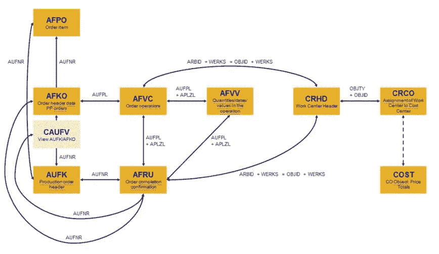

# SAP KPI:效率(制造)

> 原文：<https://towardsdatascience.com/sap-kpi-efficiency-manufacturing-1a4b2fbf14ab?source=collection_archive---------29----------------------->

## 连接哪些 SAP 表来分析效率


一切都是为了效率(法国岩石，作者图片)

**动机**:

即使是最好的制造工艺，其效率也会有所不同。随着时间的推移分析效率，将 ERP 中的数据存储在数据仓库中，这难道不是很有趣吗？下面的 SQL 从 SAP BI 的角度向您展示了如何实现这一目标。请注意，由于所有 SAP ERP 都是公司独有的，因此没有 100%正确和完整的解决方案。但它肯定会指引你正确的方向。

**解决**:

如果您希望提高效率，表 AFVV(工序数量、价值和日期)、AFVC(订单内的工序)和 CRHD(工作中心标题)是我们感兴趣的中央 SAP 表:



与生产计划 PP 模块相关的 SAP 表格(图片由作者提供)

```
truncate table [etl].[Efficiency]
insert into [etl].[Efficiency]
 (AUFNR, LMNGA, XMNGA, RMNGA, VGW01, VGW02, VGW03, ISM01, ISM02, ISM03, TSTP_DT ,
 AfvvErdat, AfvvAufpl, AfvvAplzl,AfvvMeinh, AfvcArbid, 
 arbpl, BEGDA, ENDDA, CrhdWerks, CrhdObjty, iedd,efficiency, abteil, team, vornr)
 select distinct
 a.AUFNR, a.LMNGA, a.XMNGA, a.RMNGA, a.VGW01, a.VGW02, a.VGW03, a.ISM01, a.ISM02, a.ISM03, a.TSTP_DT ,
 a.ERDAT as AfvvErdat, a.aufpl as AfvvAufpl, a.aplzl as AfvvAplzl,a.MEINH as AfvvMeinh, b.arbid as AfvcArbid, 
 c.arbpl, c.BEGDA, c.ENDDA, c.werks as CrhdWerks, c.OBJTY as CrhdObjty, a.iedd, 0 as efficiency, null as abteil, null as team, b.vornr
 from [AFVV] as a
 inner join [AFVC] as b
 on a.aufpl=b.AUFPL and a.APLZL=b.APLZL
 inner join [crhd] as c
 on b.arbid=c.OBJID
```

如果您只想分析特定状态，请使用表 JEST 进行映射:

```
update [etl].[Efficiency]
set JestStatActive= ‘WhatEverYourCompany’
from [etl].[Efficiency] as j
inner join [JEST] as jest
on concat(‘WhatEverYourCompany’, j.aufnr) = jest.OBJNR
where jest.inact<>’X’ and jest.stat =’WhatEverYourCompany'
```

我们已经可以计算效率:标准值存储在 vgw 中，而先前确认的活动来自 ism、总确认产量(lmnga)、总确认返工数量(rmnga)和总确认报废数量(xmnga):

```
update [etl].[Efficiency]
set EfficiencyTotal =
( case
 when (ism03 = 0) then (vgw01 + vgw02 * (lmnga + rmnga + xmnga))
 else (vgw01 + vgw03 * (lmnga + rmnga + xmnga))
end)
```

也许你还想加上预订日期:

```
update [etl].[Efficiency]
set BookingDate= i.iedd
FROM [etl].[Efficiency] as j
Inner join [afvv] as i
On j.AfvvAplzl = i.APLZL and j.AfvvAufpl=i.AUFPL
```

要检查测量单位(UoM)，请从 AFVV 转到 vge:

```
update [etl].[Efficiency]
set AfvvVge01 = i.vge01
from [etl].[Efficiency] as j
inner join [AFVV] as i
on j.AUFNR = i.aufnrupdate [etl].[Efficiency]
set AfvvVge02 = i.vge02
from [etl].[Efficiency] as j
inner join [AFVV] as i
on j.AUFNR = i.aufnrupdate [etl].[Efficiency]
set AfvvVge03 = i.vge03
from [etl].[Efficiency] as j
inner join [AFVV] as i
on j.AUFNR = i.aufnr
```

**恭喜:**

我们刚刚计算了 ERP 系统 SAP 的效率。非常感谢阅读，希望这是支持！有任何问题，请告诉我。你可以在 [LinkedIn](https://de.linkedin.com/in/jesko-rehberg-40653883) 或者 [Twitter](https://twitter.com/DAR_Analytics) 上和我联系。

最初发表在我的网站 [DAR-Analytics](http://dar-analytics.com/) 。