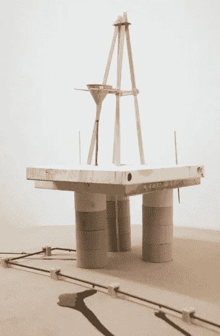

# SAP KPI:废料成本(质量管理系统)

> 原文：<https://towardsdatascience.com/sap-kpi-scrap-costs-quality-7562b9ceea75?source=collection_archive---------32----------------------->

## 连接哪些 SAP 表来分析报废成本



人无完人(Fondor，经马蒂亚斯·伯乐许可)

**动机:**

即使是最好的制造工艺也会产生废料，至少时不时会有一点。使用将 ERP 中的数据存储在数据仓库中来分析这些报废成本，这难道不有趣吗？下面的 SQL 从 SAP BI 的角度向您展示了如何实现这一目标。请注意，由于所有 SAP ERP 都是公司独有的，因此对于此请求没有 100%正确和完整的解决方案。但它肯定会指引你正确的方向。

**解决方案:**

如果您正在寻找废料成本，QMFE 是感兴趣的中央 SAP 表。QMEL 保存总体质量通知，而 QMFE 存储每个项目的误差。制裁可在 QMSM 中找到，根本原因可在 QMUR 中找到，活动可在 QMMA 中找到:


质量相关交易为 QM10、13 和 15(图片由作者提供)

首先，我们将加载表 QMFE:

```
select * into [etl].[qmfe] from [qmfe]
```

我们将只考虑 QMSM 中那些没有被取消的数据行(kzloesc <> x)。使用窗口函数 row_number 和 partition by，我们只将每个 qmnm 和 fenum 的第一个数据行选择到新表 qmsm_decision 中:

```
drop table [etl].[qmsm_decision] 
select * into [etl].[qmsm_decision] 
from
(select a.*, 
Row_number() over (partition by qmnum, fenum order by manum desc) rn
from [qmsm] as a
Where mngrp =’WhatEverYourCompany' and kzloesc <>’X’
 )src
Where rn =’1'
Order by qmnum;
```

我们想为代码组任务(mngrp)和任务代码(mncod)丰富我们的 etl.qmfe，这是我们从表 QMSM 中收到的:

```
Update [etl].[qmfe]
 set QmsmMngrp= qmsm.mngrp, QmsmMncod=qmsm.mncod
 FROM [etl].[qmfe] as qmfe
 left outer join [etl].[qmsm_decision] as qmsm
 on qmfe.QMNUM=qmsm.QMNUM and qmfe.FENUM=qmsm.FENUM
```

现在有趣的部分来了:我们将更具体地更新那些 QmsmMngrp 当前为 null 并且 QMSM 中的 fenum 为零的数据行:

```
Update [etl].[qmfe]
 set QmsmMngrp= qmsm.mngrp, QmsmMncod=qmsm.mncod
 FROM [etl].[qmfe] as qmfe
 left outer join [etl].[qmsm_decision] as qmsm
 on qmfe.QMNUM=qmsm.QMNUM 
where QmsmMngrp is null and qmsm.FENUM=0
```

我们从表 QMEL 中获得项目编号:

```
Update [etl].[qmfe]
Set qmelMatnr=qmel.matnr
From [etl].[qmfe] as qmfe
inner join [QMEL] as qmel
On qmfe.qmnum=qmel.qmnum
```

这也是我们从以下地址获取消息类型(qmart)和
工作中心工厂(arbplwe)、简短文本(qmtxt)和通知完成日期(qmdab)的地方:

```
Update [etl].[qmfe]
Set QmelQmart =qmel.qmart, QmelQmtext= qmel.qmtxt, qmelqmdab=qmel.qmdab , qmelWerk=qmel.ARBPLWE
From [etl].[qmfe] as qmfe
inner join [QMEL] as qmel
On qmfe.qmnum=qmel.qmnum
```

让我们进入狮穴，最终开始计算废料成本:

```
Update [etl].[qmfe]
Set scrap=qmsm.mngrp
From [etl].[qmfe] as qmfe
inner join [QMSM] as qmsm
On qmfe.qmnum=qmsm.qmnum
Where qmsm.mngrp=’WhatEverYourCompany' and qmsm.mncod=’WhatEverYourCompany' and qmsm.kzloesc <>’x’
```

我们来谈谈过度消费:

```
Update [etl].[qmfe]
Set OverConsumption=qmsm.mngrp
From [etl].[qmfe] as qmfe
inner join [QMSM] as qmsm
On qmfe.qmnum=qmsm.qmnum 
Where qmsm.mngrp=’WhatEverYourCompany' and qmsm.mncod=’WhatEverYourCompany' and qmsm.kzloesc <>’x’
```

不要再拐弯抹角了:我们因废品损失了多少？标准价格(stprs)来自 MBEW 表(材料估价)。乘以物料的缺陷数量，包括外部(fmgfrd)和内部(fmgeig ),并考虑价格单位(peinh ),得出报废成本:

```
Update [etl].[qmfe]
Set ScrapCosts=(FMGFRD+FMGEIG)*(STPRS/nullif(Peinh,0))
From [etl].[qmfe] as qmfe
```

真的有那么糟糕吗？像往常一样，这要看情况。您可能需要详细考虑特殊情况:例如，仅将特定的 qmtext、mngrp 和 mncod 组合视为真正的废料。但这确实取决于你的 ERP 设置。

如果只有一些状态与您废料分析相关:

```
update [etl].[qmfe]
set JestStatus = c.stat
from [etl].[qmfe] a
inner join [JEST] c
on (‘WhateverYourCompany’+ a.QMNUM ) = c.objnr
where c.inact <>’X’
```

通常，需求会随着时间而变化。因此，将来您可能需要从您的分析中移除一些特定的植物、OTRGRP 和 OTEIL:

```
delete from
[etl].[qmfe]
where qmelwerk=’WhatEverYourCompany' and otgrp= ‘WhatEverYourCompany’ and oteil=’WhatEverYourCompany' and jeststatus =’WhatEverYourCompany'
```

QPCT(代码文本)是另一个关于废料成本的有趣表格。例如，我们可以通过加入 codegruppe 和 code 来提取部门详细信息:

```
update [etl].[qmfe]
set Department= [Kurztext]
from [bi].[F_ScrapCosts]
left outer join [qpct] 
on OTGRP=Codegruppe and OTEIL=Code
where [catalog]=’WhatEverYourCompany’
```

**恭喜:**

我们刚刚从 ERP 系统 SAP 中计算了废料成本。非常感谢阅读，希望这是支持！有任何问题，请告诉我。你可以通过 [LinkedIn](https://de.linkedin.com/in/jesko-rehberg-40653883) 或 [Twitter](https://twitter.com/DAR_Analytics) 与我联系。

最初发表在我的网站 [DAR-Analytics](http://dar-analytics.com/) 。