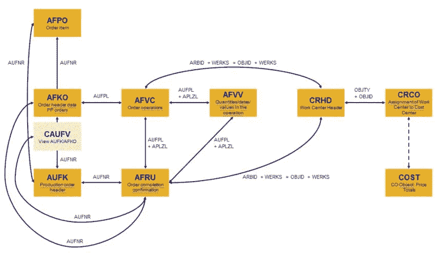

# SAP KPI:吞吐量/提前期(制造)

> 原文：<https://towardsdatascience.com/sap-kpi-throughput-lead-time-manufacturing-b74d1e4c21b8?source=collection_archive---------36----------------------->

## 连接哪些 SAP 表来分析吞吐量时间



与生产计划 PP 模块相关的 SAP 表格(图片由作者提供)

**动机:**

即使是最稳定的制造流程也会因每次生产的产品数量而有所不同。随着时间的推移分析您的吞吐量，将 ERP 中的数据存储在数据仓库中，这难道不是很有趣吗？下面的 SQL 从 SAP BI 的角度向您展示了如何实现这一目标。请注意，由于所有 SAP ERP 都是公司独有的，因此对于此请求没有 100%正确和完整的解决方案。但它肯定会指引你正确的方向。

**解决方案:**

如果您正在寻找吞吐量时间，AFKO 是感兴趣的中央 SAP 表。AFKO(德语为 Auftragskopf)代表订单标题数据 PP 订单。订单详情存储在 AFPO，我们从那里获取位置编号(posnr)、计划订单的开始日期(strmp)、计划订单的交付日期(ltrmp)、项目(matnr)和工厂(werks ),这些信息来自:

```
drop table [etl].[Throughput] 
Select distinct a.aufnr, a.gstri, a.getri, a.dispo, a.fevor, a.gsuzi, a.geuzi, b.posnr, b.strmp, b.ltrmp, b.matnr, b.werks, a.gltri
into [etl].[Throughput] 
From [AFKO] as a
inner join [afpo] as b
on a.aufnr=b.aufnr
```

为了计算净实际吞吐量，我们必须测量实际开始日期(gstri)和确认订单完成日期(getri)之间的距离。下面你会看到一个只考虑周一到周五工作日的例子:

```
update [etl].[Throughput]
 set ActThroughputNet= DATEDIFF(dd,gstri,getri) — (DATEDIFF(wk,gstri,getri) * 2) -
 case when datepart(dw, gstri) = 1 then 1 else 0 end +
 case when datepart(dw, getri) = 1 then 1 else 0 end
```

作为基准，我们再次使用相同的逻辑，但是这次是 strmp(计划开始)和 ltrmp(计划交付日期)。这样我们可以在以后比较实际和计划:

```
update [etl].[Throughput] 
set PlanThroughput =DATEDIFF(dd,strmp,ltrmp) — (DATEDIFF(wk, strmp,ltrmp) * 2) -
 case when datepart(dw, strmp) = 1 then 1 else 0 end +
 case when datepart(dw, ltrmp) = 1 then 1 else 0 end
```

到目前为止，我们只计算了以天为单位的日期差异(不包括周六和周日)。我们现在也要考虑时差。字段 gsuzi 代表实际开始时间。确认的订单完成时间存储在字段 geuzi 中。如果我们把这个时间差加到我们已经计算的日期差(ActThroughputNet)上，我们就完成了。其余的只是通常的时间格式，例如以分钟或小时显示时差:

```
update [etl].[Throughput]
set 
gsuzitime= (select left(gsuzi,2) + ‘:’ + substring(gsuzi,3,2) + ‘:’ + right(gsuzi,2)), 
geuzitime= (select left(geuzi,2) + ‘:’ + substring(geuzi,3,2) + ‘:’ + right(geuzi,2))update [etl].[Throughput]
 set ThroughputNetTimeMinutes =(
 case
 when
 — (gsuzitime>geuzitime) then 1440+datediff (mi,gsuzitime,geuzitime)
(geuzitime> gsuzitime) then datediff (HOUR,gsuzitime,geuzitime)
 else datediff (HOUR, geuzitime, gsuzitime)
 end
 )update [etl].[Throughput]
set ActThroughputNetMeasureHours= (case when gsuzitime > geuzitime then ActThroughputNet *24 — ThroughputNetTimeMinutes else ActThroughputNet *24 + ThroughputNetTimeMinutes end)
```

此外，我们现在可以映射生产订单状态。由于我们不想考虑取消的生产订单，我们将只从 JEST 表中提取那些活动的行(inact <> 'X '):

```
update [etl].[Throughput]
set JestStatActive= ‘WhatEverYourCompany’
from [etl].[Throughput] as a
inner join [JEST] as b
on concat(‘OR’, a.aufnr) = b.OBJNR
where b.inact<>’X’ and stat =’WhatEverYourCompany'
```

生产主管(fevor)是从 T024F 的 fevtxt 中加入部门详情的关键:

```
update [etl].[Throughput]
set Bereich = b.FEVTXT
from [etl].[Throughput] as a
Inner join [T024F] as b
On a.fevor=b.fevor
```

最后，我们可以随心所欲地进行所有吞吐量计算，例如:

```
drop table [etl].[ThroughputTop]
select matnr, avg(ActThroughputNetMeasureHours)/24 as AvgDurationPerItem
into [etl].[ThroughputTop] 
from [etl].[Throughput] as a
group by matnr
order by AvgDurationPerProdOrder
```

**恭喜:**

我们刚刚计算了 ERP 系统 SAP 的吞吐量(或交付周期)。非常感谢阅读，希望这是支持！有任何问题，请告诉我。你可以在 [LinkedIn](https://de.linkedin.com/in/jesko-rehberg-40653883) 或者 [Twitter](https://twitter.com/DAR_Analytics) 上和我联系。

最初发布于我的网站 [DAR-Analytics](http://dar-analytics.com/) 。