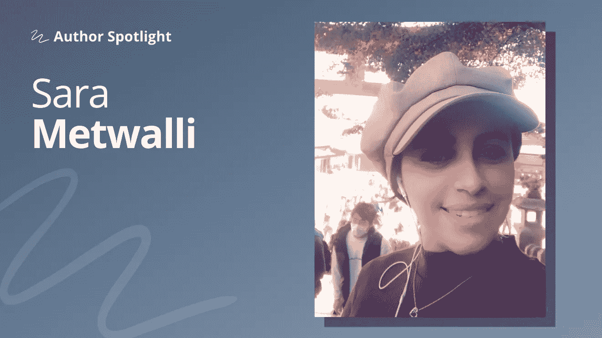

# Sara Metwalli 谈 NLP、公共写作和开启数据科学生涯

> 原文：<https://towardsdatascience.com/sara-metwalli-on-nlp-public-writing-and-launching-a-data-science-career-dca64e26103c?source=collection_archive---------28----------------------->

## [作者聚焦](https://towardsdatascience.com/tagged/author-spotlights)

## “我开始寻找一种方法来记录我的学习历程并帮助他人。”

*在 Author Spotlight 系列中，TDS 编辑与我们社区的成员谈论他们在数据科学领域的职业道路、他们的写作以及他们的灵感来源。我们很激动地呈现我们在这个系列中的第一次对话，与* [*萨拉 a .梅特沃利*](https://medium.com/u/7938431b336a?source=post_page-----dca64e26103c--------------------------------) *。*

照片由 Sara A. Metwalli 提供

Sara a . Metwalli 原籍埃及，获得亚历山大大学工程学院电子与通信工程学士学位。她随后前往东京继续攻读研究生课程:她于 2018 年获得了东京工业大学计算机和通信工程硕士学位。

完成硕士学位后，萨拉休学一年研究和学习量子力学和量子物理学，并在庆应义塾大学兼职做讲师，在东京编码俱乐部做讲师。最后，在 2020 年 4 月，她成为了庆应义塾大学的一名博士生，她是庆应义塾/IBM 量子计算中心的成员。在她的许多其他活动中，去年 Sara 还加入了 TDS 的编辑助理的行列，同时确立了自己作为一名多产和迷人的作家的地位。综上所述，当她同意和我们聊她的工作时，我们很感激。

## 人们进入数据科学的途径千差万别，你的经历是怎样的？

数据科学最先吸引我的是 NLP(自然语言处理 **)** 。我总是着迷于语言，它们是如何演变的，以及作者如何用它们来讲述一个令人难忘的故事。

我对了解人们如何使用语言的好奇心让我试图理解我们如何教会计算机理解语言。因为如果我能理解这一点，我就能更好地了解我们是如何理解语言的。

## 在你的工作中，有没有哪个方面比其他方面更困难？

当任何人加入一个技术领域，尤其是自学的时候，最具挑战性的事情之一就是孤独感。你觉得你在独自经历这段旅程。作为一名从事科技行业的女性，加剧了这种孤独感。

对我有帮助的是加入了编写代码的女性 Slack 小组，并成为 Python 全球分会的领导。这让我能够与和我有着相同经历的志趣相投的人交流。我们可以互相提供支持和见解。

## 自去年以来，你一直定期在 Medium，特别是 TDS 上发表文章，是什么激励你为更广泛的受众撰写关于数据科学、机器学习和其他主题的文章？

正如我之前提到的，我一直热衷于语言和写作。但是由于我的工作是一名教师和一名博士生，我发现自己必须一次学这么多东西。和其他人一样，我发现我也忘记了很多我学过的东西。因此，我开始寻找一种方法来记录我的学习历程并帮助他人。

答案是写文章:这就像同时达到多个目标。在我开始写作之前，我已经阅读 TDS 文章很多年了，在那里拥有我的许多文章简直是梦想成真。

## 关于这种公开写作，你最喜欢的是什么？

我一直在与“冒名顶替综合症”做斗争——我总觉得自己不够好，我的知识永远不会像同龄人一样好。写作给了我一个目标，一种被认可的感觉，让我觉得自己不那么像个骗子。此外，它还帮助我提高了写作和沟通技巧，让我结识了新朋友。

## 作为一个前瞻性的总结，你对未来几年的数据科学社区有什么希望？

我真的希望在接下来的几年里，数据科学社区仍然支持和欢迎新来者。这个支持我的社区鼓励了我，让我成为今天的我，无论是在媒体上还是在非媒体上。

想了解更多关于 Sara 的工作吗？她的帖子可能涵盖各种各样的主题，但它们都专注于清晰和同情，并着眼于教别人如何提高技能。这里有一些我们最喜欢的 TDS 档案以及其他出版物；无论你是长期粉丝还是刚刚发现莎拉的作品，你都会想读一读。

*   [**成为数据科学家的学习之路**](/a-learning-path-to-becoming-a-data-scientist-56c5c2e8ae3f) **( *TDS* ，2020 年 10 月)**
    在 Sara 最早的病毒式成功中，这是一个初学者友好的路线图，用于在数据科学和机器学习的广阔(和狂野)世界中获得立足点。
*   **写作帮助我克服冒名顶替综合症的 5 种方法(*独一无二*，2020 年 8 月)** 萨拉作品中最引人注目的元素之一是她对所面临挑战的透明性；在这篇文章中，她分享了为广大读者写作如何让她在学术和专业领域感到更加自在。
*   [**6 种 NLP 技术每个数据科学家都应该知道**](/6-nlp-techniques-every-data-scientist-should-know-7cdea012e5c3) **( *TDS* ，2021 年 1 月)** 正如她在我们的 Q & A 中提到的，NLP 是 Sara 非常关心的一个话题，在这篇文章中，她强调了这个广阔领域中数据科学家(尤其是职业生涯早期的数据科学家)应该投入时间的一些领域。
*   [**数据库 101:如何选择 Python 数据库库**](/databases-101-how-to-choose-a-python-database-library-cf19d1157d45) **( *TDS* ，2020 年 10 月)** 教学和解释是 Sara 的帖子做得最好的两件事，这一篇也不例外，考察了 SQL 和 NoSQL Python 库这两个领域。(你可以看看 Sara 的其他 101 篇文章:例如，关于[有效可视化](/data-visualization-101-7-steps-for-effective-visualizations-491a17d974de)或[选择正确的算法](/clustering-101-how-to-choose-the-right-algorithm-for-your-application-fb1521ea13fc)。)
*   [**我是如何停止欺负自己的**](https://medium.com/invisible-illness/how-i-stopped-bullying-myself-e9d0570ae626) **( *看不见的病*，2020 年 8 月)** 关于心理健康和自我接纳的几篇文章的一部分，萨拉的帖子邀请人们像对待别人一样对待自己——带着尊重和同理心。

敬请期待我们的下一位特色作者，即将推出！(如果您对希望在此空间看到的人有任何建议，请给我们留言。)