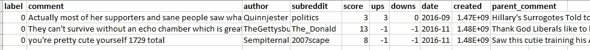

# Python 中基于空间的讽刺文本分类

> 原文：<https://towardsdatascience.com/sarcasm-text-classification-using-spacy-in-python-7cd39074f32e?source=collection_archive---------6----------------------->

## [实践教程](https://towardsdatascience.com/tagged/hands-on-tutorials)

## 训练自己的自定义 TextCat 组件，并将其打包为 Python 模块


照片由 [Unsplash](https://unsplash.com/s/photos/sarcasm?utm_source=unsplash&utm_medium=referral&utm_content=creditCopyText) 上的 [capnsnap](https://unsplash.com/@capnsnap?utm_source=unsplash&utm_medium=referral&utm_content=creditCopyText) 拍摄

通过阅读本文，您将学会训练一个讽刺文本分类模型，并将其部署到您的 Python 应用程序中。检测文本中讽刺的存在是一项有趣但具有挑战性的自然语言处理任务。

本教程主要关注于训练一个自定义多分类空间的`TextCat`组件。如果您刚刚开始或者有自己的用例，您需要做的就是用您喜欢的数据集替换掉数据集。设置和培训过程大致相同，只是对配置做了一些小的改动。

为了保持简单和简短，这部分的培训架构将基于以下内容的叠加组合:

*   线性词袋模型和
*   建立在 Tok2Vec 层上并使用注意力的神经网络模型。

在内部，spaCy 支持任何具有预训练权重和来自 [HuggingFace](https://huggingface.co/transformers/pretrained_models.html) 的 PyTorch 实现的变压器模型。如果您喜欢使用最新的变压器模型，如 BERT、ALBERT、RoBERTa 等，请随意修改模型架构。

事不宜迟，让我们进入下一节，开始安装必要的模块

# 设置

强烈建议您在继续之前设置一个虚拟环境。

## 宽大的

根据您的喜好，有多种方式安装空间[。](https://spacy.io/usage)

通过`pip`的安装可以通过以下命令完成(仅限 CPU):

```
pip install -U spacy
```

对于 GPU 支持，请使用以下命令:

```
pip install -U spacy[cuda102]
```

或者，您可以通过`conda`安装，如下所示:

```
# CPU
conda install -c conda-forge spacy# GPU
conda install -c conda-forge spacy
conda install -c conda-forge cupy
```

## 资料组

本教程在 Kaggle 的 Reddit 数据集上使用了[讽刺。如果您在访问它时遇到问题，请查看存放数据的](https://www.kaggle.com/danofer/sarcasm)[原始链接](https://nlp.cs.princeton.edu/SARC/0.0/)..请根据您的用例随意更改数据集。

下载以下文件:

*   测试平衡. csv
*   train-balanced.csv

下图展示了数据集的内容及其相应的标题。最重要的数据点是:

*   `label`:表示文本是讽刺性的(1)还是非讽刺性的(0)
*   `comment`:代表文本



作者图片

您需要处理数据集并将其转换为两个 JSONL 文件，如下所示:

```
{"text": "Certainly not number of recruiting stars.", "cats": {"sarcasm": 0.0, "other": 1.0}}
{"text": "actually Mercedes parts are quite cheap.", "cats": {"sarcasm": 0.0, "other": 1.0}}
{"text": "Because four days really makes all the difference!", "cats": {"sarcasm": 1.0, "other": 0.0}}
```

每行代表一个具有以下属性的字典:

*   文本
*   猫

`cats`表示相应文本的标签。将相应的目标标签标记为`1.0`，其余标记为`0.0`。在这种情况下，讽刺被标记为`1.0`，而其他被标记为`0.0`。将`assets`文件夹中的 JSONL 文件另存为:

*   data.train.jsonl
*   data.valid.jsonl

## 转换器脚本

此外，您将需要一个额外的转换器脚本，以便在训练期间将新创建的 JSONL 数据转换为 spaCy 二进制格式。创建一个名为`scripts`的新文件夹。然后，创建一个名为`convert.py`的 Python 文件，其中包含以下代码:

## 配置文件

接下来，在您的工作目录中创建一个名为`configs`的新文件夹。在该文件夹中，创建一个名为`config.conf`的新文件，并在其中添加以下配置:

它表示在 spaCy 中训练模型时使用的自定义管道。这表示将使用[空间对`textcat`组件进行培训。TextCatEnsemble.v2](https://spacy.io/api/architectures#TextCatEnsemble) 架构。您可以根据自己的喜好随意修改配置。

例如，您可以将`patience`值更改为更高的值，以防止过早停止。如果 1000 步后分数没有提高，当前设置将停止训练。

```
[training]
...
patience = 1000
max_epochs = 1
max_steps = 0
eval_frequency = 100
...
```

请注意，对于用于多分类任务的`textcat`组件，应始终使用`exclusive_classes = true`。另一方面，在训练多标签分类模型时，你应该使用`exclusive_classes = false`。

```
[components.textcat.model.linear_model]                       @architectures = "spacy.TextCatBOW.v1"                       exclusive_classes = true
ngram_size = 1
no_output_layer = false
nO = null
```

## 项目文件

让我们通过在您的工作目录中创建一个名为`project.yml`的新文件来结束设置。在其中添加以下代码:

它包含以下内容:

*   与项目相关的元数据
*   命令
*   工作流程

您可以在`vars`部分修改与现有项目相关的所有元数据。例如，如果您打算使用本地机器的第一个 GPU 进行训练，可以将`gpu_id`更改为 0。通过在每次训练中指定不同的`version`，spaCy 会通过`version`将你的模型打包到不同的文件夹后缀中。

```
vars:
  name: "textcat_multilabel_emotion"
  # Supported languages: all except ja, ko, th, vi, and zh, which would require
  # custom tokenizer settings in config.cfg
  lang: "en"
  # Set your GPU ID, -1 is CPU
  gpu_id: -1
  version: "0.0.0"
  train: "data.train.jsonl"
  dev: "data.valid.jsonl"
  config: "config.cfg"
```

命令是预定义的操作，可以通过以下方式触发:

```
spacy project run [command]
```

假设您已经定义了以下命令:

```
...
commands:
  - name: "convert"
    help: "Convert the data to spaCy's binary format"
    script:
      - "python scripts/convert.py ${vars.lang} assets/${vars.train} corpus/train.spacy"
      - "python scripts/convert.py ${vars.lang} assets/${vars.dev} corpus/dev.spacy"
    deps:
      - "assets/${vars.train}"
      - "assets/${vars.dev}"
      - "scripts/convert.py"
    outputs:
      - "corpus/train.spacy"
      - "corpus/dev.spacy"
...
```

您可以通过在命令行中运行以下命令来触发它。

```
spacy project run convert
```

或者，您可以将所有命令捆绑到一个工作流中，如下所示:

```
workflows:
  all:
    - convert
    - train
    - evaluate
    - package
```

然后，您可以运行以下命令来按顺序执行所有命令:

```
spacy project run all
```

您已经完成了初始设置。前往下一部分训练你的模型。

# 履行

在本节中，您将学习训练模型并将其部署到 Python 应用程序中。在您之前创建的`project.yml`脚本中，它包含以下命令:

*   `convert` —将数据转换为 spaCy 的二进制格式
*   `train` —训练 textcat 模型
*   `evaluate` —评估模型并导出指标
*   `package` —将训练好的模型打包成 pip 包
*   `visualize-model`-使用 Streamlit 交互式可视化模型输出

如果您打算运行`visualize-model`命令，请转到[下面的链接](https://github.com/explosion/projects/blob/v3/pipelines/textcat_demo/scripts/visualize_model.py)并将代码保存为`visualize_model.py`在`scripts`文件夹中。除此之外，您还需要通过以下命令安装`spacy-streamlit`。

```
pip install spacy-streamlit --pre
```

## 使用工作流

让我们利用以下工作流，而不是逐个运行命令:

*   转换数据
*   训练模型
*   评估模型
*   打包训练好的模型

运行以下命令:

```
spacy project run all
```

## 检查文件夹

它将首先检查您的工作目录，并生成其中不存在的文件夹。您应该有以下文件夹:

*   资产
*   文集
*   配置
*   培养
*   剧本
*   包装

## 转换数据集

之后，它将加载您的 JSONL 数据集，并在`corpus`文件夹中将其转换为二进制格式:

*   火车空间
*   开发空间

## 训练模型

一旦转换完成，它将初始化管道组件并开始训练模型。您应该会在控制台中看到以下输出:

```
ℹ Pipeline: ['textcat_sarcasm']
ℹ Initial learn rate: 0.001
E    #       LOSS TEXTC...  CATS_SCORE  SCORE
---  ------  -------------  ----------  ------
  0       0           0.06       48.55    0.49
  0     100           1.90       52.71    0.53
  0     200           1.41       57.34    0.57
  0     300           1.07       60.73    0.61
  0     400           0.83       63.55    0.64
```

*   `E` —表示已经完成的历元数。
*   `#` —表示当前的总训练步数。您可以通过配置文件中的`eval_frequency`更改频率。
*   `LOSS TEXTCAT` —损失值。
*   `CATS_SCORE` —评估分数，从 0 到 100。
*   `SCORE` —评价得分从 0.0 到 1.0，小数点后两位(四舍五入)。

训练将持续进行，直到满足以下任一条件:

*   达到了定义的`max_epochs`
*   达到了定义的`max_steps`
*   达到定义的`patience`(分数没有任何提高的步数)

它会将最佳模型和最后模型保存在`training`文件夹中。

## 模型评估

下一步是模型评估。它将使用最佳模型计算指标，并将结果作为`training`文件夹中的`metrics.json`导出。

```
{
  "token_acc":1.0,
  "cats_score":0.728515388,
  "speed":36132.1250494927,
  "cats_f_per_type":{
    "sarcasm":{
      "p":0.7550697085,
      "r":0.6728651527,
      "f":0.7116012201
    },
    "other":{
      "p":0.709381495,
      "r":0.7853374063,
      "f":0.7454295559
    }
  },
  "cats_auc_per_type":{
    "sarcasm":0.8028807945,
    "other":0.8028807993
  }
}
```

*   `p` —表示精度值
*   `r` —代表召回值
*   `f`—f1 值

## 打包模型

工作流程的最后一步是将最佳模型作为 pip 包打包在`packages`文件夹中。确保在每次培训期间修改`project.yml`中的版本。它将相应地输出一个新文件夹，如下所示:

```
en_textcat_sarcasm-0.0.0
en_textcat_sarcasm-0.0.1
en_textcat_sarcasm-0.0.2
```

在每个包中，它包含以下文件和文件夹:

*   距离
*   en _ textcat _ 讽刺
*   en _ textcat _ 讥讽. egg-信息
*   清单. in
*   meta.json
*   setup.py

## 部署包

您可以在文件夹中运行以下命令，将它安装到您的虚拟环境中:

```
python setup.py
```

或者，您可以复制出底层的`en_textcat_sarcasm`文件夹，并将其直接放入 Python 应用程序的同一文件夹中。它将被视为另一个 Python 模块。因此，您可以在 Python 应用程序中正常调用包，如下所示:

```
import en_textcat_sarcasm nlp = en_textcat_sarcasm.load()
```

一旦加载了模型，就可以按如下方式处理单个文本:

```
doc = nlp("This is a text")
```

它将返回一个空间的 Doc 对象。您可以通过以下方式获得基础`cats`分数:

```
doc.cats
```

处理大量文本时，您应该使用`pipe`成批处理:

```
texts = ["This is a text", "These are lots of texts", "..."]# bad
docs = [nlp(text) for text in texts]# good
docs = list(nlp.pipe(texts))
```

以下是打印所有文本及其相应分数的示例脚本:

您应该在命令行中获得以下输出:

```
yea right, so funny
{'sarcasm': 0.9599524736404419, 'other': 0.040047552436590195}You forgot "Am I a joke to you" guy
{'sarcasm': 0.3846711814403534, 'other': 0.615328848361969}Pretty ballsey for Ted to mouth off to his bosses like that.
{'sarcasm': 0.2167516052722931, 'other': 0.7832483649253845}I’m sure she is going to make an absolutely stellar cop, with no power trip agenda whatsoever
{'sarcasm': 0.878804087638855, 'other': 0.12119589745998383}Shut up, college boy!!
{'sarcasm': 0.6504116654396057, 'other': 0.3495883643627167}
```

# 结论

让我们回顾一下你今天所学的内容。

本文首先简要介绍了 spaCy 的 TextCat 组件和一个构建讽刺分类器模型的用例。

然后，它继续通过`pip`或`conda`安装 spaCy。除此之外，还介绍了使用 Kaggle 中的数据集进行数据准备以及创建相关的配置文件。

接下来，介绍了整个实现过程，包括将数据集转换为 spaCy 的二进制格式、训练模型、模型评估以及将最佳模型打包为 pip 包。

最后，本文提供了一个示例，说明如何在 Python 应用程序中部署它并获得相应的分类器结果。

感谢你阅读这篇文章。希望在我的下一篇文章中再次见到你！

# 参考

1.  [安装空间——文件](https://spacy.io/usage)
2.  [空间项目:演示文本猫](https://github.com/explosion/projects/tree/v3/pipelines/textcat_demo)
3.  [Reddit 上的嘲讽——Kaggle](https://www.kaggle.com/danofer/sarcasm)