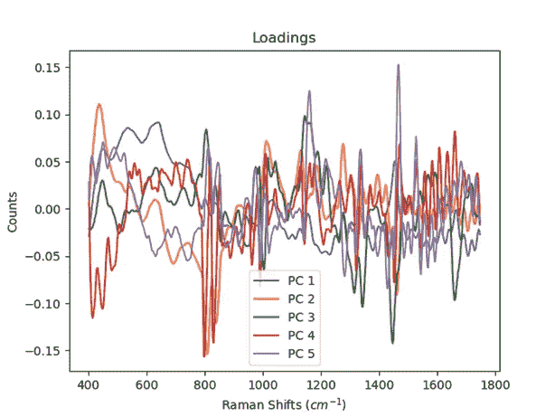

# 基于支持向量机和拉曼光谱的新型冠状病毒疾病状态分类

> 原文：<https://towardsdatascience.com/sars-cov-2-disease-state-classification-by-support-vector-machines-and-raman-spectroscopy-690c307a01cd?source=collection_archive---------29----------------------->

随着各国开始重新开放，大流行后世界的新挑战显露出来。最近，当我去国外参加一个会议时，我遇到了这种类型的挑战。在我在上述会议上的演讲结束后，我被安排乘飞机回家。为了登上国际航班的飞机，人们需要出示在 72 小时内进行的阴性新型冠状病毒(Covid)测试。实时逆转录聚合酶链反应(rRT-PCR)测试的周转时间通常为 24 小时或更长。我在起飞前 48 分钟做了一次测试，不幸的是，我没有及时收到测试结果。这导致了严重的时间延误、购买新机票的费用以及不必要的压力。

通过 rRT-PCR 的新型冠状病毒检测需要时间、专业人员和一定程度上集中的实验室、昂贵的试剂，并且是一个受操作者误差强烈影响的过程。抗原测试是分散的、快速的，并且是护理点诊断工具。护理点检测允许医生和医务人员在几分钟内而不是几小时内准确获得实验室质量的诊断结果。护理点对于测试航空旅行者是至关重要的，这种性质的测试本来可以解决我的问题。不幸的是，与 rRT‐PCR 相比，在 80%的灵敏度下，抗原测试遗漏受感染个体的概率[比 rRT‐PCR 高 20%。这种较大的假阴性率降低了抗原测试的有效性，也是政府机构仍然使用阴性 rRT-聚合酶链式反应测试结果作为国际旅行的金标准 Covid 测试的原因。具有较低假阴性率的快速现场护理诊断解决方案将是国际机场的高度需求，并且可能具有优于 rRT-PCR 测试及其 3 天有效性的其他优势。新型冠状病毒的中位潜伏期为 5-6 天，因此，一个人完全有可能在 72 小时内被感染并被允许旅行。问题是:我们能否建立一个更好的快速测试来帮助国际旅游业尽快恢复元气？](https://pubmed.ncbi.nlm.nih.gov/32845525/)

类似拉曼光谱(RS)的振动光谱是用于诊断的有前途的分析技术。[拉曼光谱已经证明了其在感染的护理点诊断中的适用性，并可能显示出疾病早期诊断的前景](https://pubmed.ncbi.nlm.nih.gov/30265133/)。拉曼光谱的工作原理是用单色光源(激光)照射样品，然后读取光与样品分子键相互作用引起的光波长变化。不同类型的键在波长上产生不同的变化，允许一个人产生一个“化学指纹”,理论上对每一个分子都是独一无二的。

通过抗原测试检测的分子是刺突蛋白，通过 rRT‐PCR 检测 RNA。拉曼是否可以看到新型冠状病毒感染的这些和其他分子标记，并区分个体/样本是否会检测出 covid 感染阳性或阴性？为了测试这个假设，我下载了一个血清拉曼光谱的[数据集](https://pubmed.ncbi.nlm.nih.gov/33821082/)，这些血清来自 Covid 测试呈阳性和阴性的个体。血清测试对国际旅行的筛查不起作用，但是有[的研究已经成功使用唾液样本的拉曼光谱](https://www.nature.com/articles/s41598-021-84565-3)。

这篇文章旨在实现两个目标。第一:看看我们能否用 Kaggle 免费提供的数据有效地检验之前陈述的假设。二:提供在高维数据上构建支持向量机分类器的教程。有了这两个目标，我们开始吧！

在 csv 文件中提供了[光谱数据](https://www.kaggle.com/sfran96/raman-spectroscopy-for-detecting-covid19/metadata)，每行对应于一个新的光谱/样品，每列对应于以拉曼位移(cm-1)为单位的光波长。转换成拉曼位移使 x 轴标准化，以说明入射激光的波长。为了构建一个基于光谱预测疾病状态的模型，我们将使用 python 并导入以下模块。

```
import numpy as np
import matplotlib.pyplot as plt
from scipy.signal import savgol_filter
import csv
from sklearn.decomposition import PCA
from math import sqrt
from sklearn.metrics import mean_squared_error
from sklearn import metrics
from sklearn.model_selection import train_test_split
from sklearn import svm
import seaborn as sns
```

我们将首先加载 csv 文件并获取每个光谱的类别信息。

```
vector = np.vectorize(np.float)
trainSetFile = r"Data/covid_and_healthy_spectra.csv"
labels = r"Data/covid_and_healthy_spectra.csv"with open(labels, newline='') as labelcsvfile:
    labelcsvfile = csv.reader(labelcsvfile, delimiter=',',  quotechar='|')

    labelHeader = next(labelcsvfile)
    classData = [0] for row in labelcsvfile:
        classData.append(row[-1])

classData.pop(0)
```

接下来，我们将对类别信息进行编码，这些信息是表示“健康”或“新型冠状病毒”的字符串。我们将把这些转换成健康的 0 和新型冠状病毒的 1

```
def encode(x):
    uniqueClasses = set(x)
    encodedArray = np.array(x)
    for count, word in enumerate(uniqueClasses):
        indices = [i for i, y in enumerate(x) if y == word]
        encodedArray[indices] = count

    return encodedArrayencodeClassdata = encode(classData)
```

从这里，我们将从 csv 文件中读取光谱，并绘制每个光谱以进行可视化。


根据相关疾病状态着色的原始光谱(蓝色=健康，红色=新型冠状病毒)(图片由作者提供)

光谱根据其类别进行着色，红色代表 Covid 阳性，蓝色代表 Covid 阴性。数据需要清理，因为信号在某些光谱和区域有噪声。我将用 15 点三阶多项式 Savitzky-Golay 平滑处理数据，并用标准正态变量对数据进行标准化。我不会执行任何基线修正，因为上升的基线可能包含有助于我们的模型预测的诊断信息。我还将删除超过 1750 cm-1 的数据，因为那里存在的正弦信号可能来自标准具，这是一种由背反射引起的降低薄型背照式 CCD 性能的现象。我将展示我用来读取光谱、执行预处理和绘图的代码。

```
# Standard normal variate normalizationdef snv(y):
    average = np.mean(y)
    standardDev = np.std(y)
    for count, element in enumerate(y):
        y[count] = (element - average) / standardDev
    return y with open(trainSetFile, newline='') as csvfile:

    csvfile = csv.reader(csvfile, delimiter=',', quotechar='|')
    header = next(csvfile)
    for count, element in enumerate(header[1:]):
        header[count] = header[count].split("cm-1")[0]

    xvals = vector(header[1:-1])# indexes find the array position for the beginning and end of the

    idx1 = (np.abs(xvals - 400)).argmin()
    idx2 = (np.abs(xvals - 1750)).argmin()

    xvals = xvals[idx1:idx2]
    dataMatrix = np.zeros(len(xvals))
    plot1 = plt.figure()

    for count, row in enumerate(csvfile):

        spectrum = np.asarray(row[idx1:idx2])
        spectrum = vector(spectrum)
        # Savitzky-golay smoothing, 15 point
        spectrum = savgol_filter(spectrum, 15, 3, deriv=0)

        # Standard Normal Variate
        spectrum = snv(spectrum)

        plt.plot(xvals, spectrum)

        dataMatrix = np.vstack((dataMatrix, spectrum))

        if row[-1] == "Healthy":

            plt.plot(xvals, spectrum, color='blue', label='Healthy')

        elif row[-1] == "SARS-CoV-2":

            plt.plot(xvals, spectrum, color='red',label='SARS-CoV-2')

dataMatrix = np.delete(dataMatrix, (0), axis=0)
plt.xlabel("Raman Shifts ($cm^{-1}$)")
plt.title("Spectra of healthy and infected subjects")
plt.ylabel("Counts")
 # Below gets unique series names to reduce size of the legend
handles, labels = plt.gca().get_legend_handles_labels()
by_label = dict(zip(labels, handles))
plt.legend(by_label.values(), by_label.keys())
plt.show()
```


预处理和转换后的光谱由相关疾病状态着色(蓝色=健康，红色=新型冠状病毒)(图片由作者提供)

数据现在被平滑和归一化。我已经做了这种类型的预处理，因为我知道拉曼光谱是由我最喜欢的科学定律之一，比尔定律来辅助的。这是我最喜欢的，一部分是因为我喜欢啤酒，一部分是因为它非常有用。本质上，只要路径长度保持不变，来自样品中分子浓度的拉曼光子响应将是线性的。此外，如果被测物质相同，每列(波数)应遵循正态分布。然而，这仍然是高维数据，最好避免一些与维数灾难相关的陷阱。幸运的是，我们有主成分分析(PCA)来帮助解决这个问题。

PCA 是一种用于减少这种数据集的维度、增加可解释性并同时最小化信息损失的技术。[它通过创建新的不相关变量来实现方差的连续最大化](https://pubmed.ncbi.nlm.nih.gov/26953178/)。在我们可以将 PCA 应用于数据之前，我们首先需要将数据集中，并将数据分成训练集和测试集。

```
dataMatrixTrans = dataMatrix.T

 for col in dataMatrixTrans:
     meanVal = np.mean(col)

     for count, i in enumerate(col):
         col[count] = col[count] – meanValPCAmat = dataMatrixTrans.T
X_train, X_test, y_train, y_test = train_test_split(PCAmat, encodeClassdata,test_size=0.33, random_state=42)
pca = PCA(n_components=5)
pca.fit(X_train)
PCAmat = pca.transform(X_train)plt.figure(figsize=(10,10))
plt.plot(np.arange(1, len(pca.explained_variance_ratio_)+1, 1), np.cumsum(pca.explained_variance_ratio_), 'ro-')
plt.xlabel("Component #")
plt.ylabel("% Variance Explained")
plt.grid()
```


总和方差图展示了随着每个连续成分的增加，我们的数据中解释了多少方差(图片由作者提供)

有了 5 个成分，我们能够解释数据集中超过 95%的差异。PCA 提取了 900 个预测变量，并将其转换为 5 个变量。更棒的是，我们可以画出这些新的变量，叫做载荷，来看看它们是什么样子的！

```
loadings = plt.figure()
 for count, row in enumerate(pca.components_):
     plt.plot(xvals, np.transpose(pca.components_[count]), label="PC " + str(count+1))
 plt.title("Loadings")
 plt.ylabel("Counts")
 plt.xlabel("Raman Shifts ($cm^{-1}$)")
 plt.legend()
 plt.show() 
```



来自 PCA 的载荷。负载代表我们变量的线性组合，以创建我们新的“潜在变量”(图片由作者提供)

加载目前看起来像一团乱麻，但其中包含有价值的信息，我们可以用它来帮助推断我们的模型的属性。我们可以以后再谈这个。

目标是在对数据集应用主成分分析后，查看是否出现了任何模式。将这些电脑的分数彼此对照，一个在 x 轴上，一个在 y 轴上，这就是我们将如何看到组件空间中是否出现了任何模式。将组件得分的组合相对于彼此作图，似乎 PC 4 与 PC 5 显示出最有趣的结果。


PC4 对 PC5 的观察分数(图片由作者提供)

PC 4 很好地将两个组分开。PC 5 有助于进一步分层，并表明 PCA 可以看到健康样本的 2 个亚群。没有更多关于这项研究的信息，我们只能推测亚组的有效性。回到负荷，PC 4 似乎在 800 cm-1 附近具有两个峰的结构，可能是从 400-600cm-1 上升的基线。上升的基线可能是由于荧光，这可能表明样品中存在更多的蛋白质或更多的细胞副产物。有必要进行更多的正交分析测试和测量，以确认从五氯苯甲醚中得出的任何推论，但这些推论可能对指导有用。

接下来，我们将使用我们的训练集数据来构建支持向量机(SVM)分类器，并在测试集上评估模型的性能。我们还不会调整分类器的超参数，但将简单地测量以三阶多项式为核心的简单 SVM 的性能。

```
# SVM classifier
SVMdataMatrix = PCAmat[:, 3:5]
SVMmodel = svm.SVC(kernel='poly', degree=3)#, C=1, gamma=1)
SVMmodel.fit(SVMdataMatrix, y_train)

 # Testing Set
test_PCAmat = pca.transform(X_test)
test_SVMdataMatrix = test_PCAmat[:, 3:5]
test_preds = SVMmodel.predict(test_SVMdataMatrix)
print("test accuracy score: " + str(SVMmodel.score(test_SVMdataMatrix, y_test))) 
```

测试准确度得分:0.931

看来我们在测试中取得了相当不错的准确度。然而，我们知道需要解决的更紧迫的问题是假阳性和假阴性读数的比率。我们将在混淆矩阵中绘制这些指标。

```
cfMat = metrics.confusion_matrix(y_test, test_preds)
disp = metrics.plot_confusion_matrix(SVMmodel, test_SVMdataMatrix, y_test,  cmap=plt.cm.Blues, normalize='true', display_labels=classData) 
plt.show()
```


混淆矩阵显示 15%的假阳性率(图片由作者提供)

好像我们的假阳性率是 15%，假阴性率是 0%。我可以想象在机场的旅客会因为一个假阳性结果而被禁止登机而感到非常沮丧！让我们调整模型的超参数，看看我们能否降低假阳性率。

```
from sklearn.model_selection import GridSearchCV

 # parameter range
param_grid = {'C': [0.1, 1, 10, 100, 1000],
               'gamma': [1, 0.1, 0.01, 0.001, 0.0001],
               'kernel': ['poly'],
               'degree':[0, 1, 2, 3, 4]}

grid = GridSearchCV(svm.SVC(), param_grid, refit=True, verbose=3)

 # fitting the model for grid search
grid.fit(SVMdataMatrix, y_train)
print(grid.best_params_)
print(grid.best_estimator_) plt.show()
```

{'C': 0.1，'度数':1，' gamma': 1，'内核':' poly'}

SVC(C=0.1，度数=1，伽玛=1，内核='poly ')

看起来使用 gridsearch 来调整超参数已经为 SVM 分类器确定了我们的最佳参数，该分类器是具有 C=0.1 和γ= 1 的一阶多项式核。让我们绘制应用于我们的测试集的这个模型的新混淆矩阵。


混淆矩阵显示 12%的假阳性率(图片由作者提供)

现在我们可以看到，我们能够将假阳性率从 15%降低到 12%。这并不激烈，但却是朝着正确方向迈出的一步。让我们通过绘制决策边界来看看我们的模型是如何对数据进行分类的。

```
# Create color maps
cmap_light = ListedColormap(['orange', 'cyan'])
cmap_bold = ['darkorange', 'darkblue']

 # Plotting the decision boundary
x_min, x_max = test_SVMdataMatrix[:, 0].min() - 1, test_SVMdataMatrix[:, 0].max() + 1
y_min, y_max = test_SVMdataMatrix[:, 1].min() - 1, test_SVMdataMatrix[:, 1].max() + 1

h = 0.02
xx, yy = np.meshgrid(np.arange(x_min, x_max, h), np.arange(y_min, y_max, h))

zMat = np.c_[xx.flatten(), yy.flatten()]

Z = grid.predict(zMat[:, 0:2])

 # Put the result into a color plot
Z = Z.reshape(xx.shape)
plt.contourf(xx, yy, Z, cmap=cmap_light, alpha=0.8)
sns.scatterplot(test_SVMdataMatrix[:, 0], test_SVMdataMatrix[:, 1], hue=nocode_y_test, palette=cmap_bold, alpha=1.0, edgecolor="black")plt.xlabel('PC 4')
plt.ylabel('PC 5')
```


PC4 与 PC5 得分由疾病状态着色，背景由 SVM 决策边界着色(图片由作者提供)

看起来这个模型是通过 PC 4 用一条直线分割这些组。

这个模型仅仅基于使用 PC 4 和 PC 5，但是我们可以包括更多的组件。一开始使用两个更容易演示和绘制决策边界。让我们看看是否可以通过添加组件 1 到 5 来进一步改进模型。


混淆矩阵显示 10%的假阳性率(图片由作者提供)

现在，我们使用线性 SVM 分类器(C=0.1，gamma=1)将假阳性率降至 10%，这与我们之前训练的模型完全相同！使用更多组件似乎有助于进一步降低我们的假阳性率！

摘要

我们已经提供了一个快速概述如何拉曼光谱可能有潜力作为一个点的护理工具检测新型冠状病毒。我们能够证明，我们可以使用 PCA 维数缩减和支持向量机分类器，基于 Covid 感染和未感染个体的血清的拉曼光谱，实现对 Covid 感染和未感染个体的分类。这是一个很好的潜力演示，但当我们试图将该数据集应用和扩展到现实世界的诊断工具时，我们必须仔细考虑。

首先，数据集是血清的，从航空旅客身上提取血液是不可行的。你需要多名训练有素的护士，然后瓶颈就变成了抽血。唾液是一种更好的方法，Carlomagno 等人已经证明了这一点。唾液样本可能会有更复杂的问题，因为食物或饮料的物质身份最终可能会掩盖冠状病毒的信号，甚至导致假阳性。

拉曼光谱也可能被证明不够敏感，无法检测低浓度的病毒和生物标志物，因此其他分析仪器可能更适合，如质谱分析，它已经在世界各地的机场广泛存在，用于检测各种违禁物质。

最后，我们没有关于样品是如何被物理处理的良好信息。两类样本在储存、化学或物理处理方面的差异可能会导致我们的模型基于这些影响进行分类，并且无法准确预测真实世界的样本。

尽管存在假设和潜在的缺点，但我们能够证明，我们可以使用 PCA 维数缩减和支持向量机分类器，基于 Covid 感染和未感染个体的血清拉曼光谱，实现对他们的分类。需要更快和更准确的护理点 Covid 诊断测试，尽管拉曼可能显示出潜力，但应继续寻找更好的分析测试。